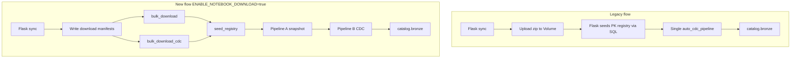

# ACC Connector — Fixes, Staged Changes & Architecture Notes

This document summarizes **all fixes applied** on branch `New_Pipeline_Logic(2_Pipeline)`, explains **bootstrap vs `seed_registry`**, and compares the **legacy single-pipeline** design with **Pipeline A / Pipeline B**.

Last updated: 2026-07-23

---

## Table of contents

1. [Architecture: old vs new](#architecture-old-vs-new)
2. [Bootstrap vs seed_registry](#bootstrap-vs-seed_registry)
3. [Sync workflow (notebook download path)](#sync-workflow-notebook-download-path)
4. [All fixes (symptoms → cause → fix)](#all-fixes-symptoms--cause--fix)
5. [Changed files (git)](#changed-files-git)
6. [Pipeline configuration keys](#pipeline-configuration-keys)
7. [What to do after pulling these changes](#what-to-do-after-pulling-these-changes)

---

## Architecture: old vs new

### Legacy (single pipeline) — why it “just worked”

| Aspect | Legacy (`auto_cdc_pipeline.py` + optional `auto_cdc_cdc_pipeline.py`) |
|--------|-----------------------------------------------------------------------|
| Pipelines | One monolithic bronze pipeline (or two legacy notebooks), **not** Pipeline A/B split |
| Service groups | Effectively **all** standard groups in one export / one pipeline |
| Ingestion method | Mostly `create_auto_cdc_from_snapshot_flow()` in one notebook |
| Data path | Flask connector **uploaded** zip + CSVs directly to UC Volume during sync |
| PK registry seeding | Flask called `_seed_registry_from_schema()` via **SQL warehouse** after upload — registry was populated **before** the pipeline ran |
| File listing in pipeline | Ran on **classic** pipeline compute where `dbutils.fs.ls()` worked |
| SDP / serverless | Often not used, or single pipeline without the new split + workflow |

**Why no `seed_registry` task was needed:** the connector app did the registry MERGE **outside** the DLT pipeline, in a normal Spark/SQL context, immediately after downloading ACC data. The pipeline then started with a **full** `_meta_bronze_pk_registry` and `schema.json` already in place.

### New (Pipeline A + Pipeline B)

| Aspect | Pipeline A (`acc_snapshot_pipeline.py`) | Pipeline B (`acc_delta_cdc_pipeline.py`) |
|--------|----------------------------------------|------------------------------------------|
| Name | `CCTech_ACCConnector_PipelineA_Snapshot` | `CCTech_ACCConnector_PipelineB_DeltaCDC` |
| Owns | 10 **snapshot-only** groups (no CDC mirror) | 10 official **`cdc*`** groups |
| Method | `create_auto_cdc_from_snapshot_flow()` SCD1 | `create_auto_cdc_flow()` — ONCE + ongoing SCD1 |
| Volume | `data_connector/` (Job 1) | `data_connector_cdc/` (Job 2) |
| Skips | Domains with CDC mirror (`admin`, `issues`, …) | Non-CDC groups |

**Why more moving parts:** ACC data is split across **two DC exports**, **two bulk-download jobs**, **one registry seed step**, and **two DLT pipelines**. Serverless SDP (Spark Connect) also broke assumptions the legacy notebook relied on (`dbutils.fs`, JVM Hadoop FS, in-pipeline registry MERGE).



---

## Bootstrap vs seed_registry

They solve **different problems at different times**.

| | **Bootstrap** (`run_bootstrap`) | **`seed_registry`** (workflow job task) |
|---|-----------------------------------|----------------------------------------|
| **When** | Once (or re-run to refresh infra) | **Every snapshot sync**, after CSV download |
| **Where** | Flask connector → Databricks APIs | Databricks notebook job (not SDP) |
| **Purpose** | Install / update **infrastructure** | Prepare **metadata** for this run’s pipelines |
| **Creates** | Catalog schema, volume, empty `_meta_*` tables, pipelines, workflows, uploads notebooks | — |
| **Uploads** | `pk_config.json` **template**, all notebooks including `seed_registry.py` | — |
| **Downloads ACC data?** | No | No (reads already-downloaded zip + `pk_config.json`) |
| **Fills PK registry?** | **No** — tables stay empty until first seed | **Yes** — MERGE ~218 rows from `pk_config.json` |
| **Writes `schema.json`?** | No | **Yes** — from `autodesk_data_extract.zip` in snapshot path |

### Simple analogy

- **Bootstrap** = build the kitchen (once).
- **seed_registry** = write tonight’s menu before cooking (every sync).

### Why bootstrap alone is not enough

Bootstrap explicitly documents that the registry is **empty until sync**:

```text
PK rows are NOT seeded here — they arrive in autodesk_data_extract.zip on each sync run
```

With `ENABLE_NOTEBOOK_DOWNLOAD=true`:

1. Flask no longer uploads the zip; **Databricks jobs** download CSVs.
2. SDP pipelines **cannot reliably persist** Delta MERGE into `_meta_bronze_pk_registry` during planning.
3. Without registry rows, `gate_table_common()` treats every CSV as unknown → **zero** `dlt.create_streaming_table()` calls → `NO_TABLES_IN_PIPELINE`.

`seed_registry` runs as a **plain Spark job** (uses `dbutils` + Delta MERGE safely) **after** download and **before** Pipeline A/B.

### When `seed_registry` is skipped

If `ENABLE_NOTEBOOK_DOWNLOAD=false`, Flask still seeds the registry via `_seed_registry_from_schema()` in `sync_orchestrator.py` after volume upload — the old pattern.

---

## Sync workflow (notebook download path)

Combined snapshot workflow task order:

```text
bulk_download          ──┐
bulk_download_cdc      ──┼──► seed_registry ──► snapshot_pipeline ──► cdc_pipeline
                         │
                    (parallel)
```

Key notebook / config parameters passed through the workflow:

- `acc.catalog`
- `acc.dc_project_id`
- `acc.dc_snapshot_path` — run folder under `data_connector/`
- `acc.dc_cdc_path` — latest CDC run folder (timestamp); stream reads parent `.../data_connector_cdc/{project_id}/` recursively

---

## All fixes (symptoms → cause → fix)

### 1. Dual bulk download used the same manifest

| | |
|---|---|
| **Symptom** | Both download tasks wrote to the same snapshot folder; CDC baseline missing. |
| **Cause** | Serverless jobs had empty `taskKey`; both tasks defaulted to snapshot role. |
| **Fix** | `download_role` via workflow `base_parameters`; `bulk_downloader.py` + `databricks_client.py` honor `snapshot` vs `cdc`. |

**Files:** `databricks_client.py`, `bulk_downloader.py`

---

### 2. `NameError: name 'spark' is not defined`

| | |
|---|---|
| **Symptom** | Pipeline failed at import/%run time. |
| **Cause** | Module-level `init_config()` at end of `acc_pipeline_common.py` ran before Spark existed in SDP. |
| **Fix** | Removed eager `init_config()`; only `prepare_shared_bootstrap()` calls it. Bound `spark = SparkSession.getActiveSession()` at module top. |

**Files:** `acc_pipeline_common.py`

---

### 3. `NO_TABLES_IN_PIPELINE` (empty PK registry)

| | |
|---|---|
| **Symptom** | Pipeline reads 0 tables; status table shows all rows skipped or unknown. |
| **Cause** | With notebook download, Flask never seeded `_meta_bronze_pk_registry`; in-pipeline seeding in SDP did not persist. |
| **Fix** | New `seed_registry.py` workflow task; bootstrap uploads notebook; workflow runs it before pipelines. `prepare_shared_bootstrap()` enriches `known_schemas` from volume `schema.json`. |

**Files:** `seed_registry.py` (new), `databricks_client.py`, `bootstrap_service.py`, `sync_orchestrator.py`, `acc_pipeline_common.py`

---

### 4. `NO_TABLES_IN_PIPELINE` (CSV discovery returned empty)

| | |
|---|---|
| **Symptom** | Registry had 218 rows; all marked `skipped_no_csv` — *"registry entry exists but no CSV in this run"*. |
| **Cause** | `_discover_csv_basenames()` used `dbutils.fs.ls()` → fails silently in **serverless SDP** (Spark Connect). |
| **Attempt 1** | Hadoop `spark._jvm` FS — **also broken** in Spark Connect. |
| **Fix (final)** | Native Python on mounted `/Volumes` paths: `os.path.exists`, `os.listdir`, `open()` for read/write. Added WARN logs when discovery is empty. |

**Files:** `acc_pipeline_common.py`

---

### 5. Removed `activities` service group

| | |
|---|---|
| **Symptom** | User request — group not needed in snapshot export. |
| **Fix** | Removed from `SNAPSHOT_ONLY_SERVICE_GROUPS`, `DC_STANDARD_SERVICE_GROUPS`, `service_groups_config.py`; smoke check expects 10 groups. |

**Files:** `constants.py`, `service_groups_config.py`, `smoke_check.py`

---

### 6. `pipelines.incompatibleViewCheck` (Pipeline B)

| | |
|---|---|
| **Symptom** | CDC pipeline fails incompatible view check for batch `@dlt.view` + `create_auto_cdc_flow(once=True)`. |
| **Fix** | `pipelines.incompatibleViewCheck.enabled: false` in **CDC-only** config via `CDC_PIPELINE_TUNING` in `pipeline_config.py`; applied at bootstrap, sync, and M2M paths. |

**Files:** `pipeline_config.py`, `bootstrap_service.py`, `sync_orchestrator.py`, `m2m_service.py`

---

### 7. `APPLY CHANGES` requires streaming source (Pipeline B ongoing flow)

| | |
|---|---|
| **Symptom** | `Source data for the APPLY CHANGES target '...cdcadmin_account_services' must be a streaming query` (`_LEGACY_ERROR_TEMP_121_APPLY_CHANGES_WITH_BATCH_SOURCE`). |
| **Cause** | Legacy ongoing branch in `_register_cdc_table()` used batch `read_csv_df()` for `create_auto_cdc_flow()` **without** `once=True`. |
| **Fix** | Legacy `else` branch now uses `spark.readStream.format('csv')...load(_glob)`. ONCE flow still uses batch `read_csv_df` + `once=True` (allowed). v2 Auto Loader branch unchanged. |

**Files:** `acc_delta_cdc_pipeline.py`, `smoke_check.py` (guard)

---

### 8. Logging / workflow polling (operational)

| | |
|---|---|
| **Symptom** | Long syncs hard to monitor; easy to cancel too early. |
| **Fix** | Progress lines in bulk downloader; orchestrator logs workflow task order; extended `SYNC_WORKFLOW_MAX_WAIT_MIN`. |

**Files:** `sync_orchestrator.py`, `databricks_client.py`, related config

---

### 9. CDC sync wiped bronze tables (single-folder + full_refresh every run)

| | |
|---|---|
| **Symptom** | After daily Sync CDC, `cdccost_*` tables only contain the latest folder’s rows; earlier CDC folders on the volume are ignored. |
| **Cause** | Pipeline B read only `acc.dc_cdc_path` (one timestamp folder) and ran with `full_refresh=True` on every CDC sync, resetting streaming checkpoints. |
| **Fix** | Legacy CDC stream root = project parent `.../data_connector_cdc/{project_id}/` with `recursiveFileLookup=true` + `pathGlobFilter={csv}`. Sync CDC / CDC workflow use `full_refresh=false`; snapshot baseline and optional Full Refresh CDC use `full_refresh=true`. |

**Files:** `acc_delta_cdc_pipeline.py`, `acc_pipeline_common.py`, `sync_orchestrator.py`, `pipeline_config.py`, `databricks_client.py`, `m2m_service.py`, `smoke_check.py`

**One-time migration:** deploy, run one Full Refresh CDC (or full snapshot sync) to repopulate from all timestamp folders, then use Sync CDC incrementally.

---

## Changed files (git)

### Staged (committed-ready subset)

| File | Summary |
|------|---------|
| `backend/clients/acc/constants.py` | Service group lists (10 snapshot groups; no `activities`) |
| `backend/clients/acc/data_connector_client.py` | DC request alignment |
| `backend/clients/databricks_client.py` | Combined workflow, `seed_registry` task, download roles, pipeline config merge |
| `backend/services/bootstrap_service.py` | Upload `seed_registry` notebook |
| `backend/services/sync/sync_orchestrator.py` | Notebook-download workflow path, logging |
| `notebooks/acc_snapshot_pipeline.py` | Pipeline A tweaks |
| `notebooks/seed_registry.py` | **New** — PK registry + `schema.json` seeding job |
| `notebooks/shared/acc_pipeline_common.py` | SDP-safe file I/O, bootstrap/init fixes, registry helpers |
| `notebooks/shared/service_groups_config.py` | 10 snapshot + 10 CDC groups |
| `scripts/smoke_check.py` | Offline validation |

### Unstaged (additional fixes — include before commit)

| File | Summary |
|------|---------|
| `backend/services/sync/pipeline_config.py` | `CDC_PIPELINE_TUNING`, `build_cdc_pipeline_conf()`, `build_snapshot_pipeline_conf()` |
| `backend/services/bootstrap_service.py` | CDC pipeline config includes `CDC_PIPELINE_TUNING` |
| `backend/services/sync/sync_orchestrator.py` | CDC-specific pipeline conf builders |
| `backend/services/m2m_service.py` | M2M CDC tuning + conf builders |
| `notebooks/acc_delta_cdc_pipeline.py` | Ongoing flow `readStream` fix |
| `scripts/smoke_check.py` | Assert legacy ongoing flow uses `readStream` |

---

## Pipeline configuration keys

### Shared (`acc.*`)

| Key | Purpose |
|-----|---------|
| `acc.catalog` | UC catalog name |
| `acc.dc_project_id` | ACC project UUID |
| `acc.dc_snapshot_path` | This run’s snapshot CSV folder |
| `acc.dc_cdc_path` | Latest CDC run folder; pipeline stream root is its parent project directory |
| `acc.volume_layout` | `legacy` or `v2` |
| `acc.test_mode` | Test harness flag |

### Pipeline A — snapshot (`build_snapshot_pipeline_conf`)

| Key | Value |
|-----|-------|
| `pipelines.numUpdateRetryAttempts` | `2` |
| `pipelines.maxFlowRetryAttempts` | `1` |

### Pipeline B — CDC only (`CDC_PIPELINE_TUNING`)

| Key | Value | Why |
|-----|-------|-----|
| `pipelines.numUpdateRetryAttempts` | `2` | Retry tuning |
| `pipelines.maxFlowRetryAttempts` | `1` | Retry tuning |
| `pipelines.incompatibleViewCheck.enabled` | `false` | Allows batch ONCE views with `create_auto_cdc_flow(once=True)` |

---

## What to do after pulling these changes

1. **Restart** the Flask ACC connector.
2. **Re-bootstrap** — recreates workflows, re-uploads notebooks, merges CDC pipeline config on the Databricks pipeline resource.
3. Run a **full snapshot sync** with `ENABLE_NOTEBOOK_DOWNLOAD=true`:
   - Wait for both bulk downloads to finish (`_SUCCESS` in snapshot + CDC volume folders).
   - Confirm `seed_registry` task logs: `OK PK registry seeded` and `OK schema.json written`.
   - Pipeline A then B should complete without `NO_TABLES_IN_PIPELINE` or APPLY CHANGES streaming errors.
4. Verify in `{catalog}.bronze`:
   - `_meta_bronze_pk_registry` ≈ 218 rows
   - Snapshot tables (e.g. `assets_*`) from Pipeline A
   - CDC tables (e.g. `cdccost_*`, `cdcadmin_*`) from Pipeline B
5. **If upgrading from pre-fix CDC behavior:** run one **Full Refresh CDC** (or full snapshot sync) so Pipeline B rebuilds from **all** timestamp folders on the volume; subsequent **Sync CDC** runs are incremental (`full_refresh=false`).

### Quick verification SQL

```sql
SELECT last_run_status, COUNT(*)
FROM `{catalog}`.bronze._meta_bronze_table_status
GROUP BY last_run_status;
```

Expect mostly `ok`, not mass `skipped_no_csv` or `not_in_schema_json`.

---

## Related docs

- [pipeline_implementation.md](./pipeline_implementation.md) — architecture (note: may still mention 11 groups / `activities`; code uses 10).
- [pipeline.md](./pipeline.md) — ACC CDC design rules and service group ownership.
