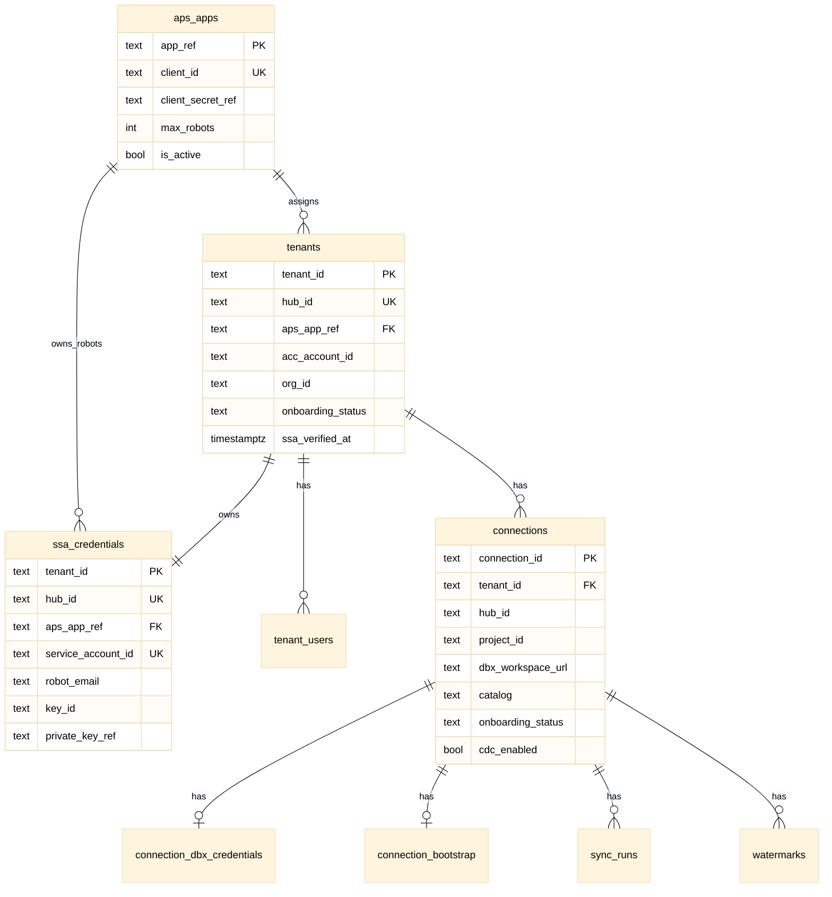

# Database & Credential Storage — Production Schema

**Version:** 1.0  
**Status:** Production schema specification  
**Applies to:** Forma → Databricks Connector (`acc-connector/`)  
**Deployment target:** AWS RDS PostgreSQL (SQLite subset for local dev)  
**Related documents:**
- [M2M_SSA_IMPLEMENTATION.md](./M2M_SSA_IMPLEMENTATION.md)
- [M2M_SSA_APS_CLIENT_SHARDING.md](./M2M_SSA_APS_CLIENT_SHARDING.md)
- Derived from: `CREDENTIAL_STORAGE_SPEC` (credential tiers, SecretStore, AWS layout)

---

## Table of contents

1. [Purpose](#1-purpose)
2. [Storage architecture](#2-storage-architecture)
3. [Secret naming (AWS Secrets Manager)](#3-secret-naming-aws-secrets-manager)
4. [Entity relationship](#4-entity-relationship)
5. [Table definitions](#5-table-definitions)
6. [Constraints and indexes](#6-constraints-and-indexes)
7. [Connection ID computation](#7-connection-id-computation)
8. [Onboarding status enums](#8-onboarding-status-enums)
9. [APS sharding and quota](#9-aps-sharding-and-quota)
10. [Behavioral contracts](#10-behavioral-contracts)
11. [Migration from POC](#11-migration-from-poc)
12. [SQL DDL (PostgreSQL)](#12-sql-ddl-postgresql)
13. [SQLite dev subset](#13-sqlite-dev-subset)
14. [Test data fixtures](#14-test-data-fixtures)

---

## 1. Purpose

Define the **production-ready** RDS schema for:

| ID | Requirement |
|----|-------------|
| **DB-01** | Hub-scoped tenant isolation (`hub_id` = tenant boundary) |
| **DB-02** | One SSA robot per hub; **never** shared across hubs |
| **DB-03** | APS Client ID sharding for 10-robot quota ([sharding spec](./M2M_SSA_APS_CLIENT_SHARDING.md)) |
| **DB-04** | SSA private keys + Databricks SP secrets in **Secrets Manager** — refs only in RDS |
| **DB-05** | Connection-scoped sync state (pipelines, watermarks, runs) |
| **DB-06** | Backward-compatible migration from SQLite / `.env` / `m2m_*` tables |

**Non-goals (v1):** Customer-managed KMS per tenant; cross-hub robot sharing.

---

## 2. Storage architecture

### 2.1 Component diagram

```text
┌─────────────────────────────────────────────────────────────────┐
│  ECS Fargate / EKS (Connector app)                              │
│  Task Role: secretsmanager:GetSecretValue, kms:Decrypt          │
└────────────┬───────────────────────────────┬────────────────────┘
             │                               │
             ▼                               ▼
┌────────────────────────┐      ┌────────────────────────────────┐
│  RDS PostgreSQL        │      │  AWS Secrets Manager + KMS     │
│  - aps_apps            │      │  - APS app B client secret     │
│  - tenants             │      │  - SSA private key (per hub)   │
│  - tenant_users        │      │  - Databricks SP secret        │
│  - ssa_credentials     │      │    (per connection)            │
│  - connections         │      │  - Platform DEK, Flask key     │
│  - sync_runs           │      └────────────────────────────────┘
│  - oauth token cache   │
└────────────────────────┘
```

### 2.2 Storage tiers

| Tier | Contents | Store | In RDS? |
|------|----------|-------|---------|
| **T0** | Flask `SECRET_KEY` | Secrets Manager / SSM | No |
| **T1** | APS `client_id` (public) | `aps_apps.client_id` | Yes |
| **T1s** | APS `client_secret` | Secrets Manager | Ref only (`client_secret_ref`) |
| **T2** | SSA metadata | `ssa_credentials` | Yes (no PEM) |
| **T3** | SSA private key PEM | Secrets Manager per hub | `private_key_ref` |
| **T4** | Databricks SP secret | Secrets Manager per connection | `client_secret_ref` |
| **T5** | U2M OAuth tokens | `acc_tokens`, `dbx_tokens` | Encrypted (DEK) |
| **T6** | `DATA_ENCRYPTION_KEY` | Secrets Manager | No |

**Rule:** T3 and T4 MUST NOT be plaintext in RDS.

### 2.3 POC baseline (migrate away)

| Current | Target |
|---------|--------|
| Global `APS_CLIENT_ID` in `.env` | `aps_apps` + `tenants.aps_app_ref` |
| Global `ACC_SSA_*` in `.env` | `ssa_credentials` + SM per hub |
| Global `DATABRICKS_M2M_*` | `connection_dbx_credentials` |
| `m2m_config` single row | `connections` |
| `m2m_bootstrap_state`, `m2m_sync_runs`, `m2m_watermarks` | `connection_bootstrap`, `sync_runs`, `watermarks` |

---

## 3. Secret naming (AWS Secrets Manager)

```text
/{app_name}/{env}/platform/aps-app-{app_ref}-secret
/{app_name}/{env}/platform/data-encryption-key
/{app_name}/{env}/hub/{hub_id}/ssa-private-key
/{app_name}/{env}/connection/{connection_id}/databricks-sp-secret
```

Defaults: `app_name=forma-connector`, `env=dev|staging|prod`.

RDS stores the path **after** leading slash as `*_ref` columns.

---

## 4. Entity relationship



---

## 5. Table definitions

### 5.1 `aps_apps` — APS Client ID shards (NEW — quota fix)

Registry of ISV-owned Server-to-Server apps. Supports hub 11+ via App B, C, …

| Column | Type | Constraints | Notes |
|--------|------|-------------|-------|
| `app_ref` | TEXT | PK | e.g. `app_a`, `app_b` |
| `client_id` | TEXT | UNIQUE NOT NULL | Public; shown in UI whitelist |
| `client_secret_ref` | TEXT | NOT NULL | Secrets Manager path |
| `max_robots` | INT | NOT NULL DEFAULT 10 | APS default quota |
| `display_name` | TEXT | | Ops dashboard only |
| `is_active` | BOOLEAN | NOT NULL DEFAULT true | false = skip in pick |
| `created_at` | TIMESTAMPTZ | NOT NULL | |

**Seed data (prod bootstrap):**

```sql
INSERT INTO aps_apps (app_ref, client_id, client_secret_ref, max_robots, display_name)
VALUES ('app_a', '<AAA-from-myapps>', 'forma-connector/prod/platform/aps-app-a-secret', 10, 'Primary APS App');
-- Add app_b before hub 11:
-- ('app_b', '<BBB>', 'forma-connector/prod/platform/aps-app-b-secret', 10, 'Shard B');
```

### 5.2 `tenants`

| Column | Type | Constraints | Notes |
|--------|------|-------------|-------|
| `tenant_id` | TEXT | PK | Same as `hub_id` in v1 |
| `hub_id` | TEXT | UNIQUE NOT NULL | Tenant boundary |
| `aps_app_ref` | TEXT | FK → aps_apps, NOT NULL | **Immutable** after insert |
| `acc_account_id` | TEXT | | DC API paths only |
| `org_id` | TEXT | NULL | Optional grouping |
| `onboarding_status` | TEXT | NOT NULL | §8 |
| `ssa_verified_at` | TIMESTAMPTZ | NULL | After whitelist verify |
| `created_at` | TIMESTAMPTZ | NOT NULL | |

### 5.3 `tenant_users`

| Column | Type | Constraints |
|--------|------|-------------|
| `tenant_id` | TEXT | FK → tenants |
| `aps_user_id` | TEXT | NOT NULL |
| `role` | TEXT | NOT NULL DEFAULT `hub_admin` |
| `created_at` | TIMESTAMPTZ | NOT NULL |

**PK:** `(tenant_id, aps_user_id)`

### 5.4 `ssa_credentials`

| Column | Type | Constraints |
|--------|------|-------------|
| `tenant_id` | TEXT | PK, FK → tenants |
| `hub_id` | TEXT | UNIQUE NOT NULL |
| `aps_app_ref` | TEXT | FK → aps_apps, NOT NULL |
| `service_account_id` | TEXT | UNIQUE NOT NULL |
| `robot_email` | TEXT | NOT NULL |
| `key_id` | TEXT | NOT NULL |
| `private_key_ref` | TEXT | NOT NULL |
| `created_at` | TIMESTAMPTZ | NOT NULL |
| `rotated_at` | TIMESTAMPTZ | NULL |

**Must NOT contain:** PEM body, APS client secret.

**Quota query:**

```sql
SELECT aps_app_ref, COUNT(*) AS robot_count
FROM ssa_credentials
GROUP BY aps_app_ref;
```

### 5.5 `connections`

| Column | Type | Constraints |
|--------|------|-------------|
| `connection_id` | TEXT | PK |
| `tenant_id` | TEXT | FK → tenants |
| `hub_id` | TEXT | NOT NULL |
| `project_id` | TEXT | NOT NULL |
| `project_name` | TEXT | NULL |
| `dbx_workspace_url` | TEXT | NOT NULL |
| `catalog` | TEXT | NOT NULL |
| `onboarding_status` | TEXT | NOT NULL |
| `snapshot_pipeline_id` | TEXT | NULL |
| `cdc_pipeline_id` | TEXT | NULL |
| `cdc_enabled` | BOOLEAN | NOT NULL DEFAULT false |
| `created_at` | TIMESTAMPTZ | NOT NULL |

**UNIQUE:** `(hub_id, project_id, dbx_workspace_url, catalog)`

### 5.6 `connection_dbx_credentials`

| Column | Type | Constraints |
|--------|------|-------------|
| `connection_id` | TEXT | PK, FK → connections |
| `workspace_url` | TEXT | NOT NULL |
| `client_id` | TEXT | NOT NULL |
| `client_secret_ref` | TEXT | NOT NULL |
| `validated_at` | TIMESTAMPTZ | NULL |

### 5.7 `connection_bootstrap`

Replaces `m2m_bootstrap_state` / per-user `bootstrap_state`.

| Column | Type | Constraints |
|--------|------|-------------|
| `connection_id` | TEXT | PK, FK → connections |
| `bronze_job_id` | BIGINT | NULL |
| `silver_job_id` | BIGINT | NULL |
| `notebook_folder` | TEXT | NULL |
| `volume_path` | TEXT | NULL |
| `warehouse_id` | TEXT | NULL |
| `bootstrapped_at` | TIMESTAMPTZ | NULL |

### 5.8 `sync_runs`

| Column | Type | Constraints |
|--------|------|-------------|
| `run_id` | BIGSERIAL | PK |
| `connection_id` | TEXT | FK → connections |
| `trigger_type` | TEXT | NOT NULL | `manual` \| `scheduled` |
| `mode` | TEXT | NOT NULL | `snapshot` \| `cdc` |
| `state` | TEXT | NOT NULL | §10.3 |
| `record_counts` | JSONB | NULL |
| `error` | TEXT | NULL |
| `started_at` | TIMESTAMPTZ | NOT NULL |
| `updated_at` | TIMESTAMPTZ | NOT NULL |

### 5.9 `watermarks`

| Column | Type | Constraints |
|--------|------|-------------|
| `connection_id` | TEXT | FK → connections |
| `data_type` | TEXT | NOT NULL DEFAULT `data_connector` |
| `last_sync` | TIMESTAMPTZ | NOT NULL |

**PK:** `(connection_id, data_type)`

### 5.10 OAuth token cache (U2M — evolve existing)

Retain `acc_tokens` and `dbx_tokens` for interactive onboarding. Optional follow-up: add `tenant_id` column.

| Requirement | Detail |
|-------------|--------|
| Encrypt at rest | Fernet/AES-GCM via `DATA_ENCRYPTION_KEY` |
| Not used for scheduled sync | Headless path uses SSA + connection SP |

---

## 6. Constraints and indexes

### 6.1 Critical uniqueness (isolation + sharding)

| Constraint | Purpose |
|------------|---------|
| `UNIQUE(tenants.hub_id)` | One tenant row per hub |
| `UNIQUE(ssa_credentials.hub_id)` | One robot per hub |
| `UNIQUE(ssa_credentials.service_account_id)` | **Anti shared-robot across hubs** |
| `UNIQUE(tenant_users(tenant_id, aps_user_id))` | One mapping per admin per hub |
| `UNIQUE(connections(hub_id, project_id, dbx_workspace_url, catalog))` | Idempotent connection |
| `UNIQUE(aps_apps.client_id)` | One registry row per APS app |

### 6.2 Indexes

```sql
CREATE INDEX idx_tenants_aps_app_ref ON tenants(aps_app_ref);
CREATE INDEX idx_ssa_credentials_aps_app_ref ON ssa_credentials(aps_app_ref);
CREATE INDEX idx_connections_tenant_id ON connections(tenant_id);
CREATE INDEX idx_connections_hub_ready ON connections(hub_id, onboarding_status)
  WHERE onboarding_status = 'ready';
CREATE INDEX idx_sync_runs_connection_inflight ON sync_runs(connection_id, state)
  WHERE state IN ('pending', 'exporting', 'downloading', 'pipeline_running');
```

---

## 7. Connection ID computation

```python
import hashlib

def connection_id(hub_id: str, project_id: str, workspace_url: str, catalog: str) -> str:
    raw = f"{hub_id}|{project_id}|{workspace_url.rstrip('/')}|{catalog}"
    digest = hashlib.sha256(raw.encode()).hexdigest()[:32]
    return f"cnx_{digest}"
```

---

## 8. Onboarding status enums

### `tenants.onboarding_status`

| Value | Meaning |
|-------|---------|
| `pending_whitelist` | Robot created; Custom Integration / invite not verified |
| `whitelist_verified` | Probes passed |
| `ssa_active` | SSA usable; may have `ready` connections |

### `connections.onboarding_status`

| Value | Meaning |
|-------|---------|
| `pending_custom_integration` | Hub whitelist incomplete |
| `pending_ssa` | SSA not provisioned |
| `pending_databricks` | SP not configured |
| `pending_bootstrap` | Bootstrap in progress |
| `ready` | Sync operational |

---

## 9. APS sharding and quota

### 9.1 Robot count per app (application layer)

```python
def robot_count(app_ref: str) -> int:
    return db.scalar(
        "SELECT COUNT(*) FROM ssa_credentials WHERE aps_app_ref = :ref",
        ref=app_ref,
    )

def has_capacity(app_ref: str) -> bool:
    app = get_aps_app(app_ref)
    return robot_count(app_ref) < app.max_robots
```

Prefer DB count over cached APS `GET /service-accounts` — DB is source of truth for **our** hubs.

### 9.2 Immutable `aps_app_ref`

```sql
-- Application rule: no UPDATE on tenants.aps_app_ref after INSERT.
-- Enforce via repository layer; optional DB trigger in v2.
```

Hub 1 keeps `app_a` forever; hub 11 gets `app_b` at insert time only.

### 9.3 Offboard frees slot

```text
1. DELETE sync_runs, watermarks, connection_* for hub
2. DELETE ssa_credentials, tenants, tenant_users
3. secret_store.delete(private_key_ref)
4. APS DELETE /service-accounts/{id}
5. robot_count(app_ref) decreases → new hub can use that app
```

---

## 10. Behavioral contracts

### 10.1 Session model

```text
session.user_id       → aps_user_id
session.tenant_id     → hub_id
session.connection_id → optional
```

All repository queries MUST filter by authorized `tenant_id`.

### 10.2 `ensure_ssa` (DB transaction)

```text
IF ssa_credentials EXISTS for hub_id → RETURN
app = pick_app_with_capacity()  -- uses aps_apps + COUNT ssa_credentials
INSERT tenants (hub_id, aps_app_ref=app.app_ref, onboarding_status=pending_whitelist)
INSERT ssa_credentials (..., aps_app_ref=app.app_ref)
-- UNIQUE constraints prevent double robot under race
```

See [M2M_SSA_APS_CLIENT_SHARDING.md](./M2M_SSA_APS_CLIENT_SHARDING.md) for full algorithm.

### 10.3 `sync_runs.state` (in-flight guard)

| State | In-flight? |
|-------|------------|
| `pending`, `exporting`, `downloading`, `pipeline_running` | Yes |
| `success`, `failed`, `cancelled` | No |

```python
def has_in_flight_run(connection_id: str) -> bool:
    return db.exists(
        "SELECT 1 FROM sync_runs WHERE connection_id = :id AND state = ANY(:states)",
        id=connection_id,
        states=["pending", "exporting", "downloading", "pipeline_running"],
    )
```

### 10.4 SecretStore interface

Implement `backend/secrets/secret_store.py`:

```python
class SecretStore(Protocol):
    def get_secret(self, ref: str) -> str: ...
    def put_secret(self, ref: str, value: str, *, description: str = "") -> str: ...
    def delete_secret(self, ref: str) -> None: ...
    def secret_exists(self, ref: str) -> bool: ...
```

Backends: `aws` (prod), `local` (dev Fernet), `memory` (tests).

---

## 11. Migration from POC

### 11.1 Phase mapping

| Phase | Scope |
|-------|-------|
| **P0** | SecretStore + local backend |
| **P1** | RDS schema (this doc) including `aps_apps` |
| **P2** | AWS Secrets Manager backend |
| **P3** | `ensure_ssa` with sharding |
| **P4** | Replace `m2m_service.py` credential resolution |
| **P5** | Session `tenant_id` + hub picker |
| **P6** | Remove global `.env` M2M vars |

### 11.2 One-time POC script

```text
1. INSERT aps_apps ('app_a', current APS_CLIENT_ID, secret_ref)
2. For pilot hub_id from m2m_config:
     INSERT tenants (hub_id, aps_app_ref='app_a')
     INSERT ssa_credentials from .env SSA + PEM → SM
     INSERT connections from m2m_config row
3. Migrate m2m_bootstrap_state → connection_bootstrap
4. Migrate m2m_sync_runs → sync_runs (map config_id → connection_id)
5. Verify mint_acc_token uses tenants.aps_app_ref
6. DROP m2m_* tables
```

---

## 12. SQL DDL (PostgreSQL)

```sql
-- ============================================================
-- Forma Connector — Production schema v1
-- ============================================================

CREATE TABLE IF NOT EXISTS aps_apps (
    app_ref           TEXT PRIMARY KEY,
    client_id         TEXT UNIQUE NOT NULL,
    client_secret_ref TEXT NOT NULL,
    max_robots        INT NOT NULL DEFAULT 10,
    display_name      TEXT,
    is_active         BOOLEAN NOT NULL DEFAULT TRUE,
    created_at        TIMESTAMPTZ NOT NULL DEFAULT NOW()
);

CREATE TABLE IF NOT EXISTS tenants (
    tenant_id           TEXT PRIMARY KEY,
    hub_id              TEXT UNIQUE NOT NULL,
    aps_app_ref         TEXT NOT NULL REFERENCES aps_apps(app_ref),
    acc_account_id      TEXT,
    org_id              TEXT,
    onboarding_status   TEXT NOT NULL DEFAULT 'pending_whitelist',
    ssa_verified_at     TIMESTAMPTZ,
    created_at          TIMESTAMPTZ NOT NULL DEFAULT NOW()
);

CREATE TABLE IF NOT EXISTS tenant_users (
    tenant_id    TEXT NOT NULL REFERENCES tenants(tenant_id) ON DELETE CASCADE,
    aps_user_id  TEXT NOT NULL,
    role         TEXT NOT NULL DEFAULT 'hub_admin',
    created_at   TIMESTAMPTZ NOT NULL DEFAULT NOW(),
    PRIMARY KEY (tenant_id, aps_user_id)
);

CREATE TABLE IF NOT EXISTS ssa_credentials (
    tenant_id           TEXT PRIMARY KEY REFERENCES tenants(tenant_id) ON DELETE CASCADE,
    hub_id              TEXT UNIQUE NOT NULL,
    aps_app_ref         TEXT NOT NULL REFERENCES aps_apps(app_ref),
    service_account_id  TEXT UNIQUE NOT NULL,
    robot_email         TEXT NOT NULL,
    key_id              TEXT NOT NULL,
    private_key_ref     TEXT NOT NULL,
    created_at          TIMESTAMPTZ NOT NULL DEFAULT NOW(),
    rotated_at          TIMESTAMPTZ
);

CREATE TABLE IF NOT EXISTS connections (
    connection_id       TEXT PRIMARY KEY,
    tenant_id           TEXT NOT NULL REFERENCES tenants(tenant_id) ON DELETE CASCADE,
    hub_id              TEXT NOT NULL,
    project_id          TEXT NOT NULL,
    project_name        TEXT,
    dbx_workspace_url   TEXT NOT NULL,
    catalog             TEXT NOT NULL,
    onboarding_status   TEXT NOT NULL DEFAULT 'pending_databricks',
    snapshot_pipeline_id TEXT,
    cdc_pipeline_id     TEXT,
    cdc_enabled         BOOLEAN NOT NULL DEFAULT FALSE,
    created_at          TIMESTAMPTZ NOT NULL DEFAULT NOW(),
    UNIQUE (hub_id, project_id, dbx_workspace_url, catalog)
);

CREATE TABLE IF NOT EXISTS connection_dbx_credentials (
    connection_id      TEXT PRIMARY KEY REFERENCES connections(connection_id) ON DELETE CASCADE,
    workspace_url      TEXT NOT NULL,
    client_id          TEXT NOT NULL,
    client_secret_ref  TEXT NOT NULL,
    validated_at       TIMESTAMPTZ
);

CREATE TABLE IF NOT EXISTS connection_bootstrap (
    connection_id    TEXT PRIMARY KEY REFERENCES connections(connection_id) ON DELETE CASCADE,
    bronze_job_id    BIGINT,
    silver_job_id    BIGINT,
    notebook_folder  TEXT,
    volume_path      TEXT,
    warehouse_id     TEXT,
    bootstrapped_at  TIMESTAMPTZ
);

CREATE TABLE IF NOT EXISTS sync_runs (
    run_id         BIGSERIAL PRIMARY KEY,
    connection_id  TEXT NOT NULL REFERENCES connections(connection_id) ON DELETE CASCADE,
    trigger_type   TEXT NOT NULL,
    mode           TEXT NOT NULL,
    state          TEXT NOT NULL DEFAULT 'pending',
    record_counts  JSONB,
    error          TEXT,
    started_at     TIMESTAMPTZ NOT NULL DEFAULT NOW(),
    updated_at     TIMESTAMPTZ NOT NULL DEFAULT NOW()
);

CREATE TABLE IF NOT EXISTS watermarks (
    connection_id  TEXT NOT NULL REFERENCES connections(connection_id) ON DELETE CASCADE,
    data_type      TEXT NOT NULL DEFAULT 'data_connector',
    last_sync      TIMESTAMPTZ NOT NULL,
    PRIMARY KEY (connection_id, data_type)
);

CREATE INDEX idx_tenants_aps_app_ref ON tenants(aps_app_ref);
CREATE INDEX idx_ssa_credentials_aps_app_ref ON ssa_credentials(aps_app_ref);
CREATE INDEX idx_connections_tenant_id ON connections(tenant_id);
CREATE INDEX idx_sync_runs_connection_state ON sync_runs(connection_id, state);
```

---

## 13. SQLite dev subset

For local dev without RDS, extend `backend/repositories/state/database.py` with equivalent tables. Omit JSONB → TEXT. Use `INTEGER` for timestamps. Seed:

```sql
INSERT INTO aps_apps (app_ref, client_id, client_secret_ref, max_robots)
VALUES ('app_a', 'dev-client-id', 'local/dev/aps-app-a-secret', 10);
```

`SECRET_STORE_BACKEND=local` stores secrets in Fernet files, not SM.

---

## 14. Test data fixtures

### Fixture: 10 hubs on App A

```sql
-- aps_apps: app_a (10 robots), app_b (0 robots)
-- tenants + ssa_credentials × 10 with aps_app_ref='app_a'
```

### Fixture: Hub 11 on App B

```sql
INSERT INTO tenants (tenant_id, hub_id, aps_app_ref, onboarding_status)
VALUES ('b.hub-11', 'b.hub-11', 'app_b', 'pending_whitelist');
-- ssa_credentials row with aps_app_ref='app_b', service_account_id unique
```

### Fixture: Shared robot rejection (TC-08)

```sql
-- Second INSERT with same service_account_id, different hub_id → UNIQUE violation
```

---

## Traceability

| Spec | Section |
|------|---------|
| M2M_SSA_IMPLEMENTATION.md §2 | tenants, ssa_credentials, connections |
| M2M_SSA_APS_CLIENT_SHARDING.md | aps_apps, aps_app_ref, quota |
| CREDENTIAL_STORAGE_SPEC | Tiers, SecretStore, SM naming, migration phases |

---

*Document version: 1.0 — Aug 2026. Production database schema with APS Client ID sharding.*
