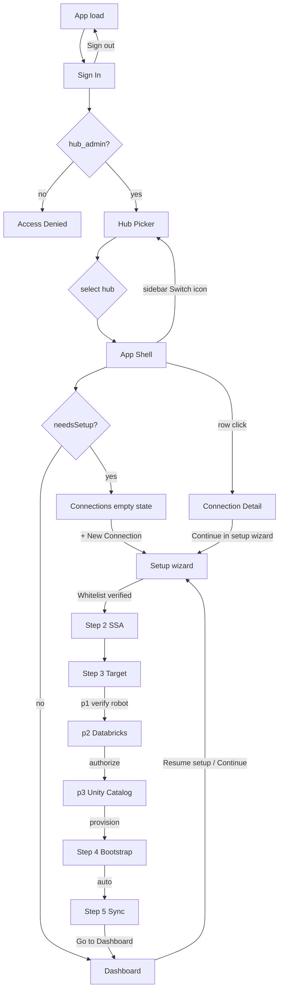

# M2M New Portal — UI Design Specification

**Epic:** ACC-M2M-001
**Version:** 1.1
**Status:** Design complete (mock implementation in `static/m2m_v2/`)
**Entry point:** Login screen → after sign-in: Hub Picker → App Shell (Dashboard / Connections / Setup wizard / Help)

This document describes the **new portal UI** (the "M2M Hub Sync" production UI) so an implementing agent can reproduce the same look, layout, copy, and behavior. Unless a screen says otherwise, copy must match **verbatim** (see §10 Copy bank).

---

## 1. Scope & entry

The portal is reached from the legacy demo panel via **"Open new portal →"** (`portalHref()` → `static/m2m_v2/index.html`). Once the user lands there, everything is a self-contained client-side mock:

| File | Role |
|------|------|
| `static/m2m_v2/index.html` | App shell — screen router containers, sidebar, Tailwind config, toast |
| `static/m2m_v2/js/app.js` | All logic — state, mock data, routing, rendering, wizard, sync simulation |

No backend. No `/api/*` calls. All behavior is simulated.

---

## 2. Design system

### 2.1 Tailwind config

```js
tailwind.config = {
  theme: {
    extend: {
      colors: {
        primary: { 50: '#eef2ff', 100: '#e0e7ff', 500: '#6366f1', 600: '#4f46e5', 700: '#4338ca' },
        adsk:    { 500: '#0696D7', 600: '#0A84C3', 700: '#0A6F9F' },
      }
    }
  }
}
```

- **Primary (indigo):** all brand CTAs, active nav, brand logo, empty-state icon.
- **Adsk (Autodesk blue):** only the login CTA and Autodesk logo.
- **Surfaces:** `slate-50` page background, white cards, `slate-200` borders, `slate-100` dividers.
- **Semantic chips:** emerald (success/ready/active), amber (warning/pending), rose (error/failed/denied), blue (info/running/whitelist-verified).
- Font: `Inter, ui-sans-serif, system-ui, sans-serif`. Fade-in animation on view change.

### 2.2 Recurring components

| Component | Styling |
|---|---|
| **Status badge (pill)** | `px-2 py-0.5 rounded-full text-xs font-medium` + color class |
| **Primary button** | `px-4 py-2.5 bg-primary-600 text-white rounded-lg hover:bg-primary-700 text-sm font-medium` |
| **Secondary button** | `px-4 py-2.5 border border-slate-200 rounded-lg text-sm font-medium hover:bg-slate-50` |
| **Disabled primary** | same + `opacity-40 cursor-not-allowed` + `disabled` attr |
| **Toggle switch (large)** | `w-12 h-6 rounded-full relative` (knob `w-5 h-5`, `translate-x-6` when on); emerald when on, slate-300 when off |
| **Toggle switch (small)** | `w-10 h-5` (knob `w-4 h-4`, `translate-x-5`) — used on connection rows |
| **Panel/card** | `bg-white rounded-xl border border-slate-200 p-6` |
| **Info banner** | `bg-blue-50 border border-blue-200 rounded-lg px-4 py-3 text-sm text-blue-900` |
| **Warning banner** | `bg-amber-50 border border-amber-200 rounded-lg p-3 text-sm text-amber-900` |
| **Error banner** | `bg-rose-50 border border-rose-200 rounded-lg p-3 text-sm text-rose-900` |
| **Success strip** | `bg-emerald-50 border border-emerald-200 rounded-lg p-3 text-sm text-emerald-800` |
| **Toast** | fixed top-right, dark (`#1e293b`), 3.4s auto-hide, prefix `✦` |

### 2.3 Status-badge color maps (exact)

**Tenant badge** (`tenantBadge`):

| Status | Classes |
|---|---|
| `ssa_active` | `bg-emerald-100 text-emerald-700` |
| `ssa_provision_failed` | `bg-rose-100 text-rose-700` |
| `ssa_limit_reached` | `bg-rose-100 text-rose-700` |
| `pending_whitelist` | `bg-amber-100 text-amber-700` |
| `whitelist_verified` | `bg-blue-100 text-blue-700` |
| no tenant | `bg-slate-100 text-slate-600`, label **"Not set up"** |
| fallback | `bg-slate-100 text-slate-600` (underscores → spaces) |

**Connection badge** (`statusBadge`):

| Status | Classes |
|---|---|
| `ready` | `bg-emerald-100 text-emerald-700` |
| `pending_bootstrap` | `bg-blue-100 text-blue-700` |
| `pending_databricks` | `bg-amber-100 text-amber-700` |
| `pending_ssa` | `bg-amber-100 text-amber-700` |
| `pending_custom_integration` | `bg-amber-100 text-amber-700` |
| `running` | `bg-blue-100 text-blue-700` |
| fallback | `bg-slate-100 text-slate-600` |

**Sync status pill** (`syncStatusCls`): `DC_JOB_SUBMITTED`/`WORKFLOW_RUNNING` → `bg-blue-100 text-blue-700`; `JOB_RUNNING` → `bg-amber-100 text-amber-700`; `COMPLETE` → `bg-emerald-100 text-emerald-700`; `FAILED` → `bg-rose-100 text-rose-700`.

### 2.4 Component state matrix

| Element | States (all must exist) |
|---|---|
| **Primary button** | default (indigo) · hover (`bg-primary-700`) · disabled (`opacity-40 cursor-not-allowed`) |
| **Secondary button** | default (white/border) · hover (`bg-slate-50`) |
| **Small toggle (row)** | off (`bg-slate-300`, knob left) · on (`bg-emerald-500`, knob `translate-x-5`) |
| **Large toggle (detail)** | off · on (`translate-x-6`) |
| **Connection row** | default (white) · hover (`bg-slate-50`) · cursor-pointer |
| **Hub card (picker)** | default (white) · hover (`border-primary-500 shadow-md`) · group-hover text indigo |
| **Sidebar nav link** | default · active (`bg-primary-50 text-primary-600` = `#eef2ff`/`#4f46e5`) |
| **Verify gates** | not-verified (amber) · blocked (rose) · verified (emerald) — see §4.8 |
| **Wizard stepper node** | done (emerald ✓) · current (indigo) · pending (slate) |
| **Toast** | hidden → shown (`opacity-0 translate-y` → visible), auto-hide |

### 2.5 Type & spacing conventions

| Use | Classes |
|---|---|
| Page/view title (h1) | `text-2xl font-semibold` |
| Panel title (h2) | `text-lg font-semibold` (or plain `font-semibold` in small cards) |
| Field label | `text-sm font-medium` |
| Body text | `text-sm text-slate-600` (secondary) / `text-slate-900` (default) |
| Stat values | `text-3xl font-semibold` (dashboard) / `text-base font-semibold` (detail) |
| Mono (ids, URLs, timestamps) | `font-mono text-xs` |
| Micro captions | `text-xs text-slate-500`; `text-[11px]`; `text-[10px] uppercase` (run trigger) |

**Spacing rhythm:** page padding `p-8`; section gaps `mb-8`/`mb-6`/`mb-4`; card padding `p-6` (panels) / `p-5` (stats) / `p-4` (banners) / `p-3` (compact); inline gaps `gap-2/2.5/3/4`; grid gaps `gap-4/6`.

**Radius:** `rounded-xl` cards, `rounded-lg` buttons/inputs, `rounded-full` pills/toggles, `rounded-2xl` login card.

**Elevation:** none by default; `shadow-sm` on the login card; custom toast shadow. No other shadows.

### 2.6 Iconography

- All icons are **inline SVGs**: `fill="none" stroke="currentColor" viewBox="0 0 24 24"`, `stroke-linecap="round" stroke-linejoin="round"`.
- **stroke-width:** `2` (buttons, hub swap, sign-out, login arrow) · `1.8` (nav + info/help icons).
- **Color via `currentColor`:** `slate-500` (nav idle) · `primary-600` (hub swap, empty-state icon) · `adsk-600` (login arrow on white) · `rose-600` (denied lock) · chip colors on help icons.
- **Sizes:** `w-4`–`w-8` per context (§4 screens).
- **Icon inventory:** home, link/chain, question-circle, swap-arrows, lock, info-circle, arrow-right, sign-out, shield, robot, server.
- **Rule:** outline only, never filled; never import an icon library — keep inline SVGs.

### 2.7 Micro-interactions (duration & easing)

| Motion | Spec |
|---|---|
| View fade-in | opacity 0→1 + translateY(6px→0), `0.25s ease` (`.fade-in`) |
| Toast | opacity/translateY transition `0.25s`; displayed 3.4s |
| Toggle knob | Tailwind `transition` (150ms ease) on `translate-x` |
| Button/link hover | Tailwind `transition` (150ms ease), bg/color swap |
| Spinner | `animate-spin` (1s linear infinite), `border-2 border-<color>-transparent rounded-full`, sizes `w-4`/`w-5` |
| Focus | not implemented in source — agent may add a `focus-visible` outline without changing visuals |

---

## 3. Screen router & navigation

### 3.1 Screens (full-page containers in `index.html`)

| Screen | id | Reached when |
|---|---|---|
| Sign In | `screen-login` | App load, sign-out |
| Access Denied | `screen-access-denied` | Signed-in user is not a hub admin |
| Hub Picker | `screen-hub-picker` | After login, on "Switch hub" |
| App Shell | `screen-app` | After a hub is selected |

### 3.2 App-shell views (`S.view`, rendered into `#main-view`)

| View | Function | Sidebar nav |
|---|---|---|
| `dashboard` | `renderDashboard()` | Dashboard |
| `connections` | `renderConnections()` | Connections |
| `connection-detail` | `renderDetail()` | (drill-down, not a nav item) |
| `setup` | `renderSetup()` | (entered via buttons, not a nav item) |
| `help` | `renderHelp()` | Help |

Sidebar has **no Setup nav item** — setup is entered through "Continue"/"Resume setup"/empty-state "+ New Connection".

### 3.3 Flow / state map



**New-hub rule:** `selectHub()` sets the view to **Connections** when `setupRequired(hub)` is true, else **Dashboard**. `setupStepFor()` returns: step 1 (no tenant / `pending_whitelist`), step 2 (`ssa_provision_failed` / `ssa_limit_reached`), step 3 (whitelist verified / `ssa_active`).

---

## 4. Screen details

### 4.1 Sign In (`screen-login`)

Centered card on a light gradient (`linear-gradient(180deg,#f5f7f9,#e9eef2)`).

- **Autodesk logo** (blue `#0696D7` "A" glyph) + wordmark **Autodesk**.
- Card (`bg-white rounded-2xl border border-slate-200 px-8 py-10`):
  - Title **Sign in**
  - Body: *"Continue to **Forma → Databricks Connector**. Sign in with your Autodesk account to grant access to your ACC hubs and projects. An **ACC / Forma Hub Administrator** is required to manage the hub robot."*
  - Primary CTA: **Sign in with Autodesk (ACC)** — `bg-adsk-600`, full width.
- Footer: *"Privacy · Legal · Terms of Use · © 2026 Autodesk, Inc."*
- Demo panel (mock, sliver): label **"Demo · mock sign-in (no real Autodesk call)"**, persona pills (**Alice · Hub Admin**, **Robert · Hub Admin**, **Casey · Viewer (denied)**), scenario dropdown.

Behavior: `accLogin()` → seeds current preset → `route()` (denies non-admins, else hub picker).

### 4.2 Access Denied (`screen-access-denied`)

Centered card, rose circular lock icon.

- Title **Access Restricted**
- Message: *"This connector is available only to ACC / Forma Hub Administrators.<br/>You are signed in as a Project Administrator."* (or *"…as a Viewer with read-only access."*)
- Button: **Sign out & try another account** (`bg-slate-900`).
- Caption: *"Demo: click the button to continue as a Hub Admin"*.

### 4.3 Hub Picker (`screen-hub-picker`)

- Brand header: **"A"** logo (`w-10 h-10 rounded-xl bg-primary-600 text-white`) + **ACC → Databricks Connector**.
- Title **Which hub do you want to manage?** + *"Hubs you administer appear below. Pick one to continue."*
- Hub cards in a 2-column grid (`grid md:grid-cols-2 gap-4`). Each card:
  - Hub **name**, short id (`b.7f3a9b2c…`, mono), tenant status badge.
  - Meta line: *"N connection(s) · Last sync …"* / *"Not set up yet"* / *"Brand-new hub — first connection"*.
  - CTA: **Continue setup →** (needs setup) / **Manage →** (ready) / **Connect →** (no role).
  - Whole card clickable → `selectHub(hubId)`.
- Footer controls: scenario dropdown + **show Access Denied** link.

### 4.4 App Shell — Sidebar (`<aside>`)

Fixed `w-64`, white, right border. Top → bottom:

1. **Brand:** "A" logo (`w-9 h-9 rounded-lg bg-primary-600`) + **ACC → Databricks** / *Connector*.
2. **Current Hub block:**
   - Label **CURRENT HUB**.
   - Clickable card (`bg-slate-50 hover:bg-slate-100 rounded-lg p-3`): hub **name** + swap icon (right, `w-6 h-6 text-primary-600`), short hub id (mono), tenant status badge. Card click → hub picker. **No separate Switch text button.**
3. **Nav:** Dashboard · Connections · Help. Active link: `bg-primary-50 text-primary-600` (`#eef2ff`/`#4f46e5`), icon turns indigo.
4. **Demo scenario** dropdown.
5. **User block:** avatar (initials on `bg-primary-100 text-primary-700`), name, role (Hub Admin / Viewer), sign-out icon.

### 4.5 Dashboard (`renderDashboard`)

Header: hub **name** (title) + subtitle *"Service Account active|not provisioned · Last sync …"*.

- **Onboarding-incomplete banner** (if `setupRequired`): amber, *"Onboarding incomplete. The hub service account / whitelist is not ready."* + optional mono error + **Resume setup** button.
- **3 stat cards:** **Active Connections** / **Last Successful Sync** / **Failed Runs (7d)** (rose when > 0).
- **Connections panel:** header **Connections** + **View all** link; rows (project name, catalog · workspace, status badge, relative last-sync) → click opens detail. Empty: *"No connections yet. Complete setup to create the first one."*
- **Headless sync info banner** (indigo): *"Headless sync: Scheduled jobs use this hub's Service Account and each connection's Databricks Service Principal. No human login is required at night — and the running credential is re-minted from vault when it expires, never via a silent U2M re-auth."*

### 4.6 Connections (`renderConnections`)

Header: **Connections** + subtitle *"All pipelines for {hub}"*. **"+ New Connection" corner button shows only when there are rows.**

**Table** (when rows exist): columns Project · Databricks Target · Status · Last Sync · actions.

- Project cell: project name (indigo, underline on hover) + catalog (mono, small).
- Databricks Target: workspace URL (mono).
- Status: onboarding badge (+ **running** badge while syncing).
- Last Sync: relative time of most recent complete run.
- Actions (right, no row navigation when clicked): **Auto CDC** small toggle + **▶ Sync Snapshot** + **▶ Sync CDC** (disabled unless `ready` and not syncing) + **Continue** (only when not ready).
- Row click → `openConnection(id)`.

**Empty state** (when no rows): centered card — indigo link icon (`w-14 h-14 rounded-full bg-primary-50`), title **No connections yet**, *"Complete setup to create the first connection."*, centered **+ New Connection** primary button.

### 4.7 Connection Detail (`renderDetail`)

- **← Back to Connections** link.
- Header: project **name** + status badge; subline `{hub} → {workspace} → {catalog}`; mono `connection_id …`. Right: **▶ Sync Snapshot** + **▶ Sync CDC**.
- **4 stat cards:** **Status** (badge) · **Last Sync** (*"Snapshot · 3 hours ago · 2026-… utc"*) · **Next Sync (upcoming)** (*"02:00 utc · upcoming"* / *"scheduler off"*) · **Total Runs** (*"N"* + *"M failed"* in rose).
- **Onboarding Status** panel: stepper **Whitelist → SSA → Databricks → Bootstrap → Ready** (green ✓ on done; numbered otherwise) + **Continue in setup wizard →** when not ready.
- **Headless sync** card: header + Active/Paused pill; **Auto CDC** large toggle; rows *Next sync (upcoming)*, *Last sync*; key-age warning when robot key > 89 days (*"Running token expired → re-minted from vault private key on next use. No user login."*).
- **Databricks** card: workspace URL (mono) + **Copy URL** + **↗ Open workspace**; actions **Rotate robot key** (when SSA exists), **Scheduler tick**, **Simulate failure** (rose outline).
- **Sync History** table: Time (relative + mono absolute) · Type (Snapshot/CDC + trigger) · Status (Success/Failed/Skipped/Running…) with meta (files+duration, error, or memo).
- **Out-of-band warning** (when relevant): *"Last failure not retried automatically…"* or *"Onboarding blocked…"* (amber).

### 4.8 Setup Wizard (`renderSetup`)

Container: title **Setup Wizard**, subline *"Onboarding for **{hub}** — hub-scoped, one robot per hub."*

**Stepper (5 steps):** `Whitelist · SSA · Target · Bootstrap · Sync`. Done = green ✓; current = indigo; pending = slate.

**Step 1 — Custom Integration Whitelist**
- Intro: *"This step cannot be automated. The Client ID must be whitelisted in Autodesk before any ACC data can flow."*
- Amber **ACTION REQUIRED** block: *"whitelist this app's Client ID in ACC:"* / *"Account Admin ▸ Settings ▸ Custom Integrations ▸ add the connector Client ID."*
- Masked Client ID (`maskCid` → e.g. `aps-xxxx…hijk`) + **Copy** + note *"The full Client ID is copied — the masked view keeps it from being exposed on screen."*
- **Verify gate states:**
  - *Not verified:* amber strip **"Whitelist not verified yet"** + **Verify whitelist** button; Continue disabled.
  - *Blocked:* rose strip **"403 — Client ID not whitelisted for this org"** + instructions; buttons **Simulate: done in ACC** (demo) + **Verify whitelist**; Continue disabled.
  - *Verified:* emerald strip **"✓ Whitelist verified — Custom Integration probe passed"** + enabled **Continue →**.

**Step 2 — Service Account** (four variants)
- *Ready (reused):* emerald card **"Service Account ready (reused — no second robot)"**, robot **email** + **Copy**, *"Private key stored securely in vault"*; **Continue →**.
- *New (provisioning):* spinner *"Creating Service Account via APS API"* + **Simulate success**.
- *Provisioning failed:* rose **"No robot exists for this hub yet"** + mono error + **Retry provisioning →**.
- *Quota blocked:* rose **"cs-16: SSA limit reached (10 per Client ID)"** + *"Creation is intentionally not attempted — the cap sits at the Client ID level across the org."* + **Raise quota → then re-check**.

**Step 3 — Target** (3 sub-parts, `wizard.target_part`)
- **Part 1 — Project + Databricks Target:** *"Choose the ACC project and Databricks destination. One pipeline is allowed per catalog. The hub Service Account will be reused for this connection."* **ACC Project** dropdown → **G3 verify gate**: unverified = amber *"Robot not verified on this project yet"*; verified = emerald *"✓ Robot verified on ACC project — {robot email}"*. **Verify robot in ACC** button (when project chosen & unverified); **Continue →** only enabled when verified.
- **Part 2 — Databricks Credentials:** *"Connect to your Databricks workspace. The hub robot (SSA) drives the sync on this connection."* **Databricks Workspace URL** is a **free-text input** (placeholder `https://<workspace-url>.cloud.databricks.com`) — typing enables the authorize button. **Databricks Service Principal** optional: SP ID (client ID) + SP Secret (`type="password"`, **never echoed into the DOM**, only a placeholder shown); note *"…written to vault — never stored or displayed in plaintext."* CTA: **🔒 Authorize & Sign In Databricks** (disabled until URL present). While "authorizing": spinner *"Redirecting to Databricks sign-in…"* + blue note with callback `https://app.forma-dbx.connector/callback`; after ~2.6s → authorized, advance to part 3.
- **Part 3 — Unity Catalog:** green *"✓ Databricks authorized — choose a catalog"*; workspace strip (mono URL + **Copy URL** + **↗ Open workspace**); **Unity Catalog** dropdown + **↻ Refresh list**; note *"Pick an existing catalog from your workspace…"*; CTA **▶ Run workspace provisioning** (enabled when catalog chosen) → creates/resumes connection → Bootstrap.

**Step 4 — Bootstrap**
- *Running:* blue *"Bootstrap running… this takes 1–2 minutes."* + title **Bootstrap Progress** + checklist of `BS_STEPS` with ✓ or spinner (10 steps: validate workspace access → SQL warehouse RUNNING → validate catalog → create schemas → volume → validate path → upload `pk_config_template.json` → upload notebooks → save configuration). ~700ms per step, then auto-advance to step 5.
- *Complete:* *"Bootstrap complete — continue to Sync."* + **Continue →**.

**Step 5 — Sync Data**
- *"Push ACC data into Unity Catalog Bronze tables via the Data Connector."*
- Blue info strip: *"Sync Snapshot exports 16 snapshot-only groups (no cdc* mirror) plus a 10-group cdc* baseline for Pipeline B, then runs Pipeline A and Pipeline B (at most once per 24 hours)…"*
- **▶ Sync Snapshot** (emerald) + **Refresh Status**.
- Run card: status pill (`DC_JOB_SUBMITTED` → `WORKFLOW_RUNNING` → `JOB_RUNNING` → `COMPLETE` / `FAILED`), *"Hub: {hub} › Project: {project}"*, file count *"128 CSV files uploaded"*, started time, polling every 10s note.
- Footer right-aligned: **Go to Dashboard** → `finishSetup()`.

### 4.9 Help (`renderHelp`)

Title **Help** + *"How the Forma → Databricks Connector works"*. 2×2 grid of cards (icon chip + title + description):

1. **Hub administrators only** (indigo shield) — access per hub via ACC; project admins/viewers blocked.
2. **One robot per hub** (sky robot) — single SSA reused; 10-robot limit per Client ID.
3. **Whitelist is a hard gate** (amber lock) — Custom Integration cannot be automated; blocked until whitelisted.
4. **Headless by default** (emerald server) — robot + SP auth; no human session.

### 4.10 ASCII wireframes (placement reference)

**Sign In**
```
┌────────────────────────────────────────────┐
│              ▴ Autodesk (blue)             │
│   ┌──────────────────────────────────┐     │
│   │  Sign in                         │     │
│   │  Continue to ACC → Databricks    │     │
│   │  Connector. … Hub Administrator   │     │
│   │  is required to manage the hub   │     │
│   │  robot.                          │     │
│   │  [ Sign in with Autodesk (ACC) ] │     │
│   └──────────────────────────────────┘     │
│   Privacy · Legal · Terms · © 2026         │
│   ┌──────────────────────────────────────┐ │
│   │ Demo · mock sign-in                  │ │
│   │ (Alice)(Robert)(Casey)  Scenario ▾   │ │
│   └──────────────────────────────────────┘ │
└────────────────────────────────────────────┘
```

**Hub Picker**
```
┌──────────────────────────────────────────────┐
│ [A] ACC → Databricks Connector               │
│ Which hub do you want to manage?             │
│ Hubs you administer appear below. Pick one…  │
│ ┌───────────────────┐ ┌───────────────────┐  │
│ │ Acme West         │ │ Acme East         │  │
│ │ b.7f3a9b2c… [badge]│ │ b.9e1d4f8a… [badge]│  │
│ │ Brand-new hub —   │ │ Not set up yet    │  │
│ │ first connection  │ │                   │  │
│ │ Continue setup →  │ │ Connect →         │  │
│ └───────────────────┘ └───────────────────┘  │
│ Demo scenario ▾        show Access Denied    │
└──────────────────────────────────────────────┘
```

**App Shell (sidebar + main)**
```
┌───────────────┬─────────────────────────────────┐
│ [A] ACC→DBX   │ #main-view                      │
│  Connector    │   (Dashboard / Connections /    │
│               │    Detail / Setup / Help)       │
│ CURRENT HUB   │                                 │
│ [Acme West ⇄] │                                 │
│ b.7f3a9b2c…   │                                 │
│ [✓ ssa active]│                                 │
│               │                                 │
│ Dashboard     │                                 │
│ Connections   │                                 │
│ Help          │                                 │
│               │                                 │
│ Demo scenario ▾│                                │
│ [AH] Alice    │                                 │
│ Hub Admin  ⏻  │                                 │
└───────────────┴─────────────────────────────────┘
```

**Connections (table)**
```
Connections                        All pipelines for Acme West
┌──────────────────────────────────────────────────────────────┐
│ Project         Target                 Status   Last  Actions │
│──────────────────────────────────────────────────────────────│
│ ACME-West-Tower https://dbc-abc123…    ✓ready   2h  Auto CDC ▾│
│ bronze_acme_…                          ✓ready       ▶ Snapshot│
│──────────────────────────────────────────────────────────────│
│ ACME-West-…    …                       …         …    ▶ CDC   │
└──────────────────────────────────────────────────────────────┘
```

**Connections (empty state)**
```
Connections
┌──────────────────────────────────────────────┐
│              (link icon circle)              │
│            No connections yet                │
│    Complete setup to create the first one.   │
│           [ + New Connection ]               │
└──────────────────────────────────────────────┘
```

**Connection Detail**
```
← Back to Connections
ACME-West-Tower  [✓ ready]        [▶ Sync Snapshot] [▶ Sync CDC]
Acme West → https://dbc-abc123… → bronze_acme_west
connection_id cnx_7f3a…

┌──────────┐ ┌──────────┐ ┌──────────┐ ┌──────────────┐
│ Status   │ │ Last Sync│ │ Next Sync│ │ Total Runs   │
│ [✓ready] │ │ Snapshot…│ │ 02:00 utc│ │ 3 · 0 failed │
└──────────┘ └──────────┘ └──────────┘ └──────────────┘

Onboarding Status:  ✓Whitelist ✓SSA ✓Databricks ✓Bootstrap ✓Ready
                    [ Continue in setup wizard → ]   (only if not ready)

┌──────────────────────────┐ ┌──────────────────────────┐
│ Headless sync   [Active] │ │ Databricks               │
│ Auto CDC  [====●]        │ │ https://dbc-abc123…      │
│ Next sync …  Last sync … │ │ [Copy URL] [↗ Open]      │
│                          │ │ [Rotate robot key]       │
│                          │ │ [Scheduler tick]         │
│                          │ │ [Simulate failure]       │
└──────────────────────────┘ └──────────────────────────┘

Sync History
│ Time      │ Type     │ Status      │
│ 2h ago…   │ Snapshot │ Success 128f │
└──────────────────────────────────────┘
```

**Setup wizard — Step 1 Whitelist (not verified)**
```
Setup Wizard
Onboarding for Acme West — hub-scoped, one robot per hub.
✓Whitelist  2 SSA  3 Target  4 Bootstrap  5 Sync

┌──────────────────────────────────────────────┐
│ Custom Integration Whitelist                 │
│ This step cannot be automated…               │
│ ⚠ ACTION REQUIRED — whitelist this app's     │
│   Client ID in ACC:                          │
│   Account Admin ▸ Settings ▸ Custom          │
│   Integrations ▸ add the connector Client ID.│
│ ┌───────────────────────────┐ ┌────┐         │
│ │ aps-xxxx…abc123xyz        │ │Copy│         │
│ └───────────────────────────┘ └────┘         │
│ ⚠ Whitelist not verified yet                 │
│ [ Verify whitelist ]        [Continue → 灰]  │
└──────────────────────────────────────────────┘
```

**Setup wizard — Step 5 Sync**
```
✓Whitelist ✓SSA ✓Target ✓Bootstrap  5 Sync

┌──────────────────────────────────────────────┐
│ Sync Data                                    │
│ Push ACC data into Unity Catalog Bronze      │
│ tables via the Data Connector.               │
│ ⓘ Sync Snapshot exports 16 snapshot-only     │
│   groups … at most once per 24 hours.        │
│ [▶ Sync Snapshot]  [Refresh Status]          │
│ (run card appears here when started)         │
│                              [Go to Dashboard]│
└──────────────────────────────────────────────┘
```

### 4.11 Form-validation matrix (exact enable/disable triggers)

| Control | Enabled when | Disabled / other |
|---|---|---|
| Step 1 · Verify whitelist | always | — |
| Step 1 · Simulate: done in ACC | only in `blocked` state | — |
| Step 1 · Continue → | `verified` | otherwise |
| Step 2 · Continue → | SSA exists (reused) | provisioning / failed / limit panels |
| Target p1 · Verify robot in ACC | project selected && g3 !== verified | — |
| Target p1 · Continue → | `project_id` && g3 === `verified` | otherwise |
| Target p2 · 🔒 Authorize & Sign In Databricks | workspace URL non-empty | empty (updates live as you type) |
| Target p3 · ▶ Run workspace provisioning | catalog chosen | no catalog |
| Step 5 · ▶ Sync Snapshot | no in-flight run | in-flight |
| Row / detail · Sync Snapshot & CDC | `ready` && not syncing | otherwise; CDC also requires an initialized watermark |
| Auto CDC toggles | always | — |
| `createConnection()` | project + workspace + catalog, else toast | — |

### 4.12 Edge cases (as implemented)

| Case | Behavior |
|---|---|
| Hub with zero projects | Target p1 select has only "Select…"; Continue stays disabled |
| Empty sync history | Detail table: **"No runs recorded."** |
| No ready connection on step 5 | **"No ready connection — bootstrap first."** |
| No connections at all | Connections empty state; dashboard preview shows empty text |
| Invalid / empty workspace URL | Authorize disabled; toast if attempted |
| **Page refresh** | State resets — `init()` re-seeds `new-user-new-hub`; no persistence |
| Long names / URLs | `truncate` + `min-w-0` (workspace, user name); `break-all` (Client ID, robot email) |
| Sync during in-flight run | Buttons disabled; `schedulerTick` appends a **Skipped** run |
| CDC without watermark | Toast **"CDC requires an initialized watermark"** |
| Non-ready connection sync | Buttons disabled |
| Rotate key with no SSA | Toast **"No service account on this hub"** |
| Simulate failure while syncing | Toast **"Stop the in-flight run before injecting a failure"** |

---

## 5. Mock data model

### 5.1 Exact seed values (reproduce identically)

**Hubs:**

| hub_id | id_short | acc_account_id | name | org | cid |
|---|---|---|---|---|---|
| `b.hubA123` | `b.7f3a9b2c` | `acme-ent-7f2a` | Acme West | ACME Corp | `aps-client-id-abc123xyz` |
| `b.hubB456` | `b.9e1d4f8a` | `acme-ent-7f2a` | Acme East | ACME Corp | `aps-client-id-abc123xyz` |

**Projects:** `A` → `pA1 ACME-West-Tower`, `pA2 ACME-West-Campus`, `pA3 ACME-West-Parking`; `B` → `pB1 ACME-East-Tower`, `pB2 ACME-East-Campus`.

**Workspaces:** `https://dbc-abc123.cloud.databricks.com`, `https://dbc-def456.cloud.databricks.com`.

**Catalogs:** `bronze_acme_west`, `bronze_acme_east`, `bronze_northwind`.

**Users:** `alice@acme.com` (Alice Hayward, AH, hub_admin) · `bob@acme.com` (Robert Chen, RC, hub_admin) · `casey@acme.com` (Casey Miller, CM, non-admin).

**Robot (SSA):** email `forma-dbx-7f3a@client.adskserviceaccount.autodesk.com` (A) / `forma-dbx-9e1d@…` (B); `service_account_id` `svc-hubA123`/`svc-hubB456`; `private_key_ref` `vault://ssa/b.hubA123/private-key`; default `key_age_days: 42`; `on_project_projects: ['pA1']` when seeded as active.

**Connection:** `connection_id = "cnx_" + hash8(hub|project|workspace|catalog)`; `snapshot_pipeline_id = "pipe_snap_" + hash8(cid+"A")`; `cdc_pipeline_id = "pipe_cdc_" + hash8(cid+"B")`; schedule `cron: "0 2 * * ? *"`; SP `client_secret_ref: vault://dbx/{cid}/secret`.

**Seeded run history** (per ready connection): snapshot·manual·complete·128 files·21s · cdc·auto·complete·37 files·9s · snapshot·auto·complete·127 files·22s.

**Bootstrap steps (`BS_STEPS`, verbatim):** validate workspace access → waiting for SQL Warehouse RUNNING (cold start ~5 min) → validate Unity Catalog and metastore → verify catalog `acc_test` → create schemas → creating volume `acc_test.bronze.acc_bronze_volume` → validate volume path `/Volumes/acc_test/bronze/acc_bronze_volume` → upload `pk_config_template.json` to Volume → upload notebooks → save configuration.

### 5.2 Entity shapes

| Entity | Fields | Notes |
|---|---|---|
| **Hub** | `hub_id`, `id_short`, `acc_account_id`, `name`, `org`, `cid` | |
| **Project** | `id`, `name` | per hub |
| **Tenant** | `onboarding_status`, `whitelist_verified_at`, `last_error` | statuses: `pending_whitelist \| whitelist_verified \| ssa_active \| ssa_provision_failed \| ssa_limit_reached` |
| **SSA** | `robot_email`, `service_account_id`, `key_id`, `key_age_days`, `on_project_projects[]`, `dc_authorized` | one per hub |
| **Connection** | `connection_id`, `project_id`, `project_name`, `workspace`, `catalog`, `onboarding_status`, `schedule{enabled,cron}`, `watermark`, `last_error`, `runs[]` | statuses: `pending_custom_integration \| pending_ssa \| pending_databricks \| pending_bootstrap \| ready` |
| **Run** | `type` (snapshot/cdc), `trigger` (manual/auto), `state` (running/complete/failed/skipped), `files`, `duration_sec`, `phase`, `error/memos` | |

### 5.3 Demo presets

A new user/new hub · B 2nd admin · C resume (connection stuck `pending_databricks`) · D new project · E one admin two hubs · F two admins one hub · G different admins · H whitelist not done · I viewer denied · J existing user brand-new hub · K project admin denied · L SSA limit (hub B `ssa_limit_reached`, last_error `400 cs-16: the maximum of 10 service accounts for Client ID has been reached.`) · M connection `pending_custom_integration` (last_error `403 Custom Integration — Client ID not whitelisted for this org`) · N SSA failed (`403 from POST /authentication/v2/service-accounts — vault write failed (KMS denied)`) · O token expiry (key_age 91 days).

---

## 6. Timings & thresholds (exact)

| Behavior | Value |
|---|---|
| Toast display | 3.4s then auto-hide |
| Bootstrap | ~700ms per step (interval 700ms); auto-advance step 4 → 5 when done |
| Databricks authorize | ~2.6s "authorizing" → authorized → advance to Target part 3 |
| Sync poll | interval 1500ms; copy says "Polling every 10s…" |
| Sync completion (simulated) | snapshot 21s / cdc 9s; files 128 / 37 |
| Key-age warning threshold | robot `key_age_days > 89` → amber warning + re-mint memo |
| Relative-time buckets | <120s "just now"; <2h "N minutes ago"; <48h "N hours ago"; else "N days ago" |
| Next-sync computation | `nextTick`: scheduler off if disabled; else next even UTC minute (2-min cadence) |

---

## 7. Responsive behavior (as implemented)

| Region | Breakpoints |
|---|---|
| Sidebar | fixed `w-64`; main content `ml-64` (no collapse behavior implemented) |
| Hub picker grid | `md:grid-cols-2` → single column below `md` |
| Detail stat cards | `grid-cols-2 md:grid-cols-4` |
| Help cards | `sm:grid-cols-2` |
| Dashboard stats | `grid-cols-3` (fixed) |
| SP input pair (Target p2) | `md:grid-cols-2` |
| Connections table | full width; no horizontal scroll wrapper (accept compression at narrow widths) |

---

## 8. Accessibility (as implemented + recommendations)

**As implemented:** icon-only toggles carry `title="Toggle Auto CDC"`; Autodesk logo SVG is `aria-hidden="true"`; color is never the only signal (badges also carry text labels); buttons use native `<button>`.

**Recommended (agent should add without changing visuals):** `role="status" aria-live="polite"` on the toast; `<label for>` pairing on inputs; `focus-visible` ring (`outline` indigo) on buttons/links/rows; `<th scope="col">` in tables; `aria-current` on active nav.

---

## 9. Acceptance checklist (per preset)

Use to verify the rebuilt UI matches behavior:

| Preset | Expected on load |
|---|---|
| A · new-user-new-hub | Login → picker shows **Acme West** (brand-new) → select → **Connections empty state** → wizard step 1 (whitelist not verified) |
| B · 2nd admin | Login as **Robert** → picker → Acme West **Manage** → dashboard with 1 ready connection |
| C · resume | Auto-lands Acme West → connection **`pending_databricks`** → detail shows amber step 3 + **Continue in setup wizard →** |
| D · new project | Acme West dashboard, 1 connection; can start **+ New Connection** for another project |
| E · one admin two hubs | Acme West active; Acme East needs setup (Continue setup) |
| F · two admins one hub | Shared Acme West, 1 connection |
| G · different admins | Alice → Acme West; Robert → Acme East |
| H · whitelist not done | Acme West dashboard shows **onboarding-incomplete banner**; wizard step 1 not verified |
| I · viewer denied | **Access Restricted** ("as a Viewer…") |
| J · existing user new hub | Both hubs; Acme East brand-new |
| K · project admin denied | **Access Restricted** ("as a Project Administrator…") |
| L · SSA limit | Lands Acme East → wizard **step 2 quota-blocked** panel |
| M · connection pre-whitelist | Connection row shows amber + **Continue**; wizard step 1 |
| N · SSA failed | Wizard **step 2 provisioning failed** + Retry |
| O · token expiry | Run a sync → toast "SSA token re-minted"; detail shows key-age amber note |

---

## 10. Copy bank (verbatim strings by screen)

| Screen / element | Exact text |
|---|---|
| Login · subtitle | Continue to **Forma → Databricks Connector**. Sign in with your Autodesk account to grant access to your ACC hubs and projects. An **ACC / Forma Hub Administrator** is required to manage the hub robot. |
| Login · CTA | Sign in with Autodesk (ACC) |
| Denied · title / message | Access Restricted / This connector is available only to ACC / Forma Hub Administrators. |
| Denied · button | Sign out & try another account |
| Picker · title | Which hub do you want to manage? |
| Picker · card CTAs | Continue setup → / Manage → / Connect → |
| Picker · metas | Brand-new hub — first connection / Not set up yet / {N} connection(s) · Last sync {rel} |
| Sidebar · labels | CURRENT HUB · Dashboard · Connections · Help · Demo scenario |
| Dashboard · subtitle | Service Account {active\|not provisioned} · Last sync {rel} |
| Dashboard · stats | Active Connections · Last Successful Sync · Failed Runs (7d) |
| Dashboard · banner | Onboarding incomplete. The hub service account / whitelist is not ready. |
| Connections · header | All pipelines for {hub} |
| Connections · empty | No connections yet / Complete setup to create the first connection. / + New Connection |
| Detail · stepper | Whitelist → SSA → Databricks → Bootstrap → Ready |
| Wizard · step1 intro | This step cannot be automated. The Client ID must be whitelisted in Autodesk before any ACC data can flow. |
| Wizard · step1 statuses | Whitelist not verified yet / 403 — Client ID not whitelisted for this org / Whitelist verified — Custom Integration probe passed |
| Wizard · step2 statuses | Service Account ready (reused — no second robot) / No robot exists for this hub yet / cs-16: SSA limit reached (10 per Client ID) / Private key stored securely in vault |
| Wizard · step3 p2 note | …written to vault — never stored or displayed in plaintext. |
| Wizard · step3 CTAs | 🔒 Authorize & Sign In Databricks / ▶ Run workspace provisioning |
| Wizard · step4 | Bootstrap running… this takes 1–2 minutes. / Bootstrap Progress / Bootstrap complete — continue to Sync. |
| Wizard · step5 | Push ACC data into Unity Catalog Bronze tables via the Data Connector. / ▶ Sync Snapshot / Refresh Status / Go to Dashboard |
| Help · titles | Hub administrators only · One robot per hub · Whitelist is a hard gate · Headless by default |
| Toasts (samples) | Signed in as {name} · ✓ Whitelist verified — probe passed · 403 — Client ID not whitelisted for this org · Service account ready · ✓ Robot verified on ACC project · Redirecting to Databricks sign-in… · ✓ Databricks authorized — returning to application · Connection ready — scheduled sync active · SNAPSHOT sync started · Sync Snapshot complete — 128 CSV files uploaded · Schedule enabled / Schedule paused |

---

## 11. Visual references

No screenshots or recordings are available. The **ASCII wireframes in §4.10** are the authoritative layout reference; the type/color tables (§2.1–2.5) and verbatim copy (§10) define exact rendering.

---

## 12. Behavior rules

1. **Never render PEM, client_secret, or tokens in the DOM.** Secrets show masked/placeholder text only.
2. Robot UI shows email + "stored in vault" note (no SA id / key id in the new portal).
3. **G1 whitelist** is a hard gate — setup and sync are blocked until verified (verify probe + 403 blocked state).
4. **G3 robot-on-project** — Continue to Databricks is disabled until the robot is verified on the selected ACC project.
5. Never offer "create robot" when an SSA already exists — reuse.
6. Non-hub-admin → Access Restricted screen.
7. Scheduled/headless sync uses robot + SP — never user refresh tokens (shown via "re-mint" memo on expiry).
8. Auto CDC toggle = `PUT schedule`; skipping on in-flight run is surfaced as a **Skipped** run with memo.
9. `selectHub` routes needs-setup hubs to **Connections** (empty state), not Dashboard.

---

## 13. Implementation notes for the agent

- Use Tailwind via CDN with the config in §2.1; avoid other UI frameworks.
- Two static files only (`index.html` + `js/app.js`); expose a single global `window.m2mV2` namespace with `init()`.
- Screen switching via `hidden` class on `#screen-*`; view switching via `#main-view` innerHTML.
- Relative-time helpers (`rel`, `fmt`, `hm`), status badge maps, and the exact copy in §10 should be reproduced verbatim for visual parity.
- All timestamps/ids are mock; deterministic `cnx_` hashes are acceptable.
- Self-verify against §9 acceptance checklist before declaring done.

---

## 14. Guardrails — what NOT to build

1. **No backend, no `/api/*`, no real tokens/auth** — everything is simulated.
2. **No dark mode, no charts/data-viz** (stat cards only), **no i18n** (English only), **no persistence** (refresh resets to `new-user-new-hub`).
3. **Do not load the Inter font** — the source lists Inter in `font-family` but never loads it; it falls back to system-ui. Preserve that behavior.
4. **No UI framework beyond the Tailwind CDN; no icon library** — inline SVGs only.
5. Do not add a **Setup sidebar nav item**; do not reintroduce the corner **"Switch"** text button or a **second "+ New Connection"** in the empty state.
6. No horizontal-scroll table wrappers unless a real overflow requires them.

---

## 15. Branding decision (open)

Current code state is inconsistent:

| Surface | Current text |
|---|---|
| Login body (`index.html:55`) | Forma → Databricks Connector |
| `<title>` (`index.html:6`) | Forma → Databricks Connector |
| Help subtitle (`app.js:784`) | How the **Forma → Databricks** Connector works |
| `app.js` header comment | Forma → Databricks Connector |
| Sidebar brand (`index.html:124`) | **ACC → Databricks** |
| Hub-picker brand (`index.html:99`) | **ACC → Databricks** |

**Recommendation:** standardize on **ACC → Databricks** everywhere (login body, `<title>`, Help subtitle). The agent should implement whichever line the owner settles on; until then this spec documents the mixed state. This is a pending copy edit, not yet applied to code.