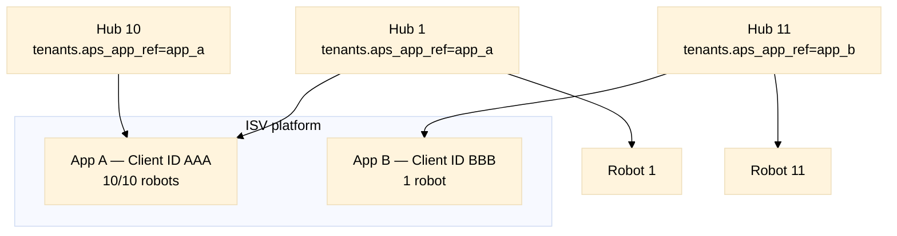
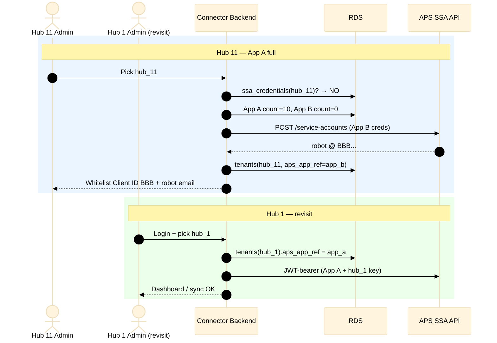

# APS Client ID Sharding — Implementation Specification

**Status:** Production implementation spec  
**Scope:** 10-robot quota, multi–Client ID sharding, hub revisit behavior  
**Parent:** [M2M_SSA_IMPLEMENTATION.md](./M2M_SSA_IMPLEMENTATION.md)  
**Database:** [DATABASE.md](./DATABASE.md)  
**Applies to:** `acc-connector/` — `ssa_provisioner.py`, onboarding UI, ops alerts

---

## Table of contents

1. [Problem statement](#1-problem-statement)
2. [POC vs production](#2-poc-vs-production)
3. [Responsibility model](#3-responsibility-model)
4. [Production architecture](#4-production-architecture)
5. [Implementation — `ensure_ssa` with sharding](#5-implementation--ensure_ssa-with-sharding)
6. [Hub 11 and hub revisit flows](#6-hub-11-and-hub-revisit-flows)
7. [UI contract](#7-ui-contract)
8. [Ops: quota monitoring](#8-ops-quota-monitoring)
9. [Modules and files](#9-modules-and-files)
10. [Test specification](#10-test-specification)
11. [Migration from POC](#11-migration-from-poc)
12. [Traceability](#12-traceability)

---

## 1. Problem statement

Autodesk SSA default quota: **10 service accounts (robots) per APS Client ID**.

Production design: **one isolated robot per `hub_id`**.

Therefore:

```
hub_count > 10 on same Client ID  →  hub #11 blocked at POST /service-accounts
```

This is **not** a customer admin problem. The **ISV connector backend** must:

1. Pick the correct APS app (Client ID shard) per hub at first provision.
2. **Never change** that assignment for an existing hub.
3. Pre-check quota and surface friendly errors.
4. Alert ops before capacity is exhausted.

**Anti-pattern (forbidden):** Reuse one robot across multiple hubs to bypass the limit.

---

## 2. POC vs production

### 2.1 Today (POC — global `.env`)

| Source | Used for | Scope |
|--------|----------|-------|
| `APS_CLIENT_ID` / `APS_CLIENT_SECRET` | U2M OAuth + M2M fallback | **Global** |
| `ACC_M2M_CLIENT_ID` / `ACC_M2M_CLIENT_SECRET` | M2M if set | **Global** |
| `ACC_SSA_USER_ID`, `ACC_SSA_KEY_ID`, `ACC_SSA_PRIVATE_KEY_PATH` | One robot | **Global** |

Hub 1 and hub 11 share the same Client ID and same robot. **Not production-ready.**

Reference: `backend/services/m2m_service.py` → `_acc_creds()` reads `os.getenv('ACC_M2M_CLIENT_ID')` or `get_config('APS_CLIENT_ID')`.

### 2.2 Production target

| Layer | Store | Scope |
|-------|-------|-------|
| APS app credentials | Platform vault (`aps_apps`) | ISV-owned; N apps (A, B, C…) |
| Shard assignment | `tenants.aps_app_ref` | **Immutable per hub** |
| Robot metadata | `ssa_credentials` | **One row per hub** |
| Robot private key | Secrets Manager per hub | Vault ref in RDS |

Production `.env`: platform bootstrap only (DB, vault prefix, **default** app ref for dev) — **not** one Client ID for all hubs.

---

## 3. Responsibility model

| Actor | Responsibility |
|-------|----------------|
| **Hub admin (customer)** | Whitelist **the Client ID shown in UI** + invite **the robot email shown in UI** |
| **ISV / connector backend** | Select app shard, create robot via API, store mapping, monitor quota, add App B/C when needed |
| **Hub 11 admin** | Same wizard as hub 1 — **does not** supply or choose Client ID |

---

## 4. Production architecture

### 4.1 Platform vault (ISV-owned)

```text
aps_apps (RDS registry + Secrets Manager secrets):

  app_a  →  client_id: AAA...
            client_secret_ref: .../platform/aps-app-a-secret
            max_robots: 10

  app_b  →  client_id: BBB...
            client_secret_ref: .../platform/aps-app-b-secret
            max_robots: 10
```

### 4.2 Per-hub DB (immutable assignment)

```text
tenants:
  hub_id         = b.hub1 … b.hub11
  aps_app_ref    = app_a (hubs 1–10), app_b (hub 11)

ssa_credentials:
  hub_id              UNIQUE
  service_account_id  UNIQUE   ← prevents cross-hub robot reuse
  aps_app_ref         NOT NULL ← which app owns this robot
  robot_email         ...@{clientId}.adskserviceaccount.autodesk.com
  private_key_ref     Secrets Manager path
```

**Rule:** `aps_app_ref` is set **once** at first `ensure_ssa(hub_id)` and **never updated**.

### 4.3 Diagram



---

## 5. Implementation — `ensure_ssa` with sharding

### 5.1 Module: `backend/services/m2m/ssa_provisioner.py`

```python
class SsaProvisionError(Exception):
    """Base provisioning error."""


class SsaCapacityExhausted(SsaProvisionError):
    """All APS apps at robot quota — hub onboarding blocked."""


def ensure_ssa(hub_id: str) -> SsaCredential:
    """
    Idempotent SSA provision for one hub.
    Picks APS app shard with capacity; never reassigns existing hubs.
    """
    existing = ssa_repository.get_by_hub_id(hub_id)
    if existing:
        return existing  # CS-01: never call create API again

    app = aps_app_service.pick_app_with_capacity()
    if app is None:
        raise SsaCapacityExhausted(
            "SSA provisioning capacity reached. Support has been notified."
        )

    with db.transaction():
        tenant_repository.ensure_tenant(hub_id, aps_app_ref=app.app_ref)

        admin_token = ssa_client.get_admin_token(
            client_id=app.client_id,
            client_secret=secret_store.get_secret(app.client_secret_ref),
        )
        sa = ssa_client.create_service_account(admin_token, hub_id=hub_id)
        key = ssa_client.create_key(admin_token, sa.service_account_id)

        private_key_ref = secret_store.put_secret(
            f"{prefix}/hub/{hub_id}/ssa-private-key",
            key.private_key_pem,
            description=f"SSA key for hub {hub_id}",
        )

        cred = ssa_repository.insert(
            tenant_id=hub_id,
            hub_id=hub_id,
            aps_app_ref=app.app_ref,
            service_account_id=sa.service_account_id,
            robot_email=sa.email,
            key_id=key.kid,
            private_key_ref=private_key_ref,
        )
        aps_app_service.increment_robot_count(app.app_ref)
        tenant_repository.update_status(hub_id, "pending_whitelist")
        return cred
```

### 5.2 Module: `backend/services/m2m/aps_app_service.py`

```python
DEFAULT_MAX_ROBOTS = 10
QUOTA_ALERT_THRESHOLD = 0.8  # 80%


def pick_app_with_capacity() -> ApsApp | None:
    """
    Select lowest-index active app where robot_count < max_robots.
    Prefer app_a before app_b (deterministic).
    """
    for app in aps_app_repository.list_active(order_by="app_ref"):
        count = ssa_repository.count_by_app_ref(app.app_ref)
        if count < app.max_robots:
            if count / app.max_robots >= QUOTA_ALERT_THRESHOLD:
                ops_alert.send_ssa_quota_warning(app, count)
            return app
    ops_alert.send_ssa_capacity_exhausted()
    return None


def get_app_for_hub(hub_id: str) -> ApsApp:
    """Resolve app for token mint — always from tenant row, never global env."""
    tenant = tenant_repository.get(hub_id)
    return aps_app_repository.get(tenant.aps_app_ref)
```

### 5.3 Pre-check (before `POST /service-accounts`)

```python
def precheck_provision(hub_id: str) -> PreCheckResult:
    if ssa_repository.exists(hub_id):
        return PreCheckResult(status="already_provisioned")

    app = aps_app_service.pick_app_with_capacity()
    if app is None:
        return PreCheckResult(
            status="capacity_exhausted",
            message="Provisioning capacity reached. Our team has been notified.",
        )
    return PreCheckResult(
        status="ready",
        client_id=app.client_id,  # for UI whitelist instructions
        slots_remaining=app.max_robots - ssa_repository.count_by_app_ref(app.app_ref),
    )
```

### 5.4 Token mint (hub revisit — hubs 1–10 stay on App A)

```python
def mint_acc_token(hub_id: str, *, force: bool = False) -> str:
    cred = ssa_repository.get_by_hub_id(hub_id)
    app = aps_app_service.get_app_for_hub(hub_id)  # from tenants.aps_app_ref
    client_secret = secret_store.get_secret(app.client_secret_ref)
    private_key = secret_store.get_secret(cred.private_key_ref)
    return ssa_client.exchange_jwt(
        client_id=app.client_id,
        client_secret=client_secret,
        service_account_id=cred.service_account_id,
        key_id=cred.key_id,
        private_key_pem=private_key,
    )
```

---

## 6. Hub 11 and hub revisit flows

### 6.1 Hub 11 (App A full → App B)

```text
1. Admin picks hub_11
2. tenants(hub_11) missing
3. pick_app_with_capacity() → App A 10/10, App B 0/10 → app_b
4. ensure_ssa(hub_11) under App B credentials
5. UI shows:
     Client ID: BBB...
     Robot email: forma-dbx-...@BBB....adskserviceaccount.autodesk.com
6. Hub 11 admin whitelists BBB + invites robot (not AAA)
```

### 6.2 Hub 1 admin returns days later

```text
1. OAuth login
2. Pick hub_1
3. tenants(hub_1).aps_app_ref = app_a  (unchanged since day 1)
4. mint_acc_token(hub_1) uses App A + hub_1 private key
5. Sync runs — no re-whitelist, no new robot
```

### 6.3 Sequence — capacity + revisit



---

## 7. UI contract

Hub admin sees **only their hub's pair** — never "shard logic."

| Hub | Client ID in Custom Integrations | Robot email domain |
|-----|----------------------------------|--------------------|
| Hubs 1–10 | `AAA...` (App A) | `@AAA....adskserviceaccount.autodesk.com` |
| Hub 11 | `BBB...` (App B) | `@BBB....adskserviceaccount.autodesk.com` |

**API response for whitelist step:**

```json
{
  "hub_id": "b.xxx",
  "aps_client_id": "BBB...",
  "robot_email": "forma-dbx-...@BBB....adskserviceaccount.autodesk.com",
  "onboarding_status": "pending_whitelist"
}
```

**Verify probe:** fails with actionable message if admin whitelisted wrong Client ID (AAA on hub 11).

---

## 8. Ops: quota monitoring

| Action | When | Implementation |
|--------|------|----------------|
| **B — Pre-check** | Every new hub | `pick_app_with_capacity()` before create |
| **C — Alert 80%** | App at 8/10 robots | `ops_alert.send_ssa_quota_warning` |
| **A — Quota increase** | Before 10/10 or after | Manual via Autodesk support |
| **D — Add App C** | App A + B full | Insert `aps_apps` row + vault secret |
| **E — Offboard delete** | Customer churn | `DELETE /service-accounts` + decrement count |

Ranked usefulness (see parent doc §16): implement **B + C** first; use **A** as bridge; **D** for long-term scale.

---

## 9. Modules and files

| Module | Responsibility |
|--------|----------------|
| `backend/services/m2m/ssa_provisioner.py` | `ensure_ssa`, pre-check |
| `backend/services/m2m/aps_app_service.py` | Shard pick, quota count, alerts |
| `backend/services/m2m/ssa_token_service.py` | `mint_acc_token` via hub's `aps_app_ref` |
| `backend/repositories/aps_app_repository.py` | CRUD `aps_apps` |
| `backend/repositories/ssa_repository.py` | `count_by_app_ref`, UNIQUE guards |
| `backend/services/ops_alert.py` | 80% + exhausted notifications |

**Remove after migration:** global `ACC_SSA_*`, single `APS_CLIENT_ID` for all M2M paths.

---

## 10. Test specification

### TC-01 — First hub uses App A

- **Given:** App A has 0 robots  
- **When:** `ensure_ssa(hub_1)`  
- **Then:** robot under App A; `tenants(hub_1).aps_app_ref = app_a`

### TC-02 — Hubs 2–10 same app

- **Given:** App A has 9 robots  
- **When:** `ensure_ssa(hub_10)`  
- **Then:** 10th robot under App A

### TC-03 — Hub 11 triggers shard B

- **Given:** App A at 10/10  
- **When:** `ensure_ssa(hub_11)`  
- **Then:** no App A create call; `aps_app_ref = app_b`; UI Client ID = BBB

### TC-04 — Hub 1 admin revisit

- **Given:** `hub_1` on App A for weeks  
- **When:** login + sync  
- **Then:** token mint uses App A + hub_1 key; **not** App B

### TC-05 — Hub 11 wrong whitelist

- **Given:** hub_11 on App B  
- **When:** verify after admin whitelisted AAA  
- **Then:** probe fails; message shows BBB

### TC-06 — Idempotent ensure_ssa

- **Given:** `ssa_credentials(hub_5)` exists  
- **When:** second admin calls `ensure_ssa(hub_5)`  
- **Then:** no new robot; same `service_account_id`

### TC-07 — All apps full

- **Given:** App A and B both 10/10  
- **When:** `ensure_ssa(hub_21)`  
- **Then:** `SsaCapacityExhausted`; no partial tenant row

### TC-08 — UNIQUE service_account_id

- **Given:** insert same `service_account_id` for two hubs  
- **Then:** DB rejects

### TC-09 — Offboard frees slot

- **Given:** hub_3 deleted + APS delete robot  
- **When:** new hub onboarded  
- **Then:** App A count 9/10; new hub can use App A

### TC-10 — Concurrent hub 11 provision

- **Given:** App A at 9/10; two concurrent `ensure_ssa` for different new hubs  
- **When:** both complete  
- **Then:** one gets App A slot 10; other gets App B slot 1 (transaction + count accurate)

---

## 11. Migration from POC

```text
Phase 1: Create aps_apps (app_a from current APS_CLIENT_ID in vault)
Phase 2: For each existing m2m_config / pilot hub:
           INSERT tenants + ssa_credentials with aps_app_ref=app_a
           Migrate PEM → Secrets Manager
Phase 3: Register app_b in aps_apps before hub 11
Phase 4: Remove ACC_SSA_* from .env; mint uses tenants.aps_app_ref
```

Single-hub POC: all existing robots map to `app_a` with count = 1.

---

## 12. Traceability

| Basic plan rule | This spec |
|-----------------|-----------|
| One robot per `hub_id` | §5.1, TC-06 |
| `tenant_id = hub_id` | §4.2 |
| Never share robot across hubs | TC-08, UNIQUE constraint |
| ISV handles quota, not customer | §3 |
| Immutable app assignment | §4.2, TC-04 |
| Pre-check + friendly error | §5.3, TC-07 |

| Parent doc | Section |
|------------|---------|
| M2M_SSA_IMPLEMENTATION.md | §6.2 limits, §7 Phase B, §12, §18 Q9 |
| DATABASE.md | `aps_apps`, `tenants.aps_app_ref`, constraints |

---

*Document version: 1.0 — Aug 2026. Implementation-only companion to M2M_SSA_IMPLEMENTATION.md.*
