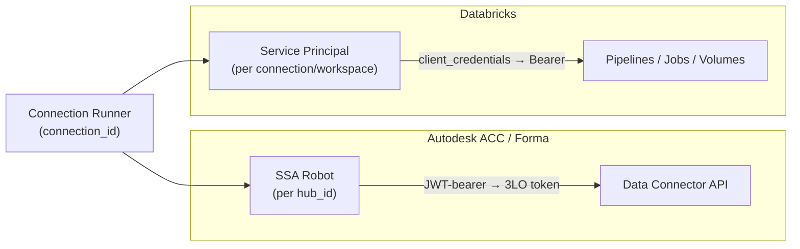
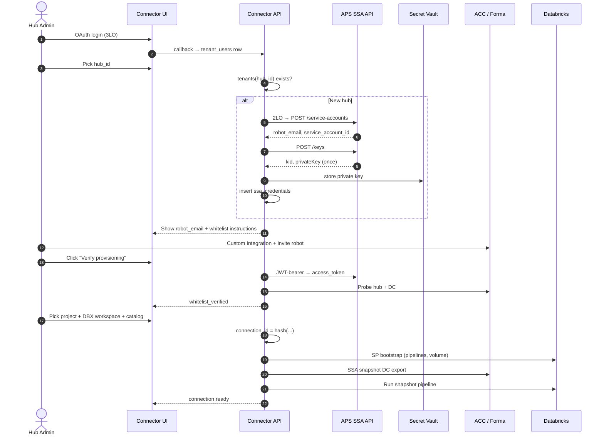
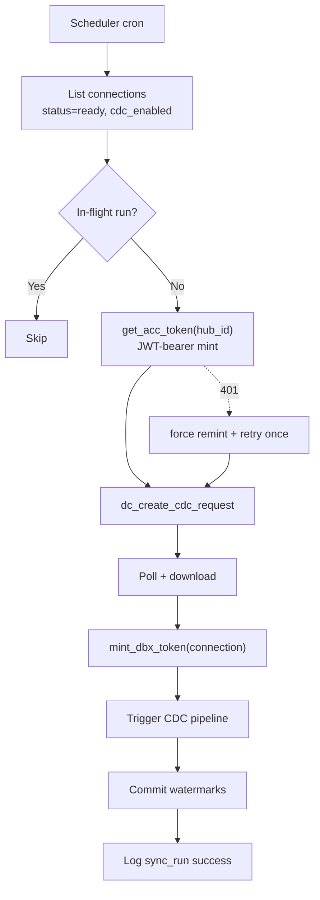
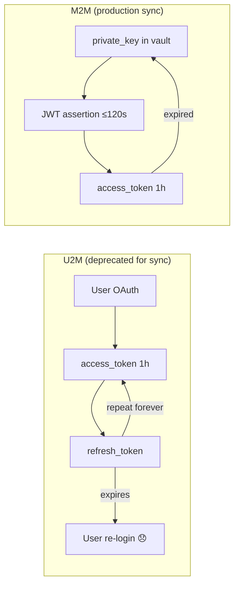
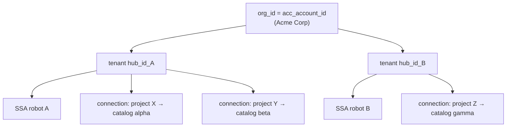
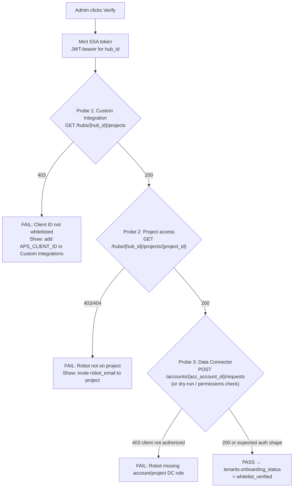
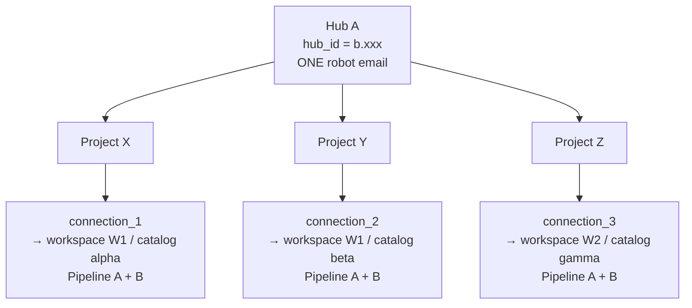
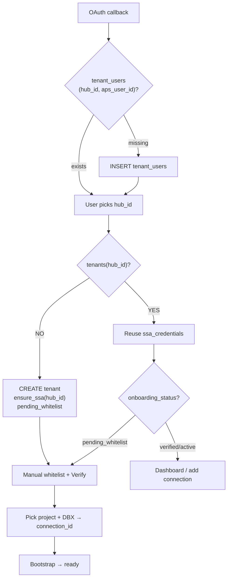
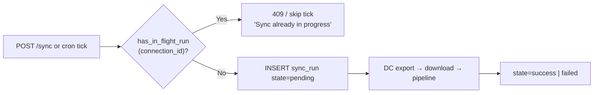
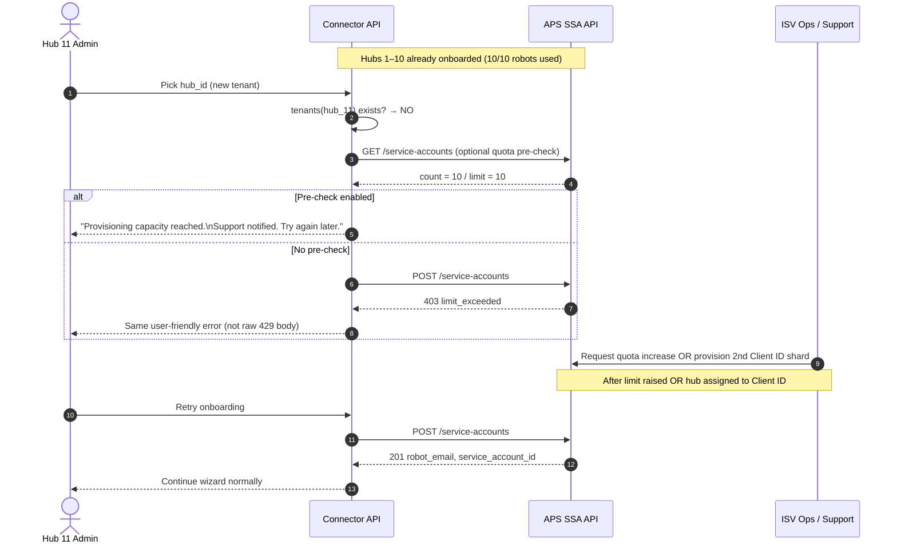

# M2M / SSA Implementation — Production Workflow

**Status:** Architecture & implementation specification  
**Scope:** Pure server-side M2M workflow for `acc-connector/`  
**Supersedes:** Current `m2m_service.py`, `m2m_routes.py`, `m2m_repository.py`, and all `m2m_*` tables  
**Builds on:** [M2M & Multi-Tenant Identity Requirements](#foundation-multi-tenant-identity) (hub-scoped tenant model)  
**Companion docs (future):** `UI.md`, `DATABASE.md`, `SECURITY.md`

---

## Table of contents

1. [Why we are doing this](#1-why-we-are-doing-this)
2. [Foundation: multi-tenant identity](#2-foundation-multi-tenant-identity)
3. [What changes from the current POC](#3-what-changes-from-the-current-poc)
4. [Dual M2M auth model](#4-dual-m2m-auth-model)
5. [Implementation layout](#5-implementation-layout)
6. [Phase A — Vendor APS app setup](#6-phase-a--vendor-aps-app-setup)
7. [Phase B — SSA provisioning (automated, hub-scoped)](#7-phase-b--ssa-provisioning-automated-hub-scoped)
8. [Phase C — Hub provisioning (customer admin, manual)](#8-phase-c--hub-provisioning-customer-admin-manual)
9. [Phase D — SSA token minting (runtime)](#9-phase-d--ssa-token-minting-runtime)
10. [Phase E — Databricks M2M token minting](#10-phase-e--databricks-m2m-token-minting)
11. [Phase F — Connection-scoped sync operations](#11-phase-f--connection-scoped-sync-operations)
12. [Idempotency, concurrency, and limits](#12-idempotency-concurrency-and-limits)
13. [Backend API surface](#13-backend-api-surface)
14. [Connector actions powered by M2M](#14-connector-actions-powered-by-m2m)
15. [Workflow diagrams](#15-workflow-diagrams)
16. [Risk & trade-off analysis](#16-risk--trade-off-analysis)
17. [References](#17-references)
18. [Extended Q&A](#18-extended-q--a)

---

## 1. Why we are doing this

### 1.1 Problem with the current U2M (user OAuth) path

Today the connector stores **per-user** ACC and Databricks OAuth tokens:

| Concern | U2M behavior today | Operational pain |
|---------|-------------------|------------------|
| ACC access token | ~1 hour TTL | Must refresh before every long sync |
| ACC refresh token | Long-lived but revocable | Expires silently; user must re-login |
| Re-auth triggers | OTP, ReCaptcha, session expiry | Breaks unattended scheduled sync |
| Token storage | `acc_tokens(user_id)`, `dbx_tokens(user_id)` | N admins × N token rows; no shared automation identity |
| Scheduled CDC | Uses whichever admin enabled it | Fails when that admin's refresh token dies |

The refresh-token model is workable for **interactive onboarding** but is a poor fit for **headless, scheduled, multi-admin production** workloads.

### 1.2 What M2M / SSA solves

| Capability | Mechanism |
|------------|-----------|
| No login box for automation | SSA JWT-bearer → 3LO-equivalent access token |
| No ACC refresh token to maintain | Mint new access token from private key on demand (~1h TTL) |
| Shared hub identity | One robot per `hub_id`; all admins reuse it |
| Audit trail | Robot appears as a user in Forma activity logs |
| Scheduled sync reliability | Cron/scheduler uses hub SSA + connection pipelines — not a human's refresh token |

**U2M remains** for the interactive wizard (OAuth login, hub picker, first-time setup). **M2M (SSA) takes over** for all unattended ACC API calls after onboarding.

---

## 2. Foundation: multi-tenant identity

This document inherits the finalized identity model. Do not re-derive it.

### 2.1 Identifier cheat sheet

| Identifier | Value | Use in M2M implementation |
|------------|-------|---------------------------|
| `tenant_id` | `hub_id` (`b.{uuid}`) | SSA scope, vault key, onboarding idempotency |
| `org_id` | `acc_account_id` (optional) | Dashboard grouping only — **not** SSA PK |
| `connection_id` | `hash(hub_id, project_id, dbx_workspace_url, catalog)` | Bootstrap + sync state boundary |
| `aps_user_id` | Human OAuth subject | Session/login only — **not** sync auth |
| `acc_account_id` | Hub ID without `b.` prefix | Data Connector URL paths only |

### 2.2 One robot per hub

```
ensure_ssa(hub_id):
  if ssa_credentials exists for hub_id → return existing
  else → POST /service-accounts + POST /keys → store in vault
```

**Never** key SSA provisioning on `aps_user_id` or `acc_account_id`.

### 2.3 Session model (production)

```
session.user_id       → aps_user_id   (who clicked)
session.tenant_id     → hub_id        (which hub they act on)
session.connection_id → optional until project + Databricks picked
```

Scheduled jobs **ignore session**; they load `(tenant_id=hub_id, connection_id)` from DB.

---

## 3. What changes from the current POC

### 3.1 Remove entirely

| Current artifact | Reason |
|-----------------|--------|
| `backend/services/m2m_service.py` | Global `.env` SSA; single `m2m_config` row; duplicates orchestration |
| `backend/routes/m2m_routes.py` | `/m2m/*` isolated from tenant model |
| `backend/repositories/state/m2m_repository.py` | `m2m_*` tables don't align with `tenants` / `connections` |
| DB tables: `m2m_config`, `m2m_bootstrap_state`, `m2m_sync_runs`, `m2m_watermarks` | Replaced by production schema (see future `DATABASE.md`) |
| Env vars: `ACC_SSA_*`, `ACC_M2M_*`, `DATABRICKS_M2M_*` as global defaults | Per-hub / per-connection vault refs instead |

### 3.2 Keep and refactor (shared orchestration)

These modules contain **business logic**, not auth identity. M2M path calls them with injected token getters:

| Module | Reuse |
|--------|-------|
| `backend/clients/acc/data_connector_client.py` | DC export create/poll/download |
| `backend/services/sync/pipeline_config.py` | Snapshot + CDC pipeline conf |
| `backend/services/sync/watermark_service.py` | Incremental windows |
| `backend/clients/databricks_client.py` | Pipelines, volumes, jobs |
| `backend/services/bootstrap_service.py` | Bootstrap steps (extract shared runner) |

### 3.3 New implementation (this document)

Pure M2M workflow modules under `backend/services/m2m/` (names illustrative):

```
backend/
  clients/
    acc/
      ssa_client.py          # SSA management + JWT-bearer token exchange
    dbx/
      m2m_auth_client.py     # Databricks client_credentials
  services/
    m2m/
      ssa_provisioner.py     # ensure_ssa(hub_id) — idempotent API calls
      ssa_token_service.py   # mint + cache ACC tokens per hub
      dbx_token_service.py   # mint + cache DBX tokens per connection/workspace
      connection_runner.py   # bootstrap + sync using connection_id
      whitelist_probe.py     # verify Custom Integration + robot project access
  routes/
    onboarding_routes.py     # SSA steps integrated into wizard (not /m2m sidebar)
```

---

## 4. Dual M2M auth model

Production uses **two independent M2M flows**:



| Side | Grant | Identity | Stored as | Refresh? |
|------|-------|----------|-----------|----------|
| ACC | `urn:ietf:params:oauth:grant-type:jwt-bearer` | SSA robot (`service_account_id`) | `ssa_credentials` per `hub_id` | **No** — re-mint from private key |
| Databricks | `client_credentials` | Service Principal | `connections.dbx_sp_ref` (vault) | **No** — re-mint from OAuth secret |

---

## 5. Implementation layout

### 5.1 Configuration tiers

| Tier | Owner | Contents | Storage |
|------|-------|----------|---------|
| Vendor app | ISV (us) | `APS_CLIENT_ID`, `APS_CLIENT_SECRET` (Server-to-Server app) | Platform secret store / env |
| Hub SSA | Per tenant (`hub_id`) | `service_account_id`, `robot_email`, `key_id`, `private_key_ref` | Vault; DB holds refs only |
| Connection DBX | Per `connection_id` | `dbx_workspace_url`, `catalog`, SP `client_id` + secret ref | Vault; DB holds refs only |

### 5.2 Token cache (process-local)

Both token services use the same pattern already proven in current `m2m_service.py`:

```python
# Pseudocode — per-hub ACC cache
_acc_cache: dict[str, {"token": str, "expires_at": float}] = {}

def get_acc_token(hub_id: str, *, force: bool = False) -> str:
    entry = _acc_cache.get(hub_id)
    if not force and entry and time.time() < entry["expires_at"] - BUFFER_SEC:
        return entry["token"]
    creds = vault.load_ssa(hub_id)          # private_key, key_id, service_account_id
    token = ssa_client.exchange_jwt(creds)  # see Phase D
    _acc_cache[hub_id] = {"token": token, "expires_at": now + expires_in}
    return token
```

Invalidate cache on: key rotation, SSA disable, hub reset.

---

## 6. Phase A — Vendor APS app setup

**One-time ISV setup** (not per customer).

### 6.1 Create Server-to-Server application

1. [APS My Apps](https://aps.autodesk.com/myapps) → Create app → type **Server-to-Server**.
2. Record `APS_CLIENT_ID` and `APS_CLIENT_SECRET`.
3. Enable SSA management scopes on the app (required for robot API automation):
   - `application:service_account:read`
   - `application:service_account:write`
   - `application:service_account_key:read`
   - `application:service_account_key:write`

### 6.2 Limits (plan capacity)

| Limit | Default | Mitigation |
|-------|---------|------------|
| Service accounts per Client ID | 10 | One per hub; request increase via `ssa-requests@autodesk.com` |
| Keys per service account | 3 | Rotation: create new key → deploy → delete old |
| SSA assertion `exp` | Max 300s from `iat` | Keep assertion TTL ≤ 120s; backdate `iat` for clock skew |

References: [SSA GA announcement](https://aps.autodesk.com/blog/update-secure-service-accounts-ssa-goes-ga), [SSA API overview](https://aps.autodesk.com/en/docs/ssa/v1/developers_guide/overview/).

---

## 7. Phase B — SSA provisioning (automated, hub-scoped)

Triggered when `tenants(hub_id)` is created and `ssa_credentials` is missing.

### 7.1 Step B1 — Obtain 2LO admin token

```http
POST https://developer.api.autodesk.com/authentication/v2/token
Content-Type: application/x-www-form-urlencoded

grant_type=client_credentials
&client_id={APS_CLIENT_ID}
&client_secret={APS_CLIENT_SECRET}
&scope=application:service_account:read application:service_account:write application:service_account_key:write
```

Use HTTP Basic auth **or** body params (not both). Cache ~1 hour.

### 7.2 Step B2 — Create service account (robot)

```http
POST https://developer.api.autodesk.com/authentication/v2/service-accounts
Authorization: Bearer {admin_2lo_token}
Content-Type: application/json

{
  "name": "forma-dbx-{hub_id_suffix}",
  "firstName": "Forma",
  "lastName": "Databricks Sync"
}
```

**Response fields to persist:**

| Field | Maps to |
|-------|---------|
| `serviceAccountId` | `ssa_credentials.service_account_id` (JWT `sub`) |
| `email` | `ssa_credentials.robot_email` — show to hub admin for project invite |

Email format: `{name}@{clientId}.adskserviceaccount.autodesk.com`

API: [Create Service Account](https://aps.autodesk.com/en/docs/ssa/v1/reference/http/create-service-account/)

### 7.3 Step B3 — Create RSA key pair

```http
POST https://developer.api.autodesk.com/authentication/v2/service-accounts/{serviceAccountId}/keys
Authorization: Bearer {admin_2lo_token}
```

**Response (store immediately — private key shown once):**

| Field | Storage |
|-------|---------|
| `kid` | `ssa_credentials.key_id` |
| `privateKey` (PEM) | Vault at `private_key_ref` — **never** in DB plaintext |

API: [Create Keys](https://aps.autodesk.com/en/docs/ssa/v1/reference/http/create-service-account-key/)

### 7.4 Step B4 — Persist with idempotency

```python
def ensure_ssa(hub_id: str) -> SsaCredentials:
    with db.transaction():
        existing = db.get_ssa_credentials(tenant_id=hub_id)
        if existing:
            return existing

        # UNIQUE(hub_id) on ssa_credentials prevents double-create under concurrency
        admin_token = ssa_client.get_admin_token()
        sa = ssa_client.create_service_account(admin_token, hub_id=hub_id)
        key = ssa_client.create_key(admin_token, sa.service_account_id)
        key_ref = vault.write_ssa_private_key(hub_id, key.private_key)

        return db.insert_ssa_credentials(
            tenant_id=hub_id,
            hub_id=hub_id,
            service_account_id=sa.service_account_id,
            robot_email=sa.email,
            key_id=key.kid,
            private_key_ref=key_ref,
        )
```

Set `tenants.onboarding_status = pending_whitelist` until Phase C passes.

---

## 8. Phase C — Hub provisioning (customer admin, manual)

**Cannot be automated** — no public API for Custom Integrations whitelist.

### 8.1 Customer steps (guide in UI — future `UI.md`)

Per [Task 2: Provision SSA to hub](https://aps.autodesk.com/en/docs/ssa/v1/tutorials/getting-started-with-ssa/task2-provision-the-ssa-to-a-hub/):

| Step | Actor | Action |
|------|-------|--------|
| C1 | Hub admin | Forma → Account Admin → **Custom Integrations** → Add vendor `APS_CLIENT_ID` |
| C2 | Hub admin | Invite **robot email** to target project(s) |
| C3 | Hub admin | Grant folder permissions (view+download for model folders) |
| C4 | Hub admin | Subscribe robot to Build modules (RFIs, Forms, etc.) if needed |
| C5 | Project admin | Issues permission settings for robot (if using Issues API) |

### 8.2 Connector verification probe

After C1–C2, connector runs automated checks using a freshly minted SSA token:

```python
def verify_hub_provisioned(hub_id: str, project_id: str) -> ProvisionStatus:
    token = get_acc_token(hub_id)
    checks = {
        "custom_integration": probe_hub_access(token, hub_id),       # GET /hubs/{hub_id}/projects
        "project_membership": probe_project_access(token, project_id),
        "data_connector": probe_dc_authorization(token, acc_account_id, project_id),
    }
    return ProvisionStatus(checks)
```

| Probe | Pass condition | Typical failure |
|-------|---------------|-----------------|
| Hub projects list | 200 on `GET /project/v1/hubs/{hub_id}/projects` | 403 — Client ID not whitelisted |
| DC create (dry) | 403 with known body vs 401 | Robot not account member / wrong role |
| Admin API (optional) | Add robot to project if missing | Robot not invited |

On full pass: `tenants.onboarding_status = whitelist_verified` → `ssa_active`.

### 8.3 Optional: automate project membership via Admin API

If hub admin granted SSA sufficient Admin API rights, connector **may** add robot to project programmatically — but **do not** create a second robot if one already exists for the hub.

---

## 9. Phase D — SSA token minting (runtime)

All unattended ACC calls use this path. Replaces `acc_client.get_valid_token(user_id)`.

### 9.1 Build JWT assertion

Per [Task 3: Generate 3-legged token](https://aps.autodesk.com/en/docs/ssa/v1/tutorials/getting-started-with-ssa/task3-generate-3-legged-access-token/) and [JWT exchange spec](https://aps.autodesk.com/en/docs/ssa/v1/reference/http/exchange-jwt-assertion/):

```python
SSA_GRANT_TYPE = "urn:ietf:params:oauth:grant-type:jwt-bearer"
APS_TOKEN_URL  = "https://developer.api.autodesk.com/authentication/v2/token"
ACC_SCOPES     = "data:read data:write data:create data:search account:read"

def build_assertion(creds: SsaCredentials) -> str:
    now = int(time.time())
    iat = now - 30   # clock skew buffer
    return jwt.encode(
        {
            "iss": creds.client_id,           # APS app Client ID
            "sub": creds.service_account_id,    # robot Oxygen ID
            "aud": APS_TOKEN_URL,
            "iat": iat,
            "exp": iat + 120,                   # max 300s; keep ≤ 120
            "scope": ACC_SCOPES.split(),
        },
        creds.private_key_pem,
        algorithm="RS256",
        headers={"kid": creds.key_id, "alg": "RS256"},
    )
```

Reference implementation: [ssa-manager-sample/server.js](https://github.com/autodesk-platform-services/ssa-manager-sample/blob/main/server.js).

### 9.2 Exchange for access token

```http
POST https://developer.api.autodesk.com/authentication/v2/token
Authorization: Basic base64({client_id}:{client_secret})
Content-Type: application/x-www-form-urlencoded

grant_type=urn:ietf:params:oauth:grant-type:jwt-bearer
&assertion={signed_jwt}
&scope=data:read data:write data:create data:search account:read
```

**Response:** `access_token`, `expires_in` (~3600). No `refresh_token`.

### 9.3 Inject into ACC clients

```python
# Connection-scoped sync
def run_sync(connection_id: str, mode: str = "snapshot"):
    conn = db.get_connection(connection_id)
    get_token = lambda **kw: get_acc_token(conn.hub_id, force=kw.get("refresh", False))
    return sync_orchestrator.run(get_token, conn, mode=mode)
```

Same `TokenGetter` pattern as `data_connector_client._dc_get` 401 retry.

---

## 10. Phase E — Databricks M2M token minting

Per [Databricks OAuth M2M](https://docs.databricks.com/aws/en/dev-tools/auth/oauth-m2m):

### 10.1 Prerequisites (customer / connection setup)

1. Create Databricks Service Principal in target workspace.
2. Generate OAuth secret (client ID + secret); store in vault keyed by `connection_id`.
3. Grant SP: catalog USE, volume CREATE, pipeline CAN MANAGE, SQL warehouse CAN USE.

### 10.2 Mint workspace token

```http
POST https://{workspace_url}/oidc/v1/token
Authorization: Basic base64({sp_client_id}:{sp_secret})
Content-Type: application/x-www-form-urlencoded

grant_type=client_credentials
&scope=all-apis
```

Token TTL ~3600s. Re-mint on expiry or 401 — **no refresh_token grant**.

### 10.3 SDK integration (recommended)

```python
from databricks.sdk import WorkspaceClient

w = WorkspaceClient(
    host=connection.dbx_workspace_url,
    client_id=vault.get_dbx_client_id(connection_id),
    client_secret=vault.get_dbx_secret(connection_id),
)
# SDK handles token refresh internally via client_credentials
```

---

## 11. Phase F — Connection-scoped sync operations

All headless work is keyed by `connection_id`, not `user_id`.

### 11.1 Connection identity

```python
connection_id = sha256(f"{hub_id}|{project_id}|{dbx_workspace_url}|{catalog}")[:32]
```

### 11.2 Bootstrap (once per connection)

| Step | ACC auth | DBX auth |
|------|----------|----------|
| Create UC catalog / volume | — | SP token |
| Upload notebooks | — | SP token |
| Create snapshot pipeline (Pipeline A) | — | SP token |
| Create CDC pipeline (Pipeline B) | — | SP token |
| Seed registry from schema zip | — | SP token |
| Verify DC access | SSA token | — |

Store `snapshot_pipeline_id`, `cdc_pipeline_id`, `volume_path` on `connections` row.

Onboarding status progression: `pending_bootstrap` → `ready`.

### 11.3 Snapshot sync (manual or scheduled)

```
1. get_acc_token(hub_id)
2. dc_create_request(token, acc_account_id, project_id, service_groups=...)
3. poll until COMPLETE
4. download extract to volume (SSA token for ACC download URLs)
5. mint_dbx_token(connection)
6. trigger snapshot pipeline update + wait
7. commit watermarks on connections
```

### 11.4 CDC sync (auto-trigger)

```
1. resolve_m2m_incremental_window(connection_id)
2. dc_create_cdc_request(token, ..., start_date, end_date, cdc_service_groups)
3. poll + download
4. trigger CDC pipeline
5. commit CDC watermarks
```

**Scheduler entry point:**

```python
def scheduled_cdc_tick():
    for conn in db.list_connections(status="ready", cdc_enabled=True):
        if conn.has_in_flight_run():
            continue
        connection_runner.run_cdc_sync(conn.connection_id, trigger="scheduled")
```

Uses **hub SSA** — never reads `acc_tokens` or refresh tokens.

### 11.5 What stays U2M-only (for now)

| Action | Auth | Notes |
|--------|------|-------|
| Initial OAuth login | 3LO user | Establishes `tenant_users` mapping |
| Hub picker (first time) | 3LO user | Discovers hubs user can admin |
| Databricks U2M OAuth (wizard) | User | Optional if customer prefers PAT/SP manual setup |
| Reviews module (if API requires user context) | 3LO user | Evaluate per API; SSA GA covers most Build modules |

---

## 12. Idempotency, concurrency, and limits

### 12.1 Decision tree (runtime)

```
User completes OAuth
  → tenant_users(hub_id, aps_user_id) missing? ADD row

User picks hub
  → tenants(hub_id) missing? CREATE tenant + ensure_ssa(hub_id)
  → else REUSE ssa_credentials

Custom Integration verified?
  → NO: guide admin (Phase C)
  → YES: continue

User picks project + Databricks
  → connections(connection_id) missing? NEW bootstrap
  → else RESUME from connection.onboarding_status
```

### 12.2 Concurrency guards

| Resource | Guard |
|----------|-------|
| SSA create | `UNIQUE(tenant_id)` on `ssa_credentials` + transaction |
| Bootstrap | `connections.onboarding_status` state machine |
| Sync | `has_in_flight_run(connection_id)` — reject duplicate POST |

### 12.3 Key rotation (no downtime)

```
1. POST .../keys → new kid + privateKey
2. vault.write(new key); update ssa_credentials.key_id
3. invalidate_acc_cache(hub_id)
4. verify token mint
5. DELETE old key via API
```

---

## 13. Backend API surface

Integrated into onboarding — **not** a separate `/m2m/*` sidebar.

| Method | Route | Purpose |
|--------|-------|---------|
| `POST` | `/api/tenants/{hub_id}/ssa/provision` | `ensure_ssa(hub_id)` — idempotent |
| `GET` | `/api/tenants/{hub_id}/ssa/status` | Robot email, provision state, key metadata |
| `POST` | `/api/tenants/{hub_id}/ssa/verify` | Run whitelist + DC probes |
| `POST` | `/api/connections/{connection_id}/bootstrap` | Start bootstrap job |
| `GET` | `/api/connections/{connection_id}/bootstrap/status` | Progress |
| `POST` | `/api/connections/{connection_id}/sync` | Snapshot sync |
| `POST` | `/api/connections/{connection_id}/sync/cdc` | CDC sync |
| `POST` | `/internal/scheduler/cdc` | Cron hook — all ready connections |

Auth on routes: session `tenant_id` must match `hub_id` on resource (future `SECURITY.md`).

---

## 14. Connector actions powered by M2M

### 14.1 Primary replacements for refresh-token flow

| Connector action | Before (U2M) | After (M2M) | User impact |
|------------------|--------------|-------------|-------------|
| Scheduled CDC export | Admin's refresh token | Hub SSA JWT-bearer | No re-login when admin leaves |
| Scheduled snapshot | Same | Hub SSA | Reliable nightly baseline |
| DC bulk export create/poll | `get_valid_token(user_id)` | `get_acc_token(hub_id)` | Decoupled from human session |
| ACC file/download URLs | User token | SSA token | Headless download in Flask/notebook |
| Long pipeline waits (>1h) | Token refresh mid-flight | Re-mint SSA/SP token | No "session expired" abort |
| Multi-admin hub | Each admin's tokens diverge | Single robot identity | Consistent permissions / audit |
| Bootstrap + pipeline deploy | User DBX OAuth/PAT | SP client_credentials | Unattended reinstall |

### 14.2 Secondary benefits

| Benefit | Detail |
|---------|--------|
| Auditability | Robot name in Forma activity log |
| Least privilege | Robot invited only to needed projects/folders |
| Zero-trust alignment | Private key in vault; short-lived access tokens |
| CI/CD friendly | No browser OAuth in deployment pipelines |
| Multi-hub ISV | 10 robots default = 10 hubs per Client ID (request increase) |

### 14.3 What M2M does **not** replace

- Human login for **first-time** hub authorization UX
- Hub admin **Custom Integration** click-through (no API)
- Customer choice of Databricks auth during wizard (may still offer U2M PAT path for lab)

---

## 15. Workflow diagrams

### 15.1 End-to-end onboarding + first sync



### 15.2 Scheduled CDC (headless)



### 15.3 Token lifecycle comparison



### 15.4 Multi-hub tenant isolation



---

## 16. Risk & trade-off analysis

### 16.1 Advantages

| # | Advantage | Severity |
|---|-----------|----------|
| A1 | Eliminates refresh-token expiry as #1 production outage | **Critical** |
| A2 | Hub-scoped robot matches Forma Custom Integration boundary | **Critical** |
| A3 | Idempotent `ensure_ssa(hub_id)` safe for multi-admin onboarding | **High** |
| A4 | Short-lived tokens + vault-stored keys = modern security posture | **High** |
| A5 | Same orchestration code with injected `TokenGetter` — minimal duplication | **Medium** |
| A6 | SSA GA with broad 3LO API coverage (DC, Build, Issues, Forms) | **High** |

### 16.2 Disadvantages / costs

| # | Disadvantage | Mitigation |
|---|--------------|------------|
| D1 | Custom Integration still manual per hub | Clear UI checklist + verify probe |
| D2 | 10 SSA limit per Client ID | Monitor count; email `ssa-requests@autodesk.com` |
| D3 | Private key loss = must create new key | Backup in vault; rotation runbook |
| D4 | Two credential systems (SSA + DBX SP) | Document per-connection setup in wizard |
| D5 | Robot needs correct folder/module permissions | Verification probes + actionable error messages |
| D6 | Implementation migration from `m2m_*` tables | One-time migration script in `DATABASE.md` |

### 16.3 Scenario matrix

| Scenario | Outcome | Grade |
|----------|---------|-------|
| **Best:** Hub admin completes whitelist; robot on project; SP entitled | Unattended CDC for years; zero user re-auth | ✅ Production ideal |
| **Good:** Second admin joins existing hub | `tenant_users` row only; SSA reused | ✅ By design |
| **OK:** SSA token expires mid-sync | Transparent re-mint from private key | ✅ Handled |
| **Bad:** Admin skips Custom Integration | Probe fails with guided fix | ⚠️ UX challenge, not arch flaw |
| **Bad:** Private key leaked | Rotate key; audit Forma logs | ⚠️ Standard key-mgmt incident |
| **Worst:** Hit 10-robot limit mid-onboarding | New hub blocked until limit raised | ❌ Capacity planning required |
| **Worst:** Shared robot across hubs (anti-pattern) | Hub B admin can't whitelist independently | ❌ Violates hub_id tenant model — **do not do** |

### 16.4 Risk register

| Risk | Likelihood | Impact | Control |
|------|------------|--------|---------|
| Refresh token outage (U2M) | High (if kept) | Sync stops | **Migrate sync to SSA** |
| SSA limit exceeded | Medium | New hub blocked | Monitor + APS limit increase |
| Clock skew JWT rejection | Low | Token mint fail | `iat` backdate 30s; NTP on servers |
| Vault unavailable | Low | All M2M stops | HA vault; cached tokens ≤1h buffer |
| DC 403 despite valid token | Medium | Export fails | Document account-admin + CI steps (see current `DC_ACCOUNT_AUTH_HELP`) |
| DBX SP secret expiry | Medium | Pipeline trigger fails | Alert 30d before secret TTL (730d max) |

### 16.5 When this design is **not** useful

- Single-user lab POC with no scheduled sync → U2M alone is simpler
- Customer refuses Custom Integration / robot invite → M2M cannot work for 3LO APIs
- Need user-impersonation audit ("who clicked sync") for **scheduled** runs → use `sync_runs.triggered_by` metadata, not user token

---

## 17. References

### Autodesk SSA

| Resource | URL |
|----------|-----|
| SSA Developer Guide | https://aps.autodesk.com/en/docs/ssa/v1/developers_guide/overview/ |
| SSA HTTP API Reference | https://aps.autodesk.com/en/docs/ssa/v1/reference/http/ |
| Task 1 — Create SSA | https://aps.autodesk.com/en/docs/ssa/v1/tutorials/getting-started-with-ssa/task1-create-an-ssa/ |
| Task 2 — Provision to hub | https://aps.autodesk.com/en/docs/ssa/v1/tutorials/getting-started-with-ssa/task2-provision-the-ssa-to-a-hub/ |
| Task 3 — Generate 3LO token | https://aps.autodesk.com/en/docs/ssa/v1/tutorials/getting-started-with-ssa/task3-generate-3-legged-access-token/ |
| SSA Public Beta blog | https://aps.autodesk.com/blog/introducing-secure-service-accounts-ssa-now-public-beta |
| SSA GA blog | https://aps.autodesk.com/blog/update-secure-service-accounts-ssa-goes-ga |
| SSA Manager sample | https://github.com/autodesk-platform-services/ssa-manager-sample |
| SSA Manager UI | https://ssa-manager.autodesk.io/ |

### Databricks M2M

| Resource | URL |
|----------|-----|
| OAuth M2M (Service Principal) | https://docs.databricks.com/aws/en/dev-tools/auth/oauth-m2m |

### Internal (to be created)

| Doc | Purpose |
|-----|---------|
| `DATABASE.md` | `tenants`, `ssa_credentials`, `connections` DDL + migrations from `m2m_*` |
| `UI.md` | Wizard steps, robot email display, whitelist checklist |
| `SECURITY.md` | Vault layout, key rotation, RBAC on routes |
| `PLATFORM.md` | Full platform architecture |

---

## Appendix A — ACC scopes for connector

```
data:read data:write data:create data:search account:read
```

Adjust if Admin API project-member automation is added (`account:write`).

## Appendix B — Pseudocode: `ssa_client.py` public interface

```python
class SsaClient:
    def get_admin_token(self) -> str: ...
    def create_service_account(self, admin_token: str, *, hub_id: str) -> ServiceAccount: ...
    def create_key(self, admin_token: str, service_account_id: str) -> PrivateKey: ...
    def exchange_jwt(self, creds: SsaCredentials, scopes: str) -> TokenResponse: ...
    def list_keys(self, admin_token: str, service_account_id: str) -> list[KeyMeta]: ...
    def delete_key(self, admin_token: str, service_account_id: str, key_id: str) -> None: ...
```

## Appendix C — Migration checklist from current POC

- [ ] Delete `m2m_service.py`, `m2m_routes.py`, `m2m_repository.py`
- [ ] Remove `ENABLE_M2M` flag and `/m2m/*` UI panel
- [ ] Migrate any pilot data from `m2m_config` → `connections`
- [ ] Implement `backend/services/m2m/*` per this spec
- [ ] Wire scheduler to `connection_runner` (not `user_id`)
- [ ] Remove global `ACC_SSA_*` env vars from `.env.example`
- [ ] Add integration test: `ensure_ssa` idempotency + JWT mint + hub probe

---

## 18. Extended Q&A

This section answers common design questions. Every answer is aligned with the **basic plan** (hub_id tenant boundary, one robot per hub, connection_id for sync state) and with §2–§12 of this document.

**Alignment summary**

| Basic plan rule | Where answered |
|-----------------|----------------|
| `tenant_id = hub_id` for SSA | Q4, Q5, Q6 |
| One robot per hub; never per user | Q3, Q4, Q5 |
| `connection_id = hash(hub, project, workspace, catalog)` | Q4, Q7 |
| Custom Integration manual; verify via API probes | Q1, Q2 |
| Second admin → `tenant_users` only; reuse SSA | Q3, Q5 |
| `has_in_flight_run` concurrency guard | Q7 |
| Databricks SP per connection | Q4, Q8 |
| 10 robots per Client ID limit | Q9 |

---

### Q1. How do we verify the admin manually added the robot email?

**We cannot read ACC's invite UI.** Autodesk provides no API to ask *"was this email invited?"* directly. Verification is **indirect**: mint an SSA token for the hub's robot, then call ACC APIs and infer success from HTTP responses.

**Implementation:** `whitelist_probe.verify_hub_provisioned(hub_id, project_id)` (§8.2, module `whitelist_probe.py`).



| Step | API call | Pass | Fail means |
|------|----------|------|------------|
| 1 | `GET /project/v1/hubs/{hub_id}/projects` with SSA token | HTTP 200 + project list | **403** → vendor Client ID not in hub Custom Integrations (C1 not done) |
| 2 | `GET /project/v1/hubs/{hub_id}/projects/{project_id}` | HTTP 200 + project payload | **403/404** → robot not invited to that project (C2 not done) |
| 3 | Data Connector authorization probe on `acc_account_id` + `project_id` | Not the generic "client id has no authorization" 403 | Robot or app not provisioned for account-level DC (C2–C3 incomplete) |

**Optional probe 4 (Admin API):** list project members and confirm `robot_email` appears — stronger proof of C2, if Admin API scope is available.

**Important:** Token mint succeeding only proves the robot **exists in APS** (Phase B). Probes 1–3 prove the **customer completed Phase C** in ACC. There is no trust-the-user checkbox without these API checks.

---

### Q2. What does `whitelist_verified` mean?

**Plain language:** The hub admin has completed the manual ACC steps so our vendor app and hub robot are allowed to call Forma/ACC APIs for that hub.

**Not** a separate Autodesk status flag — it is **our** `tenants.onboarding_status` enum value (basic plan: `pending_whitelist` → `whitelist_verified` → `ssa_active`).

| Status | Meaning |
|--------|---------|
| `pending_whitelist` | Robot created via API (`ensure_ssa` done); customer has **not** passed Verify |
| `whitelist_verified` | All §8.2 probes passed for at least one target project |
| `ssa_active` | Whitelist verified **and** at least one connection reached `ready` (bootstrap done) |

**"Whitelist"** specifically refers to **Custom Integration** (C1): the hub admin added our `APS_CLIENT_ID` under Account Admin → Custom Integrations. Without that, Probe 1 returns 403 even though the robot email exists in APS.

After `whitelist_verified`, the wizard may continue to project + Databricks selection. Scheduled sync must **not** start until a connection is `ready`.

---

### Q3. What does the second admin do? Can we skip onboarding for them?

**By design (basic plan scenario 3):** Bob logs in after Alice already provisioned Hub A:

```
→ Add tenant_users(Bob, hub_id)
→ ssa_credentials exists → SKIP ensure_ssa
→ Show existing connections or continue wizard
```

**Second admin does NOT:**

- Create a new robot (would hit 10-robot limit and break isolation)
- Re-do Custom Integration (already once per hub)
- Re-enter robot email / whitelist checklist **if hub is already `whitelist_verified` or `ssa_active`**

**Second admin MAY:**

- Log in (3LO) — required to establish `tenant_users` and session RBAC
- Pick the same hub — sets `session.tenant_id`
- View dashboard: existing connections, sync history, last run status
- **Add a new connection** — new `(project_id, workspace, catalog)` → new `connection_id`, new bootstrap; **same robot** for ACC, new SP ref for Databricks if workspace differs

**UI behavior (recommended — aligns with basic plan):**

```
┌────────────────────────────────────────────────────────────┐
│  Welcome back — Acme Corp (Hub A) is already connected.     │
│  Robot provisioned by another admin on [date].              │
│  Connections:                                               │
│   • Project X → catalog alpha    [Ready]   Last sync: 2h    │
│   • Project Y → catalog beta     [Ready]   Last sync: 5m    │
│  [+ Add another project/connection]                         │
└────────────────────────────────────────────────────────────┘
```

**Yes — skip SSA/whitelist steps** when `tenants.onboarding_status IN ('whitelist_verified', 'ssa_active')`. Only show robot email + Verify again if status is still `pending_whitelist` (e.g. first admin abandoned wizard mid-flow).

Role on `tenant_users`: `hub_admin | project_admin | viewer` — second admin's permissions come from ACC/Fomra roles, not from getting a new robot.

---

### Q4. One robot per hub — can it handle many projects, catalogs, and pipelines in parallel?

**Yes, with the right split of responsibilities** (basic plan):

| Layer | Scope | Count |
|-------|-------|-------|
| **SSA robot** | `hub_id` | **1 per hub** — shared ACC identity |
| **Connection** | `(hub_id, project_id, dbx_workspace_url, catalog)` | **Many per hub** |
| **Databricks SP** | Per connection (workspace + catalog target) | **1 per connection** (typical) |
| **Pipelines** | Per connection | `snapshot_pipeline_id`, `cdc_pipeline_id` on each `connections` row |



**How parallel sync works**

- Each **connection** runs its own sync job (`sync_runs` keyed by `connection_id`).
- All jobs on Hub A use the **same** `get_acc_token(hub_id)` — one robot identity, many DC exports for different `project_id`s.
- Each job uses its **own** Databricks SP token for its workspace/catalog.
- **Concurrency guard (Q7):** only one in-flight run **per connection_id** — not one per hub. Hub A can sync Project X and Project Y **in parallel** if two connections are ready and neither has an in-flight run.

**Robot must be invited to every project** you connect. Adding connection for Project Y does not auto-add the robot — admin must invite robot to Project Y in ACC (or Admin API automation if enabled). Verify probe runs per new project before bootstrap.

**Robot is not "one sync at a time globally"** — it is one **identity** per hub; parallel ACC API calls are fine if ACC rate limits allow. Connector policy: parallelize across connections, serialize within one connection.

---

### Q5. Scenarios: one hub multi-user, first-time vs existing, one admin multi-hub

Aligned with basic plan master decision tree and scenarios 1–4.

#### 5.1 One hub, multiple admins

| Actor | First login? | Hub tenant exists? | Actions |
|-------|--------------|-------------------|---------|
| Alice (1st admin) | New user | No | Create `tenants`, `ensure_ssa`, whitelist, connections |
| Bob (2nd admin) | New user | Yes | `tenant_users` row only; reuse SSA + connections |
| Alice again | Existing user | Yes | Resume dashboard / add connection |



#### 5.2 One admin, multiple hubs (same person)

| Resource | Hub A | Hub B |
|----------|-------|-------|
| `tenant_id` | `hub_id_A` | `hub_id_B` |
| SSA robot | Robot A | Robot B (**separate**) |
| Custom Integration | Whitelist on Hub A | Whitelist on Hub B |
| Connections | `(hub_A, project_X, …)` | `(hub_B, project_Y, …)` |

UI: after login, **hub picker** — *"You admin 2 hubs — which one?"* Switching hub → `session.tenant_id` changes → load that hub's SSA + connections.

Same `aps_user_id` under both hubs: fine for optional `org_id` grouping only — **never merge tenants**.

#### 5.3 Lookup cheat sheet (basic plan definitions)

| Term | Lookup | Meaning |
|------|--------|---------|
| New login | `tenant_users(aps_user_id)` first time | May span multiple hubs over time |
| New hub tenant | `tenants(hub_id)` missing | First setup for this hub |
| Existing SSA | `ssa_credentials(hub_id)` | Robot already provisioned |
| New connection | `connections(connection_id)` missing | New project or Databricks target |

---

### Q6. What is the robot capable of? (SSA capabilities)

The robot is a **Secure Service Account** — a real Forma/ACC user identity with 3LO-equivalent API access after JWT-bearer token exchange. Per [SSA GA blog](https://aps.autodesk.com/blog/update-secure-service-accounts-ssa-goes-ga):

| Capability | Supported for connector? | Notes |
|------------|-------------------------|-------|
| Data Connector export (snapshot + CDC) | **Yes** — primary use case | Requires account/project DC authorization |
| Docs / folder download | **Yes** | Robot needs folder view+download (C3) |
| Build modules (RFIs, Forms, Submittals, etc.) | **Yes** | Robot subscribed to modules on project (C4) |
| Issues API | **Yes** | Issues permission settings for robot (C5) |
| Admin API (add member, project admin) | **Optional** | Can automate robot invite if admin grants it |
| Interactive login / OTP / ReCaptcha | **No** — by design | Headless only |
| Cross-hub access with one robot | **No** — anti-pattern | One robot per `hub_id` only |

**Effective permissions = intersection of:**

1. Scopes on JWT (`data:read`, `data:write`, `account:read`, …)
2. Custom Integration whitelist (hub)
3. Project membership + folder/module/Issues settings (ACC admin actions)

The robot cannot exceed what the hub admin granted in ACC — same as a human project member.

**ACC scopes used by connector (Appendix A):**

```
data:read data:write data:create data:search account:read
```

---

### Q7. What is an "in-flight run"?

An **in-flight run** is a sync job for a given `connection_id` that has started but not yet finished (success or failure).

**Purpose (basic plan + §12.2):** prevent duplicate overlapping syncs for the same connection — e.g. cron fires while a manual sync is still polling DC export.

```python
def has_in_flight_run(connection_id: str) -> bool:
    return db.exists_sync_run(
        connection_id=connection_id,
        state_in=("pending", "exporting", "downloading", "pipeline_running"),
    )
```



| Scope | Rule |
|-------|------|
| Per `connection_id` | At most one in-flight run |
| Per `hub_id` | **Multiple** connections may run in parallel (each has own run row) |
| Scheduler | Skips connection if in-flight; tries again next cron tick |

States are illustrative — exact enum in `DATABASE.md`. Watermarks commit only after `state=success` to avoid partial incremental windows.

---

### Q8. What is SP?

**SP = Databricks Service Principal** — a non-human identity in Databricks used for **M2M** access to workspace resources (pipelines, volumes, Unity Catalog, jobs).

| | ACC SSA Robot | Databricks SP |
|--|---------------|---------------|
| **Side** | Autodesk / Forma | Databricks |
| **Scope** | Per `hub_id` | Per `connection_id` (workspace + catalog) |
| **Auth** | JWT-bearer → access token | `client_credentials` → access token |
| **Secret** | RSA private key (vault) | OAuth client secret (vault) |
| **Refresh token** | None | None |
| **Used for** | DC export, ACC downloads | Bootstrap, pipeline trigger, volume write |

Reference: [Databricks OAuth M2M](https://docs.databricks.com/aws/en/dev-tools/auth/oauth-m2m).

**Why two identities?** ACC and Databricks are separate platforms — no federated token exchange. The connector backend holds both credentials and orchestrates: *export from ACC with robot token → load into Databricks with SP token*.

---

### Q9. "Hit robot limit mid-onboarding" — explained (diagram)

**Basic plan + §6.2 + §16.3:** Default **10 SSA service accounts per APS Client ID**. Each new hub calls `ensure_ssa` → `POST /authentication/v2/service-accounts`. Hub #11 fails at Phase B before any robot email is shown.



**Mitigations (aligned with basic plan + review doc §4.1):**

| Action | When |
|--------|------|
| Pre-check SSA count before `ensure_ssa` | Avoid raw API error at customer |
| Alert ISV ops at **80%** (8/10) | Request increase before block |
| Shard hubs across multiple Client IDs | Long-term >10 hubs (`tenants.aps_client_id_ref`) |
| **Never** reuse one robot for two hubs | Worse failure mode than blocked signup |

**Customer impact:** Hub 11 admin cannot complete onboarding until ISV resolves capacity — not a bug in connector logic.

---

*Document version: 1.1 — Aug 2026. §18 added: Extended Q&A aligned with multi-tenant identity basic plan.*
