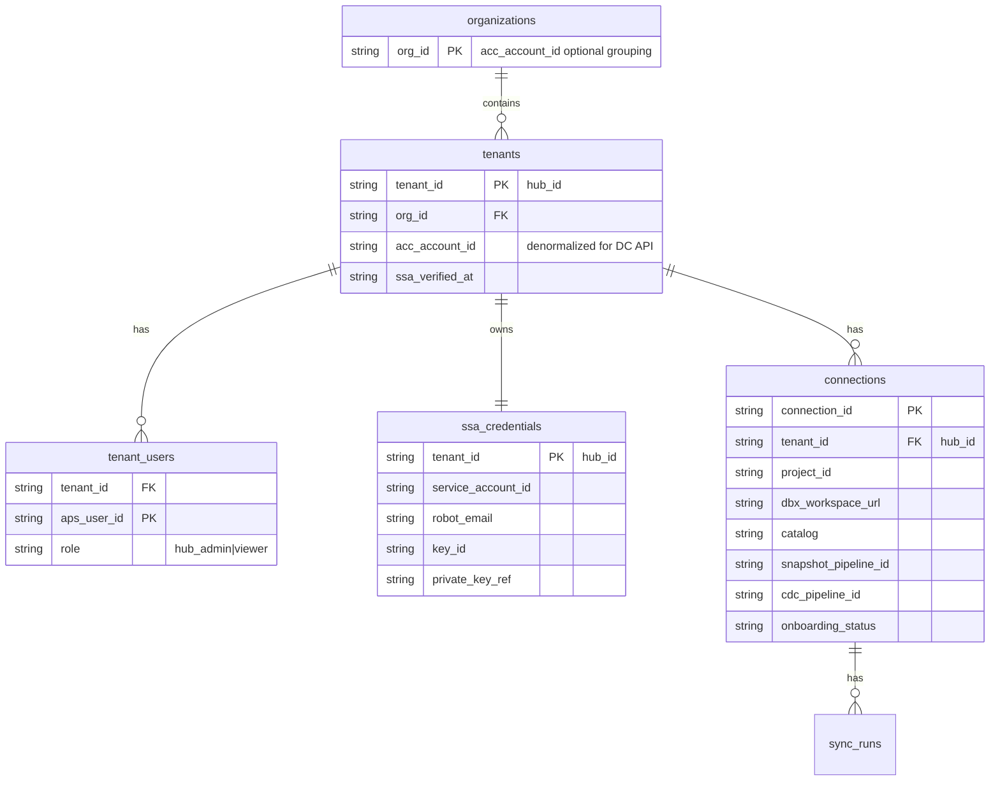
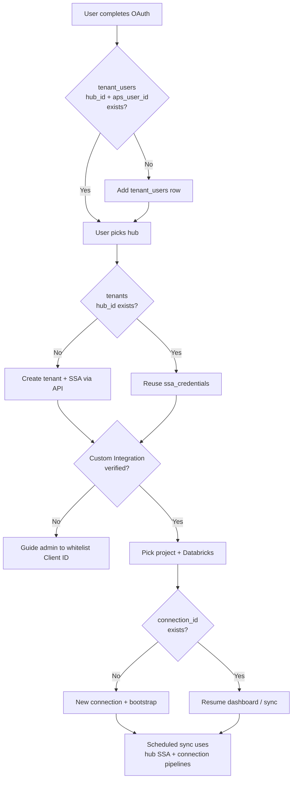

# M2M & Multi-Tenant Identity Requirements

**Status:** Architecture decision record (recovered from design session)  
**Scope:** SSA provisioning, tenant isolation, connection model, onboarding identity  
**Applies to:** Forma → Databricks Connector (`acc-connector/`)

---

## How the answer evolved (important)

We went through **two stages**:

| Stage | Tenant key for SSA | Why |
|-------|-------------------|-----|
| **First** | `acc_account_id` | One enterprise customer = one ACC account = one robot |
| **Final (after multi-hub case)** | **`hub_id`** | Custom Integration is **per hub**; hub admins are often scoped to one hub |

**Final recommendation:** use **`hub_id` as tenant identifier** for SSA, whitelist, and onboarding. Use **`acc_account_id` only for API paths and optional org grouping** — not as your primary tenant key.

---

## Identifier cheat sheet

| Identifier | What it is | Use for |
|------------|------------|---------|
| **`aps_user_id`** | Human who signed in (OAuth) | Session / login only |
| **`acc_account_id`** | Customer ACC account UUID (often `hub_id` without `b.`) | **Data Connector URLs**, Admin API paths, DC quota |
| **`hub_id`** | Forma/ACC hub (`b.{uuid}`) | **Tenant boundary** — SSA, Custom Integration, onboarding |
| **`project_id`** | ACC project being synced | Scope of one sync |
| **`connection_id`** | `(hub_id, project_id, dbx_workspace_url, catalog)` | **One Bronze pipeline installation** (bootstrap + sync state) |

```text
connection_id = hash(hub_id, project_id, dbx_workspace_url, catalog)
```

One **connection** = one ACC project → one Databricks catalog/workspace → one set of Pipeline A/B IDs, watermarks, bootstrap state.

Optional grouping:

```text
org_id = acc_account_id   # "Acme Corp has 2 hubs" — dashboard only, not SSA scope
tenant_id = hub_id        # real isolation boundary
```

---

## Data model



### What each table is for

| Table | Purpose |
|-------|---------|
| **`organizations`** | Optional grouping by `acc_account_id` ("Acme Corp has 2 hubs") |
| **`tenants`** | One row per **hub** (`hub_id`). Owns SSA + whitelist status. |
| **`tenant_users`** | Maps APS humans → tenant. Many users, one tenant per hub. |
| **`ssa_credentials`** | **One robot per hub**. Created once, reused (until rotation). |
| **`connections`** | One row per **(hub + project + Databricks destination)**. Bootstrap + pipelines live here. |

---

## SSA, robot email, and private key

| Artifact | Owner | Used for |
|----------|-------|----------|
| **Client ID + Secret** | Vendor APS app | JWT `iss` + Basic auth on token endpoint |
| **Robot email** | APS generates when robot created | Customer admin **invites to projects** (not used in API calls) |
| **Private key + Key ID** | **That specific robot** | Sign JWT assertion |
| **`service_account_id`** | Robot | JWT `sub` claim |

Robot creation **can be automated via API** (`POST /authentication/v2/service-accounts` + create keys).  
**Cannot automate:** Customer Hub Admin whitelisting **Client ID** in Custom Integrations (no public API).

Default limit: **10 service accounts per Client ID** — request increase via `ssa-requests@autodesk.com`.

---

## Scenarios

### 1. New user vs existing user

**Wrong question:** "Is this a new user?"  
**Right questions:** two separate lookups:

```text
On OAuth callback:
  A) tenant_users(aps_user_id, hub_id) exists?
       YES → existing login for this hub
       NO  → new user mapping

  After hub pick:
  B) tenants(hub_id) exists?
       YES → existing hub tenant (DO NOT create SSA again)
       NO  → new hub tenant → provision SSA via API

  After project + Databricks pick:
  C) connections(connection_id) exists?
       YES → reuse bootstrap / pipelines
       NO  → new connection (new bootstrap)
```

| Scenario | Action |
|----------|--------|
| New user, new hub | Create tenant + SSA + first connection |
| New user, existing hub (2nd admin) | Add `tenant_users` only — **reuse SSA** |
| Existing user, same connection | Resume from `connection.onboarding_status` |
| Existing user, new project | Same tenant + SSA — **new `connection_id`** |

---

### 2. One admin, multiple hubs

Same person administers Hub A and Hub B:

| Resource | Hub A | Hub B |
|----------|-------|-------|
| `tenant_id` | `hub_id_A` | `hub_id_B` |
| SSA robot | SSA-A | SSA-B (separate) |
| Custom Integration | Whitelist on Hub A | Whitelist on Hub B |
| Connections | `(hub_A, project_X, dbx…)` | `(hub_B, project_Y, dbx…)` |

**UI:** after login, hub picker — *"You admin 2 hubs — set up which one?"*  
Switching hub in UI → switch `session.tenant_id` → load that hub's SSA + connections.

Same `acc_account_id` under both hubs is fine for **org grouping only**, not for merging tenants.

---

### 3. Multiple admins, single hub

Alice and Bob both admin Hub A:

| Resource | Count |
|----------|-------|
| SSA robot | **One** per `hub_id` |
| Custom Integration | **Once** per hub (either admin can do it) |
| `tenant_users` | **Two rows** (Alice + Bob) |
| `connections` | **Shared** for same `(hub, project, dbx, catalog)` |
| Scheduled sync | Uses **hub's SSA**, not either admin's refresh token |

Bob logs in after Alice already created SSA:

```text
→ Add tenant_users(Bob, hub_id)
→ ssa_credentials exists → SKIP create-service-account
→ Show existing connections or continue wizard
```

**Never call `POST /service-accounts` again** for the same hub (10-robot limit per Client ID).

---

### 4. One account, multiple hubs, different hub admins

This is why we moved from `acc_account_id` → **`hub_id`**:

- Hub A admin whitelists Client ID + provisions SSA-A
- Hub B admin (different person) must do the same **for their hub**
- They cannot rely on Hub A's onboarding

**Default:** one SSA **per hub**, not shared across hubs (unless central IT explicitly reuses one robot email everywhere — advanced/fragile).

---

## Session model (production)

```text
session.user_id         → aps_user_id (who is logged in)
session.tenant_id       → hub_id (which hub they're acting on)
session.connection_id   → after project + Databricks pick (optional until set)
```

---

## SSA provisioning idempotency

Idempotency key is **`hub_id`**, not `user_id`:

```text
ensure_ssa(hub_id):
  if ssa_credentials exists for hub_id → return
  else create via API and store in vault
```

| Situation | Behavior |
|-----------|----------|
| API ran, DB has row | Return existing |
| Two admins click "Provision" at once | `UNIQUE(hub_id)` + transaction |
| Robot exists but not on project | Admin API add member — **don't** create new robot |

---

## Decision tree #1 (account-scoped — superseded for multi-hub)

Use only if you guarantee one hub per customer:

```text
Create new SSA robot?
  acc_account_id already in ssa_credentials?
    YES → REUSE
    NO  → CREATE

Create new connection / bootstrap?
  connection_id (account + project + workspace + catalog) exists?
    YES → REUSE
    NO  → NEW

Create tenant_users row?
  (acc_account_id, aps_user_id) missing?
    YES → ADD
```

---

## Decision tree #2 (final — hub-scoped)

```text
Create new SSA robot?
  hub_id already in tenants with ssa_credentials?
    YES → REUSE
    NO  → CREATE
         (even if acc_account_id already has another hub's SSA)

Create new tenant row?
  hub_id exists in tenants?
    YES → existing hub tenant
    NO  → new tenant for this hub

Add tenant_users row?
  (hub_id, aps_user_id) missing?
    YES → new user for this hub

Create new connection / bootstrap?
  connection_id = (hub_id, project_id, workspace, catalog) missing?
    YES → new connection
    NO  → REUSE bootstrap_state + pipeline IDs
```

---

## Master decision tree (combined)



---

## "New vs existing" — final definitions

| Term | Meaning | Lookup |
|------|---------|--------|
| **New login** | First time this APS user | `tenant_users(aps_user_id)` — may span hubs |
| **New hub tenant** | First setup for this hub | `tenants(hub_id)` |
| **Existing SSA** | Robot already for hub | `ssa_credentials(hub_id)` |
| **New connection** | New project or Databricks target | `connections(connection_id)` |

A user can be: new user + existing hub, existing user + new hub, or new user + new hub — all four combinations.

---

## Hub ID vs account ID — direct answer

| Question | Answer |
|----------|--------|
| **Tenant identifier for SSA / onboarding?** | **`hub_id`** |
| **Use `acc_account_id` as tenant key?** | **No** (breaks multi-hub / different hub admins) |
| **What is `acc_account_id` for?** | Data Connector API paths (`/accounts/{account_id}/requests`), Admin APIs, optional org grouping |
| **What is `connection_id` for?** | One sync installation: ACC project + Databricks workspace/catalog → pipelines + watermarks |

### Why `acc_account_id` exists in the connector today

- Derived from `hub_id` (strip `b.` prefix)
- Required by **Data Connector API**: `POST .../accounts/{account_id}/requests`
- **Not** used for APS OAuth, SSA JWT signing, Databricks auth, or session identity
- Can be denormalized on `connections` for DC calls; do not use as tenant PK

---

## Onboarding status enums (suggested)

**On `tenants`:**

```text
pending_whitelist
whitelist_verified
ssa_active
```

**On `connections`:**

```text
pending_custom_integration
pending_ssa_provisioned
pending_databricks
pending_bootstrap
ready
```

---

## Unique constraints

```text
UNIQUE(hub_id)                    on tenants
UNIQUE(hub_id, aps_user_id)       on tenant_users
UNIQUE(connection_id)             on connections
UNIQUE(tenant_id)                 on ssa_credentials   -- tenant_id = hub_id
```

---

## Roles per hub

| Action | Hub Admin (this hub) | Hub Admin (other hub) |
|--------|----------------------|------------------------|
| Whitelist Client ID | ✅ their hub | ❌ |
| Create SSA via API | ✅ when onboarding their hub | ❌ |
| Add robot to project | ✅ | ❌ |
| See connector dashboard | ✅ their hub's connections | ❌ unless also mapped |

Store on `tenant_users`: `role: hub_admin | project_admin | viewer`

---

## Mapping to current POC

| Today | Production |
|-------|------------|
| `session['user_id']` only | + `session['tenant_id']` = `hub_id` |
| `acc_config` per user | `connections` per `connection_id` |
| Global `.env` SSA | `ssa_credentials` per `hub_id` in vault |
| `bootstrap_state` per user | `connection_bootstrap` per `connection_id` |
| `m2m_*` tables isolated | Align with `tenants` + `connections` model |

---

## Auth paths (unchanged from PLATFORM.md)

| Path | ACC auth | Databricks auth | Scheduled sync |
|------|----------|-------------------|----------------|
| **U2M wizard** | 3LO + refresh (onboarding + Reviews) | Databricks U2M OAuth | Target: SSA per hub |
| **M2M headless** | SSA JWT-bearer per hub | Databricks SP `client_credentials` | SSA + SP per connection |

---

## References

- [SSA goes GA](https://aps.autodesk.com/blog/update-secure-service-accounts-ssa-goes-ga)
- [SSA OpenAPI spec](https://aps.autodesk.com/blog/secure-service-account-openapi-spec-here)
- [Tenant Isolation for ISV Integrations](https://aps.autodesk.com/en/docs/ssa/v1/developers_guide/tenant-isolation-for-isv-integrations/)
- [Databricks OAuth U2M](https://docs.databricks.com/aws/en/dev-tools/auth/oauth-u2m.html)
- [Databricks OAuth M2M](https://docs.databricks.com/aws/en/dev-tools/auth/oauth-m2m.html)
- Repo: [`docs/architecture/PLATFORM.md`](../architecture/PLATFORM.md), [`acc-connector/backend/services/m2m_service.py`](../../acc-connector/backend/services/m2m_service.py)

---

## Bottom line

| Question | Answer |
|----------|--------|
| Tenant key for SSA? | **`hub_id`** |
| SSA per user or hub? | **Per hub** |
| `acc_account_id` role? | API routing + org grouping only |
| `connection_id`? | `(hub_id, project_id, workspace, catalog)` → pipelines + sync state |
| New user on existing hub? | New `tenant_users` row only — reuse SSA |
| Same user, second hub? | New tenant + new SSA + new connections |
