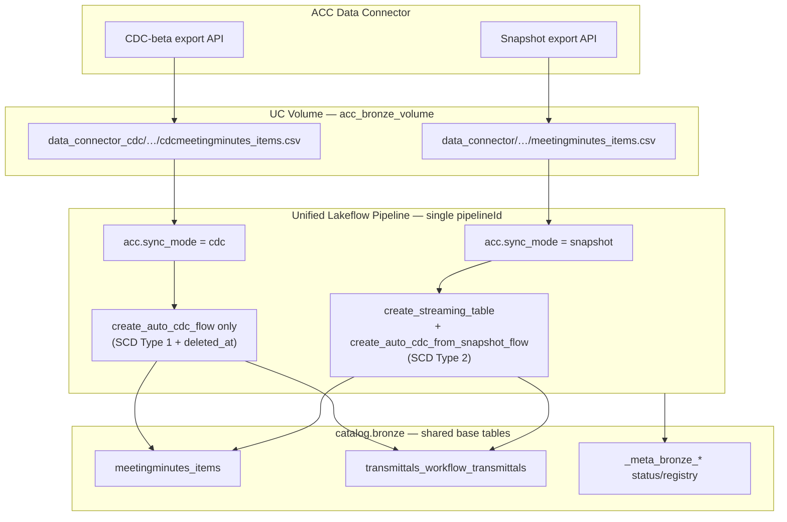
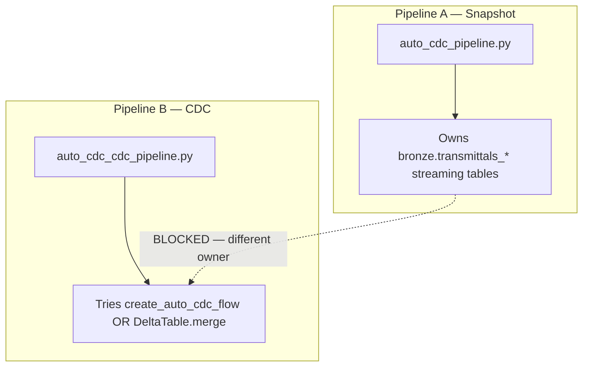
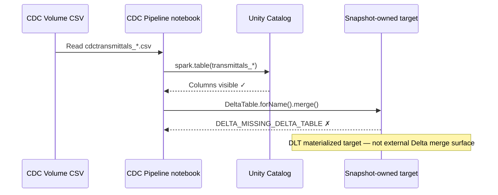
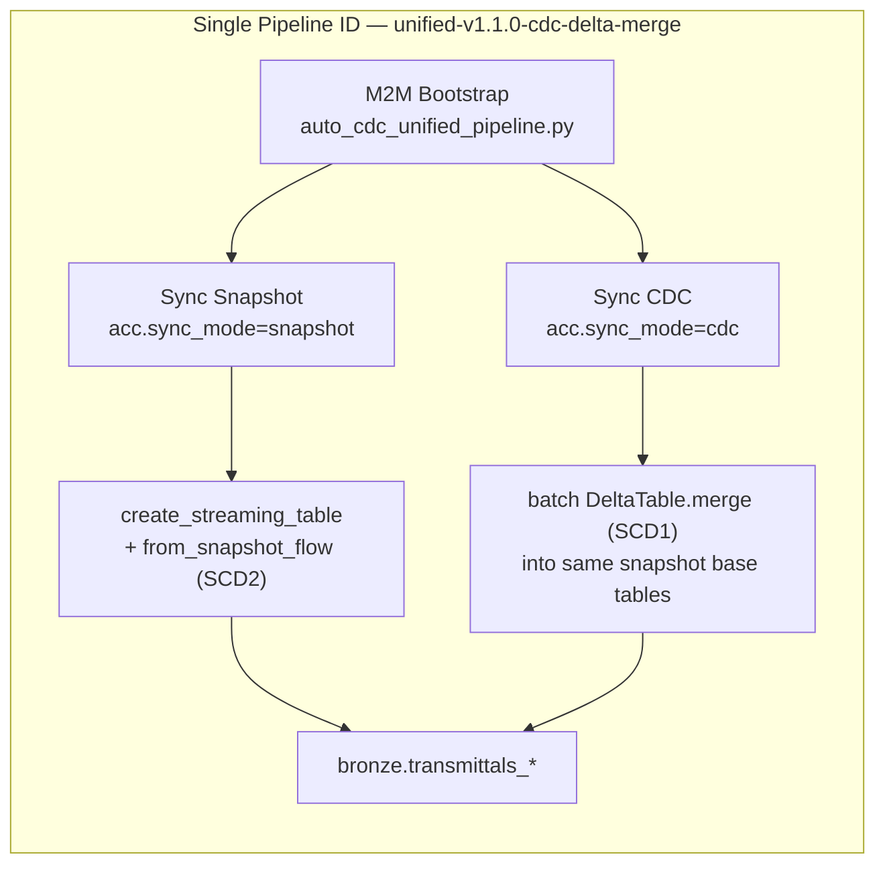
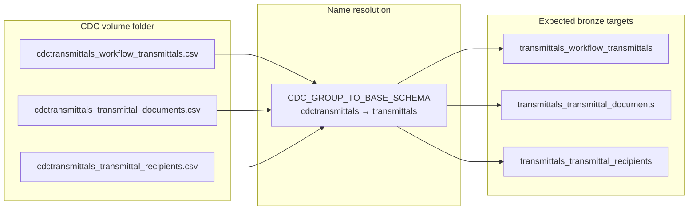
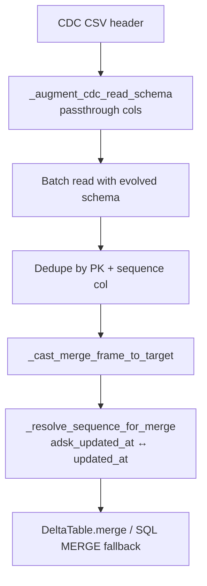
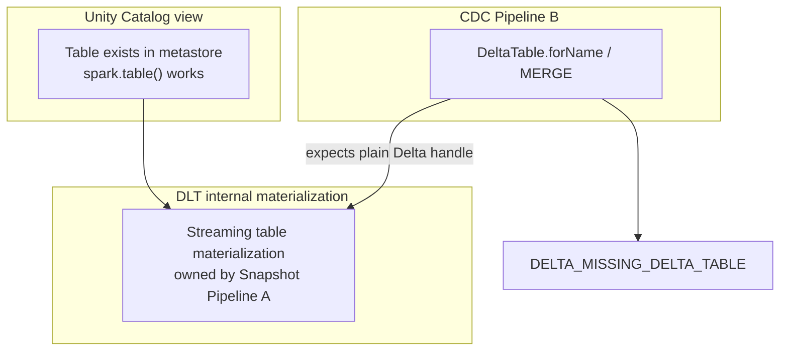
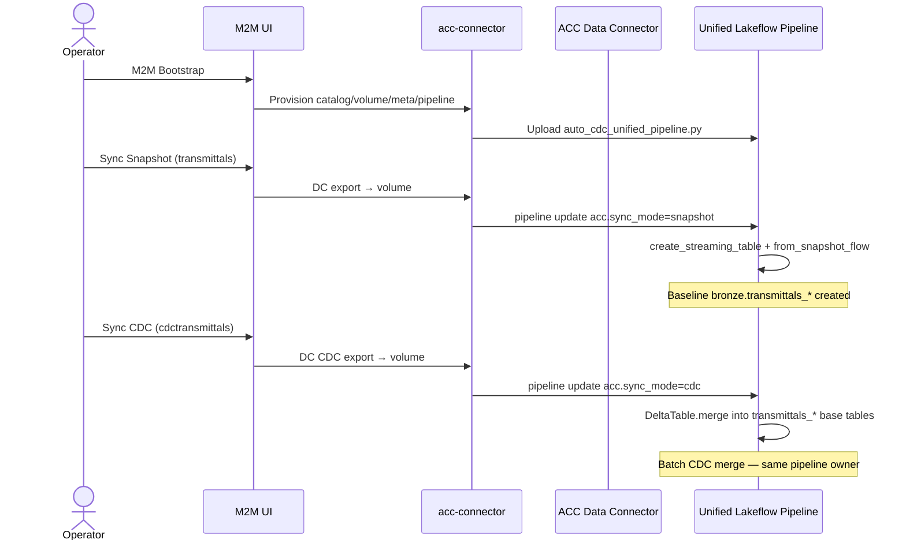
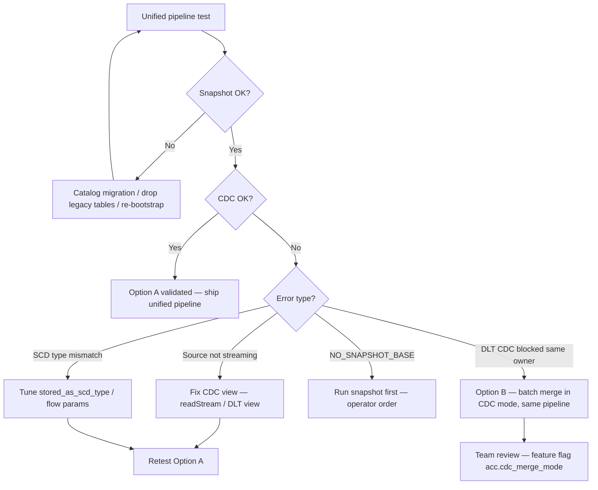

# ACC Connector — Bronze CDC Pipeline Issue History

**Audience:** Engineering team  
**Scope:** M2M path — Sync Snapshot + Sync CDC into shared bronze tables  
**Current solution:** `auto_cdc_unified_pipeline.py` (`unified-v1.0.0`) — one Lakeflow pipeline, two modes  
**Status:** **In test** — unified pipeline deployed locally; end-to-end validation on M2M tenant in progress

---

## Executive summary

The ACC Connector bronze layer must support two distinct ingest modes that **write to the same logical tables**:

| Mode | Source | Purpose |
|------|--------|---------|
| **Sync Snapshot** | `data_connector/<project>/<run>/*.csv` | Full (or incremental) baseline — creates bronze Delta tables |
| **Sync CDC** | `data_connector_cdc/<project>/<run>/cdc*.csv` | Change-only feed — merges inserts, updates, deletes into **those same tables** |

This sounds straightforward (read CSV → merge into Delta), but Databricks **Lakeflow Spark Declarative Pipelines (SDP)** adds a constraint that is easy to underestimate: **table ownership is bound to the pipeline that created the streaming/materialized target**. A second pipeline — even in the same catalog — cannot reliably attach `create_auto_cdc_flow` or execute `DeltaTable.merge` against another pipeline's DLT-managed tables.

We went through **multiple architectural iterations** (DLT CDC → table naming fixes → SCD semantics → batch Delta merge → merge fallbacks → unified pipeline). Each fix resolved one layer of failure and exposed the next. The document below captures that full chain so the team understands **why** the current unified design exists, not only **what** changed.

**Final direction:** One pipeline (`acc.sync_mode = snapshot | cdc`) so snapshot creates targets and CDC applies **batch `DeltaTable.merge`** on **same-owned tables** — eliminating cross-pipeline ownership conflict and avoiding DLT streaming-source requirements for batch CDC CSV drops.

---

## Target architecture (what we are building toward)



**Key invariant:** CDC CSV `cdcmeetingminutes_items.csv` must merge into `bronze.meetingminutes_items` — **never** into a parallel `cdcmeetingminutes_items` table.

---

## Why this was harder than it looked

Several independent problem classes stacked on top of each other. Fixing one often masked the next until the next pipeline run.

```mermaid
flowchart LR
    subgraph L1["Layer 1 — DLT API contract"]
        A1["Source must be streaming"]
        A2["Target must be pipeline-owned"]
    end

    subgraph L2["Layer 2 — Domain mapping"]
        B1["cdc{group}_* → {base}_*"]
        B2["PK registry + schema.json alignment"]
    end

    subgraph L3["Layer 3 — Change semantics"]
        C1["SCD2 snapshot vs SCD1 CDC"]
        C2["deleted_at hard deletes"]
        C3["Sequence column: adsk_updated_at vs updated_at"]
    end

    subgraph L4["Layer 4 — Platform ownership"]
        D1["DLT materialized table ≠ plain Delta"]
        D2["Cross-pipeline merge blocked"]
    end

    L1 --> L2 --> L3 --> L4
```



| Layer | Symptom if wrong | Example |
|-------|------------------|---------|
| DLT API | Flow registration fails at compile time | "view must be streaming" |
| Domain mapping | Data lands in wrong table | `cdctransmittals_*` created instead of updating `transmittals_*` |
| Change semantics | Rows wrong after merge | Deletes still visible; duplicate history rows |
| Platform ownership | Merge fails at runtime | `DELTA_MISSING_DELTA_TABLE` despite table visible in catalog |

---

## Architecture evolution (split → batch merge → unified)

### Phase A — Original split pipelines (failed at ownership)



**Outcome:** `TABLE_ALREADY_MANAGED_BY_OTHER_PIPELINE`, later `DELTA_MISSING_DELTA_TABLE`.

---

### Phase B — CDC notebook switched to batch Delta merge (partial progress)



We built substantial merge infrastructure (`_open_target_delta_table`, `_apply_cdc_delta_merge`, SQL MERGE fallback, column casting, sequence mapping). **The merge logic itself could work** — but the **target was not openable** from a foreign pipeline.

---

### Phase C — Unified pipeline + CDC batch Delta merge (current — in test)



**Rationale:** One pipeline fixes **ownership**. CDC uses **batch Delta merge** (not `create_auto_cdc_flow`) because ACC CDC drops are static CSV folders per sync — not streaming sources.

**v1.1.0 CDC path tried `create_auto_cdc_flow` first (v1.0.x) — failed with `STREAMING_TARGET_NOT_DEFINED` and `INCOMPATIBLE_BATCH_VIEW_READ`. Reverted CDC branch to proven batch merge within the same pipeline.**

---

## Concrete example — transmittals CDC run

This case drove much of the investigation:



**Observed failure (batch merge era):**

```
discovered=4  ok=0  failed=3
NO_BASE_TABLE: DELTA_MISSING_DELTA_TABLE
`bronze`.`transmittals_workflow_transmittals` is not a Delta table
detail={}
```

**Interpretation:**

| Check | Result |
|-------|--------|
| CSV discovery | ✓ 4 files in volume |
| PK / schema.json | ✓ Registry had correct keys |
| `spark.table()` | ✓ Columns readable |
| `DeltaTable.forName()` | ✗ Not a mergeable Delta target (cross-pipeline DLT) |
| `DESCRIBE DETAIL` | ✗ Empty — no location for `forPath` fallback |

Discovery and extraction worked. **Merge target access** failed — an ownership/platform issue, not a data issue.

---

## Issue timeline

| # | Issue | Root cause | Fix applied |
|---|--------|------------|-------------|
| **1** | `create_auto_cdc_flow` failed — view must be streaming, not batch | CDC notebook used batch CSV read; DLT AUTO CDC expects a **streaming** source view | Use **`readStream`** (or DLT `@dlt.view` over streaming CSV) instead of batch `spark.read` for CDC source |
| **2** | CDC created **new** tables (e.g. `cdctransmittals_*`) instead of updating snapshot base (`transmittals_*`) | CSV stem used as bronze table name; no remap from `cdc{group}_*` → `{base_schema}_*` | Add **`CDC_GROUP_TO_BASE_SCHEMA`** mapping; status keyed on base schema (`transmittals`), target = `transmittals_workflow_transmittals` |
| **3** | Deletes not reflected; history rows remained after CDC | CDC path used **`stored_as_scd_type=2`** (SCD2 keeps `__END_AT` history) | CDC merge uses **`stored_as_scd_type=1`** (current-state); deletes via `apply_as_deletes` on `deleted_at` |
| **4** | `create_auto_cdc_flow` blocked — pipeline does not **own** snapshot target table | Snapshot pipeline owns streaming tables; second CDC pipeline cannot register AUTO CDC flows on those targets | Attempted workaround: leave DLT for CDC, use **`DeltaTable.forName().merge()`** batch merge from CDC notebook |
| **5** | Delta MERGE failed — **column mismatch** (types/names between CDC CSV and bronze target) | CDC CSV has extra cols (`deleted_at`, `adsk_row_id`, `adsk_updated_at`); sequence col names differ (`adsk_updated_at` vs `updated_at`) | **`_CDC_PASSTHROUGH_COLS`**, **`_augment_cdc_read_schema`**, **`_cast_merge_frame_to_target`**, sequence column fallbacks |
| **6** | **`NO_BASE_TABLE` / `DELTA_MISSING_DELTA_TABLE`** — merge could not open snapshot target | **Two related causes:** (i) Snapshot tables are **DLT-managed / materialized streaming** targets — not a plain external Delta table another pipeline can MERGE into; (ii) `DeltaTable.forName` / `DESCRIBE DETAIL` fail cross-pipeline even when `spark.table()` lists columns | Batch merge path (`cdc-v3.3.3-merge-fallback`) added `forPath` fallback, SQL MERGE fallback — **still insufficient** when targets are owned by a different pipeline |
| **7** | **Unified pipeline** — same `pipelineId` for snapshot + CDC | Split pipelines = split ownership | `auto_cdc_unified_pipeline.py` |
| **8** | **`STREAMING_TARGET_NOT_DEFINED`** | CDC used `create_auto_cdc_flow` without `create_streaming_table` in same update | Added adopt-existing `create_streaming_table` (v1.0.1) |
| **9** | **`INCOMPATIBLE_BATCH_VIEW_READ`** | `create_auto_cdc_flow` requires **streaming** source; ACC CDC CSV is **batch** | Removed `create_auto_cdc_flow` from CDC path |
| **10** | **CDC batch merge into snapshot base** (current) | ACC CDC = one CSV folder per run; Delta merge is correct pattern; same pipeline owns targets | **`DeltaTable.merge`** in `_register_cdc_table` → `transmittals_*` base tables (`unified-v1.1.0-cdc-delta-merge`) |

---

## Issue details (expanded)

### 1. Streaming view requirement

**Symptom:** DLT error when registering CDC flow — source not valid for AUTO CDC.

**Cause:** Early CDC notebook read CSV with batch `spark.read`. Lakeflow AUTO CDC expects the source registered in the pipeline graph as a **streaming** relation.

**What we learned:** Batch reads can work for status/logging and one-off transforms, but **flow registration** has stricter contracts. The fix path involved DLT `@dlt.view` patterns and/or `readStream` over cloud file paths.

**Fix:** Streaming source (`readStream` / DLT streaming view pattern).

---

### 2. Wrong target table names

**Symptom:** Tables like `cdctransmittals_workflow_transmittals` created; `transmittals_workflow_transmittals` unchanged. Status rows sometimes showed `schema=cdctransmittals` with `ok` while base tables empty.

**Cause:** `_table_name_from_csv()` lowercased the CSV stem and used it directly as the DLT target. CDC group prefix (`cdctransmittals`) is an **export namespace**, not the bronze schema name (`transmittals`).

**Fix:** `CDC_GROUP_TO_BASE_SCHEMA` + `_resolve_registry_entry()` + status keyed on **base schema** for operator queries.

---

### 3. SCD Type 2 vs Type 1

**Symptom:** Deleted transmittal/recipient rows still visible; CDC updates appended SCD2 history instead of converging current state.

**Cause:** Snapshot baseline intentionally uses SCD2 (`__START_AT`, `__END_AT`). Early CDC path also used `stored_as_scd_type=2`, which preserves history — opposite of production CDC intent (current-state bronze).

**Design split (now explicit in unified notebook):**

| Mode | SCD | Behavior |
|------|-----|----------|
| Snapshot | Type 2 | History preserved; soft deletes via `deleted_at IS NULL` filter on source |
| CDC | Type 1 | Current state; hard deletes via `apply_as_deletes` when `deleted_at` set |

---

### 4. Pipeline ownership vs `create_auto_cdc_flow`

**Symptom:** CDC pipeline cannot attach AUTO CDC flow to existing bronze table (`TABLE_ALREADY_MANAGED_BY_OTHER_PIPELINE` or similar).

**Cause:** Lakeflow binds streaming table lifecycle to the creating pipeline. Second pipeline is a **different owner** in the SDP graph even if both target the same UC catalog/schema.

**Fix attempted:** Abandon DLT CDC in pipeline B; implement batch **`DeltaTable.merge`** in `auto_cdc_cdc_pipeline.py` (v3.x series). This unlocked progress on column/sequence logic but hit Layer 4 (below).

---

### 5. Delta MERGE column mismatch

**Symptom:** MERGE fails on type errors, missing columns, or sequence comparison never updating rows.

**Cause:** CDC CSV schema is a **superset** of snapshot schema.json:

- CDC-only: `deleted_at`, `adsk_row_id`, `adsk_updated_at`
- Snapshot bronze may only have `updated_at` (no `adsk_updated_at`)
- Numeric/timestamp types differ after PERMISSIVE CSV read

**Fix stack built over several iterations:**



This work is **reusable** if unified DLT CDC fails and we fall back to Option B (merge within same pipeline).

---

### 6. Materialized snapshot table not mergeable externally

**Symptom:**

```
NO_BASE_TABLE: unable to open Delta target acc_connector_m2m.bronze.transmittals_workflow_transmittals
DELTA_MISSING_DELTA_TABLE: `bronze`.`transmittals_workflow_transmittals` is not a Delta table
detail={}
open_errors=forName(...): [DELTA_MISSING_DELTA_TABLE] ...
```

**Cause (two sub-problems):**



1. **Internal materialization** — DLT snapshot targets are not exposed as a simple external Delta merge surface to foreign pipelines.
2. **No location fallback** — `DESCRIBE DETAIL` returned `{}` on serverless SDP, so `DeltaTable.forPath(location)` was skipped.

**Fix attempted:** v3.3.x merge-fallback chain (forName variants → forPath → SQL MERGE).  
**Outcome:** Insufficient for cross-pipeline targets. Led directly to unified pipeline decision.

---

### 7. Unified pipeline + CDC Delta merge (current — v1.1.0)

**Decision:** One pipeline for ownership. Snapshot stays DLT. CDC uses batch **`DeltaTable.merge`** into snapshot base tables.

| Mode | UI trigger | Config | Implementation |
|------|------------|--------|----------------|
| **Snapshot** | Sync Snapshot | `acc.sync_mode=snapshot` | `create_streaming_table` + `create_auto_cdc_from_snapshot_flow` (SCD2) |
| **CDC** | Sync CDC | `acc.sync_mode=cdc` | `_apply_cdc_delta_merge` → **`bronze.{schema}_{table}`** (same as snapshot) |

**CDC merge target mapping example:**

```
cdctransmittals_workflow_transmittals.csv  →  bronze.transmittals_workflow_transmittals
cdctransmittals_transmittal_documents.csv  →  bronze.transmittals_transmittal_documents
```

**CDC merge steps (`_apply_cdc_delta_merge`):**

1. Batch read CDC CSV (`spark.read.csv`)
2. Split rows: `deleted_at` set → delete merge; null → upsert merge
3. Dedupe by PK + sequence column (`updated_at` / `adsk_updated_at`)
4. Open target via `_open_target_delta_table` (same pipeline owner)
5. Cast columns to match snapshot bronze schema
6. `DeltaTable.merge` — delete matched PKs, upsert with sequence guard
7. SQL MERGE fallback if DeltaTable API fails on serverless SDP

**Removed from CDC path:** `create_auto_cdc_flow`, `@dlt.view` batch CSV sources.

**Files:**

| File | Role |
|------|------|
| `notebooks/auto_cdc_unified_pipeline.py` | **Active** — `unified-v1.1.0-cdc-delta-merge` |
| `notebooks/auto_cdc_pipeline.py` | Legacy snapshot-only reference (unchanged) |
| `notebooks/auto_cdc_cdc_pipeline.py` | **Deprecated** |

**Bootstrap:** One pipeline ID; `cdc_pipeline_id = bronze_pipeline_id`. Both workflows trigger the same pipeline with different `acc.sync_mode`.

---

## End-to-end operator flow (unified)



---

## Current status — unified pipeline testing

We are **actively testing** the unified pipeline on M2M (fresh connector DB + re-bootstrap recommended). Outcome is **not yet confirmed** in production Databricks.

**Test sequence:**

1. M2M Bootstrap → uploads `auto_cdc_unified_pipeline.py`, single pipeline ID
2. Sync Snapshot (e.g. `transmittals` standard group) → baseline via `create_auto_cdc_from_snapshot_flow`
3. Sync CDC (e.g. `cdctransmittals`) → batch Delta merge into same base tables
4. Check `_meta_bronze_table_status` and row counts in `bronze.transmittals_*`

**Pass criteria:**

- CDC run completes without `DISCOVERED_TABLES_NOT_FULLY_MERGED`
- `last_run_status = ok` for discovered tables
- Inserts/updates/deletes from CDC CSV reflected in base tables

**If tests pass:** Unified pipeline becomes the default; deprecate split-pipeline + batch merge path permanently.

**If tests fail:** Capture pipeline update logs, per-table status rows, and Lakeflow graph errors — then use [Fallback options](#fallback-options-if-unified-pipeline-does-not-work) below for team discussion.

---

## Fallback options (if unified pipeline does not work)

Use this section if `unified-v1.0.0` still fails after snapshot baseline exists **in the same pipeline**. Options are ordered by preference for team review.

| Option | Approach | Pros | Cons | When to consider |
|--------|----------|------|------|------------------|
| **A** | **Fix unified pipeline** (preferred) | Lakeflow-native; single owner; SCD1/SCD2 split by mode | Requires DLT CDC semantics to work on SCD2 parent | First — adjust `create_auto_cdc_flow` params, source view (streaming vs batch), SCD type |
| **B** | **Unified pipeline + batch merge in CDC mode only** | Same ownership; merge logic already built in v3.3.x | Not native DLT CDC; more custom code in one notebook | DLT `create_auto_cdc_flow` fails but `DeltaTable.merge` works **within same pipeline** |
| **C** | **Snapshot = DLT; CDC = separate Job notebook (not DLT)** | CDC Job can MERGE if targets expose a writable Delta location | Loses declarative pipeline UX; Job scheduling separate from Lakeflow | Same-pipeline DLT CDC blocked; need plain Delta bronze (non-streaming) |
| **D** | **Bronze = plain Delta tables (no DLT streaming parent)** | Both snapshot and CDC use `DeltaTable.merge` reliably | Lose AUTO CDC FROM SNAPSHOT / SCD2 history in bronze; larger redesign | Product accepts current-state bronze only |
| **E** | **Dual table layers** | Snapshot SCD2 history + CDC SCD1 current-state view/table | Two tables per entity; downstream must pick layer | Cannot merge into streaming parent at all |
| **F** | **Databricks support / docs escalation** | May clarify SCD2 parent + SCD1 CDC flow limits on serverless SDP | Slow; may not change design | Errors look like platform limits, not connector bugs |

### Decision tree (for discussion)



### What we already know does **not** work (avoid re-trying)

- **Split pipelines** (snapshot pipeline A + CDC pipeline B) with `create_auto_cdc_flow` on shared targets
- **Split pipelines** with cross-pipeline `DeltaTable.forName().merge()` into DLT materialized snapshot tables
- **CDC-only tables** (`cdctransmittals_*`) as merge targets when product requires `transmittals_*` base tables

### Team discussion prompts

1. Does product **require SCD2 history in bronze**, or is current-state (SCD1) enough for CDC consumers?
2. If unified `create_auto_cdc_flow` fails, are we OK with **Option B** (same pipeline, batch merge for CDC mode only)?
3. Should we maintain a **feature flag** (`acc.cdc_merge_mode = dlt | delta`) during transition?
4. What is the **rollback** plan if unified pipeline blocks snapshot regressions?

---

## Operator rules

1. **Sync Snapshot first** for each schema group (creates baseline in unified pipeline).
2. **Sync CDC second** (incremental into same tables).
3. Do not run snapshot and CDC **concurrently** on the same pipeline.
4. After code change → **re-run M2M Bootstrap** → upload unified notebook.
5. M2M catalog is **chosen at config time** — re-save M2M config after connector DB reset.

---

## Verification SQL

```sql
-- Baseline exists and is Delta
DESCRIBE DETAIL acc_connector_m2m.bronze.transmittals_workflow_transmittals;

-- CDC run outcome
SELECT schema, `table`, last_run_status, last_error_message
FROM acc_connector_m2m.bronze._meta_bronze_table_status
WHERE schema = 'transmittals'
ORDER BY last_synced_at DESC;
```

**Expected after successful CDC:** `last_run_status = ok`

---

## Key takeaway for the team

> **Root problem was never “CSV format” or “PK config” — it was pipeline ownership and DLT materialization semantics.**  
> Each iteration fixed a real layer (streaming source, table naming, SCD type, column alignment, merge fallbacks) but split pipelines could not reach a stable end state.  
> **One unified pipeline + mode-specific DLT flows is the Lakeflow-native architecture** — currently in validation. If it fails, Option B (same pipeline, batch merge for CDC mode) reuses the merge work already built in v3.3.x.

---

## Related artifacts

| Artifact | Purpose |
|----------|---------|
| `docs/CDC_SYNC_PRODUCTION_DESIGN.md` | Production target behavior, watermark rules, service groups |
| `notebooks/auto_cdc_unified_pipeline.py` | Active unified notebook |
| `scripts/smoke_check.py` | Offline validation of notebook markers and orchestrator config |

---

*Last updated: 2026-07-20 — v1.1.0 CDC Delta merge into snapshot base tables; unified pipeline in active test.*
