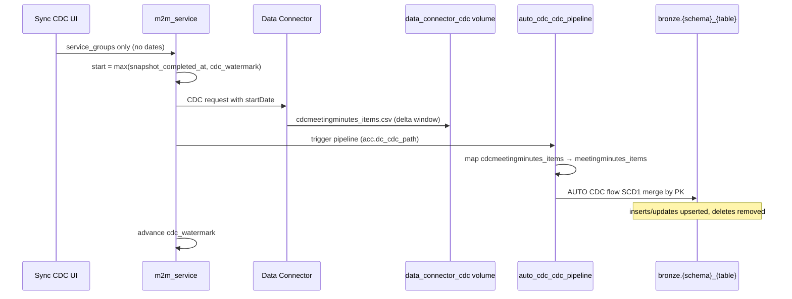
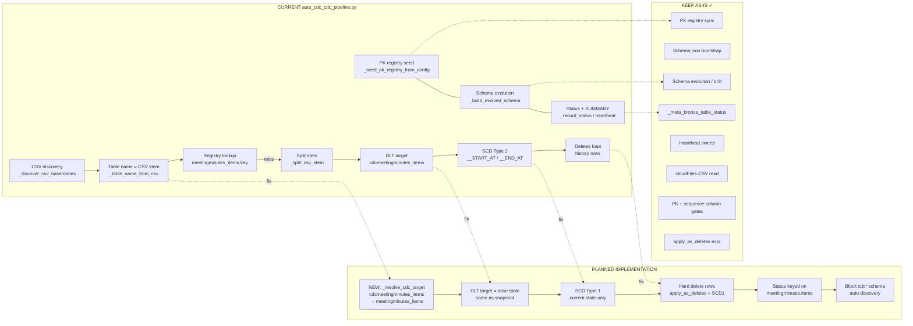
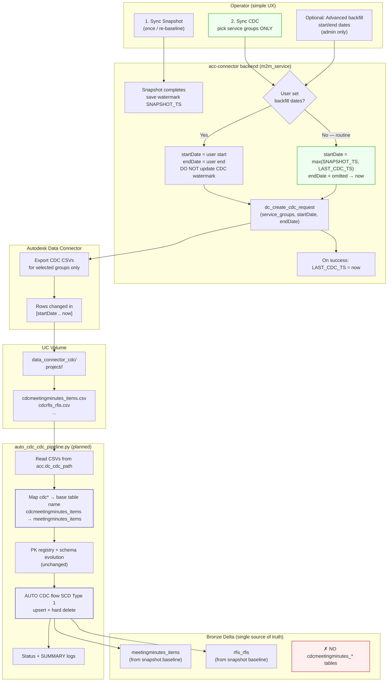
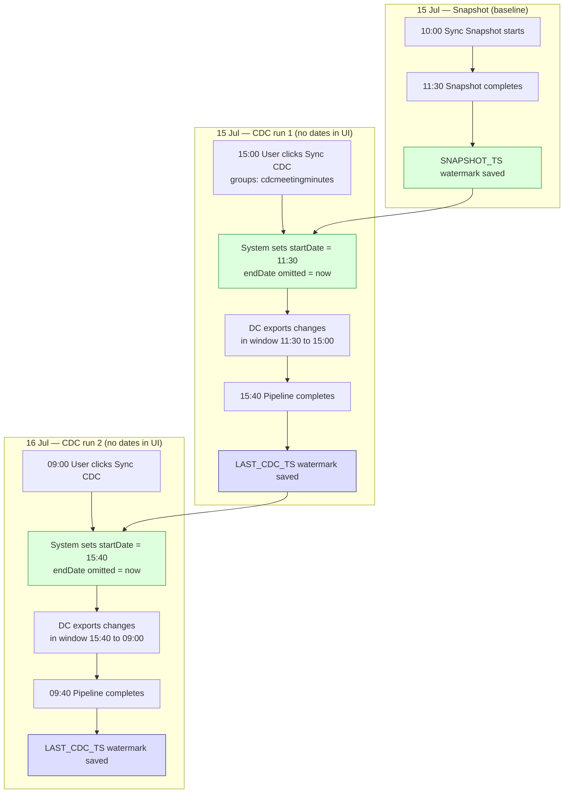

# CDC Sync — Production Design & Minimal Fix Plan

**Scope:** M2M path (`Sync Snapshot` → `Sync CDC`) and the notebooks  
`auto_cdc_pipeline.py` (snapshot) + `auto_cdc_cdc_pipeline.py` (CDC).

**Date:** 2026-07-15  
**Status:** Implemented (see git history for deployment date)

---

## 1. Target behavior (production)

| Step | Input | Bronze output | Rule |
|------|--------|---------------|------|
| **Sync Snapshot** | `data_connector/<project>/<run>/*.csv` | Base tables, e.g. `meetingminutes_items`, `rfis_rfis` | One-time baseline. Creates Delta tables + seeds PK registry. |
| **Sync CDC** | `data_connector_cdc/<project>/<run>/cdc*.csv` | **Same** base tables as snapshot | Apply **only changes** (insert / update / delete) from the CDC drop. **Never** create parallel `cdc*` tables. |

**Example (your CASE 1):**

```
Snapshot CSV:  meetingminutes_items.csv     → bronze.meetingminutes_items
CDC CSV:       cdcmeetingminutes_items.csv → bronze.meetingminutes_items  (merge, not new table)

Snapshot CSV:  rfis_rfis.csv                → bronze.rfis_rfis
CDC CSV:       cdcrfis_rfis.csv             → bronze.rfis_rfis
```

**CDC merge semantics (production default):**

- **SCD Type 1** on the CDC path: current-state table, hard deletes.
- Rows with `deleted_at` set → **remove** the PK from the base table.
- Rows without `deleted_at` → upsert by PK using `adsk_updated_at` (fallback `updated_at`).
- Snapshot baseline may keep SCD Type 2 internally; CDC must **converge** the base table to current state.

**Operator UX (keep it simple):**

1. Run **Sync Snapshot** once (required gate — already enforced).
2. Run **Sync CDC** on a schedule or manually.
3. Pick **service groups** (optional filter).
4. **No date range** for normal runs — the **system** picks the window from watermarks (see [§13.1](#131-q1-if-operator-does-not-set-a-date-range-who-decides-the-cdc-window)).
5. Date range = **admin backfill only**, clearly labeled, does not move watermark.

---

## 2. What you observed (CASE 1) — symptom map

| # | Symptom | Expected |
|---|---------|----------|
| a | CDC volume CSVs contain **all rows**, not just today’s changes | Only delta rows for the requested window |
| b | New tables created, e.g. `cdcmeetingminutes_items`, instead of updating `meetingminutes_items` | Merge into existing snapshot base table |
| c | Base table not updated (2 inserts, 1 delete missing) | Base table reflects CDC changes |
| d | Deleted row still visible (SCD2 history) | Row removed from base table (SCD1) |

All four symptoms are **consistent with the current code**, not operator error alone.

---

## 3. Root cause analysis

### 3.1 CDC volume has full data (not delta)

**Where:** `m2m_service._run_dc_phase()` / `sync_orchestrator._run_dc_export()`

When no CDC watermark exists, the connector logs *"full export (no watermark)"* and calls Data Connector **without** `startDate`:

```python
# m2m_service.py — simplified
watermark_ts = db.get_m2m_watermark(config_id, DC_CDC_WATERMARK_KEY)
if watermark_ts:
    start_date = format_ts(watermark_ts)
else:
    start_date = None   # → DC returns full export for selected CDC groups
```

**Why this bites you:**

- First CDC run after snapshot → **no CDC watermark** → full CDC export.
- Watermark is set to `time.time()` **after** the run, not to snapshot completion time.
- Snapshot completion time is **not** used as the CDC floor even though snapshot is the baseline.

**Autodesk caveat:** Even with `startDate`, some CDC-beta groups may export wide row sets (all rows carrying change metadata). The connector must still treat the file as **changes to merge**, not a second baseline. Row-level filtering in the notebook is **not** recommended — rely on DC date window + PK merge.

### 3.2 New `cdc*` tables instead of base tables

**Where:** `auto_cdc_cdc_pipeline.py` → `_table_name_from_csv()` + `_register_table()`

CDC CSV `cdcmeetingminutes_items.csv` becomes table name `cdcmeetingminutes_items`.

Registry / PK config keys are `meetingminutes` + `items` → flat key `meetingminutes_items`.

Lookup fails → `_split_csv_stem()` matches longest known prefix `cdcmeetingminutes` (if previously registered) or `unknown`.

```python
# Current behavior
dlt.create_streaming_table(name=table_name, ...)  # table_name = CSV stem
dlt.create_auto_cdc_flow(target=table_name, ...)
```

The notebook header *claims* "into the same Bronze targets as the snapshot pipeline" but **never remaps** `cdc{schema}` → `{schema}`.

### 3.3 SCD Type 2 on CDC path

**Where:** `auto_cdc_cdc_pipeline.py` lines ~832–846

```python
dlt.create_streaming_table(schema=_schema_for_scd2(...))
dlt.create_auto_cdc_flow(..., stored_as_scd_type=2, apply_as_deletes=...)
```

SCD2 keeps deleted rows with `__END_AT`. Production CDC into a **current-state** bronze layer should use **`stored_as_scd_type=1`**.

### 3.4 Watermark / date-range UX adds complexity

**Where:** UI (`app.js`), `m2m_routes._parse_cdc_options()`, `m2m_service._run_dc_phase()`

| UI option | Current behavior | Production intent |
|-----------|------------------|-------------------|
| No dates | Incremental from CDC watermark, or **full** if no watermark | Incremental from **max(snapshot_completed_at, cdc_watermark)** |
| Date range set | One-off backfill; watermark **not** advanced | Admin-only; hidden or behind "Advanced backfill" |
| Service groups | Subset of `DC_CDC_SERVICE_GROUPS` | Keep — useful and low risk |

---

## 4. Production principles

1. **One table per entity** — snapshot and CDC share the same Delta name (`{schema}_{table}`).
2. **Snapshot = baseline, CDC = delta** — never two parallel table families.
3. **Watermarks are system-managed** — operators pick groups, not dates, for routine sync.
4. **CDC start floor = snapshot completion** — first CDC never re-baselines from DC.
5. **SCD1 for CDC merges** — deletes are real deletes in bronze.
6. **Keep observability** — PK registry, schema evolution, `_meta_bronze_table_status`, `[SUMMARY]` logs stay as-is.

---

## 5. What to change (minimal)

### 5.1 CDC CSV → base table mapping (notebook) — **required**

**File:** `notebooks/auto_cdc_cdc_pipeline.py`

Add a resolver used by `_register_table()`:

```python
CDC_PREFIX = 'cdc'

def _resolve_cdc_target(csv_stem: str, registry: dict, known_schemas: set) -> tuple[str, str, str]:
    """
    Returns (target_table_name, schema, table) for bronze.

    cdcmeetingminutes_items → meetingminutes_items (meetingminutes, items)
    cdcrfis_rfis            → rfis_rfis            (rfis, rfis)
    """
```

**Rules:**

1. If `csv_stem` starts with `cdc`, strip the `cdc` prefix and find the longest `known_schema` such that `csv_stem.startswith(schema + '_')`.
2. `target_table_name = f'{schema}_{table}'` (same convention as snapshot).
3. PK / status / registry lookups use `(schema, table)` from the **base** schema, not `cdc{schema}`.
4. `dlt.create_streaming_table(name=target_table_name, ...)` and `create_auto_cdc_flow(target=target_table_name, ...)`.
5. If no base schema match → `STATUS_NOT_IN_SCHEMA_JSON` (do **not** auto-discover `cdc*` schemas into registry).

**Constant map (optional safety net)** — mirror `DC_CDC_SERVICE_GROUPS`:

```python
CDC_GROUP_TO_SCHEMA = {
    'cdcadmin': 'admin',
    'cdccost': 'cost',
    # ...
    'cdcmeetingminutes': 'meetingminutes',
    'cdcrfis': 'rfis',
}
```

Use as fallback if stem split is ambiguous.

### 5.2 SCD Type 1 for CDC flows (notebook) — **required**

**File:** `notebooks/auto_cdc_cdc_pipeline.py`

| Change | From | To |
|--------|------|-----|
| `create_streaming_table` schema | `_schema_for_scd2(evolved_struct)` | `evolved_struct` only (no `__START_AT` / `__END_AT` on CDC target) |
| `create_auto_cdc_flow` | `stored_as_scd_type=2` | `stored_as_scd_type=1` |
| Deletes | `apply_as_deletes` when `deleted_at` present | Keep — correct for SCD1 |

**Note:** If the snapshot pipeline already created the table with SCD2 columns, first CDC run after this change may require a **one-time** pipeline reset or migration for affected tables. Document in runbook: *after deploying CDC SCD1 fix, run Sync CDC once per group; verify `__END_AT` rows are not accumulating.*

**Do not change** `auto_cdc_pipeline.py` snapshot SCD2 in this pass unless product mandates SCD1 end-to-end.

### 5.3 Lock CDC start to snapshot completion (backend) — **required**

**Files:**

- `backend/services/m2m_service.py` — `_run_dc_phase()`
- `backend/services/sync/sync_orchestrator.py` — same pattern for U2M
- `backend/repositories/state/m2m_repository.py` — helper to read snapshot completion ts

**Logic:**

```python
def _cdc_start_date(config_id, dc_cdc_watermark_key) -> str | None:
    cdc_wm = get_m2m_watermark(config_id, DC_CDC_WATERMARK_KEY)
    snap_wm = get_m2m_watermark(config_id, DC_WATERMARK_KEY)  # set on snapshot success
    floor_ts = snap_wm  # required: _assert_cdc_baseline already ensures snapshot ran

    if cdc_wm and snap_wm:
        effective_ts = max(cdc_wm, snap_wm)
    elif cdc_wm:
        effective_ts = cdc_wm
    else:
        effective_ts = floor_ts   # first CDC: start at snapshot completion, NOT full export

    return format_iso_z(effective_ts) if effective_ts else None
```

**On snapshot complete:** continue setting `DC_WATERMARK_KEY` (already done). Ensure it uses the run **completion** timestamp, not submission time.

**On CDC complete (incremental only):** keep advancing `DC_CDC_WATERMARK_KEY` to `time.time()`.

**Explicit date backfill:** unchanged — overrides win, watermark not advanced.

### 5.4 Restrict CDC UI options (frontend + API) — **recommended**

**Files:** `static/app.js`, `backend/routes/m2m_routes.py`

| UI element | Production change |
|------------|-------------------|
| Start / End date inputs | Collapse under **"Advanced: date backfill"** toggle; default hidden |
| Help text | *"Routine CDC uses automatic watermark. Dates are for one-off backfill only."* |
| Sync CDC button | Enabled only when `snapshot_baseline_complete` (already enforced server-side) |
| Service groups | Keep; require ≥1 selected (already validated) |

**API hardening (optional):** reject `start_date` without `snapshot_baseline_complete` (already gated) and log a warning when date range spans > N days.

### 5.5 Cleanup / migration note (ops, not code)

Tables already created by the buggy path (`cdcmeetingminutes_*`, etc.):

- **Do not** merge these into production queries.
- After code fix, drop or archive `cdc*` bronze tables once base tables show correct counts.
- Re-run Sync CDC for affected service groups.

---

## 6. What NOT to change

| Component | Reason |
|-----------|--------|
| `auto_cdc_pipeline.py` snapshot ingest | Baseline path works; scope CDC fixes separately |
| PK registry seeding (`pk_config.json`, `_meta_bronze_pk_registry`) | Still authoritative for PK columns |
| Schema evolution (`_build_evolved_schema`, `_meta_bronze_schema_versions`) | Needed for both paths |
| `_meta_bronze_table_status` + heartbeat sweep | Operational visibility |
| `[SUMMARY]` run counters | Keep for support / monitoring |
| Bootstrap, workflows, `bulk_downloader` | Infrastructure is sound |
| `DC_CDC_SERVICE_GROUPS` list | Correct Autodesk group names |
| Snapshot gate (`has_successful_m2m_snapshot`) | Correct safety check |
| Date-range backfill semantics (no watermark bump) | Correct for admin use |

---

## 7. File-level change summary

| File | Change size | Description |
|------|-------------|-------------|
| `notebooks/auto_cdc_cdc_pipeline.py` | **Medium** | CDC→base table resolver; SCD1; status keyed on base schema |
| `backend/services/m2m_service.py` | **Small** | CDC `start_date` from `max(snapshot_wm, cdc_wm)` |
| `backend/services/sync/sync_orchestrator.py` | **Small** | Same watermark floor for U2M CDC |
| `static/app.js` | **Small** | Hide date range by default; clearer copy |
| `backend/routes/m2m_routes.py` | **Tiny** | Optional stricter date validation |
| `backend/clients/acc/constants.py` | **Tiny** | Optional `CDC_GROUP_TO_BASE_SCHEMA` map |

**Estimated touch:** ~150–220 lines, mostly one notebook function + watermark helper.

---

## 8. Corrected end-to-end flow



---

## 9. Test plan (CASE 1 replay)

**Setup:** ACC change in meeting minutes — 2 inserts, 1 delete.

1. **Snapshot** — confirm `bronze.meetingminutes_*` exist and row counts match ACC.
2. **CDC** — select only `cdcmeetingminutes`, leave dates blank.
3. **Volume check** — `data_connector_cdc/.../cdcmeetingminutes_*.csv` row count ≈ changes in window (not full table). *If DC still exports wide files, merge correctness matters more than file row count.*
4. **Bronze check:**
   - No new `cdcmeetingminutes_*` tables.
   - `meetingminutes_*` row counts reflect +2 / -1.
   - Deleted PK absent from base table (SCD1).
5. **Registry / status** — `_meta_bronze_table_status` shows `meetingminutes.{table}`, not `cdcmeetingminutes.{table}`.
6. **Second CDC run** — no ACC changes → minimal or empty CSVs; base tables unchanged; watermark advanced.

---

## 10. Decision log

| Decision | Choice | Rationale |
|----------|--------|-----------|
| CDC target tables | Same as snapshot | Single source of truth in bronze |
| CDC SCD type | Type 1 | Current-state semantics for operational data |
| Snapshot SCD type | Keep Type 2 (for now) | Avoid large snapshot refactor; CDC converges state |
| Date range in UI | Admin-only / hidden | Reduces operator error and support load |
| First CDC start | Snapshot completion timestamp | Prevents silent full re-export |
| Auto-discover `cdc*` schemas | **Disable** | Prevents registry pollution |

---

## 11. Open questions (verify with one DC API log)

1. **DC CDC row scope:** With `startDate` set to snapshot completion, does Autodesk still emit all rows in `cdcmeetingminutes_items.csv` or only changed PKs? Implementation is correct either way if merge targets base tables; volume size affects cost, not correctness.
2. **SCD2 → SCD1 on existing tables:** If snapshot created `__START_AT`/`__END_AT` columns, confirm DLT `stored_as_scd_type=1` CDC flow into that table is supported in your workspace edition — if not, add a one-line migration to drop SCD2 columns from base tables before first CDC merge.

---

## 12. Implementation order

1. **Watermark floor** (backend) — stops full CDC exports immediately.
2. **Table name resolver** (notebook) — stops new `cdc*` tables.
3. **SCD Type 1** (notebook) — correct delete semantics.
4. **UI simplification** — prevent date-range misuse.
5. **Ops cleanup** — drop stray `cdc*` tables; re-run CDC per group.

This order fixes data correctness before polish.

---

## 13. FAQ — your design questions answered

### 13.1 Q1: If operator does NOT set a date range, who decides the CDC window?

**Short answer:** The **connector backend** decides automatically using two stored timestamps (watermarks). The operator only picks **which CDC service groups** to sync.

**The plan (what we will implement):**

When the user clicks **Sync CDC** with no dates, `m2m_service._run_dc_phase()` computes the Data Connector request like this:

| Field sent to Autodesk DC API | Who sets it | Value |
|-------------------------------|-------------|-------|
| `startDate` | **System** (automatic) | See table below |
| `endDate` | **System** (automatic) | **Omitted** → DC treats it as **“now”** (time when the DC job runs) |
| `serviceGroups` | **Operator** (optional filter) | e.g. `["cdcmeetingminutes"]` or all groups |

**How `startDate` is computed (planned logic):**

| Situation | `startDate` sent to DC | Stored after success |
|-----------|------------------------|----------------------|
| **First CDC** after snapshot (no CDC watermark yet) | Snapshot **completion** timestamp | New CDC watermark = this run’s completion time |
| **Second and later CDC** runs (CDC watermark exists) | **Last successful CDC** completion timestamp | CDC watermark updated again |
| Safety rule always applied | `startDate = max(snapshot_completion, last_cdc_completion)` | Never ask DC for changes **before** the snapshot baseline |

**Plain-language example:**

```
Day 1, 10:00  → Sync Snapshot completes        (watermark A saved)
Day 1, 15:00  → User clicks Sync CDC (no dates)
                startDate = 10:00 (snapshot done)
                endDate   = implicit “now” ≈ 15:00 when DC job runs
                → DC returns changes between 10:00 and 15:00

Day 2, 09:00  → User clicks Sync CDC again (no dates)
                startDate = 15:00 (last CDC done)
                endDate   = implicit “now” ≈ 09:00
                → DC returns changes between yesterday 15:00 and today 09:00
```

The operator never types dates. The window is always **“since last successful sync point → until this run.”**

**What is wrong today (before fix):**

| Case | Current `startDate` | Result |
|------|---------------------|--------|
| First CDC, no CDC watermark | `None` (missing) | DC often returns **full table** export — this caused your CASE 1 volume problem |
| Later CDC runs | Last CDC watermark only | May work, but ignores snapshot floor if clocks/order get odd |

---

### 13.2 Q2: Is `start = snapshot complete` and `end = click Sync CDC time` correct or wrong?

**Answer: That is CORRECT for the first CDC run.** It is also the right *pattern* for every later run, with one change to what “start” means.

**Correct model (planned):**

```
┌─────────────────────────────────────────────────────────────────┐
│  CDC window (routine run, no dates in UI)                       │
│                                                                 │
│  startDate  =  last successful sync point (see below)           │
│  endDate    =  not sent → Autodesk uses "now" (job run time)    │
│                                                                 │
│  First CDC:   start = snapshot completion time     ✓ CORRECT    │
│  Later CDC:   start = last CDC completion time     ✓ CORRECT    │
│  Always:      start ≥ snapshot completion time    ✓ SAFETY      │
└─────────────────────────────────────────────────────────────────┘
```

**Why `end = click time` is correct:**

- You do not send `endDate` in the API payload today unless the user picks a backfill range.
- When omitted, Data Connector’s export covers changes **up to the moment the job executes** (effectively “now” when the user clicked Sync CDC, plus a few minutes of DC processing).
- So the user’s mental model — *“give me everything that changed since my last sync, up to when I clicked the button”* — is exactly what we want.

**What would be WRONG:**

| Approach | Why it is wrong |
|----------|-----------------|
| User must pick start/end dates every day | Easy to overlap gaps or re-export full history (your CASE 1) |
| `startDate = None` on first CDC | Full CDC dump instead of delta |
| `endDate` fixed to snapshot time | Would miss changes after snapshot until CDC run |
| Manual end date for routine runs | Same row exported twice if ranges overlap; watermark gets confusing |

**“No date range” does NOT mean “no date window.”** It means:

> **The date window exists and is automatic.** The user does not choose it; watermarks do.

---

### 13.3 Q3: `auto_cdc_cdc_pipeline.py` — what is wrong, what is correct, what we will implement

#### Mind map (current notebook vs planned fix)



#### Point-by-point analysis

| # | Notebook area | Current behavior | Verdict | Planned change |
|---|---------------|------------------|---------|----------------|
| 1 | `_table_name_from_csv()` | Uses raw CSV name `cdcmeetingminutes_items` | **WRONG** | Add `_resolve_cdc_target()` → `meetingminutes_items` |
| 2 | Registry lookup (`flat_key in registry`) | Looks up `cdcmeetingminutes_items`; snapshot registered `meetingminutes_items` | **WRONG** (miss) | Lookup PK using **base** `(schema, table)` after remap |
| 3 | `_split_csv_stem()` fallback | May classify as schema `cdcmeetingminutes` | **WRONG** | Prefer base schema map; fail if no base match |
| 4 | `_insert_registry_row()` on unknown | Can register new `cdc*` schema into registry | **WRONG** for CDC | **Disable** auto-discover for `cdc*` stems |
| 5 | `dlt.create_streaming_table(name=...)` | Creates **new** `cdc*` Delta table | **WRONG** | `name=target_table_name` (base table) |
| 6 | `stored_as_scd_type=2` | Keeps delete history | **WRONG** for bronze CDC | Change to **`stored_as_scd_type=1`** |
| 7 | `_schema_for_scd2()` on CDC target | Adds `__START_AT`, `__END_AT` | **WRONG** on CDC path | Use `evolved_struct` only (no SCD2 cols) |
| 8 | `apply_as_deletes` when `deleted_at` set | Expression is correct | **CORRECT** | Keep |
| 9 | `sequence_by = adsk_updated_at` | Required for AUTO CDC | **CORRECT** | Keep |
| 10 | PK null expectations | Validates PK columns | **CORRECT** | Keep |
| 11 | `_seed_pk_registry_from_config()` | Syncs PKs from pk_config.json | **CORRECT** | Keep |
| 12 | `_build_evolved_schema()` | Handles new/widened columns | **CORRECT** | Keep |
| 13 | `_record_status()` + heartbeat | Operational visibility | **CORRECT** | Keep; key status by **base** schema.table |
| 14 | `_bootstrap_schema_json()` | Updates schema.json from zip | **CORRECT** | Keep |
| 15 | `_resolve_cdc_base()` / `DC_CDC_PATH` | Reads correct run folder | **CORRECT** | Keep |
| 16 | cloudFiles streaming source | Reads CDC CSV drop | **CORRECT** | Keep |
| 17 | SCD2 snapshot tables already exist | CDC SCD1 into SCD2 table may need validation | **NEEDS ANALYSIS** | Test in workspace; one-time migration if DLT rejects |

#### Simple picture (left = today, right = after fix)

```
TODAY (wrong)                          AFTER FIX (correct)
──────────────────────────────────────────────────────────────────

Volume CSV                             Volume CSV
cdcmeetingminutes_items.csv            cdcmeetingminutes_items.csv
         │                                      │
         ▼                                      ▼
_table_name_from_csv                     _resolve_cdc_target()
         │                                      │
         ▼                                      ▼
Bronze NEW table                         Bronze BASE table
cdcmeetingminutes_items                meetingminutes_items  ← same as snapshot
         │                                      │
         ▼                                      ▼
SCD2 (deleted row kept)                SCD1 (deleted row removed)
Base table UNCHANGED ✗                 Base table UPDATED ✓
```

**Important:** The notebook alone cannot fix the “full CSV in volume” problem. That is fixed in **`m2m_service.py`** by sending the correct `startDate` to Data Connector. The notebook fixes **where** CDC lands in Bronze (which table) and **how** merges/deletes behave.

---

### 13.4 Q4: Why is removing date range from routine UX the best option?

**Simple reason:** Dates are powerful but dangerous. Most operators need **“sync my changes since last time”**, not manual time-range editing.

| If we keep dates prominent | What goes wrong (you already saw this) |
|----------------------------|----------------------------------------|
| User leaves dates blank + broken watermark | Full CDC export (all rows in volume) |
| User sets same start/end day for “today” | Backfill mode; watermark not moved; next run confusing |
| User sets overlapping ranges | Same changes merged twice; hard to debug |
| User sets gap (missed days) | Requires admin backfill anyway — not a daily task |
| More UI fields | More support tickets, more “which date do I pick?” |

**Why automatic watermarks are better for production:**

1. **No gaps** — each successful CDC run chains to the next (`start = last success`).
2. **No overlaps** — you never re-request the same window twice by mistake.
3. **Matches user intent** — “I changed data in ACC today; run CDC” = changes since last sync.
4. **Less cost** — smaller DC exports, less volume storage, faster pipeline.
5. **One code path** — easier to test and monitor.

**We are NOT deleting date range capability.** We **hide** it under **“Advanced: backfill”** for rare cases (e.g. connector was down for 5 days, need to re-pull a specific week). Routine operators never touch it.

```
Routine operator path:     Sync CDC + pick groups        → automatic dates
Admin / support path:      Advanced backfill + dates     → manual window, watermark frozen
```

---

### 13.5 Q5: Why keep CDC service group selection? (simple explanation)

**Simple reason:** A project has **many ACC modules** (RFIs, issues, meeting minutes, sheets, …). CDC lets the operator sync **only the module they care about right now**, instead of waiting for all 10 CDC groups every time.

**Example from your CASE 1:**

- You changed **meeting minutes** only.
- You checked **`cdcmeetingminutes`** only.
- DC exports only meeting-minutes CDC CSVs → faster, cheaper, easier to verify.

**If we removed service group selection:**

- Every CDC run would pull **all** CDC groups (admin, cost, issues, RFIs, sheets, …).
- Longer DC job, more CSV files, higher Databricks pipeline cost.
- Harder to test one module after a change.

**Why this is safe to keep (unlike dates):**

| Service groups | Date range |
|----------------|------------|
| Filters **which tables** are exported | Filters **which time period** is exported |
| Does not break watermark logic | Can break watermark / cause full re-export |
| Matches “I changed RFIs today” workflow | Requires understanding of sync history |
| Low complexity | High complexity |

**What we will implement for service groups:**

| Layer | Behavior |
|-------|----------|
| UI | Checkboxes for each `DC_CDC_SERVICE_GROUPS` entry; at least one required |
| API | Pass `service_groups` list to `dc_create_cdc_request()` |
| DC | Only exports CSVs for selected groups |
| Notebook | Processes whatever CSVs land in the run folder; remap each `cdc*` file to its base table |

**Default when all boxes checked:** Same as today — full CDC group list. Narrowing selection is optional optimization, not a different mode.

---

## 14. Master diagram — full system (planned production behavior)

This is the **complete picture**: operator actions, automatic dates, volume, notebook, and bronze base tables.



### Timeline swimlane (routine CDC, no dates)

> **Note:** Gantt with `HH:mm` and milestones breaks some Mermaid renderers (including Cursor preview). Use the timeline flowchart below instead.



**How to read this:** each CDC run automatically covers **from the last watermark → until the current run**. The operator never types those times.

### One-page cheat sheet

| Question | Answer |
|----------|--------|
| Who picks CDC dates in normal runs? | **System watermarks** — not the operator |
| First CDC `startDate`? | **Snapshot completion time** |
| Later CDC `startDate`? | **Last successful CDC time** |
| CDC `endDate`? | **Implicit now** (when DC job runs) — operator click time ≈ end |
| What does operator pick? | **Service groups** (which ACC modules) |
| Where do CSVs go? | `data_connector_cdc/...` volume |
| Which Bronze tables update? | **Same base tables as snapshot** (`meetingminutes_*`, `rfis_*`, …) |
| Delete behavior? | **SCD1** — row removed from base table |
| When are manual dates OK? | **Admin backfill only** — does not move watermark |
