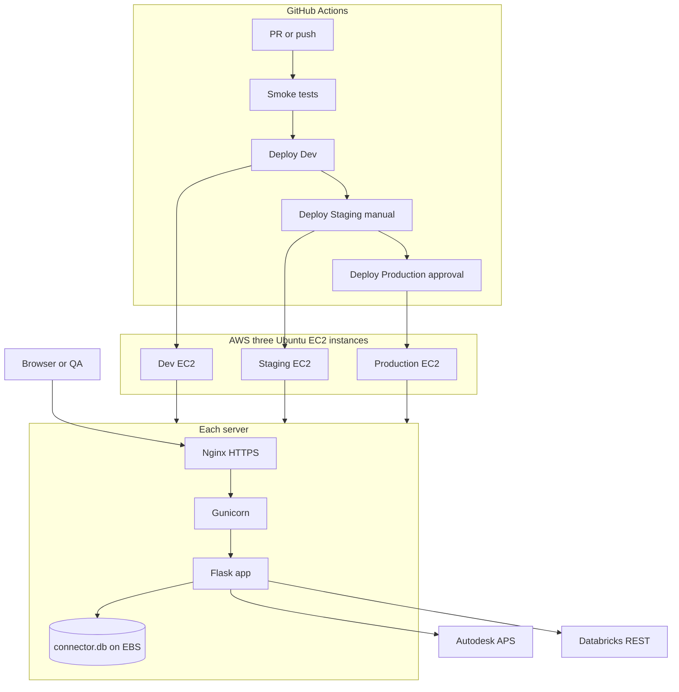

# AWS Hosting + CI/CD Guide — ACC Connector

> **Audience:** First-time web hosts. This single document covers everything you need to move the ACC Connector from `http://localhost:8000` to **AWS Ubuntu** with **Gunicorn + Nginx**, a **GitHub Actions** pipeline for **Dev / Staging / Production**, what to do **before** company AWS access arrives, team workflows, QA testing, and cost estimates.
>
> **Related docs in this repo:**
> - [TESTING.md](TESTING.md) — manual E2E test runbook (bootstrap, sync, CDC)
> - [../AWS_MIGRATION_GUIDE.md](../AWS_MIGRATION_GUIDE.md) — Databricks-on-AWS OAuth and workspace setup
> - [.env.example](.env.example) — required environment variables
> - [startup.txt](startup.txt) — production Gunicorn command
>
> **Code files in this repo:**
> - [../.github/workflows/acc-connector-ci.yml](../.github/workflows/acc-connector-ci.yml) — GitHub Actions CI/CD
> - [deploy/acc-connector.service](deploy/acc-connector.service) — systemd unit for Gunicorn
> - [deploy/nginx-acc-connector.conf](deploy/nginx-acc-connector.conf) — Nginx site template

---

## Table of Contents

1. [Overview](#1-overview)
2. [Localhost vs AWS — What Changes](#2-localhost-vs-aws--what-changes)
3. [Why Gunicorn and Nginx](#3-why-gunicorn-and-nginx)
4. [Architecture](#4-architecture)
5. [Three Environments (Dev, Staging, Production)](#5-three-environments-dev-staging-production)
6. [Phase A — Before AWS Access (Start Now)](#6-phase-a--before-aws-access-start-now)
7. [Phase B — After AWS Access (First-Time Host Walkthrough)](#7-phase-b--after-aws-access-first-time-host-walkthrough)
8. [How the Team Works Across Environments](#8-how-the-team-works-across-environments)
9. [Giving Access to Testers](#9-giving-access-to-testers)
10. [Testing Guide (Hosted)](#10-testing-guide-hosted)
11. [AWS Cost Estimates](#11-aws-cost-estimates)
12. [Appendix A — GitHub Actions Workflow](#appendix-a--github-actions-workflow)
13. [Appendix B — systemd Unit (Gunicorn)](#appendix-b--systemd-unit-gunicorn)
14. [Appendix C — Nginx Configuration](#appendix-c--nginx-configuration)
15. [Appendix D — GitHub Secrets and OAuth URIs](#appendix-d--github-secrets-and-oauth-uris)
16. [Appendix E — Optional /health Route](#appendix-e--optional-health-route)
17. [Appendix F — Troubleshooting](#appendix-f--troubleshooting)
18. [Appendix G — Security Checklist](#appendix-g--security-checklist)

---

## 1. Overview

The ACC Connector is a **Flask** web app (`app.py`) that connects **Autodesk Construction Cloud (ACC)** to **Databricks**. Today you run it locally with `python app.py` or `start.bat` on port 8000.

**Goal:** Host it on **three AWS Ubuntu EC2 servers** (one per environment), serve it over **HTTPS**, and deploy automatically with **GitHub Actions** when code is merged.

**Stack per server:**

| Layer | Software | Port |
|-------|----------|------|
| Internet | Browser / QA | — |
| Reverse proxy + SSL | **Nginx** | 443 (HTTPS), 80 (redirect) |
| App server | **Gunicorn** | 127.0.0.1:8000 (internal only) |
| Application | **Flask** (`app.py`) | — |
| State | **SQLite** (`connector.db`) | file on persistent EBS disk |

---

## 2. Localhost vs AWS — What Changes

| Topic | Localhost (`start.bat`) | AWS hosted |
|-------|-------------------------|------------|
| **URL** | `http://localhost:8000` | `https://acc-connector-dev.yourcompany.com` (per env) |
| **HTTPS** | Not required | **Required** — OAuth providers reject `http://` callbacks in production |
| **Process** | Flask dev server (`app.run`) | Gunicorn WSGI server |
| **Public access** | Only your machine | Anyone with the URL (or VPN) |
| **Secrets** | `.env` file on disk | AWS Secrets Manager + `.env` on server (not in git) |
| **Database** | `connector.db` in project folder | Same file, but on **persistent EBS** — never on ephemeral disk |
| **Uptime** | Stops when you close the terminal | Runs 24/7 via `systemd` |
| **Deploy** | `git pull` manually | GitHub Actions SSH + `rsync` |

---

## 3. Why Gunicorn and Nginx

### 3.1 Why not `python app.py` in production?

Flask's built-in server (`app.run` in `app.py`) is designed for **development only**:

- **Single-threaded** — one request at a time; sync/bootstrap blocks everyone else
- **Not hardened** — no production security hardening
- **No graceful restarts** — deploys kill in-flight requests

On AWS you run **Gunicorn** instead. It is already in [requirements.txt](requirements.txt) and configured in [startup.txt](startup.txt):

```bash
gunicorn --bind=0.0.0.0 --timeout 600 app:app
```

| Setting | Why it matters for this app |
|---------|----------------------------|
| `app:app` | Module `app.py`, Flask instance `app` |
| `--timeout 600` | Bootstrap and manual sync can run **30+ minutes**; default 30s timeout would kill them |
| `--bind 127.0.0.1:8000` | On the server, bind to localhost only — Nginx faces the internet |

### 3.2 Why Nginx?

Gunicorn speaks HTTP but does **not** handle:

| Nginx job | Benefit |
|-----------|---------|
| **HTTPS / TLS** | Free certificates via Let's Encrypt (Certbot); OAuth requires HTTPS |
| **Reverse proxy** | Users hit port 443; Nginx forwards to Gunicorn on 8000 |
| **Long timeouts** | Proxy read timeout for long sync operations |
| **Security** | Hide internal ports; optional IP allowlist or basic auth on Staging |
| **HTTP → HTTPS redirect** | Port 80 redirects to 443 |

**Request flow:**

```
Browser  →  Nginx :443 (SSL)  →  Gunicorn :8000  →  Flask app.py  →  connector.db
                ↓
         APS / Databricks APIs (outbound HTTPS)
```

---

## 4. Architecture



**Repo:** `https://github.com/cctech-labs/FormaDatabricksIntegration`  
**App directory on server:** `/opt/acc-connector`  
**SQLite path:** `acc-connector/connector.db` (relative to app root — see [backend/state_store.py](backend/state_store.py))

> **Warning:** `connector.db` stores encrypted OAuth tokens. It must live on **persistent EBS storage**. If you deploy to ephemeral instance storage, tokens and bootstrap state are lost on every redeploy.

---

## 5. Three Environments (Dev, Staging, Production)

| | **Development** | **Staging** | **Production** |
|---|-----------------|-------------|----------------|
| **Purpose** | Developers integrate and break things | QA, integrators, UAT | Real pilot / customer use |
| **Suggested URL** | `https://acc-connector-dev.yourcompany.com` | `https://acc-connector-staging.yourcompany.com` | `https://acc-connector.yourcompany.com` |
| **Git branch** | `develop` | `staging` | `main` |
| **Deploy** | Auto on merge to `develop` | Manual or merge to `staging` | Manual + approver on `main` |
| **Databricks** | Dev workspace / catalog | Staging workspace | Production workspace |
| **APS OAuth** | Dev callback URLs | Staging callback URLs | Production callback URLs |
| **Data** | Throwaway `connector.db` OK | Staging-like ACC project | Real data — **backup EBS** |
| **Who accesses** | Engineering team | QA + selected testers | Customers / pilot users |

Each environment gets its **own EC2 instance**, **own secrets**, **own `SECRET_KEY`**, and **own OAuth redirect URIs**. Never share production secrets with Dev.

---

## 6. Phase A — Before AWS Access (Start Now)

You can do all of this **today**, while waiting 1–2 days for company AWS access.

### Step A1 — Branch strategy

Create long-lived branches (if they do not exist):

```bash
git checkout main
git pull origin main
git checkout -b develop
git push -u origin develop

git checkout main
git checkout -b staging
git push -u origin staging
```

| Branch | Deploys to |
|--------|------------|
| `develop` | Dev |
| `staging` | Staging |
| `main` | Production |

Feature work: branch from `develop` → PR → merge `develop`.

### Step A2 — CI workflow (already in repo)

The workflow is committed at [`.github/workflows/acc-connector-ci.yml`](../.github/workflows/acc-connector-ci.yml).

Until AWS secrets exist, **deploy jobs are skipped** — the repo variable `ENABLE_DEPLOY` is unset (or not `true`). The **test job runs on every PR** and validates:

```bash
pip install -r acc-connector/requirements.txt
python -m py_compile acc-connector/backend/sync_service.py acc-connector/backend/acc_client.py acc-connector/app.py ...
python acc-connector/scripts/smoke_check.py
```

> `smoke_check.py` calls `init_db()` which needs `SECRET_KEY`. The workflow sets a dummy value for CI only.

**When AWS is ready:** GitHub → Settings → Secrets and variables → Actions → Variables → add `ENABLE_DEPLOY` = `true`.

### Step A3 — Baseline local E2E

Run the full manual test pass from [TESTING.md](TESTING.md) on localhost **before** cloud hosting. Record pass/fail so you can compare after first AWS deploy.

### Step A4 — Register OAuth callback URLs (APS)

At [https://aps.autodesk.com/myapps/](https://aps.autodesk.com/myapps/), add **three** callback URLs (use your real domain when known):

| Environment | `APS_REDIRECT_URI` |
|-------------|-------------------|
| Dev | `https://acc-connector-dev.yourcompany.com/callback` |
| Staging | `https://acc-connector-staging.yourcompany.com/callback` |
| Production | `https://acc-connector.yourcompany.com/callback` |

### Step A5 — Register Databricks OAuth apps

Per [AWS_MIGRATION_GUIDE.md §7](../AWS_MIGRATION_GUIDE.md) and [.env.example](.env.example):

- Create one OAuth app per environment (recommended) **or** one app with three redirect URIs
- Set `DATABRICKS_REDIRECT_URI` per env:

| Environment | `DATABRICKS_REDIRECT_URI` |
|-------------|---------------------------|
| Dev | `https://acc-connector-dev.yourcompany.com/databricks/callback` |
| Staging | `https://acc-connector-staging.yourcompany.com/databricks/callback` |
| Production | `https://acc-connector.yourcompany.com/databricks/callback` |

### Step A6 — Prepare GitHub Secrets list (empty for now)

When AWS access arrives, add secrets from [Appendix D](#appendix-d--github-secrets-and-oauth-uris). Document the list now so nothing is forgotten.

### Step A7 — What CI does before AWS

| Runs today | Waits for AWS |
|------------|---------------|
| `py_compile` on key Python files | SSH deploy to EC2 |
| `scripts/smoke_check.py` | `rsync` + `systemctl restart` |
| PR status checks green / red | Post-deploy `curl /health` |

Deploy jobs run only when **`ENABLE_DEPLOY=true`** (repo variable) **and** GitHub deploy secrets are configured.

**You are unblocked:** merge PRs with confidence that code compiles and offline invariants hold.

---

## 7. Phase B — After AWS Access (First-Time Host Walkthrough)

Repeat **B2** three times (Dev, Staging, Production) with different hostnames and secrets.

### B1 — AWS account setup (one-time)

#### B1.1 Create EC2 instances

| Setting | Value |
|---------|-------|
| AMI | Ubuntu 22.04 LTS |
| Instance type | `t3.small` (2 vCPU, 2 GB RAM) — upgrade to `t3.medium` if sync is slow |
| Storage | 30 GB gp3 EBS (root volume) |
| Count | **3** (one per environment) |
| Key pair | Create `acc-connector-deploy`; save `.pem` securely |

#### B1.2 Security groups

Create one security group (or three) with:

| Port | Source | Purpose |
|------|--------|---------|
| 22 | Your office IP / VPN CIDR | SSH (do not open to `0.0.0.0/0` in production) |
| 80 | `0.0.0.0/0` | HTTP → Certbot + redirect to HTTPS |
| 443 | `0.0.0.0/0` | HTTPS app traffic |

#### B1.3 Elastic IPs and DNS

1. Allocate 3 Elastic IPs; associate one per instance
2. In Route 53 (or company DNS), create **A records**:

| Record | Points to |
|--------|-----------|
| `acc-connector-dev.yourcompany.com` | Dev Elastic IP |
| `acc-connector-staging.yourcompany.com` | Staging Elastic IP |
| `acc-connector.yourcompany.com` | Production Elastic IP |

#### B1.4 Secrets Manager

Create three secrets (JSON or key-value), one per environment, mirroring [.env.example](.env.example):

```
acc-connector/dev
acc-connector/staging
acc-connector/production
```

Example secret keys:

```
SECRET_KEY
APS_CLIENT_ID
APS_CLIENT_SECRET
APS_REDIRECT_URI
DATABRICKS_CLIENT_ID
DATABRICKS_CLIENT_SECRET
DATABRICKS_REDIRECT_URI
```

Generate `SECRET_KEY`:

```bash
python -c "import secrets; print(secrets.token_hex(32))"
```

Use a **different** `SECRET_KEY` per environment.

#### B1.5 IAM for GitHub Actions deploy (recommended)

Use **OIDC** so GitHub Actions assumes an IAM role — no long-lived AWS access keys in secrets.

1. AWS Console → IAM → Identity providers → Add **GitHub**
2. Create role `github-acc-connector-deploy` with trust policy for your repo
3. Attach minimal policy: `secretsmanager:GetSecretValue` (if pulling secrets in CI), or skip if secrets live only on EC2
4. For SSH deploy, you only need the **SSH private key** in GitHub Secrets — no AWS API calls required for the simple rsync pattern

> **Simplest path for first deploy:** SSH key in GitHub Secrets + `rsync` over port 22. Add OIDC later if you automate EC2 provisioning.

---

### B2 — One-time Ubuntu server setup (repeat per environment)

SSH in:

```bash
ssh -i acc-connector-deploy.pem ubuntu@<ELASTIC_IP>
```

#### B2.1 System packages and Python

```bash
sudo apt update && sudo apt upgrade -y
sudo apt install -y python3.11 python3.11-venv python3-pip nginx certbot python3-certbot-nginx git rsync

# Verify
python3.11 --version
```

#### B2.2 App user and directories

```bash
sudo useradd --system --home /opt/acc-connector --shell /usr/sbin/nologin accconnector || true
sudo mkdir -p /opt/acc-connector /var/lib/acc-connector
sudo chown -R accconnector:accconnector /opt/acc-connector /var/lib/acc-connector
```

Clone the repo (first time only):

```bash
sudo -u accconnector git clone https://github.com/cctech-labs/FormaDatabricksIntegration.git /opt/acc-connector/repo
sudo -u accconnector ln -sfn /opt/acc-connector/repo/acc-connector /opt/acc-connector/app
```

Or deploy only the `acc-connector/` subfolder via CI `rsync` (preferred after initial setup).

#### B2.3 Python virtual environment

```bash
cd /opt/acc-connector/app
sudo -u accconnector python3.11 -m venv /opt/acc-connector/venv
sudo -u accconnector /opt/acc-connector/venv/bin/pip install --upgrade pip
sudo -u accconnector /opt/acc-connector/venv/bin/pip install -r requirements.txt
```

#### B2.4 Environment file (from Secrets Manager)

Create `/opt/acc-connector/app/.env` — **never commit this file**:

```bash
sudo nano /opt/acc-connector/app/.env
```

Paste values from AWS Secrets Manager for this environment. Example (Dev):

```ini
SECRET_KEY=<unique-32-byte-hex>
APS_CLIENT_ID=<dev-aps-client-id>
APS_CLIENT_SECRET=<dev-aps-secret>
APS_REDIRECT_URI=https://acc-connector-dev.yourcompany.com/callback
DATABRICKS_CLIENT_ID=<dev-dbx-oauth-client-id>
DATABRICKS_CLIENT_SECRET=<dev-dbx-oauth-secret>
DATABRICKS_REDIRECT_URI=https://acc-connector-dev.yourcompany.com/databricks/callback
```

```bash
sudo chown accconnector:accconnector /opt/acc-connector/app/.env
sudo chmod 600 /opt/acc-connector/app/.env
```

#### B2.5 Persistent SQLite database

`connector.db` defaults to the app root (`acc-connector/connector.db`). Keep it on durable storage:

```bash
# Symlink or set working directory so DB survives code deploys
sudo -u accconnector touch /var/lib/acc-connector/connector.db
sudo rm -f /opt/acc-connector/app/connector.db
sudo -u accconnector ln -s /var/lib/acc-connector/connector.db /opt/acc-connector/app/connector.db
```

#### B2.6 systemd service (Gunicorn)

Copy the unit from [deploy/acc-connector.service](deploy/acc-connector.service) to the server:

```bash
sudo cp /opt/acc-connector/app/deploy/acc-connector.service /etc/systemd/system/acc-connector.service
# or scp from your machine before first deploy
sudo nano /etc/systemd/system/acc-connector.service
# paste unit file, adjust paths if needed

sudo systemctl daemon-reload
sudo systemctl enable acc-connector
sudo systemctl start acc-connector
sudo systemctl status acc-connector
```

Verify Gunicorn is listening:

```bash
curl -s -o /dev/null -w "%{http_code}" http://127.0.0.1:8000/
# Expect 200
```

#### B2.7 Nginx + HTTPS

Copy config from [deploy/nginx-acc-connector.conf](deploy/nginx-acc-connector.conf), replacing `YOUR_DOMAIN`:

```bash
sudo cp /opt/acc-connector/app/deploy/nginx-acc-connector.conf /etc/nginx/sites-available/acc-connector
sudo nano /etc/nginx/sites-available/acc-connector   # replace YOUR_DOMAIN
sudo ln -s /etc/nginx/sites-available/acc-connector /etc/nginx/sites-enabled/
sudo rm -f /etc/nginx/sites-enabled/default
sudo nginx -t
sudo systemctl reload nginx

# Free SSL certificate
sudo certbot --nginx -d acc-connector-dev.yourcompany.com
```

Certbot auto-renews via systemd timer.

#### B2.8 Firewall (optional, ufw)

```bash
sudo ufw allow OpenSSH
sudo ufw allow 'Nginx Full'
sudo ufw enable
```

---

### B3 — Enable CI/CD deploy

1. Add GitHub Secrets from [Appendix D](#appendix-d--github-secrets-and-oauth-uris)
2. Set GitHub repo variable **`ENABLE_DEPLOY`** = `true` (Settings → Secrets and variables → Actions → Variables)
3. Create GitHub **Environments**: `development`, `staging`, `production`
   - Production: enable **Required reviewers**
4. Add deploy SSH public key to each server:

```bash
# On each EC2 instance, as ubuntu user:
echo "<github-actions-public-key>" >> ~/.ssh/authorized_keys
```

5. Merge to `develop` → watch Actions deploy Dev
6. Promote to Staging → Production per [Section 8](#8-how-the-team-works-across-environments)

**Deploy pattern (what CI does):**

```bash
rsync -avz --delete \
  --exclude '.env' \
  --exclude 'connector.db' \
  --exclude '.git' \
  --exclude '__pycache__' \
  acc-connector/ deploy-user@DEV_HOST:/opt/acc-connector/app/

ssh deploy-user@DEV_HOST \
  'cd /opt/acc-connector/app && /opt/acc-connector/venv/bin/pip install -r requirements.txt && sudo systemctl restart acc-connector'
```

---

### B4 — Post-deploy verification

| Check | Command / action | Expected |
|-------|------------------|----------|
| HTTPS home page | `curl -I https://acc-connector-dev.yourcompany.com/` | `HTTP/2 200` |
| Gunicorn running | `sudo systemctl status acc-connector` | `active (running)` |
| ACC OAuth | Browser → Sign in Autodesk | Redirect back to `/callback` without error |
| Databricks OAuth | Sign in Databricks | Redirect to `/databricks/callback` |
| Bootstrap | Run bootstrap in UI | Completes all steps — see [TESTING.md §3](TESTING.md) |
| Sync | Manual sync | Volume paths populated — see [TESTING.md §4](TESTING.md) |

---

## 8. How the Team Works Across Environments

### 8.1 Promotion flow


### 8.2 Day-to-day roles

| Role | Dev | Staging | Production |
|------|-----|---------|------------|
| **Developer** | Push features, test OAuth/bootstrap | — | — |
| **QA** | Optional spot checks | Full [TESTING.md](TESTING.md) suite | Smoke only after release |
| **Release manager** | — | Promote build to Staging | Approve Production deploy |
| **Ops / DevOps** | Maintain EC2, secrets, DNS | Same | Backups, monitoring |

### 8.3 Rules of thumb

- **Never test destructive sync experiments on Production**
- **Never copy Production `connector.db` to Dev** (contains real tokens)
- **Each environment uses its own Databricks workspace or catalog** when possible
- **Hotfix:** branch from `main` → fix → PR to `main` → deploy Production → back-merge to `staging` and `develop`

### 8.4 Rollback

1. `git revert <bad-commit>` on the target branch
2. Re-run the deploy workflow (or merge triggers auto-deploy)
3. Keep last 3 release tags: `git tag acc-connector-v1.2.3`

On server emergency rollback without git:

```bash
sudo systemctl stop acc-connector
# restore previous rsync backup if you keep /opt/acc-connector/app.backup
sudo systemctl start acc-connector
```

---

## 9. Giving Access to Testers

### 9.1 Which URL to share

| Share with testers | Do **not** share |
|--------------------|------------------|
| **Staging** URL only | Dev (unstable) |
| | Production (real customer data) |

Send: `https://acc-connector-staging.yourcompany.com`

### 9.2 Prerequisites for each tester

| Item | Notes |
|------|-------|
| Modern browser | Chrome or Edge recommended |
| ACC test account | Hub/project with Data Connector access |
| Databricks test user | Access to Staging workspace |
| Network | HTTPS outbound to APS and Databricks |

### 9.3 Optional — password-protect Staging

Add HTTP basic auth in Nginx ([Appendix C](#appendix-c--nginx-configuration)) so casual visitors cannot open the wizard.

### 9.4 Tester walkthrough (short)

1. Open Staging URL
2. **Step 1:** Sign in with Autodesk → pick hub and project
3. **Step 2:** Sign in with Databricks → run bootstrap → wait for complete
4. **Step 3:** Click Sync Now → wait for complete (may take 30+ minutes)
5. **Dashboard:** Confirm pipeline links and sync history

### 9.5 Bug reports

Ask testers to file GitHub Issues with:

- Environment URL (Staging)
- Approximate time (UTC)
- Step that failed (OAuth, bootstrap, sync)
- Screenshot of error
- From dashboard: latest sync run id if visible

### 9.6 VPN / IP allowlist

If company policy requires it, restrict Staging security group port 443 to office VPN CIDR instead of `0.0.0.0/0`. Testers must connect to VPN first.

---

## 10. Testing Guide (Hosted)

This extends [TESTING.md](TESTING.md) for cloud-hosted environments.

### 10.1 Automated — every PR (CI)

| Step | What runs |
|------|-----------|
| Compile | `python -m py_compile` on `app.py`, `backend/*.py`, pipeline notebooks |
| Smoke | `python scripts/smoke_check.py` with dummy `SECRET_KEY` |
| Gate | PR cannot merge if red |

### 10.2 Automated — after deploy

Add to deploy job (Appendix A):

```bash
curl -sf https://acc-connector-dev.yourcompany.com/ -o /dev/null
# After adding /health (Appendix E):
curl -sf https://acc-connector-dev.yourcompany.com/health
```

### 10.3 Manual — Dev (developer, 15 min)

| # | Test | Pass criteria |
|---|------|---------------|
| 1 | Load homepage | 200, wizard renders |
| 2 | ACC OAuth | Returns to `/callback`, hub list loads |
| 3 | Databricks OAuth | Returns to `/databricks/callback` |
| 4 | Bootstrap start | `/bootstrap/status` shows progress |

### 10.4 Manual — Staging (QA, full — see TESTING.md)

Run all sections from [TESTING.md](TESTING.md):

| Section | What it validates |
|---------|-------------------|
| §3 Test A | Bootstrap creates both pipelines |
| §3.5 | Typed schema ingestion |
| §4 Test B | Manual full sync + 24h gate |
| §5 Test C | CDC sync |
| §6 Test D | Overlap table reconciliation |
| §7 | Observability endpoints |

Replace `http://localhost:8000` with your Staging URL in any manual `curl` commands.

### 10.5 Manual — Production (smoke only, 5 min)

| # | Test | Safe for prod? |
|---|------|----------------|
| 1 | `curl -I https://acc-connector.yourcompany.com/` | Yes |
| 2 | ACC sign-in | Yes (uses real prod OAuth) |
| 3 | Dashboard load | Yes |
| 4 | Full manual sync | **Only with approval** |

### 10.6 Offline tests (no server needed)

From `acc-connector/`:

```powershell
python -m py_compile backend/sync_service.py backend/acc_client.py app.py notebooks/auto_cdc_pipeline.py notebooks/auto_cdc_cdc_pipeline.py
python scripts/smoke_check.py
```

---

## 11. AWS Cost Estimates

> Prices are approximate USD/month for **us-east-1** (June 2026). Your company's enterprise discount, reserved instances, and region will change totals. **Databricks costs are separate** (Marketplace subscription, SQL warehouse, pipeline compute).

### 11.1 Scenarios

| Scenario | Monthly estimate | What is included |
|----------|------------------|------------------|
| **Minimum (pilot)** | **$25 – $45** | 1× `t3.small` Dev only, 30 GB gp3 EBS, 1 Elastic IP, Route 53 hosted zone (~$0.50), 1–2 Secrets Manager secrets ($0.40/secret), minimal egress |
| **Typical (3 envs)** | **$90 – $150** | 3× `t3.small`, 3× 30 GB EBS, 3 Elastic IPs, Route 53, 3 secrets, Certbot (free), GitHub Actions within free tier (2,000 min/month private repos) |
| **Maximum (scaled)** | **$250 – $450+** | 3× `t3.medium`, optional ALB per env (+$16–22 each), daily EBS snapshots, CloudWatch alarms/logs, higher data transfer, NAT Gateway (+$32+/month if private subnets) |

### 11.2 Line-item reference

| Service | Approx. unit cost | This project |
|---------|-------------------|--------------|
| EC2 `t3.small` on-demand | ~$15/month each | 1–3 instances |
| EC2 `t3.medium` on-demand | ~$30/month each | If sync is CPU-bound |
| EBS gp3 30 GB | ~$2.40/month each | Root + DB |
| Elastic IP (attached) | Free | One per instance |
| Elastic IP (unattached) | ~$3.60/month | Avoid leaving spare IPs |
| Route 53 hosted zone | $0.50/month | One zone for all subdomains |
| Route 53 queries | $0.40/million | Low for internal QA |
| Secrets Manager | $0.40/secret/month | 3 secrets ≈ $1.20 |
| Data transfer out | $0.09/GB first 10 TB | ACC export traffic through Flask |
| ACM / Let's Encrypt SSL | **Free** | Via Certbot on Nginx |
| GitHub Actions | **Free tier** | ~2–5 min per PR |

### 11.3 Cost drivers (what makes the bill go up)

| Factor | Impact |
|--------|--------|
| **Instance size** | Larger `t3.medium` if sync CPU pegs at 100% |
| **24/7 vs business hours** | Stop Dev EC2 nights/weekends → save ~65% on Dev compute |
| **Number of environments** | Each env = another EC2 + EBS |
| **ACC export volume** | Large projects → more network egress during sync |
| **EBS snapshots** | Automated daily snapshots of `connector.db` volume |
| **ALB instead of Nginx on EC2** | +$16–22/month per load balancer (usually unnecessary at this scale) |
| **Multi-AZ / HA** | 2× instances per env for failover |
| **Databricks** | Warehouse uptime, pipeline runs, storage — often **larger than EC2** |

### 11.4 Cost optimization tips

1. Start with **Dev only** (~$25–45/month) until Staging is needed
2. Use **`t3.small`** until monitoring shows sustained high CPU
3. Schedule Dev instance stop/start (EventBridge + Lambda) outside business hours
4. Skip ALB — Nginx on EC2 is sufficient for this Flask app
5. Keep GitHub Actions jobs fast (cache pip dependencies)

### 11.5 What the company is **not** paying AWS for

| Item | Notes |
|------|-------|
| Gunicorn, Nginx, Flask | Open source |
| GitHub Actions | Free tier for typical PR volume |
| Let's Encrypt certificates | Free |
| Autodesk APS API | Free tier with rate limits |
| Databricks | Billed separately via AWS Marketplace / Databricks account |

---

## Appendix A — GitHub Actions Workflow

**Committed file:** [`.github/workflows/acc-connector-ci.yml`](../.github/workflows/acc-connector-ci.yml)

Deploy jobs require repo variable `ENABLE_DEPLOY=true`. Reference copy below (keep in sync with the committed file):

```yaml
name: ACC Connector CI/CD

on:
  push:
    branches: [develop, staging, main]
    paths:
      - 'acc-connector/**'
      - '.github/workflows/acc-connector-ci.yml'
  pull_request:
    branches: [develop, staging, main]
    paths:
      - 'acc-connector/**'

defaults:
  run:
    working-directory: acc-connector

env:
  PYTHON_VERSION: '3.11'

jobs:
  test:
    name: Smoke tests
    runs-on: ubuntu-latest
    steps:
      - uses: actions/checkout@v4

      - uses: actions/setup-python@v5
        with:
          python-version: ${{ env.PYTHON_VERSION }}
          cache: pip
          cache-dependency-path: acc-connector/requirements.txt

      - name: Install dependencies
        run: pip install -r requirements.txt

      - name: Compile check
        run: |
          python -m py_compile \
            backend/sync_service.py \
            backend/acc_client.py \
            backend/bootstrap.py \
            backend/databricks_client.py \
            backend/state_store.py \
            app.py \
            notebooks/auto_cdc_pipeline.py \
            notebooks/auto_cdc_cdc_pipeline.py

      - name: Offline smoke
        env:
          SECRET_KEY: ci-smoke-dummy-key-not-used-in-production
        run: python scripts/smoke_check.py

  deploy-dev:
    name: Deploy Development
    needs: test
    if: github.ref == 'refs/heads/develop' && github.event_name == 'push'
    runs-on: ubuntu-latest
    environment: development
    steps:
      - uses: actions/checkout@v4

      # --- BEFORE AWS ACCESS: set if: false on this job ---
      # --- AFTER AWS ACCESS: ensure secrets exist and remove the line below if you added if: false ---
      - name: Deploy to Dev EC2
        env:
          SSH_PRIVATE_KEY: ${{ secrets.SSH_PRIVATE_KEY }}
          DEPLOY_HOST: ${{ secrets.DEV_HOST }}
          DEPLOY_USER: ${{ secrets.DEPLOY_USER }}
        run: |
          mkdir -p ~/.ssh
          echo "$SSH_PRIVATE_KEY" > ~/.ssh/deploy_key
          chmod 600 ~/.ssh/deploy_key
          ssh-keyscan -H "$DEPLOY_HOST" >> ~/.ssh/known_hosts

          rsync -avz --delete \
            -e "ssh -i ~/.ssh/deploy_key" \
            --exclude '.env' \
            --exclude 'connector.db' \
            --exclude '.git' \
            --exclude '__pycache__' \
            --exclude '*.pyc' \
            ./ "$DEPLOY_USER@$DEPLOY_HOST:/opt/acc-connector/app/"

          ssh -i ~/.ssh/deploy_key "$DEPLOY_USER@$DEPLOY_HOST" \
            '/opt/acc-connector/venv/bin/pip install -r /opt/acc-connector/app/requirements.txt && sudo systemctl restart acc-connector'

          curl -sf "https://${{ secrets.DEV_PUBLIC_HOST }}/" -o /dev/null
          echo "Dev deploy OK"

  deploy-staging:
    name: Deploy Staging
    needs: test
    if: github.ref == 'refs/heads/staging' && github.event_name == 'push'
    runs-on: ubuntu-latest
    environment: staging
    steps:
      - uses: actions/checkout@v4
      - name: Deploy to Staging EC2
        env:
          SSH_PRIVATE_KEY: ${{ secrets.SSH_PRIVATE_KEY }}
          DEPLOY_HOST: ${{ secrets.STAGING_HOST }}
          DEPLOY_USER: ${{ secrets.DEPLOY_USER }}
        run: |
          mkdir -p ~/.ssh
          echo "$SSH_PRIVATE_KEY" > ~/.ssh/deploy_key
          chmod 600 ~/.ssh/deploy_key
          ssh-keyscan -H "$DEPLOY_HOST" >> ~/.ssh/known_hosts
          rsync -avz --delete \
            -e "ssh -i ~/.ssh/deploy_key" \
            --exclude '.env' --exclude 'connector.db' --exclude '.git' --exclude '__pycache__' \
            ./ "$DEPLOY_USER@$DEPLOY_HOST:/opt/acc-connector/app/"
          ssh -i ~/.ssh/deploy_key "$DEPLOY_USER@$DEPLOY_HOST" \
            '/opt/acc-connector/venv/bin/pip install -r /opt/acc-connector/app/requirements.txt && sudo systemctl restart acc-connector'
          curl -sf "https://${{ secrets.STAGING_PUBLIC_HOST }}/" -o /dev/null

  deploy-production:
    name: Deploy Production
    needs: test
    if: github.ref == 'refs/heads/main' && github.event_name == 'push'
    runs-on: ubuntu-latest
    environment: production
    steps:
      - uses: actions/checkout@v4
      - name: Deploy to Production EC2
        env:
          SSH_PRIVATE_KEY: ${{ secrets.SSH_PRIVATE_KEY }}
          DEPLOY_HOST: ${{ secrets.PROD_HOST }}
          DEPLOY_USER: ${{ secrets.DEPLOY_USER }}
        run: |
          mkdir -p ~/.ssh
          echo "$SSH_PRIVATE_KEY" > ~/.ssh/deploy_key
          chmod 600 ~/.ssh/deploy_key
          ssh-keyscan -H "$DEPLOY_HOST" >> ~/.ssh/known_hosts
          rsync -avz --delete \
            -e "ssh -i ~/.ssh/deploy_key" \
            --exclude '.env' --exclude 'connector.db' --exclude '.git' --exclude '__pycache__' \
            ./ "$DEPLOY_USER@$DEPLOY_HOST:/opt/acc-connector/app/"
          ssh -i ~/.ssh/deploy_key "$DEPLOY_USER@$DEPLOY_HOST" \
            '/opt/acc-connector/venv/bin/pip install -r /opt/acc-connector/app/requirements.txt && sudo systemctl restart acc-connector'
          curl -sf "https://${{ secrets.PROD_PUBLIC_HOST }}/" -o /dev/null
```

**Before AWS access:** Leave `ENABLE_DEPLOY` unset — only the `test` job runs.

---

## Appendix B — systemd Unit (Gunicorn)

**Repo file:** [deploy/acc-connector.service](deploy/acc-connector.service)  
**Install on server:** `/etc/systemd/system/acc-connector.service`

```ini
[Unit]
Description=ACC Connector (Gunicorn)
After=network.target

[Service]
Type=simple
User=accconnector
Group=accconnector
WorkingDirectory=/opt/acc-connector/app
EnvironmentFile=/opt/acc-connector/app/.env
ExecStart=/opt/acc-connector/venv/bin/gunicorn \
    --bind 127.0.0.1:8000 \
    --workers 2 \
    --timeout 600 \
    --access-logfile - \
    --error-logfile - \
    app:app
Restart=on-failure
RestartSec=5

[Install]
WantedBy=multi-user.target
```

Commands:

```bash
sudo systemctl daemon-reload
sudo systemctl enable acc-connector
sudo systemctl start acc-connector
sudo journalctl -u acc-connector -f   # view logs
```

> `--workers 2` is a reasonable start for `t3.small`. Increase on `t3.medium` if you see request queuing. Long sync runs hold a worker — do not set workers too high on a 2 GB instance.

---

## Appendix C — Nginx Configuration

**Repo file:** [deploy/nginx-acc-connector.conf](deploy/nginx-acc-connector.conf)  
**Install on server:** `/etc/nginx/sites-available/acc-connector`

Replace `YOUR_DOMAIN` (e.g. `acc-connector-dev.yourcompany.com`).

```nginx
# HTTP → HTTPS redirect
server {
    listen 80;
    listen [::]:80;
    server_name YOUR_DOMAIN;
    return 301 https://$host$request_uri;
}

server {
    listen 443 ssl http2;
    listen [::]:443 ssl http2;
    server_name YOUR_DOMAIN;

    # Certbot will inject ssl_certificate paths after running certbot --nginx
    # ssl_certificate /etc/letsencrypt/live/YOUR_DOMAIN/fullchain.pem;
    # ssl_certificate_key /etc/letsencrypt/live/YOUR_DOMAIN/privkey.pem;

    client_max_body_size 50m;

    # Optional: HTTP basic auth for Staging only
    # auth_basic "Staging — login required";
    # auth_basic_user_file /etc/nginx/.htpasswd;

    location / {
        proxy_pass http://127.0.0.1:8000;
        proxy_set_header Host $host;
        proxy_set_header X-Real-IP $remote_addr;
        proxy_set_header X-Forwarded-For $proxy_add_x_forwarded_for;
        proxy_set_header X-Forwarded-Proto $scheme;

        # Long sync / bootstrap — match Gunicorn --timeout 600
        proxy_connect_timeout 600s;
        proxy_send_timeout 600s;
        proxy_read_timeout 600s;
    }
}
```

Create basic auth user (Staging optional):

```bash
sudo apt install apache2-utils
sudo htpasswd -c /etc/nginx/.htpasswd qa_tester
```

Enable site:

```bash
sudo ln -s /etc/nginx/sites-available/acc-connector /etc/nginx/sites-enabled/
sudo nginx -t && sudo systemctl reload nginx
sudo certbot --nginx -d YOUR_DOMAIN
```

---

## Appendix D — GitHub Secrets and OAuth URIs

### GitHub repository secrets

| Secret / variable | Example | Used by |
|-------------------|---------|---------|
| `ENABLE_DEPLOY` | `true` (repo **variable**, not secret) | All deploy jobs — unset = deploy skipped |
| `SSH_PRIVATE_KEY` | Contents of `acc-connector-deploy.pem` | All deploy jobs |
| `DEPLOY_USER` | `ubuntu` | SSH user on EC2 |
| `DEV_HOST` | `3.85.1.2` (Elastic IP) | Dev rsync/ssh |
| `DEV_PUBLIC_HOST` | `acc-connector-dev.yourcompany.com` | Post-deploy curl |
| `STAGING_HOST` | Elastic IP | Staging deploy |
| `STAGING_PUBLIC_HOST` | `acc-connector-staging.yourcompany.com` | Post-deploy curl |
| `PROD_HOST` | Elastic IP | Production deploy |
| `PROD_PUBLIC_HOST` | `acc-connector.yourcompany.com` | Post-deploy curl |

Application secrets (`SECRET_KEY`, APS, Databricks) live in **AWS Secrets Manager** and on each server's `.env` — not in GitHub unless your team explicitly chooses that pattern.

### OAuth redirect URI registration

| Environment | APS callback | Databricks callback |
|-------------|--------------|---------------------|
| Dev | `https://acc-connector-dev.yourcompany.com/callback` | `https://acc-connector-dev.yourcompany.com/databricks/callback` |
| Staging | `https://acc-connector-staging.yourcompany.com/callback` | `https://acc-connector-staging.yourcompany.com/databricks/callback` |
| Production | `https://acc-connector.yourcompany.com/callback` | `https://acc-connector.yourcompany.com/databricks/callback` |

These must match `.env` on each server exactly (including `https` and no trailing slash).

---

## Appendix E — `/health` Route

Implemented in [`app.py`](app.py):

```python
@app.route('/health')
def health():
    return jsonify({'status': 'ok'}), 200
```

Post-deploy smoke check (used by CI):

```bash
curl -sf https://YOUR_DOMAIN/health
```

---

## Appendix F — Troubleshooting

| Symptom | Likely cause | Fix |
|---------|--------------|-----|
| **502 Bad Gateway** | Gunicorn not running | `sudo systemctl status acc-connector`; check `journalctl -u acc-connector` |
| **502 after long sync** | Nginx timeout too low | Set `proxy_read_timeout 600s` (Appendix C) |
| **OAuth redirect mismatch** | URI not registered or `http` vs `https` | Match APS/Databricks app settings to `.env` exactly |
| **`SECRET_KEY must be set`** | Missing `.env` on server | Create `/opt/acc-connector/app/.env`; restart service |
| **SQLite permission denied** | Wrong owner on `connector.db` | `sudo chown accconnector:accconnector /var/lib/acc-connector/connector.db` |
| **Tokens lost after deploy** | DB on ephemeral disk | Symlink to `/var/lib/acc-connector/` (B2.5) |
| **Worker timeout** | Gunicorn default 30s | Ensure `--timeout 600` in systemd unit |
| **Certbot fails** | DNS not pointing to server | Verify A record → Elastic IP before certbot |
| **CI smoke fails on `init_db`** | Missing `SECRET_KEY` in CI | Set dummy env in workflow (Appendix A) |
| **Sync stuck** | Databricks pipeline failed | Check Databricks UI — see [TESTING.md §9](TESTING.md) |
| **SSH deploy fails** | Security group or key | Open port 22 from GitHub Actions IPs or use self-hosted runner |

**View logs:**

```bash
sudo journalctl -u acc-connector -n 100 --no-pager
sudo tail -f /var/log/nginx/error.log
```

---

## Appendix G — Security Checklist

- [ ] `.env` is in `.gitignore` — never committed
- [ ] Unique `SECRET_KEY` per environment (rotating invalidates encrypted tokens in DB)
- [ ] SSH port 22 restricted to office IP or VPN — not open worldwide
- [ ] `chmod 600` on `.env` and deploy private key
- [ ] HTTPS only in production OAuth redirect URIs
- [ ] Staging behind basic auth or VPN if exposing customer-like data
- [ ] EBS snapshots enabled for Production `connector.db` path
- [ ] Remove default Ubuntu passwords / use key-only SSH
- [ ] `accconnector` system user runs Gunicorn — not root
- [ ] GitHub Production environment has required reviewers
- [ ] No AWS access keys in workflow YAML — use SSH key or OIDC

---

## Quick Start Checklist

**Today (no AWS):**

- [ ] Create `develop` and `staging` branches
- [ ] CI workflow is in [`.github/workflows/acc-connector-ci.yml`](../.github/workflows/acc-connector-ci.yml) — `ENABLE_DEPLOY` unset = tests only
- [ ] Register OAuth callback URLs when domain is known
- [ ] Run [TESTING.md](TESTING.md) locally

**When AWS access arrives:**

- [ ] Launch 3× Ubuntu EC2 + Elastic IPs + DNS
- [ ] Complete B2 server setup on each instance (use [deploy/](deploy/) configs)
- [ ] Store secrets in Secrets Manager; create `.env` per server
- [ ] Enable HTTPS with Certbot
- [ ] Add GitHub Secrets; set `ENABLE_DEPLOY=true`
- [ ] Deploy Dev → QA on Staging → approve Production

---

*Guide version: June 2026 — ACC Connector Flask app, Gunicorn per [startup.txt](startup.txt), SQLite per [state_store.py](backend/state_store.py).*
