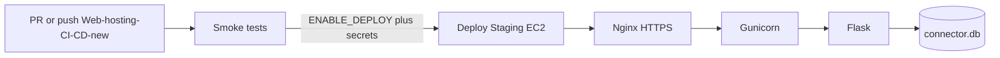

# Staging-Only AWS Hosting Guide — ACC Connector

> **Audience:** You are hosting **one** Staging environment on AWS for the ACC Connector POC. Dev and Production are **out of scope for now**.
>
> **Start here if you are new to AWS hosting:** [DEMO_HOSTING_GUIDE.md](DEMO_HOSTING_GUIDE.md) — free-tier t2.micro demo (Elastic IP, Nginx, Gunicorn, YAML deploy) before this guide.
>
> **Related docs:**
> - [AWS_HOSTING_AND_CICD_GUIDE.md](AWS_HOSTING_AND_CICD_GUIDE.md) — full three-environment guide, troubleshooting appendices
> - [TESTING.md](TESTING.md) — manual E2E test runbook
> - [.env.example](.env.example) — required environment variables
> - [deploy/acc-connector.service](deploy/acc-connector.service) — systemd unit for Gunicorn
> - [deploy/nginx-acc-connector.conf](deploy/nginx-acc-connector.conf) — Nginx site template
> - [`.github/workflows/acc-connector-ci.yml`](../.github/workflows/acc-connector-ci.yml) — CI/CD workflow

---

## Table of Contents

1. [Scope and current state](#1-scope-and-current-state)
2. [`.env` vs `connector.db` — multi-user on one server](#2-env-vs-connectordb--multi-user-on-one-server)
3. [Register your Staging domain](#3-register-your-staging-domain)
4. [AWS setup — one t3.small instance](#4-aws-setup--one-t3small-instance)
5. [OAuth registration — Staging URLs only](#5-oauth-registration--staging-urls-only)
6. [One-time Ubuntu server setup](#6-one-time-ubuntu-server-setup)
7. [Enable CI/CD deploy](#7-enable-cicd-deploy)
8. [First deploy and verification](#8-first-deploy-and-verification)
9. [Cost estimate](#9-cost-estimate)
10. [When you add Dev / Production later](#10-when-you-add-dev--production-later)

---

## 1. Scope and current state

### In scope

| Item | Value |
|------|-------|
| EC2 instances | **1** (Staging only) |
| Instance type | **t3.small** (2 vCPU, 2 GB RAM) |
| OS | Ubuntu 22.04 LTS |
| Storage | 30 GB gp3 EBS |
| Stack | Nginx (HTTPS) → Gunicorn → Flask → SQLite |
| Deploy branch | `Web-hosting-CI-CD-new` |

### Out of scope (for now)

- Dev EC2, Production EC2
- Separate OAuth apps for Dev/Prod
- `DEV_*` / `PROD_*` GitHub secrets

### Current CI state

The workflow at [`.github/workflows/acc-connector-ci.yml`](../.github/workflows/acc-connector-ci.yml) already runs **smoke tests** on every push/PR to `Web-hosting-CI-CD-new`:

- `python -m py_compile` on key backend files
- `python scripts/smoke_check.py` (with a dummy `SECRET_KEY` in CI only)

**Deploy is not running yet.** The `deploy-staging` job is skipped until you set `ENABLE_DEPLOY=true` and configure GitHub secrets (see [Section 7](#7-enable-cicd-deploy)).



---

## 2. `.env` vs `connector.db` — multi-user on one server

**Testers do not each get a `.env` file.** There is one server config and one shared database file with per-user rows.

### Two layers

| Layer | What it holds | Who shares it | Where it lives |
|-------|---------------|---------------|----------------|
| **Server `.env`** | `SECRET_KEY`, APS OAuth app credentials, Databricks OAuth app credentials, redirect URIs | **Everyone** on this Staging server | `/opt/acc-connector/app/.env` |
| **`connector.db`** | Encrypted ACC/Databricks tokens, hub/project selection, bootstrap state, sync history | **One partition per APS user** (`user_id`) | `/var/lib/acc-connector/connector.db` (symlinked into app dir) |

### What happens when a tester signs in

1. Tester opens `https://acc-connector-staging.yourcompany.com`.
2. Flask sets a session cookie signed with the server `SECRET_KEY`.
3. **Sign in with Autodesk** → APS returns a `user_id` → stored in the Flask session → ACC tokens saved in `connector.db` under that `user_id`.
4. **Sign in with Databricks** → tokens saved under the same `user_id`.
5. Bootstrap and sync state are isolated per `user_id`. Two testers on the same Staging server do not overwrite each other.

### Rules

| Rule | Why |
|------|-----|
| Create **one** Staging `.env` from [.env.example](.env.example) | OAuth apps are per-environment, not per-user |
| Use **HTTPS** redirect URIs in `.env` | OAuth providers reject `http://` callbacks on public hosts |
| **Never** commit `.env` to git | Contains secrets |
| **Never** copy Production secrets into Staging | Separate environments, separate OAuth apps |
| **Do not rotate `SECRET_KEY` casually** | It derives the Fernet encryption key in [backend/state_store.py](backend/state_store.py); changing it invalidates all encrypted tokens in `connector.db` |
| CI deploy **never overwrites** `.env` or `connector.db` | `rsync --exclude '.env' --exclude 'connector.db'` in the workflow |

### Optional: AWS Secrets Manager

Store Staging secrets in AWS Secrets Manager as `acc-connector/staging` (JSON or key-value). On first server setup, copy values into `/opt/acc-connector/app/.env` manually. The connector reads `.env` at runtime — it does not pull from Secrets Manager automatically.

Generate a `SECRET_KEY`:

```bash
python -c "import secrets; print(secrets.token_hex(32))"
```

Example Staging `.env`:

```ini
SECRET_KEY=<unique-32-byte-hex>
APS_CLIENT_ID=<staging-aps-client-id>
APS_CLIENT_SECRET=<staging-aps-secret>
APS_REDIRECT_URI=https://acc-connector-staging.yourcompany.com/callback
DATABRICKS_CLIENT_ID=<staging-dbx-oauth-client-id>
DATABRICKS_CLIENT_SECRET=<staging-dbx-oauth-secret>
DATABRICKS_REDIRECT_URI=https://acc-connector-staging.yourcompany.com/databricks/callback
```

```bash
sudo chown accconnector:accconnector /opt/acc-connector/app/.env
sudo chmod 600 /opt/acc-connector/app/.env
```

---

## 3. Register your Staging domain

Pick one hostname for Staging, e.g. `acc-connector-staging.yourcompany.com`. You need HTTPS before OAuth will work.

### Path A — Company subdomain (most common)

1. Launch the EC2 instance (see [Section 4](#4-aws-setup--one-t3small-instance)).
2. Allocate **one Elastic IP** and associate it with the instance.
3. Create a DNS **A record** pointing your subdomain to the Elastic IP:
   - **Route 53:** Hosted zone → Create record → A → Elastic IP
   - **Company IT DNS:** Ask IT to add the A record to your corporate DNS
4. Wait for propagation (minutes to a few hours). Verify:

```bash
nslookup acc-connector-staging.yourcompany.com
# or: dig acc-connector-staging.yourcompany.com +short
```

5. Use this exact hostname everywhere in the checklist below.

### Path B — New domain in AWS Route 53

1. Route 53 → **Register domain** (or transfer an existing domain).
2. A hosted zone is created automatically for the new domain.
3. Launch EC2, allocate Elastic IP, create an **A record** (subdomain or apex) → Elastic IP.
4. Continue with the same Nginx, Certbot, `.env`, and OAuth steps as Path A.

### Hostname checklist — must match exactly

Use the **same** hostname in every row. `https` only, **no trailing slash**.

| Where | Value |
|-------|-------|
| Route 53 / IT DNS A record | `acc-connector-staging.yourcompany.com` → Elastic IP |
| Nginx `server_name` | `acc-connector-staging.yourcompany.com` |
| Certbot `-d` flag | `acc-connector-staging.yourcompany.com` |
| `.env` → `APS_REDIRECT_URI` | `https://acc-connector-staging.yourcompany.com/callback` |
| `.env` → `DATABRICKS_REDIRECT_URI` | `https://acc-connector-staging.yourcompany.com/databricks/callback` |
| APS app callback URL | `https://acc-connector-staging.yourcompany.com/callback` |
| Databricks OAuth app redirect URI | `https://acc-connector-staging.yourcompany.com/databricks/callback` |
| GitHub secret `STAGING_PUBLIC_HOST` | `acc-connector-staging.yourcompany.com` |

---

## 4. AWS setup — one t3.small instance

### EC2 launch settings

| Setting | Value |
|---------|-------|
| AMI | Ubuntu 22.04 LTS |
| Instance type | **t3.small** (2 vCPU, 2 GB RAM) |
| Storage | 30 GB gp3 EBS (root volume) |
| Count | **1** |
| Key pair | Create `acc-connector-deploy`; save `.pem` securely |

### Security group

| Port | Source | Purpose |
|------|--------|---------|
| 22 | Your office IP / VPN CIDR | SSH (avoid `0.0.0.0/0` if possible) |
| 80 | `0.0.0.0/0` | HTTP — Certbot + redirect to HTTPS |
| 443 | `0.0.0.0/0` | HTTPS app traffic |

### Elastic IP

1. EC2 → Elastic IPs → Allocate
2. Associate with the Staging instance
3. Use this IP in your DNS A record ([Section 3](#3-register-your-staging-domain))

> **Warning:** An unattached Elastic IP incurs a small monthly charge. Always attach it to the running instance.

### Optional: Secrets Manager

Create one secret `acc-connector/staging` with keys matching [.env.example](.env.example). Copy into `.env` on the server during setup.

---

## 5. OAuth registration — Staging URLs only

Register callbacks **only** for your Staging hostname. Do not register Dev or Production URLs yet.

### Autodesk Platform Services (APS)

At [https://aps.autodesk.com/myapps/](https://aps.autodesk.com/myapps/):

| Setting | Value |
|---------|-------|
| Callback URL | `https://acc-connector-staging.yourcompany.com/callback` |

Copy `APS_CLIENT_ID` and `APS_CLIENT_SECRET` into Staging `.env`.

### Databricks OAuth app

In your **Staging** Databricks workspace: Settings → Developer → OAuth Applications.

| Setting | Value |
|---------|-------|
| Redirect URI | `https://acc-connector-staging.yourcompany.com/databricks/callback` |

Copy `DATABRICKS_CLIENT_ID` and `DATABRICKS_CLIENT_SECRET` into Staging `.env`.

---

## 6. One-time Ubuntu server setup

SSH in:

```bash
ssh -i acc-connector-deploy.pem ubuntu@<ELASTIC_IP>
```

### 6.1 System packages and Python

```bash
sudo apt update && sudo apt upgrade -y
sudo apt install -y python3.11 python3.11-venv python3-pip nginx certbot python3-certbot-nginx git rsync

python3.11 --version
```

### 6.2 App user and directories

```bash
sudo useradd --system --home /opt/acc-connector --shell /usr/sbin/nologin accconnector || true
sudo mkdir -p /opt/acc-connector /var/lib/acc-connector
sudo chown -R accconnector:accconnector /opt/acc-connector /var/lib/acc-connector
```

First-time code on server (CI `rsync` replaces this after deploy is enabled):

```bash
sudo -u accconnector git clone https://github.com/cctech-labs/FormaDatabricksIntegration.git /opt/acc-connector/repo
sudo -u accconnector ln -sfn /opt/acc-connector/repo/acc-connector /opt/acc-connector/app
```

### 6.3 Python virtual environment

```bash
cd /opt/acc-connector/app
sudo -u accconnector python3.11 -m venv /opt/acc-connector/venv
sudo -u accconnector /opt/acc-connector/venv/bin/pip install --upgrade pip
sudo -u accconnector /opt/acc-connector/venv/bin/pip install -r requirements.txt
```

### 6.4 Server `.env`

Create `/opt/acc-connector/app/.env` per [Section 2](#2-env-vs-connectordb--multi-user-on-one-server).

### 6.5 Persistent `connector.db`

`connector.db` stores encrypted tokens and per-user state. It must survive code deploys.

```bash
sudo -u accconnector touch /var/lib/acc-connector/connector.db
sudo rm -f /opt/acc-connector/app/connector.db
sudo -u accconnector ln -s /var/lib/acc-connector/connector.db /opt/acc-connector/app/connector.db
sudo chown accconnector:accconnector /var/lib/acc-connector/connector.db
```

Why: GitHub Actions `rsync` updates `/opt/acc-connector/app/` but excludes `connector.db`. The real file lives in `/var/lib/acc-connector/` so deploys never wipe tester tokens or bootstrap state.

### 6.6 systemd service (Gunicorn)

```bash
sudo cp /opt/acc-connector/app/deploy/acc-connector.service /etc/systemd/system/acc-connector.service
sudo systemctl daemon-reload
sudo systemctl enable acc-connector
sudo systemctl start acc-connector
sudo systemctl status acc-connector
```

Verify:

```bash
curl -s -o /dev/null -w "%{http_code}" http://127.0.0.1:8000/
# Expect 200
```

The unit uses `--workers 2` and `--timeout 600` — appropriate for t3.small and long sync runs.

### 6.7 Nginx + HTTPS

Replace `YOUR_DOMAIN` in [deploy/nginx-acc-connector.conf](deploy/nginx-acc-connector.conf):

```bash
sudo cp /opt/acc-connector/app/deploy/nginx-acc-connector.conf /etc/nginx/sites-available/acc-connector
sudo nano /etc/nginx/sites-available/acc-connector   # replace YOUR_DOMAIN
sudo ln -s /etc/nginx/sites-available/acc-connector /etc/nginx/sites-enabled/
sudo rm -f /etc/nginx/sites-enabled/default
sudo nginx -t
sudo systemctl reload nginx

sudo certbot --nginx -d acc-connector-staging.yourcompany.com
```

Optional — password-protect Staging (uncomment `auth_basic` lines in the Nginx config):

```bash
sudo apt install apache2-utils
sudo htpasswd -c /etc/nginx/.htpasswd qa_tester
```

### 6.8 Firewall (optional)

```bash
sudo ufw allow OpenSSH
sudo ufw allow 'Nginx Full'
sudo ufw enable
```

### 6.9 GitHub Actions SSH access

Add the deploy public key to the server:

```bash
# On EC2, as ubuntu user:
echo "<github-actions-public-key>" >> ~/.ssh/authorized_keys
```

---

## 7. Enable CI/CD deploy

### Step 1 — Update workflow branch for Staging deploy

The workflow currently deploys Staging only on push to `staging`. You deploy from `Web-hosting-CI-CD-new`. Edit [`.github/workflows/acc-connector-ci.yml`](../.github/workflows/acc-connector-ci.yml) — in the `deploy-staging` job, change:

```yaml
github.ref == 'refs/heads/staging'
```

to:

```yaml
github.ref == 'refs/heads/Web-hosting-CI-CD-new'
```

Commit and push this change before enabling deploy.

> `deploy-dev` and `deploy-production` jobs can stay in the YAML. They only run on `develop` / `main` pushes and will not trigger from your branch.

### Step 2 — GitHub repository variable

GitHub → Settings → Secrets and variables → Actions → **Variables**:

| Name | Value |
|------|-------|
| `ENABLE_DEPLOY` | `true` |

### Step 3 — GitHub secrets (Staging only)

GitHub → Settings → Secrets and variables → Actions → **Secrets**:

| Secret | Example | Used for |
|--------|---------|----------|
| `SSH_PRIVATE_KEY` | Contents of `acc-connector-deploy.pem` | SSH/rsync to EC2 |
| `DEPLOY_USER` | `ubuntu` | SSH user on EC2 |
| `STAGING_HOST` | `3.85.1.2` (Elastic IP) | SSH target |
| `STAGING_PUBLIC_HOST` | `acc-connector-staging.yourcompany.com` | Post-deploy `curl /health` |

**Not needed now:** `DEV_HOST`, `DEV_PUBLIC_HOST`, `PROD_HOST`, `PROD_PUBLIC_HOST`.

### Step 4 — GitHub Environment

Create environment **`staging`** (Settings → Environments). No required reviewers needed for a POC.

### What deploy does

On push to `Web-hosting-CI-CD-new` (after tests pass):

```bash
rsync -avz --delete \
  --exclude '.env' \
  --exclude 'connector.db' \
  ...
  ./ deploy-user@STAGING_HOST:/opt/acc-connector/app/

ssh ... 'pip install -r requirements.txt && sudo systemctl restart acc-connector'
curl -sf https://STAGING_PUBLIC_HOST/health
```

`.env` and `connector.db` on the server are never touched by deploy.

---

## 8. First deploy and verification

### Ordered checklist

- [ ] DNS A record points to Elastic IP
- [ ] EC2 t3.small running, security group open on 80/443
- [ ] Server setup complete (Section 6): venv, `.env`, `connector.db` symlink, systemd, Nginx, Certbot
- [ ] APS and Databricks OAuth apps registered with Staging URLs
- [ ] Workflow branch fix applied (Section 7)
- [ ] `ENABLE_DEPLOY=true` and Staging secrets configured
- [ ] Push to `Web-hosting-CI-CD-new` → Actions green for test + deploy-staging

### Quick verification

| Check | Command / action | Expected |
|-------|------------------|----------|
| HTTPS | `curl -I https://acc-connector-staging.yourcompany.com/` | `HTTP/2 200` |
| Health | `curl -sf https://acc-connector-staging.yourcompany.com/health` | `{"status":"ok"}` |
| Gunicorn | `sudo systemctl status acc-connector` | `active (running)` |
| ACC OAuth | Browser → Sign in Autodesk | Redirect to `/callback` without error |
| Databricks OAuth | Sign in Databricks | Redirect to `/databricks/callback` |
| Multi-user | Two testers sign in with different ACC accounts | Each sees own hub/project state |

### Full QA

Run [TESTING.md](TESTING.md) against the Staging URL (replace `http://localhost:8000` with your Staging hostname).

### Troubleshooting

See [AWS_HOSTING_AND_CICD_GUIDE.md — Appendix F](AWS_HOSTING_AND_CICD_GUIDE.md#appendix-f--troubleshooting) for 502 errors, OAuth mismatches, SQLite permissions, and worker timeouts.

**View logs:**

```bash
sudo journalctl -u acc-connector -n 100 --no-pager
sudo tail -f /var/log/nginx/error.log
```

---

## 9. Cost estimate

Approximate USD/month for **us-east-1** (June 2026). Enterprise discounts and region vary.

| Item | Approx. cost |
|------|--------------|
| 1× EC2 `t3.small` on-demand | ~$15/month |
| 30 GB gp3 EBS | ~$2.40/month |
| 1 Elastic IP (attached) | Free |
| Route 53 hosted zone (if new domain) | ~$0.50/month |
| 1 Secrets Manager secret | ~$0.40/month |
| **Total** | **~$18–25/month** |

Databricks compute (warehouse, pipelines) is billed separately and is often larger than EC2.

**Save money:** Stop the EC2 instance nights/weekends if testers are not using Staging (~65% savings on compute).

---

## 10. When you add Dev / Production later

| Step | Action |
|------|--------|
| Infrastructure | Launch additional EC2 instances (or reuse the pattern from this guide) |
| Branches | Use `develop` → Dev, `staging` → Staging, `main` → Production |
| Secrets | Add `DEV_*` and `PROD_*` GitHub secrets; separate `.env` per server |
| OAuth | Register separate callback URLs per environment |
| Database | Separate `connector.db` per environment — never copy Production DB to Staging |
| Full guide | [AWS_HOSTING_AND_CICD_GUIDE.md](AWS_HOSTING_AND_CICD_GUIDE.md) |

---

## Quick Start Checklist

**Today (CI already running):**

- [x] Smoke tests pass on `Web-hosting-CI-CD-new`
- [ ] Pick Staging hostname and register DNS
- [ ] Register APS + Databricks OAuth callbacks for Staging URL
- [ ] Launch 1× t3.small EC2 + Elastic IP

**When AWS server is ready:**

- [ ] Complete [Section 6](#6-one-time-ubuntu-server-setup)
- [ ] Apply workflow branch fix + GitHub secrets ([Section 7](#7-enable-cicd-deploy))
- [ ] Push → deploy → verify OAuth and bootstrap
- [ ] Share Staging URL with QA; run [TESTING.md](TESTING.md)

---

*Guide version: June 2026 — Staging-only, t3.small, branch `Web-hosting-CI-CD-new`.*
