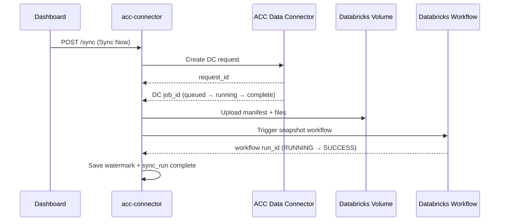

# Sync Log Guide — ACC, Databricks, and Job IDs

This document explains a **real sync run** from the connector logs (terminal session
`py app.py`, 2026-06-30). It is written for anyone who sees lines like
`DC job queued`, `workflow run_id`, or `Sync run 1 complete` and wants to know
**what each ID means**, **which system owns it**, and **what the connector remembers**
for the next run.

---

## 1. The one-paragraph summary

A manual **snapshot sync** does three big things in order:

1. **ACC Data Connector (Autodesk)** — asks Autodesk to export project data, waits for
   their export **job** to finish, then downloads 263 CSV files.
2. **Databricks Volume** — lands those files under a timestamped folder and writes a
   `_manifest.json`.
3. **Databricks workflow** — triggers a serverless job that runs the bronze **pipeline**
   to ingest the manifest into Unity Catalog tables.

Each step has its **own IDs**. They are **not interchangeable**. The connector saves
the long-lived Databricks resource IDs at **bootstrap** and the **watermark** after a
successful sync so the **next** run can do an incremental export instead of a full one.

---

## 2. Two different worlds: ACC vs Databricks

| System | What it does in sync | Example ID from the log | Where to look it up |
|--------|----------------------|-------------------------|---------------------|
| **ACC / APS Data Connector** | Exports construction data from your ACC project | `858629a5-3b79-4aa1-8b63-c3bbe5ef5c19` (DC **job**) | ACC Data Connector API / APS developer portal |
| **acc-connector (Flask app)** | Orchestrates the flow, stores state in SQLite | `Sync run 1` (internal **run_id**) | Dashboard, `GET /sync/status`, local DB |
| **Databricks** | Stores files in Volume, runs pipelines & workflows | `337912993524533` (workflow **run_id**) | Databricks UI → Workflows → Job runs |



---

## 3. Every ID type (what to remember)

### 3.1 Saved at bootstrap (reused on every sync)

These are created once during **bootstrap** and stored in SQLite `bootstrap_state`.
You do **not** need to copy them from every log line — they stay the same until you
re-run bootstrap.

| Name in code | Log example | Purpose |
|--------------|-------------|---------|
| `bronze_pipeline_id` | `75d8b37b-4b41-4da8-bffc-097e07dfdf36` | Lakeflow pipeline **CCTech_ACCConnector_Bronze** (snapshot ingest) |
| `cdc_pipeline_id` | `866330db-3fba-4ec1-94ba-447bdf7c4caa` | Pipeline **CCTech_ACCConnector_Bronze_CDC** (daily changes) |
| `snapshot_workflow_id` | `1065621841693041` | Databricks Job **CCTech_ACCConnector_Snapshot_Sync** |
| `cdc_workflow_id` | `867623795987386` | Databricks Job **CCTech_ACCConnector_CDC_Sync** |
| `volume_path` | `/Volumes/acc_connector_2_pk_test/bronze/acc_bronze_volume` | Unity Catalog volume root |
| `catalog_name` | `acc_connector_2_pk_test` | UC catalog for bronze tables |

Log lines:

```text
Pipeline "CCTech_ACCConnector_Bronze" updated (ID: 75d8b37b-4b41-4da8-bffc-097e07dfdf36)
Sync workflow "CCTech_ACCConnector_Snapshot_Sync" created (serverless, ID: 1065621841693041)
Workflows ready — snapshot: 1065621841693041, CDC: 867623795987386
```

**Note:** Bootstrap may **delete and recreate** old workflow jobs when you re-run it
(e.g. `Job deleted (ID: 1035449539778477)` then a new ID is created). Always trust the
latest bootstrap log or `GET /state`, not an old screenshot.

---

### 3.2 ACC Data Connector IDs (new every sync)

| Step | Log pattern | Example | Remember? |
|------|-------------|---------|-----------|
| DC **request** | `DC request created:` | `fbfd7c8e-7924-4a8c-bfdf-a9c60ad77147` | No — one-time export order |
| DC **job** | `DC job queued:` / `status: complete` | `858629a5-3b79-4aa1-8b63-c3bbe5ef5c19` | No — only for this export |

Timeline from the sample log:

| Time (approx) | Event |
|---------------|-------|
| 19:14:16 | Sync starts; **no prior watermark** → full export |
| 19:14:17 | DC request created |
| 19:14:18 – 19:16:10 | Waiting for DC job to appear (~97 s) |
| 19:16:10 | DC job queued |
| 19:17:12 | Status: **running** |
| 19:21:48 | Status: **complete** (~338 s total) |
| 19:21:49 | **263 files** available |

Use the DC job ID only for **debugging with Autodesk** or tracing that one export.
The connector does not store it after the run finishes.

---

### 3.3 Connector internal sync run (SQLite)

| Field | Log | Example |
|-------|-----|---------|
| `run_id` | `Sync run 1 started` / `Sync run 1 complete` | `1` |
| States | `dc_job_submitted` → `uploading_files` → `workflow_running` → `complete` | (see `/sync/status`) |
| `bronze_run_id` | Stored when workflow is triggered | `337912993524533` (Databricks workflow **run**) |

This is the row in table `sync_runs`. The dashboard “last sync” uses it.

---

### 3.4 Databricks workflow run (per sync)

| Log | Meaning |
|-----|---------|
| `Triggering sync workflow snapshot (ID: 1065621841693041)...` | Uses **saved** workflow job from bootstrap |
| `Sync workflow 1065621841693041 triggered → run_id 337912993524533` | **New** run instance each sync |
| `workflow run_id 337912993524533: life_cycle=RUNNING` | Polling Databricks until done |
| `life_cycle=TERMINATED result=SUCCESS` | Ingest finished OK |

- **Job ID** (`1065621841693041`) = the workflow definition (stable).
- **Run ID** (`337912993524533`) = one execution of that job (changes every trigger).

In this run the workflow ran about **32 minutes** (19:25:08 → 19:57:50). Large
projects can take longer; the connector polls up to 90 minutes by default.

---

### 3.5 Watermark (remembered for the *next* ACC export)

| Log | Meaning |
|-----|---------|
| `DC full export — no prior watermark for data_connector` | First sync for this project — full snapshot |
| *(after success, not always logged)* | `set_watermark` saves UTC timestamp in SQLite |

On the **next** snapshot sync you would see:

```text
DC incremental from watermark: 2026-06-30T14:27:50.000Z
```

That tells ACC to export only data changed since the last successful run. CDC mode uses
a separate key (`data_connector_cdc`).

---

## 4. Phase-by-phase walkthrough (sample log)

### Phase A — Bootstrap (steps 7–11)

Already completed before sync in this session:

- Volume, meta tables, `pk_config.json`, notebooks uploaded
- Bronze + CDC pipelines updated
- Snapshot + CDC sync workflows created
- Config saved → `Bootstrap complete!`

### Phase B — User clicks Sync Now

```text
POST /sync HTTP/1.1" 200
Sync run 1 started (mode=snapshot trigger=manual) user=SUF2GK4HNBF8LTVS project=2583e697-0117-415b-bdda-26b4cee09d23
```

- **mode=snapshot** — full Data Connector export path (not daily CDC).
- **trigger=manual** — user clicked the button (auth = **U2M**, user’s Databricks token).
- **project** — ACC project UUID (bare form, no `b.` prefix in logs).

### Phase C — ACC export

```text
DC create_request payload: {"projectId": "2583e697-...", "scheduleInterval": "ONE_TIME", "serviceGroups": [...]}
DC request created: fbfd7c8e-7924-4a8c-bfdf-a9c60ad77147
...
DC job 858629a5-3b79-4aa1-8b63-c3bbe5ef5c19 status: complete (338s elapsed)
Data Connector job complete: 858629a5-3b79-4aa1-8b63-c3bbe5ef5c19
DC job ...: 263 files available
```

### Phase D — Land files in Volume

```text
Manifest written: .../data_connector/2583e697-.../2026-06-30T13-51-48/_manifest.json (263 files)
Phase 2 complete: 263 files at /Volumes/acc_connector_2_pk_test/bronze/acc_bronze_volume/data_connector/...
```

Folder layout:

```text
/Volumes/<catalog>/bronze/acc_bronze_volume/
  data_connector/
    <project_id>/
      <timestamp>/          ← one folder per sync
        _manifest.json
        ... CSV files ...
```

### Phase E — Databricks ingest

```text
Pipeline 75d8b37b-4b41-4da8-bffc-097e07dfdf36 configuration updated for run
Sync workflow 1065621841693041 triggered → run_id 337912993524533
...
workflow run_id 337912993524533: life_cycle=TERMINATED result=SUCCESS
Sync run 1 complete. Files: 263
```

### Phase F — UI refresh

```text
GET /sync/status HTTP/1.1" 200
GET /state HTTP/1.1" 200
```

---

## 5. Quick reference — “which ID do I need?”

| I want to… | Use this ID |
|------------|-------------|
| Open the Databricks **job run** for this sync | Workflow **run_id** `337912993524533` |
| Find the **workflow definition** in Databricks | `snapshot_workflow_id` `1065621841693041` |
| Debug ACC export with Autodesk support | DC **job** `858629a5-3b79-4aa1-8b63-c3bbe5ef5c19` |
| See connector history / errors | Internal **sync run** `1` |
| Know if next sync is full or incremental | Watermark in DB (or log line `no prior watermark` vs `incremental from watermark`) |
| Re-ingest without re-exporting ACC | Volume path + re-trigger pipeline (advanced) |

---

## 6. IDs from this run (copy sheet)

| Label | Value |
|-------|-------|
| ACC account | `a50dcb76-5328-4d9e-9898-3795ad0d1015` |
| ACC project | `2583e697-0117-415b-bdda-26b4cee09d23` |
| DC request | `fbfd7c8e-7924-4a8c-bfdf-a9c60ad77147` |
| DC job | `858629a5-3b79-4aa1-8b63-c3bbe5ef5c19` |
| Connector sync run | `1` |
| UC catalog | `acc_connector_2_pk_test` |
| Volume export path | `.../data_connector/2583e697-.../2026-06-30T13-51-48` |
| Bronze pipeline | `75d8b37b-4b41-4da8-bffc-097e07dfdf36` |
| Snapshot workflow (job) | `1065621841693041` |
| Workflow run | `337912993524533` |
| Files ingested | `263` |
| Result | `SUCCESS` |

---

## 7. Common log lines that look like errors (but are not)

| Log | Meaning |
|-----|---------|
| `Waiting for DC job to appear... (Ns elapsed)` | Normal — Autodesk queues the job asynchronously |
| `GET /sync/status` every ~10 s | UI polling while sync runs |
| `workflow run_id ... life_cycle=RUNNING` (many times) | Normal — bronze ingest can take 30+ minutes |
| `Job deleted (ID: ...)` during bootstrap | Old workflow replaced on re-bootstrap |
| `GET /debug/acc HTTP/1.1" 401` | ACC token expired; refresh login and retry |

---

## 8. Related docs

- [M2M_AUTO_CDC.md](./M2M_AUTO_CDC.md) — daily CDC uses **M2M** auth and `cdc_workflow_id`
- [PATTERN2_U2M_CHANGES.md](./PATTERN2_U2M_CHANGES.md) — manual sync uses **U2M** token refresh

---

## 9. Where IDs are stored in code

| What | Table / module |
|------|----------------|
| Bootstrap IDs | `bootstrap_state` — `bootstrap_repository.py` |
| Watermarks | `watermarks` — `watermark_repository.py` |
| Per-sync progress | `sync_runs` — sync orchestrator updates `bronze_run_id` |
| Orchestration | `backend/services/sync/sync_orchestrator.py` |
| Databricks polling | `backend/clients/databricks_client.py` (`poll_workflow_run`, `poll_job_run`) |
| ACC DC polling | `backend/clients/acc/data_connector_client.py` |
