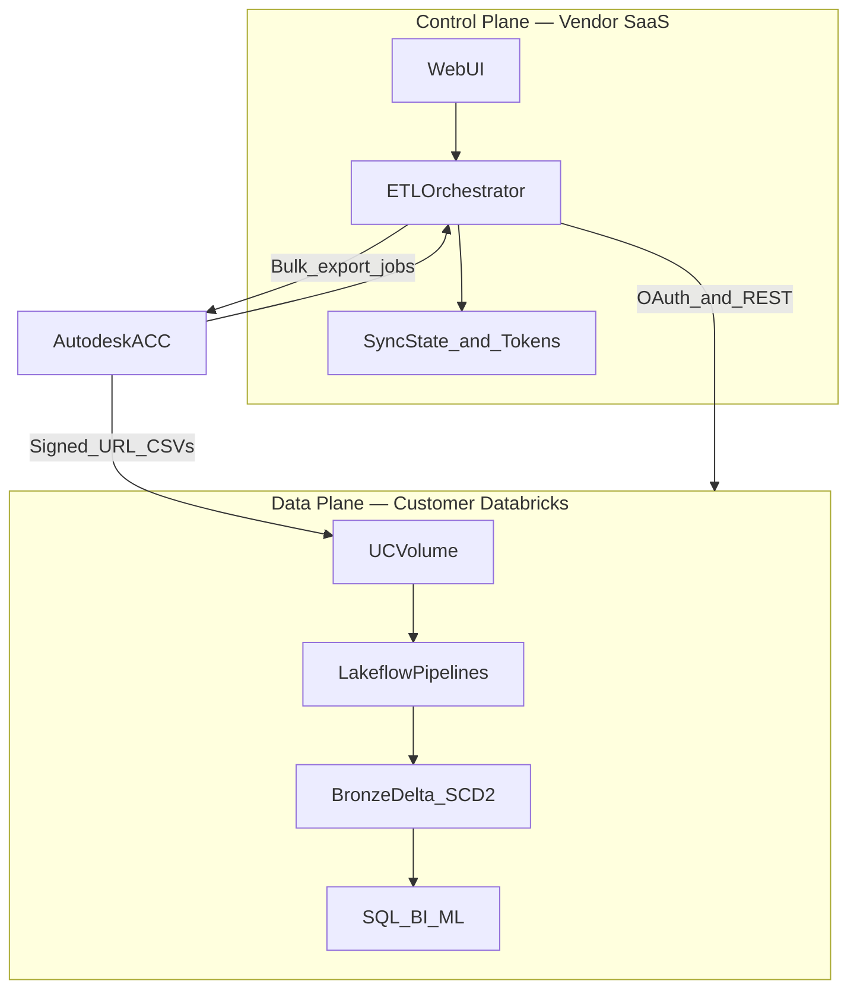
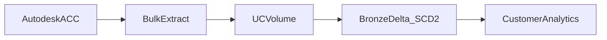

# Architecture Overview

Control plane / data plane split for the Forma → Databricks Connector.

## Control plane vs data plane

- **Control plane (SaaS):** Flask app — OAuth, orchestration, scheduling, encrypted token/state store. No long-term ACC project data on the host when `ENABLE_NOTEBOOK_DOWNLOAD=true`.
- **Data plane (customer Databricks):** UC Volume landing, bulk downloader job, two Lakeflow pipelines, Bronze Delta tables.
- **Source:** Autodesk ACC via Data Connector API.

## Data flow

## See also

- [PLATFORM.md](PLATFORM.md) — auth, ingestion decisions, phasing
- [RUNBOOK.md](../engineering/RUNBOOK.md) — operational sequence and components
- [PITCH.md](../customer/PITCH.md) — customer-facing summary
