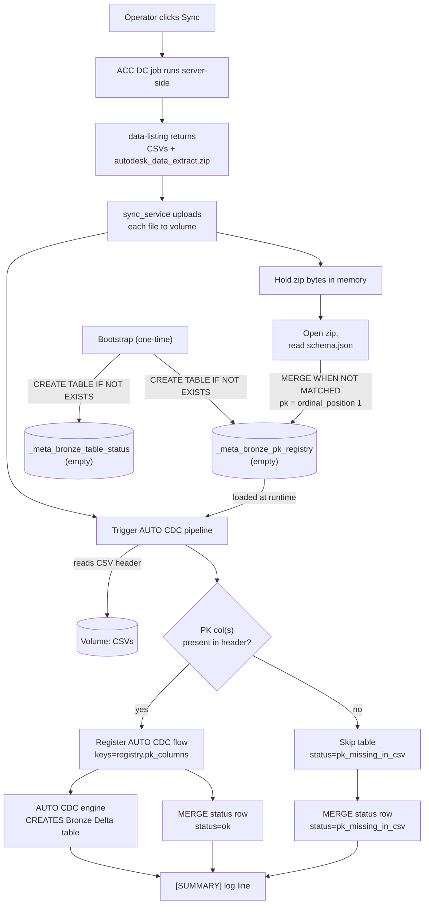
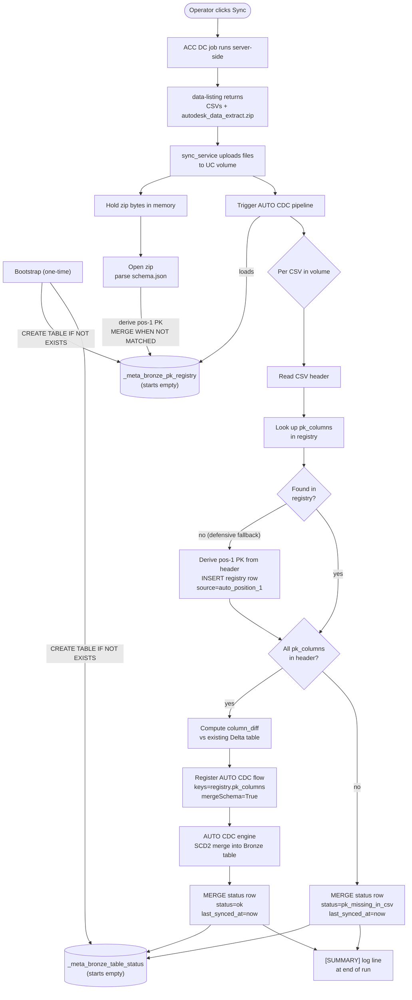

# Schema Handling & Evolution — Design

> Created: May 17, 2026
> Status: **LOCKED — implementation in progress**
> Owner: Prabal + AI agent collaboration
> Purpose: How the connector derives primary keys per ACC table from the
> Data Connector's `schema.json`, tracks per-run sync status via a
> dedicated registry, and gracefully handles broken / partial Autodesk
> exports without blocking ingestion.
> Supersedes: the L1-Q5 stub in
> [PLATFORM.md](PLATFORM.md)
> about README.html-based PK extraction.  
> Databricks CDC technique mapping (FROM SNAPSHOT today; AUTO CDC for
> activities/REST future): [CDC_TECHNIQUES.md](../reference/CDC_TECHNIQUES.md).

---

## 1. Three sources of truth

| Source | Role | Authority for | Lifecycle |
|---|---|---|---|
| `pk_config.json` in UC Volume (operator-maintained) | PK definitions | Primary key columns (single or composite) for each table | Uploaded once during bootstrap; updated manually by operator as needed |
| `schema.json` inside `autodesk_data_extract.zip` (delivered by ACC on every sync) | Column type definitions | Column names, data types, and ordinal position metadata | Read by pipeline after every sync; parsed from Volume |
| `<catalog>.bronze._meta_bronze_pk_registry` | The runtime source of truth | The locked PK columns the pipeline will actually use | One row per (schema, table); rows are **immutable after first write** (source: pk_config.json or auto_position_1 fallback) |
| `<catalog>.bronze._meta_bronze_table_status` | The per-run journal | Heartbeat + last-run status per table | One row per ACC table the pipeline has touched; **rewritten every run** |
| `<catalog>.bronze._meta_bronze_schema_versions` | Config version tracker | SHA-256 hashes of pk_config.json and schema.json | Enables hash-gated processing (skip unchanged configs) |
| Per-CSV header (read at pipeline run) | The gate | Whether the locked PK column(s) physically exist in this run's data | Per-run; never persisted (snapshot saved into `_meta_bronze_table_status` for debugging) |

Per-run rule: the pipeline registers an AUTO CDC flow for a table
**only when the registry's locked PK columns are present in this run's
CSV header**. Anything else (extra non-PK columns, missing non-PK
columns, schema.json drift) is tolerated and logged. Missing PK
columns → skip that table, continue with the rest.

### What the bundled `acc-connector/schemas/schema.json` is **not**

The `schema.json` (and the per-schema files like `issues.json`,
`cost.json`, …) committed under `acc-connector/schemas/` are
**documentation artefacts** scraped from Autodesk's public docs. They
are **never read at runtime**. They exist as a quick-reference for
developers exploring the ACC schema offline; deleting them would not
change connector behaviour. The runtime path uses the per-tenant
`schema.json` that arrives inside `autodesk_data_extract.zip` on every
sync.

### Bronze table schema vs primary keys

```
Bronze Delta table SCHEMA (columns + types)
        |
        +-- driven by: CSV header + Spark inferSchema / mergeSchema
                       (Delta only ever GROWS in column count -
                        non-PK adds yes, drops no)

Bronze Delta table PRIMARY KEYS (used by AUTO CDC merge)
        |
        +-- driven by: registry  (locked at first write,
                                  never auto-updated)
```

The registry is **only about identity** (which columns make a row
unique). Column shape and types come from the CSV via Spark
`mergeSchema=True`.

---

## 2. Primary key derivation — pk_config.json

**One rule, explicit control:**

> `pk_columns = array from pk_config.json[schema][table]`

PKs are defined in `/Volumes/{catalog}/bronze/acc_bronze_volume/pk_config.json`,
a JSON file maintained by the connector operator. Supports single and composite PKs.

### Structure

```json
{
  "cost": {
    "invoices": ["invoice_id"],
    "line_items": ["invoice_id", "line_number"],
    "budget_properties": ["budget_id", "property_name"]
  },
  "issues": {
    "issues": ["issue_id"],
    "attachments": ["attachment_id"]
  }
}
```

### Why pk_config.json (not ordinal_position)

- **Operator control**: Fix incorrect PKs without Autodesk coordination
- **Composite keys**: Explicit arrays like `["invoice_id", "line_number"]`
- **Auditability**: Version-controlled, not derived heuristically
- **Separation**: PK logic independent from Autodesk's schema changes

### Fallback behavior

If pk_config.json is missing or doesn't define a table:
- **Fallback**: Use first column from CSV header (backward compatible)
- **Source**: Marked as `auto_position_1` vs `explicit_pk_config` in registry

### Hash-gating and registry sync

The pipeline tracks the SHA-256 hash of `pk_config.json` in
`_meta_bronze_schema_versions` (`config_type = 'pk_config'`).

| Condition | Behavior |
|-----------|----------|
| Hash **unchanged** and registry has rows for this catalog | **No MERGE** — log and skip |
| Hash **unchanged** but registry **empty** | Run MERGE (re-seed after manual cleanup) |
| Hash **changed** | **Upsert** all tables in the file |

On sync, the pipeline **INSERT**s new `(schema, table)` rows and
**UPDATE**s `pk_columns` / `source` / `locked_at` for existing rows
where `source` is `auto_position_1` or `explicit_pk_config`. Rows with
`manual_override` or `expert_curated` are **never** overwritten by
`pk_config.json`.

Edit `acc-connector/config/pk_config_template.json`, upload to the
Volume as `pk_config.json` (bootstrap Step 8.5 or Files API), then
re-run the pipeline. If PK columns change on a table that already has
Bronze data, **rebuild that Bronze table** — AUTO CDC merge keys will
differ from historical rows.

### Locking (fallback and operator paths)

CSV discovery still **INSERT-only** for tables not in `pk_config`:
first header column, `source = auto_position_1`. Operator SQL
(Section 11) can set `expert_curated` or `manual_override`; those
sources are outside the `pk_config` upsert path.

---

## 3. Empirical validation — historical context

> **Historical note.** The breakdown below was generated against the
> earlier **ordinal_position-based PK derivation** approach (Section 2's
> original implementation). The **current** implementation uses
> `pk_config.json` (operator-defined PKs) instead of heuristic
> derivation from schema.json. This section is preserved as analysis
> context showing why explicit PK control was needed: ~30% of tables
> had incorrect position-1 PKs requiring manual override.

For each table, the legacy classifier walks columns in
`ordinal_position` order, applies the 3-rule waterfall, and records
the PK column it resolves to. Per-schema totals and the explicit table
&rarr; PK mapping for each rule appear below.

### Per-schema breakdown

| Schema | Total tables | # Rule 1 | Rule 1 tables (PK = `id`) | # Rule 3 | Rule 3 tables (`table` &rarr; `pk_col`) | # Rule 4 | Rule 4 tables (PK blank, manual override) |
|---|---|---|---|---|---|---|---|
| `admin` | 16 | 5 | `business_units`<br>`companies`<br>`projects`<br>`roles`<br>`users` | 8 | `project_companies` &rarr; `project_id`<br>`project_roles` &rarr; `role_oxygen_id`<br>`project_services` &rarr; `project_id`<br>`project_user_companies` &rarr; `company_oxygen_id`<br>`project_user_products` &rarr; `user_id`<br>`project_user_roles` &rarr; `project_id`<br>`project_user_services` &rarr; `project_id`<br>`project_users` &rarr; `user_id` | 3 | `account_services`<br>`accounts`<br>`project_products` |
| `assets` | 16 | 13 | `asset_model_sync_records`<br>`asset_permissions`<br>`asset_stages`<br>`asset_statuses`<br>`assets`<br>`categories`<br>`category_custom_attribute_assignments`<br>`category_status_set_assignments`<br>`custom_attribute_selection_values`<br>`custom_attributes`<br>`model_sync_containers`<br>`status_sets`<br>`systems` | 3 | `asset_custom_attribute_values` &rarr; `asset_id`<br>`custom_attribute_default_values` &rarr; `custom_attribute_id`<br>`system_memberships` &rarr; `system_id` | 0 | (none) |
| `checklists` | 20 | 15 | `checklist_assignees`<br>`checklist_attachments`<br>`checklist_item_doc_attachments`<br>`checklist_items`<br>`checklist_items_answers`<br>`checklist_section_assignees`<br>`checklist_sections`<br>`checklist_sections_signatures`<br>`checklist_signatures`<br>`checklists`<br>`template_item_instructions`<br>`template_sections`<br>`template_sections_all`<br>`template_signatures`<br>`template_signatures_all` | 5 | `template_items` &rarr; `template_version_id`<br>`template_items_all` &rarr; `template_version_id`<br>`template_items_answers` &rarr; `list_response_id`<br>`templates` &rarr; `template_id`<br>`templates_versions` &rarr; `template_id` | 0 | (none) |
| `clashes` | 4 | 0 | (none) | 4 | `assigned_clash_group` &rarr; `clash_group_id`<br>`clash_group_to_clash_id` &rarr; `clash_group_id`<br>`clash_test` &rarr; `clash_test_id`<br>`closed_clash_group` &rarr; `clash_group_id` | 0 | (none) |
| `iq` | 16 | 16 | `company_daily_quality_risk_changes`<br>`company_daily_safety_risk_changes`<br>`cost_impact_issues`<br>`design_issues_building_components`<br>`design_issues_root_cause`<br>`inspection_risk_issues`<br>`issues_quality_categories`<br>`issues_quality_risks`<br>`issues_safety_hazard`<br>`issues_safety_observations`<br>`issues_safety_risk`<br>`project_daily_quality_risk_changes`<br>`rfis_building_components`<br>`rfis_disciplines`<br>`rfis_high_risk`<br>`rfis_root_cause` | 0 | (none) | 0 | (none) |
| `cost` | 32 | 22 | `approval_workflows`<br>`budget_code_segment_codes`<br>`budget_code_segments`<br>`budget_payment_items`<br>`budget_payments`<br>`budget_transfers`<br>`budgets`<br>`change_orders`<br>`contracts`<br>`cost_items`<br>`cost_payment_items`<br>`cost_payments`<br>`distribution_item_curves`<br>`distribution_items`<br>`expense_items`<br>`expenses`<br>`main_contract_items`<br>`main_contracts`<br>`payment_references`<br>`permissions`<br>`sub_distribution_items`<br>`transferences` | 10 | `budget_payment_properties` &rarr; `budget_payment_id`<br>`budget_properties` &rarr; `budget_id`<br>`change_order_cost_items` &rarr; `change_order_id`<br>`change_order_properties` &rarr; `change_order_id`<br>`contract_properties` &rarr; `contract_id`<br>`cost_item_properties` &rarr; `cost_item_id`<br>`cost_payment_properties` &rarr; `cost_payment_id`<br>`expense_properties` &rarr; `expense_id`<br>`main_contract_properties` &rarr; `main_contract_id`<br>`schedule_of_values_properties` &rarr; `schedule_of_value_id` | 0 | (none) |
| `dailylogs` | 5 | 5 | `dailylogs`<br>`labor_items`<br>`labors`<br>`notes`<br>`weather_logs` | 0 | (none) | 0 | (none) |
| `estimates` | 9 | 8 | `cost_markup_formula_bond_levels`<br>`cost_markup_formula_items`<br>`cost_markup_formula_sections`<br>`cost_markup_formulas`<br>`equipment_cost_calculations`<br>`estimation_instances`<br>`labor_cost_calculations`<br>`material_cost_calculations` | 0 | (none) | 1 | `settings` |
| `forms` | 15 | 9 | `form_attachments`<br>`form_files`<br>`form_sections`<br>`form_templates`<br>`forms`<br>`native_form_section_item_attachments`<br>`native_form_values`<br>`native_forms`<br>`weather` | 3 | `layout_sections` &rarr; `form_section_id`<br>`native_form_tabular_values` &rarr; `native_form_id`<br>`weather_hours` &rarr; `weather_id` | 3 | `layout_section_items`<br>`layout_table_columns`<br>`layouts` |
| `issues` | 13 | 1 | `custom_attributes_mappings` | 12 | `attachments` &rarr; `attachment_id`<br>`checklist_mappings` &rarr; `issue_id`<br>`comments` &rarr; `comment_id`<br>`custom_attribute_list_values` &rarr; `attribute_mappings_id`<br>`custom_attributes` &rarr; `issue_id`<br>`issue_subtypes` &rarr; `issue_subtype_id`<br>`issue_types` &rarr; `issue_type_id`<br>`issues` &rarr; `issue_id`<br>`placements` &rarr; `placement_id`<br>`root_cause_categories` &rarr; `root_cause_category_id`<br>`root_causes` &rarr; `root_cause_id`<br>`viewables` &rarr; `placement_id` | 0 | (none) |
| `issuesbim360` | 11 | 1 | `custom_attributes_mappings` | 10 | `attachments` &rarr; `attachment_id`<br>`checklist_mappings` &rarr; `issue_id`<br>`comments` &rarr; `comment_id`<br>`custom_attribute_list_values` &rarr; `attribute_mappings_id`<br>`custom_attributes` &rarr; `issue_id`<br>`issue_subtypes` &rarr; `issue_subtype_id`<br>`issue_types` &rarr; `issue_type_id`<br>`issues` &rarr; `issue_id`<br>`root_cause_categories` &rarr; `root_cause_category_id`<br>`root_causes` &rarr; `root_cause_id` | 0 | (none) |
| `locations` | 2 | 2 | `nodes`<br>`trees` | 0 | (none) | 0 | (none) |
| `markups` | 4 | 2 | `markup`<br>`placement` | 1 | `link` &rarr; `markup_id` | 1 | `layer` |
| `meetingminutes` | 7 | 7 | `assignees`<br>`attachments`<br>`items`<br>`meetings`<br>`non_member_participants`<br>`participants`<br>`topics` | 0 | (none) | 0 | (none) |
| `packages` | 4 | 3 | `package_associations`<br>`package_roles`<br>`packages` | 1 | `version_resources` &rarr; `version_id` | 0 | (none) |
| `photos` | 4 | 4 | `photo_tags`<br>`photos`<br>`referencer_participants`<br>`referencer_photos` | 0 | (none) | 0 | (none) |
| `relationships` | 1 | 0 | (none) | 1 | `entity_relationship` &rarr; `item1_id` | 0 | (none) |
| `reviews` | 9 | 9 | `review_candidates`<br>`review_comments`<br>`review_documents`<br>`review_steps`<br>`review_tasks`<br>`review_workflow_templates`<br>`review_workflows`<br>`reviews`<br>`workflow_notes` | 0 | (none) | 0 | (none) |
| `rfis` | 17 | 11 | `acc_attachments`<br>`attachments`<br>`comments`<br>`project_custom_attributes`<br>`project_custom_attributes_enums`<br>`rfi_assignees`<br>`rfi_custom_attributes`<br>`rfi_responses`<br>`rfi_transitions`<br>`rfi_types`<br>`rfis` | 6 | `category` &rarr; `rfi_id`<br>`discipline` &rarr; `rfi_id`<br>`rfi_co_reviewers` &rarr; `rfi_id`<br>`rfi_distribution_list` &rarr; `rfi_id`<br>`rfi_location` &rarr; `rfi_id`<br>`rfi_reviewers` &rarr; `rfi_id` | 0 | (none) |
| `schedule` | 12 | 11 | `activities`<br>`activity_codes`<br>`comments`<br>`dependencies`<br>`plan_commitments`<br>`plan_handoffs`<br>`plan_plans`<br>`plan_task_comments`<br>`plan_tasks`<br>`resources`<br>`schedules` | 0 | (none) | 1 | `plan_project_settings` |
| `sheets` | 6 | 3 | `lineages`<br>`sets`<br>`sheets` | 2 | `sheet_bubbles` &rarr; `sheet_id`<br>`sheet_tags` &rarr; `sheet_id` | 1 | `disciplines` |
| `submittals` | 9 | 5 | `attachments`<br>`comments`<br>`items`<br>`packages`<br>`specs` | 4 | `item_cc_users` &rarr; `item_id`<br>`item_co_reviewers_users` &rarr; `item_id`<br>`item_distribution_list_users` &rarr; `item_id`<br>`itemrevisions` &rarr; `item_id` | 0 | (none) |
| `submittalsacc` | 13 | 12 | `attachments`<br>`comments`<br>`custom_identifier_settings`<br>`item_custom_attribute_value`<br>`item_revision`<br>`items`<br>`itemtype`<br>`packages`<br>`parameters_collections`<br>`specs`<br>`steps`<br>`tasks` | 1 | `item_watchers` &rarr; `item_id` | 0 | (none) |
| `takeoff` | 10 | 10 | `carbon_definitions`<br>`classification_systems`<br>`classifications`<br>`content_lineages`<br>`packages`<br>`quantities`<br>`quantity_definitions`<br>`settings`<br>`takeoff_items`<br>`takeoff_types` | 0 | (none) | 0 | (none) |
| `transmittals` | 4 | 4 | `transmittal_documents`<br>`transmittal_non_members`<br>`transmittal_recipients`<br>`workflow_transmittals` | 0 | (none) | 0 | (none) |
| **TOTAL** | **259** | **178 (68.7%)** | &mdash; | **71 (27.4%)** | &mdash; | **10 (3.9%)** | &mdash; |

### Distribution at a glance

- **Rule 1 (literal `id`): 178 tables, 68.7%.** PK is straightforward.
- **Rule 3 (first non-`bim360_*` `_id`): 71 tables, 27.4%.** Single-column
  PK named after the entity (e.g. `attachment_id`, `clash_group_id`,
  `version_id`). Bridge-style tables like `clash_group_to_clash_id`
  resolve to single-column PKs under this rule.
- **Rule 4 (no derivable PK): 10 tables, 3.9%.** Operator pre-loads
  `manual_override` rows in the registry. Listed below.

### Rule 4 manual-override seed list

The 10 tables that fall to Rule 4 across all 25 in-scope schemas:

| Schema.table | Why Rule 4 fires | Override starting point |
|---|---|---|
| `admin.account_services` | Only `bim360_account_id` + `service` enum; no `_id` column | `pk_columns = ['bim360_account_id', 'service']` (composite) |
| `admin.accounts` | Only `bim360_account_id` (notes: "Account Identifier"); blanket `bim360_*` exclusion masks the real PK | `pk_columns = ['bim360_account_id']` |
| `admin.project_products` | Only `bim360_project_id` + `bim360_account_id` + `product_key` | `pk_columns = ['bim360_project_id', 'product_key']` |
| `estimates.settings` | Only project-scoped settings, no `_id` | Inspect CSV header; likely `pk_columns = ['bim360_project_id']` |
| `forms.layout_section_items` | No `_id` column at any ordinal | Inspect CSV header |
| `forms.layout_table_columns` | No `_id` column | Inspect CSV header |
| `forms.layouts` | No `_id` column | Inspect CSV header |
| `markups.layer` | Has `uid` / `surface_uid` (not `_id`) | `pk_columns = ['uid']` |
| `schedule.plan_project_settings` | Project-level settings; no `_id` | Inspect CSV header; likely `pk_columns = ['bim360_project_id']` |
| `sheets.disciplines` | Only `index` + `name` + `designator` | `pk_columns = ['bim360_project_id', 'container_type', 'index']` |

Suggested overrides are starting points — final values are confirmed
by reading the actual CSV header at first sync (the gate described in
Section 1) and by an operator review of cardinality.

### Why this matters under the position-1 rule

1. **178 Rule 1 tables — correct under both rules.** `id` is at
   ordinal_position 1 in every in-scope table that has it.
2. **~17 of the 71 Rule 3 tables — correct under both rules.** Tables
   like `issues.attachments` (PK `attachment_id`), `issues.issues`
   (PK `issue_id`), `clashes.clash_test` (PK `clash_test_id`) — the
   position-1 column IS the row's natural identifier.
3. **~54 of the 71 Rule 3 tables — placeholder under position-1.**
   Junction / property / bridge tables resolve to a parent-FK as their
   PK (e.g. `cost.budget_properties` &rarr; `[budget_id]`). This is
   knowingly wrong for row-uniqueness; AUTO CDC will collapse multiple
   property rows per parent. **ACC-expert curation replaces these
   per-table** before production.
4. **10 Rule 4 tables — placeholder under position-1.** Tables with no
   `_id` column (e.g. `admin.account_services`, `markups.layer`) get
   `bim360_account_id` or similar at position 1. Same story: locked
   placeholder, expert curation replaces.

The list of "needs expert curation" tables is the union of (3) and (4)
above — roughly 64 tables out of 259. These are the ones to prioritize
during the curation pass.

---

## 4. Registry tables — two-table layout

The connector keeps two `_meta_*` Delta tables under
`<catalog>.bronze` (no separate `_meta` schema; the `_meta_` prefix is
sufficient for namespacing without a separate UC schema to provision):

### 4.1 `_meta_bronze_pk_registry` — pk_config sync + insert-only fallback

```sql
CREATE TABLE IF NOT EXISTS <catalog>.bronze._meta_bronze_pk_registry (
  catalog       STRING NOT NULL,
  schema        STRING NOT NULL,        -- ACC schema (e.g. 'issues')
  table         STRING NOT NULL,        -- ACC table (e.g. 'attachments')
  pk_columns    ARRAY<STRING> NOT NULL, -- e.g. ['attachment_id']
  locked_at     TIMESTAMP NOT NULL,
  source        STRING NOT NULL         -- 'explicit_pk_config'
                                         -- 'auto_position_1'
                                         -- 'expert_curated'
                                         -- 'manual_override'
) USING DELTA;
```

Writes happen in these cases:

1. **`pk_config.json` sync (pipeline startup, hash-gated)** — reads
   `/Volumes/.../acc_bronze_volume/pk_config.json`. When the file hash
   changes (or registry is empty), `MERGE` **INSERT**s new tables and
   **UPDATE**s `pk_columns` for rows with
   `source IN ('auto_position_1', 'explicit_pk_config')`. Does not
   touch `manual_override` / `expert_curated`. Does not DELETE registry
   rows removed from the file (INFO log only). Unchanged hash + non-empty
   registry → skip MERGE entirely.
2. **Pipeline CSV fallback (per sync)** — if a CSV's `(schema, table)`
   is not in the registry after the sync step, INSERT with PK = first
   header column, `source = 'auto_position_1'` (`WHEN NOT MATCHED` only).
3. **Operator / expert curation (out-of-band)** — explicit UPDATE via
   SQL in Section 11; not driven by `pk_config.json`.

Bootstrap creates this table **empty** and uploads a default
`pk_config.json` from `config/pk_config_template.json` (Step 8.5).

### 4.2 `_meta_bronze_table_status` — mutable

```sql
CREATE TABLE IF NOT EXISTS <catalog>.bronze._meta_bronze_table_status (
  catalog                  STRING NOT NULL,
  schema                   STRING NOT NULL,
  table                    STRING NOT NULL,
  last_synced_at           TIMESTAMP NOT NULL,   -- heartbeat, every run
  last_run_status          STRING NOT NULL,      -- enum, see Section 8
  last_error_message       STRING,
  csv_header_at_last_run   ARRAY<STRING>,
  column_diff              STRUCT<
                             added: ARRAY<STRING>,
                             absent_in_csv: ARRAY<STRING>,
                             type_widened: ARRAY<STRING>,
                             type_kept_old: ARRAY<STRING>
                           >
) USING DELTA;
```

MERGE'd via `(catalog, schema, table)` at the end of each per-table
processing block. **`last_synced_at` is updated every run, even on
skip / no-op** — it's the heartbeat that tells operators "yes, the
pipeline considered this table this run".

### Sample rows

`_meta_bronze_pk_registry`:

| catalog | schema | table | pk_columns | locked_at | source |
|---|---|---|---|---|---|
| `final_poc` | `admin` | `users` | `[id]` | 2026-05-17 | `auto_position_1` |
| `final_poc` | `issues` | `attachments` | `[attachment_id]` | 2026-05-17 | `auto_position_1` |
| `final_poc` | `cost` | `budget_properties` | `[budget_id, property_name]` | 2026-05-20 | `expert_curated` |

`_meta_bronze_table_status`:

| catalog | schema | table | last_synced_at | last_run_status | last_error_message | column_diff |
|---|---|---|---|---|---|---|
| `final_poc` | `admin` | `users` | 2026-05-17 14:02 | `ok` | NULL | `{added:[], absent_in_csv:[], type_widened:[]}` |
| `final_poc` | `issues` | `attachments` | 2026-05-17 14:02 | `ok` | NULL | `{added:[priority], absent_in_csv:[], type_widened:[]}` |
| `final_poc` | `cost` | `budgets` | 2026-05-17 14:02 | `pk_missing_in_csv` | `required PK column [id] missing from header` | `{...}` |

### Why two tables and not one

- **Auditability.** The "what is the PK" answer never changes
  silently. Anyone reading `_meta_bronze_pk_registry` sees only
  intentional writes (bootstrap inserts and explicit curation).
- **Separation of concerns.** Heartbeat + per-run status churns every
  sync. Mixing it into the immutable PK record would muddy both.
- **Different access patterns.** Operators querying "is sync healthy
  right now?" hit `_meta_bronze_table_status`. Engineers querying
  "what PK is locked for table X?" hit `_meta_bronze_pk_registry`.

---

## 5. First sync (registry seeded by sync_service from the zip)

The registry is **empty** after bootstrap — bootstrap only creates the
`_meta_*` tables. The PK rows are populated on **every sync** by
`sync_service`, using the `schema.json` that arrives inside
`autodesk_data_extract.zip` from ACC's Data Connector.

### ASCII summary

```
+- BOOTSTRAP (one-time) -------------------------------+
| 1. CREATE TABLE IF NOT EXISTS                         |
|      _meta_bronze_pk_registry                         |
|      _meta_bronze_table_status                        |
|    Both empty. No PK rows yet.                        |
+-------------------------------------------------------+

+- EVERY sync run --------------------------------------+
| Phase 1   Submit ACC Data Connector job, poll         |
| Phase 2   List + download files, upload each into     |
|             /Volumes/<cat>/bronze/acc_bronze_volume/  |
|             data_connector/<project>/<run>/           |
|           One of those files is                       |
|             autodesk_data_extract.zip — held in       |
|             memory by sync_service                    |
| Phase 2.5 sync_service:                               |
|             open zip in memory                        |
|             read schema.json                          |
|             derive pk = ordinal_position 1            |
|             MERGE WHEN NOT MATCHED into               |
|               _meta_bronze_pk_registry                |
|               (existing rows untouched)               |
| Phase 3   Trigger AUTO CDC pipeline with conf:        |
|             acc.dc_snapshot_path = this run folder    |
|             acc.dc_project_id = project id              |
|             load registry; for each CSV in that path: |
|             gate on PK in header                      |
|             register FROM SNAPSHOT flow / skip        |
|             emit [SUMMARY]                            |
+-------------------------------------------------------+
```

After the first sync the registry has exactly the (schema, table) tuples
the tenant actually exports. Every later sync MERGEs in any new tables
the tenant starts using; existing rows (locked PKs, possibly curated by
an operator) stay untouched.

### Diagram



---

## 6. Subsequent sync — PK immutability

Every sync runs the same two-stage pipeline. `sync_service` reads the
zip's `schema.json` and updates the registry **only via INSERT** (MERGE
WHEN NOT MATCHED). The Spark Declarative Pipeline that follows uses the
registry as its sole runtime source of truth.

```
+- sync_service (runs once per sync, before pipeline) +
| Phase 2.5 of _run_sync_bulk:                         |
|   1. Open autodesk_data_extract.zip in memory        |
|   2. Parse schema.json                               |
|   3. For each (schema, table) declared:              |
|        pk = column at ordinal_position 1             |
|        MERGE INTO _meta_bronze_pk_registry           |
|            ON catalog,schema,table                   |
|            WHEN NOT MATCHED THEN INSERT *            |
|      Existing rows are NEVER updated.                |
+-------------------------------------------------------+

+- AUTO CDC pipeline (every sync, after seed) ---------+
| 1. Load _meta_bronze_pk_registry into memory         |
| 2. For each CSV in the volume:                       |
|      a. Read first line as header                    |
|      b. Look up pk_columns in registry               |
|      c. Gate: all pk_columns present in header?      |
|         yes -> compute column_diff vs Delta cols     |
|                register AUTO CDC flow                |
|                MERGE status row, status='ok'         |
|         no  -> skip flow registration                |
|                MERGE status row, status='pk_missing_in_csv' |
| 3. Update last_synced_at on EVERY status row         |
|    (heartbeat, even for tables we couldn't process)  |
| 4. Emit [SUMMARY] aggregate line                     |
+-------------------------------------------------------+
```

The pipeline never reads `schema.json` directly. The seed step in
`sync_service` is the *only* place schema.json influences the registry,
and it does so through `WHEN NOT MATCHED` only — that's what enforces PK
immutability. No code path anywhere in the connector updates a row's
`pk_columns` in the registry, so a PK can only change via the manual
override SQL in Section 11.

### What if Autodesk changes the PK upstream?

Two sub-cases, neither of which mutates the registry:

1. **CSV still contains the old PK column** — gate passes, ingestion
   continues unchanged. Any new column Autodesk introduced is a
   non-PK column and follows Section 7's "add yes" rule.
2. **CSV no longer contains the old PK column** — gate fails for that
   table, status row records `pk_missing_in_csv`, table is skipped
   each run until an operator either: (a) rebuilds the Bronze table
   under a new PK (data loss accepted), or (b) freezes the table.

There is **no automated PK-rotation path**, intentionally. See
Section 6.1 below for why.

### 6.1 Why PK is locked (vs. auto-updating from schema.json)

If we let the connector swap the PK on a table mid-life, AUTO CDC's
MERGE clause would change from `target.id = source.id` to
`target.budget_id = source.budget_id`. Existing Delta rows have
`budget_id IS NULL` (the column never existed when they were written)
so the MERGE matches zero rows, AUTO CDC inserts every source row as
a fresh SCD2 active version, and the table ends up with two parallel
identity sets:

- Old rows keyed on `id`, all marked `__IS_CURRENT = false` or stuck
  as orphan `__IS_CURRENT = true`.
- New rows keyed on `budget_id`, marked `__IS_CURRENT = true` —
  with no link back to the old history.

Lineage shatters. SCD2 invariants break. There's no clean way to
recover without rebuilding the table from scratch (which Autodesk's
DC export can't help with — DC ships the *current* snapshot, not
history).

The only safe path is: lock the PK at first write, surface the
upstream mismatch loudly, and require an explicit operator decision.
That's what the design does.

### 6.2 New table appears in a sync after the first one

There are now two registry-INSERT paths, and they cooperate cleanly:

1. **`sync_service` seed (preferred path).** When the new table is
   declared in this run's `schema.json`, the pre-pipeline MERGE inserts
   its registry row *before* the pipeline starts. The pipeline then
   sees a fully-populated registry entry and runs the gate against the
   CSV header normally.
2. **Pipeline fallback (defensive path).** If a CSV arrives whose
   `(schema, table)` is *still* not in the registry — e.g. a tenant's
   `schema.json` was malformed and got skipped, or an operator dropped
   in a CSV manually — the pipeline derives `pk_columns =
   [<position-1 column>]` directly from the CSV header and INSERTs the
   row with `source = 'auto_position_1'` before evaluating the gate.

Both paths produce the same registry row shape; the only difference is
which code wrote it. Operator-curated PKs (`source = 'manual_*'`) are
never overwritten by either path.

---

## 7. Schema evolution — Reconcile-and-Pass model

The pipeline uses a **non-destructive reconcile** strategy. When
`schema.json` changes (detected via SHA-256 hash), the pipeline builds
an **evolved schema** per table by merging `schema.json` types with the
existing Delta target's types. The reconcile runs once per sync where
the hash changes; on unchanged hash syncs (99% of runs), it is skipped
entirely (zero overhead).

### Reconcile rules

| What changed | Pipeline action | Resulting Delta state |
|---|---|---|
| New column in `schema.json` | Add with `schema.json` type via `schema=evolved_struct` on `create_streaming_table` | Existing rows get `NULL`; new rows carry the value |
| Column removed from `schema.json` | Keep with target's existing type (never drop) | Existing values preserved; new rows write `NULL` |
| Safe type widening (`int`→`bigint`, `int`→`double`, `float`→`double`, etc.) | Use wider type from `schema.json` | Old values upcast cleanly |
| Unsafe type change (`string`→`int`, `bigint`→`int`, etc.) | **Keep target's old type** — PERMISSIVE mode handles incompatible CSV values as `NULL` | Data still flows; no table blocked. Logged in `column_diff.type_kept_old` |
| Column reorder | No effect | Spark reads by name |

### Safe widenings (exhaustive set)

`(int, bigint)`, `(int, double)`, `(int, float)`,
`(bigint, double)`, `(float, double)`,
`(smallint, int)`, `(smallint, bigint)`, `(smallint, double)`,
`(tinyint, smallint)`, `(tinyint, int)`, `(tinyint, bigint)`

### Key design invariants

- **Tables are NEVER blocked** for type mismatches. Data always flows.
  Incompatible values become `NULL` under `PERMISSIVE` mode.
- **Delta tables only ever GROW** in column count, never shrink.
- **`schema=evolved_struct`** on `dlt.create_streaming_table` tells DLT
  what the target schema should be. DLT handles column additions
  atomically on both the target and internal tables.
- **CSV reader uses the evolved schema** (target-compatible types), so
  source types always match target types by construction. No type
  mismatch can occur at MERGE time.
- **`columnNameOfCorruptRecord` is NOT used.** Instead, DLT Expectations
  (`@dlt.expect('pk_not_null', ...)`) monitor data quality non-destructively.

### Hash-gating

The reconcile is gated on `schema.json` hash change:

```
if schema_changed:
    for each table in typed_schemas:
        evolved_struct = reconcile(schema.json types, target types)
else:
    evolved_struct = schema.json types as-is (no target lookups)
```

When hash is unchanged: 0 calls to `spark.catalog.listColumns()`,
0 drift detection, sub-second overhead for ~260 tables.

### column_diff struct

```
column_diff STRUCT<
    added:          ARRAY<STRING>,   -- columns new in schema.json
    absent_in_csv:  ARRAY<STRING>,   -- columns in target but removed from schema.json
    type_widened:   ARRAY<STRING>,   -- safe widenings applied
    type_kept_old:  ARRAY<STRING>    -- unsafe changes where target type was kept
>
```

### Why we don't DROP columns Autodesk removes

If Autodesk drops `priority` from `issues.issues` and a year later
adds it back, dropping it from Delta would erase that year of data
that was perfectly valid at the time it was written. Keeping the
column with `NULL` for new rows is non-destructive and faithful to
SCD2 semantics.

### DLT column-add behavior (Q2-C verification pending)

Whether `schema=evolved_struct` automatically adds new columns to
existing SCD2 targets (vs requiring a full refresh) is being validated
via a controlled test. Until confirmed, operators should monitor the
first post-schema-change pipeline run for column presence.

---

## 8. Failure scenarios — message catalogue

Every divergence emits both a pipeline log line and a row update in
`_meta_bronze_table_status`. The same row's `last_synced_at` is
bumped on every run regardless of outcome.

| Scenario | Action | Log level | `last_run_status` |
|---|---|---|---|
| Clean sync | Ingest | INFO | `ok` |
| New non-PK column in CSV | Ingest, widen schema | INFO | `ok` (recorded in `column_diff.added`) |
| Non-PK column in schema.json absent in CSV | Ingest, NULL forward | WARN | `ok` (recorded in `column_diff.absent_in_csv`) |
| Non-PK type widening | Ingest | INFO | `ok` (recorded in `column_diff.type_widened`) |
| Non-PK type incompatible (unsafe) | Ingest with old type, log warning | WARN | `ok` (recorded in `column_diff.type_kept_old`) |
| **PK column missing from CSV header** | **Skip table** | ERROR | `pk_missing_in_csv` |
| CSV unreadable / empty | **Skip table** | ERROR | `csv_unreadable` |
| Table in schema.json, no CSV this run | **Skip table** | WARN | `skipped_no_csv` |
| New table discovered (not yet in registry) | INSERT registry row, then ingest | INFO | `ok` (registry insert logged separately) |
| Table dropped from schema.json, CSV still arrives | Ingest as before | INFO | `ok` |
| Table dropped from schema.json, no CSV | Skip silently with status | WARN | `not_in_schema_json` |

### Status enum (canonical)

`last_run_status` is one of:

- `ok`
- `pk_missing_in_csv`
- `csv_unreadable`
- `type_incompat` (reserved — not raised under reconcile model; kept for backward compat)
- `skipped_no_csv`
- `not_in_schema_json`

### Per-message copy templates

| `last_run_status` | Log line template |
|---|---|
| `ok` | `[OK] {schema}.{table}: {n_rows} rows synced` |
| `pk_missing_in_csv` | `[ERROR] {schema}.{table}: skipped — required PK column(s) {pk_cols} missing from CSV header. Actual header: {header}` |
| `csv_unreadable` | `[ERROR] {schema}.{table}: skipped — CSV unreadable or empty` |
| `type_incompat` | (reserved, not emitted under reconcile model) |
| `skipped_no_csv` | `[WARN] {schema}.{table}: skipped — no CSV file in volume for this table this run` |
| `not_in_schema_json` | `[WARN] {schema}.{table}: dropped from schema.json and no CSV provided; no action taken` |
| (column added) | `[INFO] {schema}.{table}: schema widened — new column(s): {cols}` |
| (column absent) | `[WARN] {schema}.{table}: column(s) {cols} declared in schema.json but absent in CSV; existing data preserved, new rows will have NULL` |
| (type widened) | `[INFO] {schema}.{table}: column {col} type widened {old}&rarr;{new}` |
| (type kept old) | `[WARN] {schema}.{table}: UNSAFE type change for "{col}" ({old}&rarr;{new}) — keeping old type, incompatible values become NULL` |
| (new table) | `[INFO] new table {schema}.{table} discovered; PK locked as {pk_columns} (source=auto_position_1)` |

---

## 9. Watermark advancement policy

| Scenario | Watermark advanced? | Rationale |
|---|---|---|
| All tables ingested cleanly | Yes | Normal happy path |
| Per-table skips (`pk_missing_in_csv`, `type_incompat`, `csv_unreadable`, `skipped_no_csv`, `not_in_schema_json`) | Yes | Successful tables shouldn't be re-fetched; per-table failures don't block partial progress |
| Pipeline runtime error (cluster crash, init exception) | No | Zero ingest this run |

Rule of thumb: **only roll back the watermark when zero new data was
ingested**. Per-table skips are routine and don't affect the
watermark.

---

## 10. Pipeline log line format & end-of-run summary

### Per-table log lines

Every per-table outcome emits one line in the pipeline log, formatted
per the templates in Section 8. The per-table line goes alongside the
status row write — same information, two surfaces.

### End-of-run summary

After the per-table loop completes, the pipeline emits a single
`[SUMMARY]` line:

```
[SUMMARY] sync_run_id={run_id} duration={hh:mm:ss}
  ingested_clean: {n_ok}
  schema_changes: {n_widened}
  skipped_pk_missing: {n_pk_missing}
  skipped_type_incompat: {n_incompat}
  skipped_csv_unreadable: {n_unreadable}
  skipped_no_csv: {n_no_csv}
  skipped_not_in_schema_json: {n_not_in_schema}
  newly_discovered: {n_new}
```

Operators read this one line and know whether to investigate. The
counts add up to the total number of `(schema, table)` rows in
`_meta_bronze_table_status`.

### Sync_service filter

`sync_service` collects every event whose message matches
`^\[(OK|INFO|WARN|ERROR|SUMMARY)\]` and stores them as a JSON array
in `sync_runs.warnings` (with `[OK]` / `[INFO]` lines optionally
filtered out for brevity). The dashboard renders that array directly,
plus a single highlighted card for the `[SUMMARY]` line.

---

## 11. Manual override path (escape hatch)

For tables that need a different PK than position-1 derives:

1. Operator runs:
   ```sql
   UPDATE <catalog>.bronze._meta_bronze_pk_registry
   SET pk_columns = ARRAY['<col1>', '<col2>'],
       source     = 'manual_override',
       locked_at  = current_timestamp()
   WHERE catalog = '<catalog>'
     AND schema  = '<schema>'
     AND table   = '<table>';
   ```
2. Next pipeline run reads the updated registry and registers the
   AUTO CDC flow with the new `pk_columns`.
3. **Caveat:** if the table already has Bronze data under the previous
   PK, the new PK won't merge cleanly with existing rows. See
   Section 6.1. Manual override on a table that's already ingested
   should be paired with a Bronze table rebuild.
4. CSV header gate still enforces — the operator can't pick a column
   that doesn't exist in the CSV.

`source = 'expert_curated'` is the same path but reserved for the
deliberate, audited curation pass that ACC-expert review will perform
across the ~64 known-imperfect tables (see Section 3).

---

## 12. Final consolidated diagram

End-to-end flow: bootstrap creates the empty `_meta_*` tables;
`sync_service` MERGE-seeds the registry from each run's
`autodesk_data_extract.zip`; the AUTO CDC pipeline gates on PK presence
in the CSV header.



---

## 13. Out of scope (intentional)

These are deliberate scope decisions for this iteration:

- Webhook-based incremental ingest — bulk DC snapshot is the only
  Bronze writer covered here.
- Silver / Gold transforms — design stops at Bronze SCD2.
- Multi-tenant isolation of registry — single
  `_meta_bronze_pk_registry` per workspace.
- Automated PK rotation when Autodesk changes upstream PKs — explicit
  operator decision required (see Section 6.1).

---

## 14. Known limitations of the current implementation

Distinct from Section 13 ("things we chose not to do") — these are
**real gaps in the current code** that operators should be aware of
and that we may close in follow-up work.

### 14.1 Placeholder PKs for ~54 junction / property tables

Under the position-1 rule (Section 2), tables whose first column is
a parent foreign key — `cost.*_properties`, `submittals.item_cc_users`,
`relationships.entity_relationship`, `rfis.category`, `sheets.sheet_bubbles`,
and roughly 50 others — receive a PK that is **not row-unique**. AUTO
CDC will silently collapse multiple rows per parent on those tables.

- **Detection:** compare CSV row count to Bronze table row count after
  the first sync per table; large discrepancies indicate a non-unique
  PK on that table.
- **Remediation:** Update `pk_config.json` with correct composite keys
  (e.g., `["budget_id", "property_name"]` for `cost.budget_properties`),
  upload to Volume. Next sync will use updated PKs. Existing data
  requires table rebuild if historical accuracy is needed.
- **Scope:** ~54 of 259 tables (~21%). The ~17 Rule-3 tables where
  position-1 IS the natural PK (e.g. `issues.attachments` &rarr;
  `attachment_id`, `issues.issues` &rarr; `issue_id`) are correct
  under the placeholder rule.
- **Tracked in:** the `(R3, b)` rows in Section 3's empirical table.

### 14.2 `column_diff.type_widened` and `type_kept_old` — now populated

**Resolved.** The reconcile-and-pass model (Section 7) now computes
type widenings and unsafe type retentions per table when `schema.json`
changes. Results are written to `column_diff.type_widened` and
`column_diff.type_kept_old` respectively.

### 14.3 `STATUS_TYPE_INCOMPAT` is reserved, never raised

Under the reconcile model, type mismatches no longer block tables.
Unsafe type changes are handled by keeping the target's old type and
letting `PERMISSIVE` mode turn incompatible CSV values into `NULL`.
The `type_incompat` status is retained in the enum for backward
compatibility but is never emitted by current code.

### 14.4 Partial-CSV mass-tombstoning is not guarded

If Autodesk's DC export silently ships an incomplete CSV for a table
(e.g. half the rows missing due to an upstream bug), AUTO CDC will
treat the missing rows as deletes and SCD2-close them. The connector
has no row-count delta threshold check.

- **Impact:** a single bad export can wipe out half of a Bronze
  table's active rows in one run. SCD2 history is preserved but
  reconstructing the "real" state requires either replaying an older
  CSV or accepting the loss until the next clean export.
- **Remediation (follow-up):** add a "if `csv_count < 0.5 *
  bronze_active_count`, fail the table" guard; threshold tunable.

### 14.5 No first-sync PK uniqueness probe

The pipeline trusts that the registry's `pk_columns` is actually
unique in the data. There's no `SELECT pk, count(*) FROM csv GROUP BY
pk HAVING count(*) > 1` sanity check at first ingest of a table.

- **Impact:** overlaps heavily with 14.1 — the same ~54 placeholder
  tables would be caught by a uniqueness probe, but it would also
  catch any expert-curated PK that turns out to be wrong.
- **Remediation (follow-up):** add a one-shot probe at first ingest
  per table; on failure, mark the registry row with a
  `pk_uniqueness_warning` flag (separate from `last_run_status`).

### 14.6 Schema split for stem-only CSV names is heuristic

`_split_csv_stem()` in `auto_cdc_pipeline.py` resolves a CSV stem to
`(schema, table)` by picking the longest registry-known schema name
that the stem starts with. This works for current ACC schemas (no
schema name is a prefix of another except `submittals` vs.
`submittalsacc`, which the longest-match rule handles). If Autodesk
introduces a new schema whose name overlaps an existing one
ambiguously, the heuristic may pick the wrong split.

- **Impact:** a brand-new table from Autodesk could be miscategorized
  under a sibling schema. Status row would read `ok` but with the
  wrong `(schema, table)` key.
- **Remediation (follow-up):** keep an explicit mapping file or
  embed the exact schema list in the registry for unambiguous lookup
  rather than relying on stem prefix matching. Low-priority — no
  current ACC schema names trigger the ambiguity.

---

## 15. Open questions

(none currently — refresh this section as implementation discovers
edge cases.)
