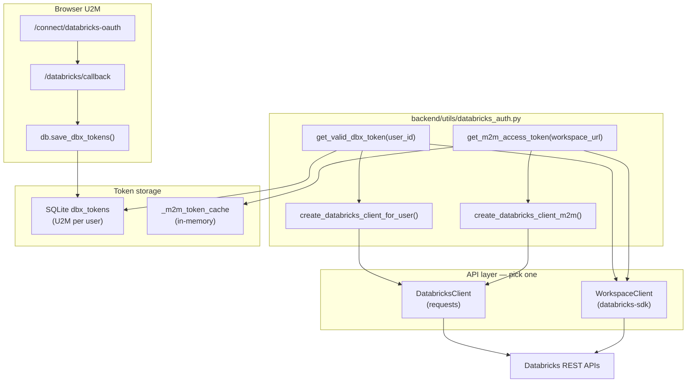

# U2M / M2M / SDK Integration Guide + Refresh Token FAQ

This document answers:

1. **Where to put auth code** if you have U2M on another branch
2. **How M2M differs** from U2M (and why M2M does **not** use a refresh token)
3. **Why M2M still needs automatic token renewal**
4. **SDK-only options** — U2M only, M2M only, or both
5. **Q&A** about the refresh token implementation in this repo

Related docs:

- [`DATABRICKS_AUTH.md`](DATABRICKS_AUTH.md) — beginner guide + line-by-line `databricks_auth.py`
- [`../tests/test_databricks_auth.py`](../tests/test_databricks_auth.py) — unit tests

---

## 1. Two auth worlds — do not mix them up

| | **U2M** (User-to-Machine) | **M2M** (Machine-to-Machine) |
|--|---------------------------|------------------------------|
| **Who logs in** | Human in browser | No human — service principal (robot account) |
| **OAuth grant** | `authorization_code` → then `refresh_token` | `client_credentials` only |
| **Refresh token?** | **Yes** — stored in SQLite per user | **No** — OAuth does not issue one |
| **How to renew access token** | POST with `grant_type=refresh_token` | POST with `grant_type=client_credentials` again |
| **Env vars** | `DATABRICKS_CLIENT_ID`, `DATABRICKS_CLIENT_SECRET` | `DATABRICKS_SP_CLIENT_ID`, `DATABRICKS_SP_CLIENT_SECRET` |
| **Storage** | SQLite `dbx_tokens` (encrypted) | In-memory `_m2m_token_cache` |
| **Main function** | `get_valid_dbx_token(user_id)` | `get_m2m_access_token(workspace_url)` |
| **Used today for** | Bootstrap, sync, catalog picker | Optional — future background / SP automation |

### Critical clarification: M2M and “refresh token”

**M2M does NOT use a refresh token.**

When people say “M2M needs automatic token refresh,” they mean:

```text
When the cached access_token is near expiry,
automatically request a NEW access_token
using client_credentials (client_id + client_secret).
```

That is **not** the same as U2M `refresh_token` flow. There is no long-lived refresh voucher for M2M — you simply call the token endpoint again.

```text
U2M renewal:  refresh_token  ──►  new access_token + (often) new refresh_token
M2M renewal:  client_id + secret ──►  new access_token only
```

Both flows are **automatic** in `databricks_auth.py` — callers do not manually track expiry.

---

## 2. Where to fit code if you have U2M on another branch

Suppose **Branch A** has browser login (U2M) working, and **Branch B** (this repo) has sync/bootstrap/M2M/SDK work. Merge or port using this map.

### File placement map

```text
acc-connector/
├── backend/
│   ├── utils/
│   │   └── databricks_auth.py          ◄── ALL token refresh logic (U2M + M2M)
│   ├── routes/
│   │   └── databricks_routes.py        ◄── U2M LOGIN ONLY (browser OAuth + callback)
│   ├── repositories/state/
│   │   └── token_repository.py         ◄── save_dbx_tokens / get_dbx_tokens
│   ├── clients/
│   │   ├── databricks_client.py        ◄── HTTP API calls (uses bearer token)
│   │   └── databricks_sdk_adapter.py   ◄── Optional SDK wrapper
│   ├── routes/bootstrap_routes.py      ◄── CALL SITE: get_valid_dbx_token
│   └── services/sync/sync_orchestrator.py ◄── CALL SITE: get_valid_dbx_token
├── tests/
│   └── test_databricks_auth.py         ◄── Tests for refresh + M2M cache
└── docs/
    └── DATABRICKS_AUTH.md
```

### Step-by-step: merging U2M from another branch

| Step | What to bring from U2M branch | Where it lives |
|------|------------------------------|----------------|
| 1 | Browser redirect + PKCE login | `databricks_routes.py` — `/connect/databricks-oauth`, `/databricks/callback` |
| 2 | First token save | `databricks_callback()` → `db.save_dbx_tokens(...)` |
| 3 | Token refresh before API calls | **Add** `backend/utils/databricks_auth.py` from this branch |
| 4 | Wire call sites | Replace `db.get_dbx_tokens()` + raw token with `get_valid_dbx_token()` or `create_databricks_client_for_user()` |
| 5 | Tests | Copy `tests/test_databricks_auth.py` |
| 6 | Env vars | Ensure `DATABRICKS_OAUTH_SCOPE` includes `offline_access` for refresh_token |

### Call sites you MUST update (U2M branch → this pattern)

**Wrong (causes 403 after ~1 hour):**

```python
dbx_tok = db.get_dbx_tokens(user_id)
client = DatabricksClient(dbx_tok['workspace_url'], dbx_tok['access_token'])
```

**Correct:**

```python
from backend.utils.databricks_auth import create_databricks_client_for_user

client = create_databricks_client_for_user(user_id)
# or
from backend.utils.databricks_auth import get_valid_dbx_token
dbx_tok = get_valid_dbx_token(user_id)
client = DatabricksClient(dbx_tok['workspace_url'], dbx_tok['access_token'])
```

### Files already wired in this repo

| File | Auth function used |
|------|-------------------|
| `backend/routes/databricks_routes.py` | `create_databricks_client_for_user()` for `/databricks/catalogs` |
| `backend/routes/bootstrap_routes.py` | `get_valid_dbx_token()` before + inside bootstrap thread |
| `backend/services/sync/sync_orchestrator.py` | `get_valid_dbx_token()` at start of sync |
| `backend/services/zerobus_service.py` | `create_databricks_client_for_user()` |

### What stays in `databricks_routes.py` vs `databricks_auth.py`

| Responsibility | Module |
|----------------|--------|
| Redirect user to Databricks login | `databricks_routes.py` |
| PKCE, state, CSRF | `databricks_routes.py` |
| Exchange `authorization_code` for first tokens | `databricks_routes.py` (`/databricks/callback`) |
| Refresh expired access tokens | `databricks_auth.py` (`get_valid_dbx_token`) |
| M2M client_credentials | `databricks_auth.py` (`get_m2m_access_token`) |
| Build `DatabricksClient` with fresh token | `databricks_auth.py` (factory helpers) |

**Rule:** Login lives in routes; renewal lives in `databricks_auth.py`.

---

## 3. Where to fit code if you have a different M2M setup

If your other branch uses a **different** service principal or token URL:

### Option A — Same env var names (recommended)

Set in `.env`:

```env
DATABRICKS_SP_CLIENT_ID=<your-sp-app-id>
DATABRICKS_SP_CLIENT_SECRET=<your-sp-secret>
DATABRICKS_SP_SCOPE=all-apis
DATABRICKS_SP_TOKEN_URL=https://accounts.cloud.databricks.com/oidc/accounts/<account-id>/v1/token
```

No code change — `get_m2m_access_token()` reads these via `_sp_client_id()`, `_resolve_m2m_token_url()`.

### Option B — Different credential source (Key Vault, etc.)

Add your loader **inside** `databricks_auth.py` only — change:

- `_sp_client_id()` / `_sp_client_secret()` to read from your vault
- Or add `get_m2m_access_token_from_custom_source()` that still returns a string access token

**Do not** scatter M2M token fetch across routes/services. Keep one module.

### Option C — M2M for sync instead of U2M

Today sync uses **U2M** (user’s OAuth token) because Unity Catalog permissions follow the logged-in user.

To use M2M for sync you would:

1. Grant the service principal UC permissions on catalog/schema/volume
2. Change `sync_orchestrator.py`:

```python
# Today (U2M — user delegated)
dbx_tok = get_valid_dbx_token(user_id)
dbx = DatabricksClient(dbx_tok['workspace_url'], dbx_tok['access_token'])

# M2M alternative (SP identity — no user_id token)
from backend.utils.databricks_auth import create_databricks_client_m2m
workspace_url = ...  # from bootstrap_state or env
dbx = create_databricks_client_m2m(workspace_url)
```

3. ACC calls still need U2M ACC token (`acc_client.get_valid_token`) — only Databricks side switches to M2M

### When to use which

| Scenario | Use |
|----------|-----|
| User clicks Sync in browser | **U2M** — `get_valid_dbx_token(user_id)` |
| User picks catalog after login | **U2M** |
| Bootstrap triggered by logged-in user | **U2M** |
| Nightly cron with no browser | **M2M** — `get_m2m_access_token()` |
| Zerobus writer (future) | Likely **M2M** if SP owns writes |

---

## 4. Why M2M still needs “automatic token renewal” (without refresh token)

Access tokens **always expire** (~60 minutes for Databricks). Even M2M must handle that.

```text
Without automatic renewal:
  T+0   get_m2m_access_token() → cache token
  T+61  API call with cached token → HTTP 403

With automatic renewal (implemented):
  T+0   get_m2m_access_token() → fetch + cache
  T+55  get_m2m_access_token() → cache still valid → return cached
  T+61  get_m2m_access_token() → cache expired → POST client_credentials → new token
```

Implementation in `get_m2m_access_token()`:

- Lines 190–193: return cached token if `time.time() < expires_at - 60`
- Lines 197–215: otherwise POST new token and update `_m2m_token_cache`

**No refresh_token involved** — the “renewal trigger” is expiry check + `client_credentials` POST.

---

## 5. SDK-only integration — three patterns

Package: `databricks-sdk` in `requirements.txt`  
Adapter: `backend/clients/databricks_sdk_adapter.py`

The SDK **does not replace** login or refresh in this architecture. It consumes tokens **after** `databricks_auth.py` validates/refreshes them.

### Pattern 1 — SDK with U2M only (matches current connector)

**Auth module:** `databricks_auth.py` → `get_valid_dbx_token()`  
**SDK entry:**

```python
from backend.utils.databricks_auth import get_valid_dbx_token
from backend.clients.databricks_sdk_adapter import create_workspace_client

record = get_valid_dbx_token(user_id)
wc = create_workspace_client(record['workspace_url'], record['access_token'])
catalogs = [c.name for c in wc.catalogs.list()]
```

**Put SDK calls in:** new service code or gradually replace `DatabricksClient` methods.  
**Keep refresh in:** `databricks_auth.py` only.

### Pattern 2 — SDK with M2M only (no browser user)

**Auth module:** `get_m2m_access_token()`  
**SDK entry:**

```python
from backend.utils.databricks_auth import get_m2m_access_token
from backend.clients.databricks_sdk_adapter import create_workspace_client

token = get_m2m_access_token(workspace_url)
wc = create_workspace_client(workspace_url, token)
```

**Use when:** background jobs, scripts, no `session['user_id']`.

### Pattern 3 — SDK with both U2M and M2M (choose at runtime)

Add a small factory (suggested location: extend `databricks_sdk_adapter.py`):

```python
def create_workspace_client_for_user(user_id: str):
    from backend.utils.databricks_auth import get_valid_dbx_token
    record = get_valid_dbx_token(user_id)
    return create_workspace_client(record['workspace_url'], record['access_token'])

def create_workspace_client_m2m(workspace_url: str, *, cloud_provider=None):
    from backend.utils.databricks_auth import get_m2m_access_token
    token = get_m2m_access_token(workspace_url, cloud_provider=cloud_provider)
    return create_workspace_client(workspace_url, token)
```

**Decision logic example:**

```python
if user_id and not use_service_principal:
    wc = create_workspace_client_for_user(user_id)      # U2M
else:
    wc = create_workspace_client_m2m(workspace_url)       # M2M
```

### What SDK auto-refresh does NOT do for us

| SDK feature | Why we don't use it for U2M |
|-------------|----------------------------|
| `~/.databrickscfg` profiles | Tokens are per-user in SQLite, not on disk profile |
| SDK OAuth browser flow | We already have Flask PKCE in `databricks_routes.py` |
| SDK unified auth auto-refresh | Requires SDK-owned credential provider; our tokens are in `dbx_tokens` table |

**If you went SDK-only for U2M without custom provider:** you would still need either:

- Custom `CredentialsProvider` reading from SQLite + refresh logic, **or**
- Reimplement what `get_valid_dbx_token()` already does

---

## 6. Architecture diagram — U2M + M2M + SDK



---

## 7. Refresh token FAQ — question / answer format

Answers refer to **this repository’s Databricks U2M implementation** in `backend/utils/databricks_auth.py`, unless noted.

---

### Q1. What problem is this refresh token implementation trying to solve?

**A:** Databricks OAuth **access tokens expire after about 60 minutes**. Without refresh, the connector kept using the old token from SQLite and API calls returned **HTTP 403**. The implementation silently obtains a new access token using the **refresh token** so the user does not have to log in again every hour.

---

### Q2. Who is using the refresh token in this implementation — the user, a service principal, or an M2M application?

**A:**

| Flow | Uses refresh token? | Who |
|------|---------------------|-----|
| **U2M** (`get_valid_dbx_token`) | **Yes** | The **logged-in end user’s** OAuth session. The Flask app uses the stored refresh token on the user’s behalf. |
| **M2M** (`get_m2m_access_token`) | **No** | **Service principal** uses `client_credentials` only — no refresh token exists. |

The **user** does not manually handle the refresh token; the **server** (`databricks_auth.py`) does when code calls `get_valid_dbx_token(user_id)`.

---

### Q3. Where is the access token initially generated?

**A:** During browser login at **`GET /databricks/callback`** in `backend/routes/databricks_routes.py`:

1. User completes Databricks OAuth in browser
2. Databricks redirects back with `code`
3. Flask POSTs to `{workspace}/oidc/v1/token` with `grant_type=authorization_code`
4. Response contains first `access_token` and `refresh_token`
5. Saved via `db.save_dbx_tokens(uid, workspace_url, access_token, refresh_token, expires_in, ...)`

See lines 147–176 in `databricks_routes.py`.

---

### Q4. Why does the code check whether the access token has expired?

**A:** An expired access token is rejected by Databricks APIs (403). The check at line 115:

```python
if time.time() < record['expires_at'] - TOKEN_REFRESH_BUFFER_SEC:
    return record
```

- If still valid (with 60-second safety buffer) → use cached token, skip network call
- If expired or within 60s of expiry → run refresh flow

This avoids unnecessary refresh calls and prevents using a token about to die mid-request.

---

### Q5. What triggers the refresh token flow?

**A:** Any code that calls **`get_valid_dbx_token(user_id)`** when:

- `expires_at - now < 60 seconds` (TOKEN_REFRESH_BUFFER_SEC)

Triggers in this repo include:

- `create_databricks_client_for_user()` → catalogs, zerobus checks
- `bootstrap_routes.py` — before and during bootstrap thread
- `sync_orchestrator.py` — at start of sync

There is **no** background timer — refresh is **lazy** (on next API need).

---

### Q6. Which API endpoint is called to obtain a new access token?

**A:** The workspace **OIDC token endpoint**:

```text
POST {workspace_url}/oidc/v1/token
```

URL resolved by `_resolve_databricks_oidc_endpoints()` (OIDC discovery or fallback).

For **U2M refresh:** this endpoint with `grant_type=refresh_token`.  
For **M2M renewal:** same or account-level URL with `grant_type=client_credentials` (different flow, no refresh token).

---

### Q7. What request parameters are sent during the refresh request?

**A:** U2M refresh (`get_valid_dbx_token`, lines 133–141):

| Parameter | Value |
|-----------|--------|
| `grant_type` | `refresh_token` |
| `refresh_token` | Stored refresh token from SQLite (decrypted) |
| `client_id` | `DATABRICKS_CLIENT_ID` |
| `client_secret` | `DATABRICKS_CLIENT_SECRET` |

Sent as `application/x-www-form-urlencoded` POST body via `requests.post(..., data={...})`.

**Not sent on refresh:** `redirect_uri`, `code`, PKCE verifier (those are login-only).

---

### Q8. How does the implementation store the new access token after it is received?

**A:** Via **`db.save_dbx_tokens(...)`** in `token_repository.py` (lines 155–162 in `databricks_auth.py`):

- Encrypts and saves new `access_token`
- Saves new `refresh_token` (if rotated)
- Updates `expires_at` = now + `expires_in`
- Updates `updated_at`

Stored in SQLite table **`dbx_tokens`**, keyed by `user_id`.

**Note:** Legacy helper `update_dbx_access_token()` only updated access token — that was part of the original bug. Current code uses `save_dbx_tokens()` for full rotation support.

---

### Q9. Does the refresh token itself change after every refresh, or does it remain the same? Why?

**A:** **It may change** — and for Databricks ISV/partner apps with **single-use refresh tokens**, it **must** be treated as changing.

Code (line 154):

```python
new_refresh = tokens.get('refresh_token') or refresh_token
```

- If Databricks returns a new `refresh_token` → save it (required for single-use rotation)
- If not returned → keep the previous one (fallback)

Reusing an old refresh token after Databricks rotated it causes `invalid_grant` / 403 on the next refresh.

**ACC comparison:** `acc_client.get_valid_token()` only updates access token via `update_acc_access_token()` — Autodesk often keeps the same refresh token; Databricks is stricter.

---

### Q10. What happens if the refresh token is expired or revoked?

**A:**

1. POST to token URL returns **400, 401, or 403** (lines 143–151)
2. Code logs error and raises:

   ```text
   RuntimeError: Databricks refresh token expired or revoked — user must re-authenticate
   ```

3. Route/service returns error to UI (e.g. 401 on bootstrap, sync failure)
4. **User must** click Connect Databricks again and complete browser OAuth

If `refresh_token` is **missing** from DB (line 119–122), same outcome — re-authenticate.

---

### Q11. How does the application avoid multiple simultaneous refresh requests?

**A:** **It does not currently implement explicit locking** (no mutex, no distributed lock).

Behavior today:

- Each call to `get_valid_dbx_token()` independently checks expiry and may POST refresh
- Under concurrent requests (e.g. two threads right after expiry), **two refresh POSTs could run** for the same user

Mitigations that exist:

- **60-second buffer** reduces refresh frequency
- After first refresh completes, `save_dbx_tokens` updates DB; second caller may get fresh token from DB

**Gap / improvement:** add per-`user_id` lock or “refresh in progress” flag if you see race issues. M2M cache has the same consideration for concurrent `get_m2m_access_token()` calls.

---

### Q12. Which parts of the code are responsible for token caching, expiration checks, and token refresh?

**A:**

| Concern | U2M location | M2M location |
|---------|--------------|--------------|
| **Persistent cache** | SQLite `dbx_tokens` via `get_dbx_tokens` / `save_dbx_tokens` | N/A |
| **In-memory cache** | None (DB is source of truth) | `_m2m_token_cache` dict |
| **Expiration check** | `get_valid_dbx_token()` line 115 | `get_m2m_access_token()` lines 190–193 |
| **Renewal HTTP call** | `get_valid_dbx_token()` lines 133–142 (`refresh_token` grant) | `get_m2m_access_token()` lines 197–205 (`client_credentials` grant) |
| **Endpoint resolution** | `_resolve_databricks_oidc_endpoints()` | `_resolve_m2m_token_url()` |
| **Factory for API clients** | `create_databricks_client_for_user()` | `create_databricks_client_m2m()` |
| **Initial token (login)** | `databricks_routes.databricks_callback()` | N/A — M2M has no login |
| **Tests** | `tests/test_databricks_auth.py` | Same file — `TestGetM2mAccessToken` |

---

### Q13. Can you trace the complete flow from the first API call until a refreshed access token is used?

**A:** Yes — full U2M trace:

```text
PHASE 0 — LOGIN (once)
──────────────────────
User → Connect Databricks
  → GET /connect/databricks-oauth (PKCE + state in session)
  → Databricks login page
  → GET /databricks/callback?code=...
  → POST /oidc/v1/token  grant_type=authorization_code
  → db.save_dbx_tokens(access + refresh + expires_at)
  → Redirect to /?dbx_connected=1


PHASE 1 — FIRST API CALL (token still fresh)
────────────────────────────────────────────
User → Sync Now (or catalog list)
  → Route calls get_valid_dbx_token(user_id)
  → db.get_dbx_tokens(user_id)
  → time.time() < expires_at - 60  ✓
  → return record (no refresh HTTP call)
  → DatabricksClient(workspace_url, access_token)
  → Databricks REST API succeeds


PHASE 2 — LATER API CALL (token expired)
────────────────────────────────────────
User → Sync (61+ minutes later)
  → sync_orchestrator: get_valid_dbx_token(user_id)
  → db.get_dbx_tokens(user_id)
  → time.time() >= expires_at - 60  ✗ need refresh
  → POST /oidc/v1/token
       grant_type=refresh_token
       refresh_token=<from sqlite>
       client_id, client_secret
  → Response: new access_token, new refresh_token, expires_in
  → db.save_dbx_tokens(both tokens)
  → return fresh record
  → DatabricksClient(workspace_url, new access_token)
  → Sync continues (ACC export, volume upload, pipeline)
  → User sees success — no browser login required
```

**M2M equivalent trace:**

```text
Job → get_m2m_access_token(workspace_url)
  → Check _m2m_token_cache
  → If miss/expired: POST client_credentials → cache → return access_token
  → DatabricksClient or WorkspaceClient uses token
  → (No refresh_token at any step)
```

---

## 8. Quick decision table

| I have… | Put code in… | Call… |
|---------|--------------|-------|
| U2M login on another branch | Keep login in `databricks_routes.py`; add `databricks_auth.py` | `get_valid_dbx_token()` before APIs |
| Different M2M SP credentials | `.env` or `_sp_*()` helpers in `databricks_auth.py` | `get_m2m_access_token()` |
| SDK + U2M | `databricks_sdk_adapter.py` | `get_valid_dbx_token` → `create_workspace_client` |
| SDK + M2M | `databricks_sdk_adapter.py` | `get_m2m_access_token` → `create_workspace_client` |
| SDK + both | Factory in `databricks_sdk_adapter.py` | Branch on `user_id` vs SP mode |
| ACC token refresh (similar idea) | `acc/auth_client.py` | `get_valid_token()` — same pattern, different provider |

---

## 9. Related ACC pattern (for comparison)

ACC refresh in `backend/clients/acc/auth_client.py` lines 210–243:

- Same expiry check + buffer
- Same `grant_type=refresh_token` POST
- **Difference:** only updates access token (`update_acc_access_token`), not refresh token

Databricks U2M is stricter: **always save both tokens** after refresh.

---

## 10. Files to read in order

1. `backend/routes/databricks_routes.py` — where tokens are **born**
2. `backend/utils/databricks_auth.py` — where tokens are **renewed**
3. `backend/repositories/state/token_repository.py` — where tokens are **stored**
4. `backend/services/sync/sync_orchestrator.py` — where tokens are **consumed**
5. `tests/test_databricks_auth.py` — proof of expected behavior
6. `backend/clients/databricks_sdk_adapter.py` — optional SDK layer

---

## 11. How long does the refresh token “run until”?

There are **two different lifetimes**. Do not mix them up.

### Access token (short life)

| Item | Typical value in this repo |
|------|---------------------------|
| Lifetime | **~60 minutes** (`expires_in` from Databricks, default 3600 seconds) |
| Stored in | SQLite `dbx_tokens.expires_at` |
| What happens when it expires | `get_valid_dbx_token()` automatically uses **refresh_token** to get a new one |
| User action needed? | **No** — if refresh token is still valid |

So: access token dies every hour; refresh logic runs **every ~60 minutes** (or on next API call after expiry).

### Refresh token (long life)

| Item | Detail |
|------|--------|
| Lifetime in our code | **No `expires_at` column** — we do not track refresh token expiry in SQLite |
| Runs until | Databricks or admin **revokes** it, user **re-authenticates** and old session is invalidated, OAuth app policy changes, or refresh fails (`invalid_grant`) |
| Databricks policy | Often **days to months** (partner/ISV apps may use single-use rotation — each refresh gives a **new** refresh token) |
| When it stops working | User sees error: *"re-authenticate"* → must click **Connect Databricks** again |

### Simple timeline

```text
Day 1, 10:00  User logs in
              → access_token (expires ~11:00)
              → refresh_token saved (long-lived)

Day 1, 11:05  Sync runs
              → get_valid_dbx_token() refreshes access_token automatically
              → new access_token + possibly new refresh_token saved
              → User does NOT log in again

Day 1–30      Same pattern every hour on API use

Someday       Refresh fails (revoked / expired / wrong token reused)
              → User must Connect Databricks in browser again
```

### M2M reminder

M2M has **no refresh token**. Its access token also lasts ~60 minutes, then `get_m2m_access_token()` fetches a new one with `client_credentials` — repeats until SP credentials are revoked.

---

## 12. If I add U2M refresh logic, do I also need SDK (or vice versa)?

**No. They are independent choices.**

```text
                    ┌─────────────────────────────────────┐
                    │  Layer 1: AUTH (required for U2M)   │
                    │  databricks_auth.py                 │
                    │  get_valid_dbx_token()              │
                    │  ← refresh token logic lives HERE   │
                    └─────────────────┬───────────────────┘
                                      │ fresh access_token
                    ┌─────────────────▼───────────────────┐
                    │  Layer 2: HTTP client (pick ONE)    │
                    │  A) DatabricksClient (requests)     │  ← current default
                    │  B) WorkspaceClient (SDK)         │  ← optional
                    └─────────────────────────────────────┘
```

| You add… | Do you also need…? | Why |
|----------|-------------------|-----|
| U2M refresh (`get_valid_dbx_token`) | SDK? **No** | Refresh is auth; `DatabricksClient` works fine with refreshed token |
| SDK (`WorkspaceClient`) | U2M refresh? **Yes** (for browser users) | SDK does not read SQLite or refresh per-user tokens by itself |
| M2M (`get_m2m_access_token`) | U2M refresh? **No** | Different flow — no user, no refresh_token |
| U2M refresh | M2M? **No** | Only if you also run background jobs as service principal |

**Rule:** Always call `get_valid_dbx_token(user_id)` **before** either `DatabricksClient` or `WorkspaceClient` for U2M.

**You do NOT keep duplicate auth code** — one `databricks_auth.py` for all callers. SDK vs non-SDK is only **how you call Databricks APIs after** you have the token.

---

## 13. Where to put U2M + SDK code (exact files and lines)

### Your SDK example

```python
from backend.utils.databricks_auth import get_valid_dbx_token
from backend.clients.databricks_sdk_adapter import create_workspace_client

record = get_valid_dbx_token(user_id)
wc = create_workspace_client(record['workspace_url'], record['access_token'])
catalogs = [c.name for c in wc.catalogs.list()]
```

### How it works (step by step)

```text
1. get_valid_dbx_token(user_id)
      → Load tokens from SQLite
      → If access token expired → POST refresh_token to Databricks
      → Return dict with workspace_url + access_token

2. create_workspace_client(host, token)
      → Builds databricks.sdk.WorkspaceClient with that bearer token

3. wc.catalogs.list()
      → SDK calls Databricks UC API using the fresh token
```

### Where this code goes TODAY in the repo

| File | Current code (no SDK) | Line(s) | If you switch to SDK |
|------|----------------------|---------|----------------------|
| `backend/routes/databricks_routes.py` | `client = create_databricks_client_for_user(uid)` | **204** | Replace 204–205 with SDK pattern below |
| `backend/routes/bootstrap_routes.py` | `get_valid_dbx_token(uid)` | **47, 53** | **Keep as-is** — bootstrap needs `DatabricksClient` (pipelines, files) |
| `backend/services/sync/sync_orchestrator.py` | `dbx_tok = get_valid_dbx_token(user_id)` then `DatabricksClient(...)` | **98, 148** | **Keep DatabricksClient** — sync uses pipelines/workflows not in your SDK snippet |
| `backend/services/zerobus_service.py` | `create_databricks_client_for_user(user_id)` | **~171** | Optional SDK swap for catalog/permission checks only |

### Example: change ONLY `/databricks/catalogs` to SDK

**File:** `backend/routes/databricks_routes.py`

**Add import** (top of file, ~line 38–43):

```python
from backend.utils.databricks_auth import (
    DBX_OAUTH_SCOPE,
    _detect_cloud_provider,
    _resolve_databricks_oidc_endpoints,
    get_valid_dbx_token,                    # add if using SDK pattern directly
    create_databricks_client_for_user,      # keep OR remove if fully on SDK
)
from backend.clients.databricks_sdk_adapter import create_workspace_client  # add
```

**Replace** inside `databricks_catalogs()` (~lines 204–205):

```python
# REMOVE (current — requests-based client):
# client = create_databricks_client_for_user(uid)
# raw = client.uc_list_catalogs()

# ADD (SDK):
record = get_valid_dbx_token(uid)
wc = create_workspace_client(record['workspace_url'], record['access_token'])
raw = [{'name': c.name, 'comment': c.comment or '', 'catalog_type': c.catalog_type or '',
        'storage_root': c.storage_root or ''} for c in wc.catalogs.list() if c.name]
```

Then keep the existing `for c in raw:` loop that builds `catalogs` JSON — it still works if `raw` is a list of dicts.

**Do NOT remove** `get_valid_dbx_token` from bootstrap/sync — they still need it even if catalogs uses SDK.

### What you must NEVER remove

| Keep always | Why |
|-------------|-----|
| `backend/utils/databricks_auth.py` | Refresh + M2M logic |
| `databricks_routes.py` login routes | First token creation |
| `db.save_dbx_tokens` in callback | Stores refresh_token at login |
| `get_valid_dbx_token()` at API call sites | Without this, 403 returns after 1 hour |

### What you CAN remove (only if migrating fully)

| Remove only when… | What |
|-------------------|------|
| Every call site uses SDK | Direct `DatabricksClient(...)` construction with stale `db.get_dbx_tokens()` |
| Replaced everywhere | `create_databricks_client_for_user` if you duplicate its logic inline (not recommended) |
| Never used | `update_dbx_access_token()` in `token_repository.py` — legacy, do not use for Databricks refresh |

---

## 14. Four scenarios — code categories, pros/cons, what to keep

### Scenario A — U2M without SDK (current default for most of app)

**Auth:**

```python
from backend.utils.databricks_auth import get_valid_dbx_token
# or shorthand:
from backend.utils.databricks_auth import create_databricks_client_for_user

record = get_valid_dbx_token(user_id)
client = DatabricksClient(record['workspace_url'], record['access_token'])
# or: client = create_databricks_client_for_user(user_id)
client.uc_list_catalogs()
client.start_pipeline_update(...)
```

**Files:** `databricks_auth.py` + `databricks_client.py`  
**Used in:** bootstrap, sync, catalogs (today), zerobus

| Advantages | Disadvantages |
|------------|---------------|
| Full API coverage (pipelines, files, jobs) already implemented | Manual `requests` code in `databricks_client.py` |
| No extra SDK dependency surface for core paths | No typed SDK models |
| Matches existing connector patterns | You maintain HTTP error handling |

---

### Scenario B — U2M with SDK

**Auth (same as always):**

```python
record = get_valid_dbx_token(user_id)
```

**HTTP layer:**

```python
from backend.clients.databricks_sdk_adapter import create_workspace_client
wc = create_workspace_client(record['workspace_url'], record['access_token'])
wc.catalogs.list()
```

**Files:** `databricks_auth.py` + `databricks_sdk_adapter.py` + `databricks-sdk` package

| Advantages | Disadvantages |
|------------|---------------|
| Typed API, less boilerplate for new UC/SQL features | SDK does not cover all connector APIs (pipelines, sync workflows) |
| Official Databricks client | **Still need** `get_valid_dbx_token()` — SDK does not replace refresh |
| Good for new features (catalog list, SQL, jobs) | Two HTTP stacks if you keep `DatabricksClient` for sync |

---

### Scenario C — M2M without SDK

**Auth:**

```python
from backend.utils.databricks_auth import get_m2m_access_token, create_databricks_client_m2m

client = create_databricks_client_m2m(workspace_url)
# or:
token = get_m2m_access_token(workspace_url)
client = DatabricksClient(workspace_url, token)
```

**Files:** `databricks_auth.py` (M2M section) + `databricks_client.py`  
**Env:** `DATABRICKS_SP_CLIENT_ID`, `DATABRICKS_SP_CLIENT_SECRET`

| Advantages | Disadvantages |
|------------|---------------|
| No browser user needed | SP must have UC grants configured |
| Good for cron/background | In-memory cache lost on process restart |
| Same HTTP client as sync | Not used for normal UI sync today (user U2M) |

---

### Scenario D — M2M with SDK

**Auth:**

```python
token = get_m2m_access_token(workspace_url)
wc = create_workspace_client(workspace_url, token)
```

**Files:** `databricks_auth.py` + `databricks_sdk_adapter.py`

| Advantages | Disadvantages |
|------------|---------------|
| SDK typed calls as service principal | Same SP permission setup as C |
| Clean for automation scripts | Cache still in `databricks_auth.py`, not SDK |

---

### Comparison matrix

| | **A: U2M no SDK** | **B: U2M + SDK** | **C: M2M no SDK** | **D: M2M + SDK** |
|--|-------------------|------------------|-------------------|------------------|
| Refresh token used? | Yes | Yes | No | No |
| `get_valid_dbx_token` needed? | Yes | Yes | No | No |
| `get_m2m_access_token` needed? | No | No | Yes | Yes |
| Browser login? | Yes | Yes | No | No |
| Best for this connector | **Bootstrap, sync, pipelines** | Catalog picker, new UC features | Night jobs, SP writer | SP automation + SDK APIs |
| Can replace entire app? | **Almost** (current) | **No** (pipelines still need A) | Only SP-only deployments | Only SP-only + SDK APIs |

### Do you need BOTH SDK and non-SDK code for U2M?

**For this connector today: yes, practically.**

| Area | Recommendation |
|------|----------------|
| Sync, bootstrap, pipelines | **Scenario A** — keep `DatabricksClient` |
| Catalog list only | **Optional B** — SDK is fine |
| Auth refresh | **Always** `databricks_auth.py` — shared by A and B |

You are **not** maintaining two refresh implementations — only two **HTTP clients** that share the same `get_valid_dbx_token()`.

```text
                    get_valid_dbx_token(user_id)
                              │
              ┌───────────────┴───────────────┐
              ▼                               ▼
    DatabricksClient (A)            WorkspaceClient (B)
    sync, bootstrap, pipelines      catalogs, new SDK features
```

---

## 15. `databricks_auth.py` — every line explained (simple)

**File:** `backend/utils/databricks_auth.py` (238 lines)

**Why is this file so long?** It handles **four jobs** in one place:

1. Find correct OAuth URLs (per workspace / cloud)
2. **U2M** — refresh user tokens from SQLite
3. **M2M** — fetch/cache service principal tokens
4. Build ready-to-use `DatabricksClient` for routes/services

Without this file, every route would duplicate refresh logic → 403 bugs return.

---

### Lines 1–16 — Setup and caches

| Line | Code | Simple meaning |
|------|------|----------------|
| 1 | blank | — |
| 2 | `import logging` | For log messages |
| 3 | `import os` | Read `.env` variables |
| 4 | `import time` | Compare now vs token expiry |
| 6 | `import requests` | HTTP calls to Databricks token endpoint |
| 8 | `from ... state_store as db` | Load/save tokens in SQLite |
| 10 | `logger = ...` | Named logger |
| 12 | `DBX_OAUTH_SCOPE = ...` | OAuth scopes; `offline_access` helps get refresh_token at login |
| 13 | `TOKEN_REFRESH_BUFFER_SEC = 60` | Refresh 60 seconds **before** hard expiry |
| 15 | `_oidc_endpoint_cache = {}` | Remember token URLs per workspace (avoid repeat discovery) |
| 16 | `_m2m_token_cache = {}` | Remember M2M access tokens in RAM until expiry |

---

### Lines 19–26 — `_detect_cloud_provider`

| Line | Meaning |
|------|---------|
| 19–26 | Guess Azure vs AWS vs GCP from workspace hostname — used to pick account-level M2M token URL |

---

### Lines 29–58 — `_resolve_databricks_oidc_endpoints`

**Why needed?** Each Databricks workspace has OAuth URLs. We must POST refresh to the correct `token_url`.

| Line | Meaning |
|------|---------|
| 31–33 | Return cached URLs if we already looked up this workspace |
| 35–39 | If `.env` overrides set, use those (testing) |
| 41–51 | Try OIDC discovery document from Databricks |
| 48–49 | Read `authorization_endpoint` and `token_endpoint` from JSON |
| 52–53 | If discovery fails, log warning |
| 55–58 | Fallback: standard `/oidc/v1/authorize` and `/oidc/v1/token` paths |

Used by: login (`databricks_routes.py`), U2M refresh, and M2M (as fallback token URL).

---

### Lines 61–78 — Read credentials from environment

| Function | Env var | For |
|----------|---------|-----|
| 61–62 | `DATABRICKS_CLIENT_ID` | U2M OAuth app |
| 65–66 | `DATABRICKS_CLIENT_SECRET` | U2M OAuth app |
| 69–70 | `DATABRICKS_SP_CLIENT_ID` | M2M service principal |
| 73–74 | `DATABRICKS_SP_CLIENT_SECRET` | M2M service principal |
| 77–78 | `DATABRICKS_SP_SCOPE` | M2M scope (default `all-apis`) |

Small helpers keep env access in one place.

---

### Lines 81–99 — `_resolve_m2m_token_url`

**Why needed?** M2M token can be at **account** URL or **workspace** URL depending on deployment.

| Line | Meaning |
|------|---------|
| 83–85 | Use `DATABRICKS_SP_TOKEN_URL` if set |
| 87–96 | If `DATABRICKS_ACCOUNT_ID` set, build account-level URL for azure/aws/gcp |
| 98–99 | Else use workspace token URL from OIDC discovery |

---

### Lines 102–163 — `get_valid_dbx_token` (U2M heart)

| Line | Meaning |
|------|---------|
| 102 | Function start — input: `user_id` |
| 111 | Load encrypted tokens from `dbx_tokens` table |
| 112–113 | No row? User never connected Databricks |
| 115–116 | Token still valid (with 60s buffer)? Return immediately — **no HTTP** |
| 118 | Get refresh_token from record |
| 119–122 | No refresh_token? Cannot renew — user must log in again |
| 124–129 | Need OAuth app id/secret from `.env` to refresh |
| 131 | Find token endpoint for this user's workspace |
| 132 | Log that refresh is happening |
| 133–142 | **POST refresh request** to Databricks |
| 136 | `grant_type=refresh_token` — "give me a new access token" |
| 143–151 | If 400/401/403 — refresh dead — tell user to re-authenticate |
| 152 | Other HTTP errors |
| 153 | Parse JSON response |
| 154 | Get new refresh_token (or keep old if not returned) — **single-use rotation** |
| 155–162 | Save **both** tokens encrypted to SQLite |
| 163 | Return fresh record from DB |

**This function is why the connector works past 1 hour.**

---

### Lines 166–216 — `get_m2m_access_token`

| Line | Meaning |
|------|---------|
| 166 | Function start — input: workspace URL |
| 180–186 | Require SP client id/secret in `.env` |
| 188–189 | Build cache key: workspace + client_id |
| 190–193 | If cached token still valid, return it — **no HTTP** |
| 195 | Resolve M2M token URL |
| 196 | Log fetch |
| 197–205 | POST `client_credentials` with HTTP Basic auth (id+secret) |
| 201 | `grant_type=client_credentials` — M2M grant (no refresh_token) |
| 206–210 | Auth failure |
| 212–214 | Parse access_token and expires_in |
| 215 | Store in `_m2m_token_cache` with expiry timestamp |
| 216 | Return access_token string |

**No refresh_token anywhere** — when cache expires, this POST runs again.

---

### Lines 219–237 — Factory helpers

| Line | Meaning |
|------|---------|
| 219–221 | `m2m_configured()` — quick check if SP env vars exist |
| 224–229 | `create_databricks_client_for_user` — U2M: refresh then wrap `DatabricksClient` |
| 228 | Calls `get_valid_dbx_token` internally |
| 232–237 | `create_databricks_client_m2m` — M2M: fetch token then wrap `DatabricksClient` |

**Why factories?** Routes/services call one line instead of repeating refresh + client construction.

---

### Why not split into smaller files?

You could, but one module keeps:

- One place for `TOKEN_REFRESH_BUFFER_SEC`
- One OIDC cache
- U2M + M2M side by side for comparison
- Easier testing (`test_databricks_auth.py`)

The line count is mostly **helpers** (URL resolution, env readers) + **two token flows** (U2M + M2M) + **two factories**.

---

## 16. Quick answers to your 4 questions

| # | Question | Short answer |
|---|----------|--------------|
| 1 | Refresh token runs until? | **Access token:** ~60 min, auto-renewed. **Refresh token:** until Databricks revokes it or refresh fails — then user logs in again. |
| 2 | U2M refresh + SDK required together? | **No.** Refresh is required for U2M. SDK is optional HTTP layer. Always `get_valid_dbx_token` first. |
| 3 | Where to put SDK U2M catalog code? | `databricks_routes.py` ~line 204; replace `create_databricks_client_for_user` with `get_valid_dbx_token` + `create_workspace_client`. Keep refresh in bootstrap/sync as-is. |
| 4 | Four scenarios? | See **Section 14** — A/B/C/D with pros/cons; keep both HTTP clients for U2M today (A for sync, B optional for catalogs). |
