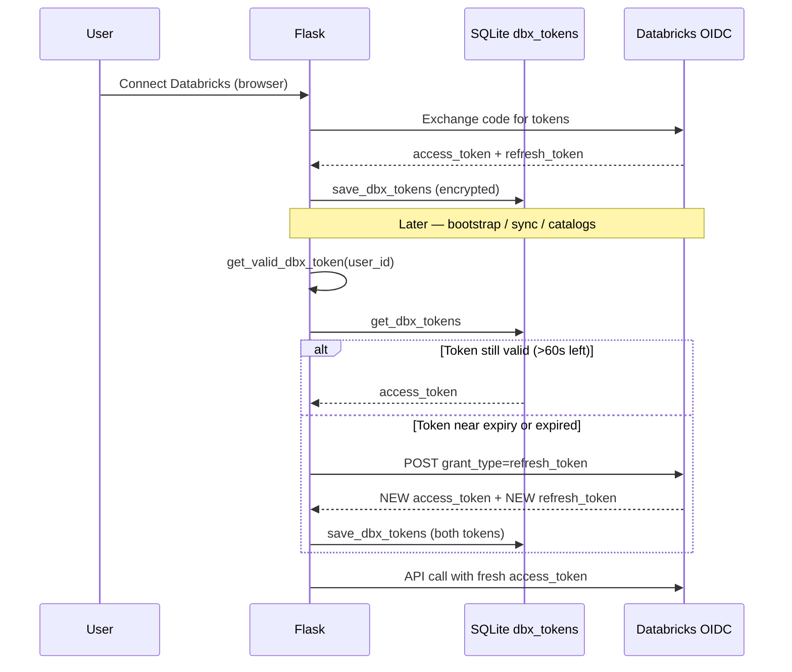
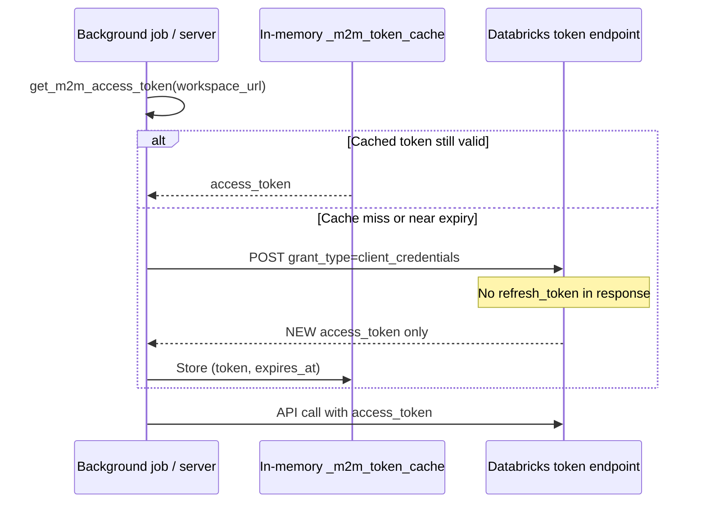

# Databricks Authentication — Beginner Guide + Technical Reference

This document explains **why** the connector had HTTP 403 errors, **what** refresh tokens are, **what was wrong**, **what we fixed**, and **how each line** in [`backend/utils/databricks_auth.py`](../backend/utils/databricks_auth.py) works.

Read this even if you have never heard of OAuth, refresh tokens, or REST APIs.

---

## Part 1 — Concepts (start here)

### What is an API?

An **API** (Application Programming Interface) is how one program talks to another over the network.

In this project, the Flask app calls **Databricks REST APIs** over HTTPS, for example:

```text
GET https://<workspace>/api/2.0/sql/warehouses
Authorization: Bearer <access_token>
```

Databricks checks the token. If it is valid, you get data. If not, you get an error (often **403 Forbidden**).

### What is OAuth?

**OAuth** is a standard way for a user to log in to Databricks **without** giving their password to our Flask app.

Flow in plain English:

```text
1. User clicks "Connect Databricks" in the browser
2. Browser redirects to Databricks login page
3. User approves access
4. Databricks sends our app a short-lived "authorization code"
5. Our app exchanges that code for tokens
6. We store tokens securely and use them for API calls
```

This is called **U2M** (user-to-machine) OAuth — a **human** signs in, and the app acts on their behalf.

### Two kinds of token

| Token | What it is | How long it lasts | Analogy |
|-------|------------|-------------------|---------|
| **Access token** | Proof you may call APIs right now | ~60 minutes (Databricks default) | A day-pass badge |
| **Refresh token** | A long-lived key used to get a **new** access token without asking the user to log in again | Days/weeks (until revoked) | A renewal voucher for a new day-pass |

You send the **access token** on every API request.

When the access token expires, you use the **refresh token** to get a fresh pair — **without** opening the browser again.

### What is M2M (machine-to-machine)?

**M2M** means **no human in the browser**. A **service principal** (robot account) authenticates with `client_id` + `client_secret`.

Important difference:

```text
U2M (user login):     access_token + refresh_token
M2M (service principal): access_token only — NO refresh token
```

For M2M, when the access token nears expiry, the app simply requests a **brand new** access token using `client_credentials` — there is nothing to "refresh" in the OAuth sense.

### What is PKCE?

PKCE protects the browser login step. Our app generates a secret **verifier** in the Flask session and sends only a **challenge** to Databricks. When exchanging the authorization code, we prove we own the same browser session.

Implemented in [`backend/routes/databricks_routes.py`](../backend/routes/databricks_routes.py), not in `databricks_auth.py`.

---

## Part 2 — What happened (the story)

### Symptom users saw

After using the connector for about **an hour**, Databricks calls started failing:

```text
Databricks API error 403: ...
```

Bootstrap, catalog listing, and sync would break until the user logged in to Databricks again.

### Root cause

The connector **did** implement Databricks OAuth login and **did** save tokens in SQLite (`dbx_tokens`):

- `access_token`
- `refresh_token`
- `expires_at`

But it **never refreshed** the access token before API calls.

```text
Timeline of the bug:

  T+0 min   User logs in → access_token saved (valid ~60 min)
  T+30 min  API calls still work
  T+61 min  access_token EXPIRED
  T+61 min  DatabricksClient still sends OLD token → HTTP 403
```

### Why ACC worked but Databricks did not

ACC (Autodesk) already had refresh logic in [`backend/clients/acc/auth_client.py`](../backend/clients/acc/auth_client.py):

```python
def get_valid_token(user_id):
    # If near expiry → POST refresh_token → save new access_token
```

Databricks had **no equivalent** until we added `get_valid_dbx_token()`.

A comment in `databricks_routes.py` incorrectly said Databricks tokens "refresh on their own." **They do not** — our code must refresh them.

### The second bug: wrong save after refresh

There was a helper `update_dbx_access_token()` that only updated the **access token** in SQLite.

Databricks **single-use refresh tokens** (common for ISV/partner OAuth apps) return a **new refresh_token** on every refresh. If you:

1. Refresh successfully
2. Save only the new `access_token`
3. Keep the old `refresh_token` in the database

…then the **next** refresh fails with `invalid_grant` / 403, because the old refresh token was already consumed.

| What we did wrong | What we must do |
|-------------------|-----------------|
| Never called refresh before API calls | Call `get_valid_dbx_token()` before every Databricks API use |
| `update_dbx_access_token()` — access only | `save_dbx_tokens()` — save **both** tokens after refresh |
| Assumed tokens "refresh on their own" | Mirror ACC's `get_valid_token()` pattern for Databricks |

### Note: 403 in `bulk_downloader.py` is different

[`notebooks/bulk_downloader.py`](../notebooks/bulk_downloader.py) treats HTTP **403/410** on **Autodesk signed download URLs** (expired links). That is **not** Databricks OAuth. Do not confuse the two.

---

## Part 3 — What we fixed (summary)

| Area | Before | After |
|------|--------|-------|
| Token refresh | Missing for Databricks | `get_valid_dbx_token()` in `databricks_auth.py` |
| Refresh token rotation | Not persisted | `save_dbx_tokens()` saves new refresh_token |
| API call sites | Used stale `db.get_dbx_tokens()` | Use `get_valid_dbx_token()` or `create_databricks_client_for_user()` |
| M2M (optional) | Not implemented | `get_m2m_access_token()` with in-memory cache |
| Tests | None | [`tests/test_databricks_auth.py`](../tests/test_databricks_auth.py) |
| SDK | N/A | Partial adoption via [`databricks_sdk_adapter.py`](../backend/clients/databricks_sdk_adapter.py) |

### Call sites wired to refresh (U2M)

- [`backend/routes/bootstrap_routes.py`](../backend/routes/bootstrap_routes.py)
- [`backend/routes/databricks_routes.py`](../backend/routes/databricks_routes.py) — `/databricks/catalogs`
- [`backend/services/sync/sync_orchestrator.py`](../backend/services/sync/sync_orchestrator.py)
- [`backend/services/zerobus_service.py`](../backend/services/zerobus_service.py)

---

## Part 4 — Flow diagrams

### U2M (user OAuth) — after fix



### M2M (service principal) — no refresh token



---

## Part 5 — Line-by-line: `databricks_auth.py`

File: [`backend/utils/databricks_auth.py`](../backend/utils/databricks_auth.py)

### Lines 1–16 — Imports, logging, module-level config

| Line | Code | What it does (beginner) |
|------|------|-------------------------|
| 1 | (blank) | — |
| 2 | `import logging` | Lets us write log messages when tokens refresh or fail |
| 3 | `import os` | Read environment variables (client IDs, secrets) |
| 4 | `import time` | Compare "now" vs token expiry timestamps |
| 6 | `import requests` | HTTP library to POST to Databricks token URL |
| 8 | `from backend.repositories import state_store as db` | Load/save encrypted tokens in SQLite |
| 10 | `logger = logging.getLogger(__name__)` | Named logger for this file |
| 12 | `DBX_OAUTH_SCOPE = os.getenv(...)` | OAuth scopes requested at login; `offline_access` needed to get a refresh token |
| 13 | `TOKEN_REFRESH_BUFFER_SEC = 60` | Refresh **60 seconds before** expiry so API calls never use a dying token |
| 15 | `_oidc_endpoint_cache = {}` | Remember authorize/token URLs per workspace (avoid repeated discovery HTTP calls) |
| 16 | `_m2m_token_cache = {}` | In-memory cache for M2M access tokens: `cache_key → (token, expires_at)` |

**Why `offline_access` in scope?** Without it, Databricks may not issue a refresh token, and silent renewal becomes impossible.

---

### Lines 19–26 — `_detect_cloud_provider`

| Line | What it does |
|------|----------------|
| 19–26 | Looks at workspace URL hostname to guess `azure`, `aws`, `gcp`, or `unknown`. Used when building account-level M2M token URLs. |

Example: `https://adb-123.4.azuredatabricks.net` → `azure`.

---

### Lines 29–58 — `_resolve_databricks_oidc_endpoints`

**Purpose:** Find the correct OAuth URLs for a workspace.

| Line | What it does |
|------|----------------|
| 31–33 | If we already resolved this workspace, return cached URLs |
| 35–39 | If `.env` has `DATABRICKS_OAUTH_AUTHORIZE_URL` and `DATABRICKS_OAUTH_TOKEN_URL`, use those (testing override) |
| 41–51 | Try standard OIDC discovery: `GET {workspace}/oidc/.well-known/oauth-authorization-server` |
| 48–49 | Read `authorization_endpoint` and `token_endpoint` from JSON |
| 52–53 | If discovery fails, log warning |
| 55–58 | Fallback to `{workspace}/oidc/v1/authorize` and `.../token` |

**Wrong API symptom:** If token URL is wrong, login or refresh POST returns 404/400 — not the same as expired access token 403, but still auth failure.

---

### Lines 61–78 — Credential helpers

| Function | Env variable | Used for |
|----------|--------------|----------|
| `_databricks_oauth_client_id()` | `DATABRICKS_CLIENT_ID` | U2M browser OAuth app |
| `_databricks_oauth_client_secret()` | `DATABRICKS_CLIENT_SECRET` | U2M browser OAuth app |
| `_sp_client_id()` | `DATABRICKS_SP_CLIENT_ID` | M2M service principal |
| `_sp_client_secret()` | `DATABRICKS_SP_CLIENT_SECRET` | M2M service principal |
| `_sp_scope()` | `DATABRICKS_SP_SCOPE` (default `all-apis`) | M2M token scope |

**Do not mix these up:** `DATABRICKS_CLIENT_ID` is the **user login app**. `DATABRICKS_SP_CLIENT_ID` is the **robot/service principal** — different credentials, different flow.

---

### Lines 81–99 — `_resolve_m2m_token_url`

**Purpose:** Where to POST for M2M `client_credentials` token.

| Line | What it does |
|------|----------------|
| 83–85 | If `DATABRICKS_SP_TOKEN_URL` is set, use it (account-level token endpoint) |
| 87–96 | Else if `DATABRICKS_ACCOUNT_ID` set, build account URL for azure/aws/gcp |
| 98–99 | Else use workspace token URL from OIDC discovery (same as U2M refresh) |

---

### Lines 102–163 — `get_valid_dbx_token` (THE MAIN U2M FIX)

This is the Databricks equivalent of ACC `get_valid_token()`.

```python
def get_valid_dbx_token(user_id: str) -> dict:
```

| Line | Code | What it does (step by step) |
|------|------|-----------------------------|
| 111 | `record = db.get_dbx_tokens(user_id)` | Load encrypted tokens from SQLite for this user |
| 112–113 | `if not record: raise` | User never completed Databricks login |
| 115–116 | `if time.time() < record['expires_at'] - 60: return record` | **Fast path:** token still good → return immediately, no HTTP call |
| 118 | `refresh_token = record.get('refresh_token')` | Get the renewal voucher |
| 119–122 | `if not refresh_token: raise` | Cannot renew — user must log in again in browser |
| 124–129 | Check `DATABRICKS_CLIENT_ID/SECRET` | OAuth app credentials required for refresh POST |
| 131 | `_, token_url = _resolve_databricks_oidc_endpoints(...)` | Where to send refresh request |
| 132 | `logger.info('Refreshing...')` | Audit log |
| 133–142 | `requests.post(token_url, data={ grant_type: refresh_token, ... })` | **The actual refresh API call** |
| 143–151 | `if status in (400,401,403): raise re-auth` | Refresh token dead/revoked — user must log in again |
| 152 | `resp.raise_for_status()` | Other HTTP errors |
| 153 | `tokens = resp.json()` | Parse new tokens from response body |
| 154 | `new_refresh = tokens.get('refresh_token') or refresh_token` | **Single-use rotation:** save NEW refresh token if Databricks sent one |
| 155–162 | `db.save_dbx_tokens(...)` | Persist **both** tokens encrypted in SQLite |
| 163 | `return db.get_dbx_tokens(user_id)` | Return fresh record to caller |

**What you must NOT do anymore:**

```python
# WRONG — may use expired token
dbx_tok = db.get_dbx_tokens(user_id)
client = DatabricksClient(dbx_tok['workspace_url'], dbx_tok['access_token'])

# RIGHT — refreshes first if needed
from backend.utils.databricks_auth import create_databricks_client_for_user
client = create_databricks_client_for_user(user_id)
```

---

### Lines 166–216 — `get_m2m_access_token`

**Purpose:** Get a service-principal token **without** a logged-in user.

| Line | What it does |
|------|----------------|
| 180–186 | Require `DATABRICKS_SP_CLIENT_ID` and `DATABRICKS_SP_CLIENT_SECRET` |
| 188–189 | Build cache key: `workspace_url:client_id` |
| 190–193 | If cached token exists and not within 60s of expiry → return cached token |
| 195 | Resolve M2M token URL |
| 197–205 | `POST` with `grant_type=client_credentials`, HTTP Basic auth `(client_id, client_secret)` |
| 206–210 | On 400/401/403 → raise (bad SP credentials or permissions) |
| 212–215 | Save `access_token` and `expires_at` in `_m2m_token_cache` only (not SQLite) |
| 216 | Return access token string |

**Why no refresh token for M2M?**

OAuth `client_credentials` grant is designed for server-to-server. Databricks returns only a short-lived `access_token`. To "renew," you simply call the same token endpoint again with the same client ID/secret — no separate refresh voucher exists.

```text
U2M refresh:  refresh_token  →  new access + new refresh
M2M "refresh": client_id + secret  →  new access only (repeat as needed)
```

---

### Lines 219–237 — Factory helpers

| Function | What it does |
|----------|----------------|
| `m2m_configured()` | Returns `True` if SP env vars are set (feature detection) |
| `create_databricks_client_for_user(user_id)` | `get_valid_dbx_token()` → `DatabricksClient(workspace, access_token)` |
| `create_databricks_client_m2m(workspace_url)` | `get_m2m_access_token()` → `DatabricksClient(workspace, access_token)` |

Use these so every API path gets a fresh token automatically.

---

## Part 6 — Without SDK vs with SDK

### What the Databricks SDK provides

Package: `databricks-sdk` (see [`requirements.txt`](../requirements.txt))

The SDK can:

- Manage auth from `~/.databrickscfg` profiles
- Auto-refresh tokens **when using SDK-managed OAuth profiles**
- Expose typed APIs (`workspace_client.catalogs.list()`, etc.)

Adapter: [`backend/clients/databricks_sdk_adapter.py`](../backend/clients/databricks_sdk_adapter.py)

```python
def create_workspace_client(host: str, access_token: str) -> WorkspaceClient:
    return WorkspaceClient(host=host.rstrip('/'), token=access_token)
```

### Why we did NOT rely on SDK for refresh (this project)

Our tokens live in **per-user SQLite**, not in SDK config files. Each browser user has their own `user_id` and their own encrypted `dbx_tokens` row.

The SDK does not know about our Flask session or SQLite. So we:

1. **Keep** refresh logic in `databricks_auth.py` (explicit, testable)
2. **Pass** already-valid tokens into `WorkspaceClient(host=..., token=...)`
3. **Keep** [`DatabricksClient`](../backend/clients/databricks_client.py) as primary HTTP layer (Files API, pipelines, workflows)

### Code you need WITHOUT SDK (what we implemented)

| Need | Code to add / use |
|------|-------------------|
| Refresh before API call | `get_valid_dbx_token(user_id)` |
| Build HTTP client | `create_databricks_client_for_user(user_id)` |
| M2M server calls | `get_m2m_access_token(workspace_url)` |
| OIDC token URL | `_resolve_databricks_oidc_endpoints(workspace_url)` |
| Persist both tokens | `db.save_dbx_tokens(..., access, refresh, expires_in)` |
| Refresh HTTP call | `requests.post(token_url, data={ grant_type: 'refresh_token', ... })` |
| M2M HTTP call | `requests.post(token_url, auth=(id, secret), data={ grant_type: 'client_credentials', ... })` |

### Minimal refresh implementation (educational — already in repo)

This is essentially what `get_valid_dbx_token` does:

```python
import time
import requests
from backend.repositories import state_store as db

BUFFER_SEC = 60

def get_valid_dbx_token(user_id: str) -> dict:
    record = db.get_dbx_tokens(user_id)
    if not record:
        raise RuntimeError('Databricks not connected')

    # Still valid? Return cached access token.
    if time.time() < record['expires_at'] - BUFFER_SEC:
        return record

    # Need refresh — require refresh_token
    refresh = record.get('refresh_token')
    if not refresh:
        raise RuntimeError('Re-authenticate in browser')

    _, token_url = _resolve_databricks_oidc_endpoints(record['workspace_url'])
    resp = requests.post(
        token_url,
        data={
            'grant_type':    'refresh_token',
            'refresh_token': refresh,
            'client_id':     os.environ['DATABRICKS_CLIENT_ID'],
            'client_secret': os.environ['DATABRICKS_CLIENT_SECRET'],
        },
        timeout=15,
    )
    if resp.status_code in (400, 401, 403):
        raise RuntimeError('Refresh failed — re-authenticate')

    body = resp.json()
    db.save_dbx_tokens(
        user_id,
        record['workspace_url'],
        body['access_token'],
        body.get('refresh_token') or refresh,  # IMPORTANT: save new refresh too
        body.get('expires_in', 3600),
        cloud_provider=record.get('cloud_provider', 'unknown'),
    )
    return db.get_dbx_tokens(user_id)
```

### What SDK would look like (optional path)

```python
from backend.utils.databricks_auth import get_valid_dbx_token
from backend.clients.databricks_sdk_adapter import create_workspace_client

record = get_valid_dbx_token(user_id)
wc = create_workspace_client(record['workspace_url'], record['access_token'])
catalogs = [c.name for c in wc.catalogs.list()]
```

**SDK does not replace** `get_valid_dbx_token()` in our architecture — it consumes the token **after** we refresh it.

### Decision: partial SDK adoption

| Topic | Result |
|-------|--------|
| Auto token refresh | Handled by `databricks_auth.py`, not SDK profiles |
| U2M browser OAuth | Flask PKCE in `databricks_routes.py` — SDK interactive flow not used |
| Explicit token | `WorkspaceClient(host=..., token=...)` works with our tokens |
| API coverage | Custom `DatabricksClient` still needed for pipelines, Files API, sync workflows |

---

## Part 7 — U2M vs M2M comparison

| | U2M (user OAuth) | M2M (service principal) |
|--|-------------------|-------------------------|
| **Who signs in** | Human in browser | No human — server uses SP secret |
| **Env vars** | `DATABRICKS_CLIENT_ID`, `DATABRICKS_CLIENT_SECRET` | `DATABRICKS_SP_CLIENT_ID`, `DATABRICKS_SP_CLIENT_SECRET` |
| **Grant type** | `authorization_code` (login), then `refresh_token` | `client_credentials` |
| **Refresh token** | Yes — must save rotated refresh token | **No** — request new access token when cache expires |
| **Storage** | SQLite `dbx_tokens` per `user_id` | In-memory `_m2m_token_cache` |
| **Function** | `get_valid_dbx_token()` | `get_m2m_access_token()` |
| **Used for** | Bootstrap, sync, catalog picker (user's UC permissions) | Future background automation, Zerobus writer |

---

## Part 8 — Environment variables

### U2M (browser login — required for normal connector use)

```env
DATABRICKS_CLIENT_ID=<oauth-app-client-id>
DATABRICKS_CLIENT_SECRET=<oauth-app-client-secret>
DATABRICKS_REDIRECT_URI=http://localhost:8000/databricks/callback
DATABRICKS_OAUTH_SCOPE=all-apis offline_access
```

`offline_access` is important — it helps ensure you receive a **refresh_token**.

### M2M (optional — service principal)

```env
DATABRICKS_SP_CLIENT_ID=<service-principal-application-id>
DATABRICKS_SP_CLIENT_SECRET=<service-principal-oauth-secret>
DATABRICKS_SP_SCOPE=all-apis
# Optional account-level token:
DATABRICKS_ACCOUNT_ID=<account-id>
DATABRICKS_SP_TOKEN_URL=https://accounts.cloud.databricks.com/oidc/accounts/<account-id>/v1/token
```

---

## Part 9 — Validation and debugging

### Unit tests

[`tests/test_databricks_auth.py`](../tests/test_databricks_auth.py):

- Cached token returned when not near expiry
- Expired token triggers refresh and persists **new** refresh_token
- Missing refresh_token → re-auth error
- Refresh HTTP 403 → re-auth error
- M2M fetch and cache behavior

### Manual test (U2M refresh)

1. Connect Databricks in the UI
2. In SQLite `dbx_tokens`, set `expires_at` to a past timestamp
3. Call `GET /databricks/catalogs`
4. Expected: silent refresh in logs, catalogs load
5. If refresh_token invalid: error asking user to re-authenticate

### Common mistakes checklist

| Mistake | Symptom | Fix |
|---------|---------|-----|
| Use `db.get_dbx_tokens()` directly for API calls | 403 after ~1 hour | Use `get_valid_dbx_token()` |
| Save only access_token after refresh | Second refresh fails | `save_dbx_tokens()` with new refresh_token |
| Reuse old refresh_token after rotation | `invalid_grant` / 403 | Always persist token from refresh response |
| Confuse U2M and M2M client IDs | M2M or login fails | Separate env vars |
| Expect M2M refresh_token | N/A — M2M has none | Call `client_credentials` again |

---

## Part 10 — ODBC auth flow analogy

Databricks ODBC drivers document auth flow numbers. Mapping to this connector:

| ODBC Auth_Flow | Connector equivalent |
|----------------|---------------------|
| 0 — pass-through token | **Before fix:** static `access_token` from SQLite |
| 2 — browser U2M with auto refresh | **After fix:** `get_valid_dbx_token()` |
| 1 — client credentials | `get_m2m_access_token()` |

---

## References

- [Databricks SDK for Python](https://docs.databricks.com/aws/en/dev-tools/sdk-python)
- [Single-use refresh tokens](https://docs.databricks.com/aws/en/integrations/single-use-tokens)
- [OAuth U2M](https://docs.databricks.com/aws/en/dev-tools/auth/oauth-u2m)
- [OAuth M2M](https://docs.databricks.com/aws/en/dev-tools/auth/oauth-m2m)
- [ODBC authentication (auth flow concepts)](https://docs.databricks.com/aws/en/integrations/odbc/authentication)

---

## Quick reference — which function when?

```text
User clicked "Connect Databricks"     → databricks_routes.py (login, not refresh)
About to call Databricks REST API     → get_valid_dbx_token(user_id)
Need DatabricksClient for user        → create_databricks_client_for_user(user_id)
Background job, no user session       → get_m2m_access_token(workspace_url)
Need DatabricksClient as SP           → create_databricks_client_m2m(workspace_url)
Optional SDK experiment               → create_workspace_client(host, token)
```
