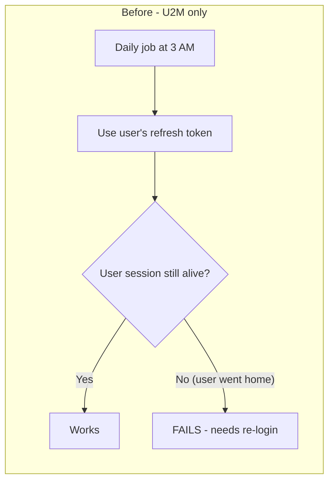
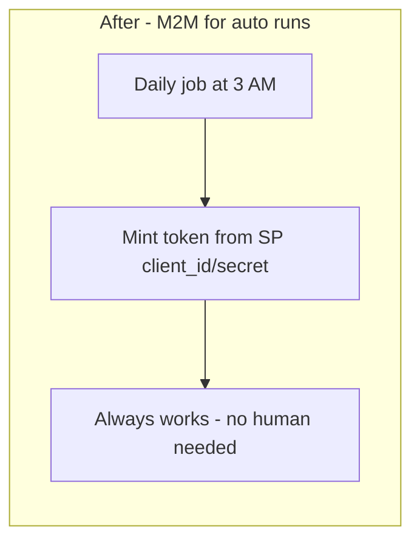
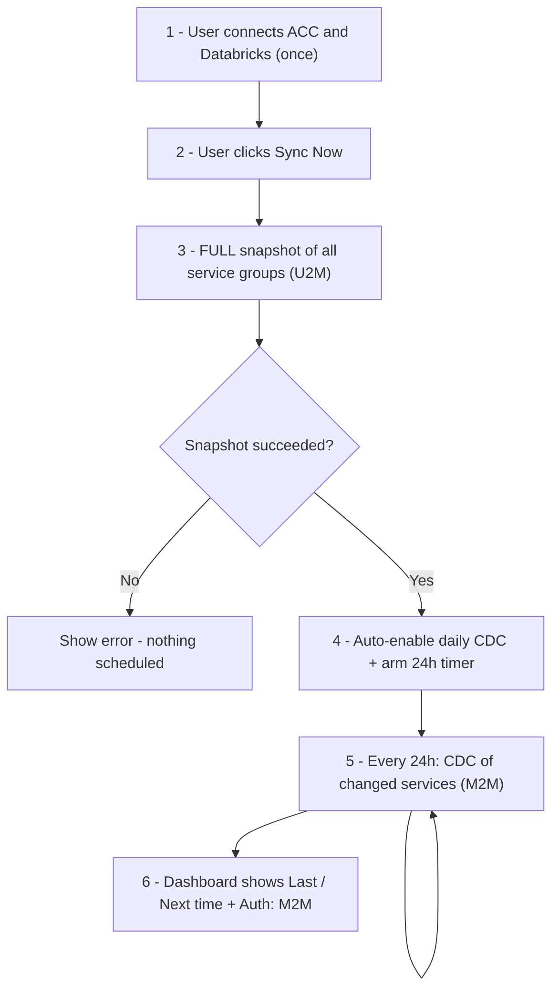
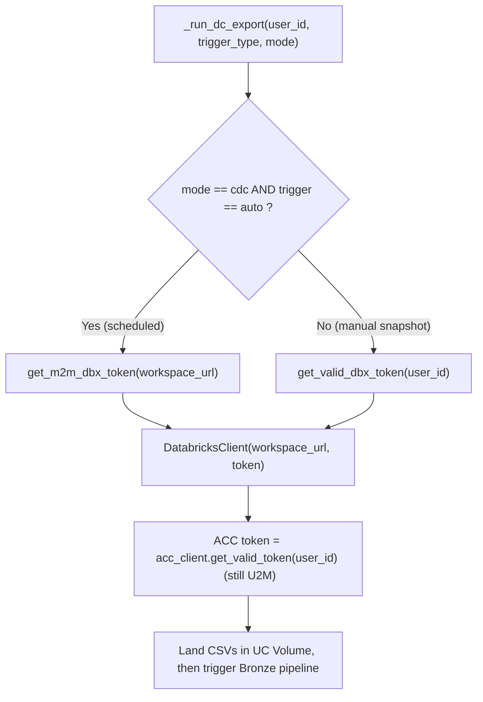
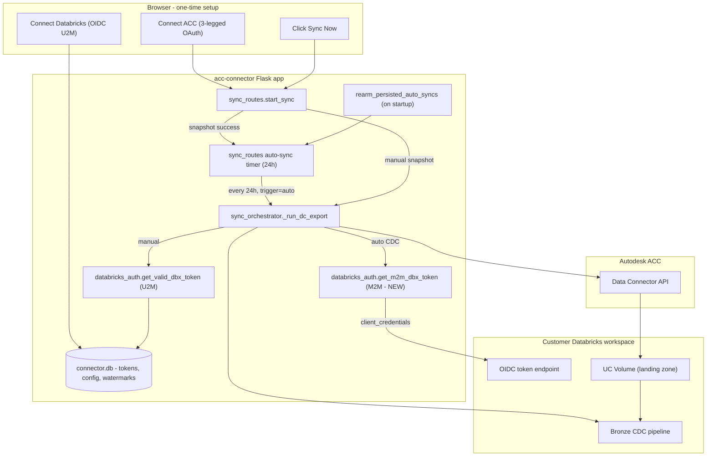
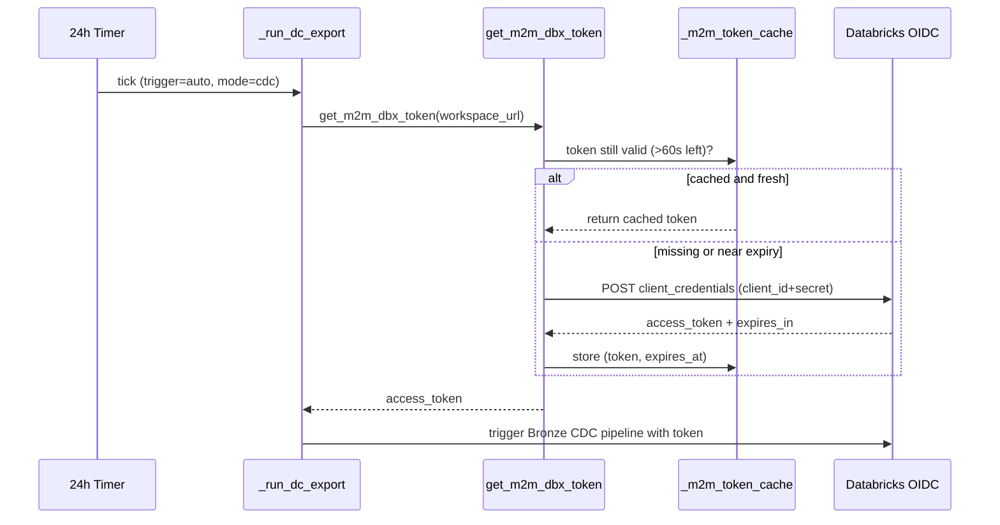
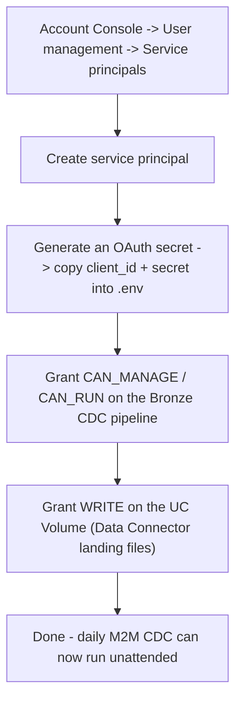
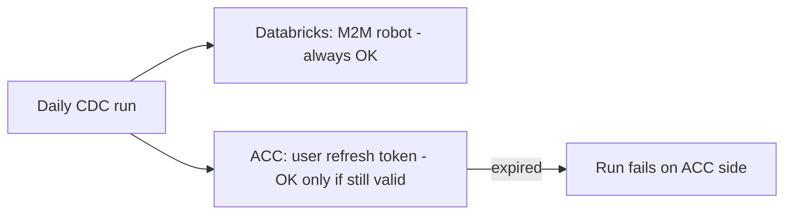

# M2M Auto CDC — Unattended Daily Change Capture

This document explains, from the ground up, the **M2M (Machine-to-Machine)** work
added to `acc-connector` so the **daily CDC sync runs on its own — with no logged-in
user**. It is written to be readable by someone new to the project (intern level):
every term is explained, every diagram is small and clean, and the full code of each
change is included.

---

## 1. The one-paragraph summary

A user connects ACC + Databricks once and clicks **Sync Now**. That first click pulls
a **full snapshot** of all service groups for the project. After that succeeds, the
connector **automatically turns on a daily CDC job** that captures only what changed,
**once every 24 hours**, **without anyone being logged in**. To do that unattended work
on the Databricks side, it stops relying on the user's personal login token and instead
uses a **service principal** (a robot account) via the **M2M** OAuth flow. The dashboard
shows the last run time, the next run time, and an **`Auth: M2M`** badge.

---

## 2. Words you need to know

| Term | Plain-English meaning |
|------|------------------------|
| **U2M** (User-to-Machine) | "Log in as a human." A person clicks **Connect**, approves, and we get a token tied to *that person*. Comes with a **refresh token** so we can renew silently — but only while that person's session stays valid. |
| **M2M** (Machine-to-Machine) | "Log in as a robot." No human, no browser. The app proves who it is using a **client_id + secret** (the `client_credentials` grant). Perfect for scheduled jobs that run at 3 AM when nobody is around. |
| **Service Principal (SP)** | A non-human identity in Databricks (a "robot user") that owns the M2M client_id/secret and is given permissions (run this pipeline, write to this volume). |
| **Snapshot** | A **full** export of all the data — taken the first time. |
| **CDC** (Change Data Capture) | An export of **only what changed** since last time. Smaller and faster, run daily. |
| **Access token** | A short-lived key (~1 hour) that proves we're allowed to call an API. |
| **Refresh token** | A longer-lived key that lets U2M mint new access tokens silently. **M2M does not use one** — it just re-asks with the client_id/secret. |
| **Watermark** | A saved timestamp marking "we have everything up to here," so the next run only fetches newer data. |

---

## 3. The problem we solved

The daily CDC job already existed, but it authenticated to Databricks using the
**user's** token (`get_valid_dbx_token`). That token chain only stays alive while the
user's refresh token is valid. So if the user closed the app and went home for the
weekend, the unattended 3 AM run could **fail** — there was no human to keep the login
fresh.



**The fix:** for scheduled/auto CDC runs only, authenticate to Databricks as a **robot**
(service principal) using **M2M**. A robot never "goes home," so the daily job is
reliable.



---

## 4. The end-to-end workflow the user sees



Key idea: **the first sync is a human action (U2M); every daily sync after that is a
robot action (M2M).**

---

## 5. How the code decides U2M vs M2M

The single decision lives in the sync orchestrator. It is intentionally tiny:

```python
use_m2m = (mode == 'cdc' and trigger_type == 'auto')
```

- **Manual "Sync Now"** → `mode='snapshot'`, `trigger='manual'` → `use_m2m = False` → **U2M**.
- **Scheduled daily** → `mode='cdc'`, `trigger='auto'` → `use_m2m = True` → **M2M**.



> Note: only the **Databricks** side became M2M. The **ACC/Autodesk** side still uses
> the user's refresh token (see Caveat in section 11).

---

## 6. Full system architecture (with the new pieces highlighted)



New/changed pieces: **`get_m2m_dbx_token` (M2M)**, **auto-enable after first snapshot**,
**`rearm_persisted_auto_syncs` on startup**, and the **`Auth: M2M`** UI badge.

---

## 7. The M2M token lifecycle (sequence diagram)



Why a cache? A token lives ~1 hour; without a cache every run would mint a brand-new
one. The cache reuses a live token and only re-mints when fewer than 60 seconds remain
(`TOKEN_REFRESH_BUFFER_SEC`).

---

## 8. Every code change, explained

### 8.1 New M2M helper — `backend/utils/databricks_auth.py`

**Module-level config and cache** (added near the top):

```python
DBX_OAUTH_SCOPE = os.getenv('DATABRICKS_OAUTH_SCOPE', 'all-apis offline_access')
# M2M (service principal) client_credentials scope — no offline_access; there is
# no user, so no refresh token is issued or needed.
DBX_M2M_SCOPE = os.getenv('DATABRICKS_M2M_SCOPE', 'all-apis')
TOKEN_REFRESH_BUFFER_SEC = 60   # rotate if token expires within 60 seconds

_oidc_endpoint_cache: dict[str, tuple[str, str]] = {}

# In-memory M2M token cache keyed by workspace_url → (access_token, expires_at).
# Scheduled CDC runs reuse a live token instead of minting one per run.
_m2m_token_cache: dict[str, tuple[str, float]] = {}
```

**Credential accessors** (read from environment — never hardcoded):

```python
def _databricks_m2m_client_id() -> str:
    return os.getenv('DATABRICKS_M2M_CLIENT_ID', '').strip()


def _databricks_m2m_client_secret() -> str:
    return os.getenv('DATABRICKS_M2M_CLIENT_SECRET', '').strip()
```

**The token function and client builder:**

```python
def get_m2m_dbx_token(workspace_url: str) -> str:
    """
    Return a Databricks M2M (service principal) access token via the OAuth
    ``client_credentials`` grant, with an in-memory per-workspace cache.

    Unlike the U2M flow there is no user and no refresh token: the connector
    re-mints a token directly from the service principal client_id/secret when
    the cached one is near expiry. Used by scheduled/auto CDC runs so they work
    with no logged-in user present.

    Raises RuntimeError if the M2M credentials are not configured.
    """
    base = workspace_url.rstrip('/')
    cached = _m2m_token_cache.get(base)
    if cached and time.time() < cached[1] - TOKEN_REFRESH_BUFFER_SEC:
        return cached[0]

    client_id = _databricks_m2m_client_id()
    client_secret = _databricks_m2m_client_secret()
    if not client_id or not client_secret:
        raise RuntimeError(
            'Databricks M2M not configured — set DATABRICKS_M2M_CLIENT_ID and '
            'DATABRICKS_M2M_CLIENT_SECRET for unattended (auto CDC) runs'
        )

    _, token_url = _resolve_databricks_oidc_endpoints(base)
    logger.info('Minting Databricks M2M access token for workspace %s', base)
    resp = requests.post(
        token_url,
        data={
            'grant_type':    'client_credentials',
            'client_id':     client_id,
            'client_secret': client_secret,
            'scope':         DBX_M2M_SCOPE,
        },
        timeout=15,
    )
    if resp.status_code in (400, 401, 403):
        # Do not log the response body — it can echo back credentials.
        logger.error(
            'Databricks M2M token request failed for %s (HTTP %s)',
            base, resp.status_code,
        )
        raise RuntimeError(
            'Databricks M2M token request rejected — verify the service '
            'principal client_id/secret and its workspace permissions'
        )
    resp.raise_for_status()
    tokens = resp.json()
    access_token = tokens['access_token']
    expires_at = time.time() + tokens.get('expires_in', 3600)
    _m2m_token_cache[base] = (access_token, expires_at)
    return access_token


def create_databricks_client_m2m(workspace_url: str):
    """Build a DatabricksClient with an M2M (service principal) access token."""
    from backend.clients.databricks_client import DatabricksClient

    return DatabricksClient(workspace_url, get_m2m_dbx_token(workspace_url))
```

**Security notes baked in:** secret comes from env vars (rule: no hardcoded secrets);
HTTPS only; the error branch deliberately **does not log the response body** so a
credentials echo can't leak into logs.

---

### 8.2 Auth selection in the orchestrator — `backend/services/sync/sync_orchestrator.py`

Import the new helper:

```python
from backend.utils.databricks_auth import get_valid_dbx_token, get_m2m_dbx_token
```

Pick the auth path inside `_run_dc_export`:

```python
# Scheduled CDC runs are unattended, so they authenticate to Databricks with
# an M2M (service principal) token instead of the user's U2M refresh token.
# Manual "Sync Now" full snapshots stay on U2M (a user is present).
use_m2m = (mode == 'cdc' and trigger_type == 'auto')
dbx_record = db.get_dbx_tokens(user_id)
if not dbx_record:
    raise RuntimeError(
        'Databricks not configured — complete Databricks connection first'
    )
if use_m2m:
    workspace_url = dbx_record['workspace_url']
    access_token = get_m2m_dbx_token(workspace_url)
else:
    try:
        dbx_tok = get_valid_dbx_token(user_id)
    except RuntimeError as exc:
        raise RuntimeError(
            'Databricks not configured — complete Databricks connection first'
        ) from exc
    workspace_url = dbx_tok['workspace_url']
    access_token = dbx_tok['access_token']
```

The run log now records which mode was used (no secrets):

```python
logger.info(
    'Sync run %d started (mode=%s trigger=%s auth=%s) user=%s project=%s',
    run_id, mode, trigger_type, 'M2M' if use_m2m else 'U2M',
    user_id, bare_project_id,
)
```

> Why read `workspace_url` from `db.get_dbx_tokens` directly? Because M2M does not need a
> refreshed *user* token — it only needs to know **which** workspace to talk to.

---

### 8.3 Auto-enable daily CDC after the first snapshot — `backend/routes/sync_routes.py`

After the manual snapshot finishes successfully, we turn the daily job on for the user
(so they don't have to flip a toggle):

```python
def _run():
    try:
        sync_service.run_sync(uid)
    except Exception as exc:
        logger.error('Background sync error: %s', exc)
        return
    # First full snapshot succeeded — auto-enable the unattended daily CDC
    # so changes are captured (via M2M) once a day without a manual toggle.
    try:
        acc_cfg = db.get_acc_config(uid)
        bs = db.get_bootstrap_state(uid)
        if acc_cfg and bs and bs.get('cdc_pipeline_id'):
            db.set_daily_cdc_enabled(uid, True)
            _start_auto_sync(
                uid,
                acc_cfg.get('project_id', ''),
                acc_cfg.get('hub_name', ''),
                acc_cfg.get('project_name', ''),
            )
    except Exception as exc:
        logger.error('Auto-enable daily CDC after full sync failed: %s', exc)
```

---

### 8.4 Survive restarts — re-arm timers on startup

The 24h schedule is an in-memory `threading.Timer`. If the server restarts, those timers
vanish. We re-create them at boot for everyone who had the toggle on.

**New DB query** in `backend/repositories/state/config_repository.py`:

```python
def list_daily_cdc_users() -> list[dict]:
    """Return config rows with the daily CDC toggle on.

    Used at startup to re-arm the in-memory auto-sync timers so scheduled CDC
    survives a process restart.
    """
    with _conn() as con:
        rows = con.execute(
            'SELECT user_id, project_id, hub_name, project_name '
            'FROM acc_config WHERE daily_cdc_enabled = 1'
        ).fetchall()
    return [dict(r) for r in rows]
```

**Re-arm function** in `backend/routes/sync_routes.py`:

```python
def rearm_persisted_auto_syncs() -> int:
    """Re-arm in-memory auto-sync timers at startup for every user whose daily
    CDC toggle is on, so scheduled M2M CDC runs survive a process restart.

    The timers live only in-process (``_auto_sync_timers``); without this the
    schedule would be silently lost on every restart. Returns the number of
    timers armed.
    """
    armed = 0
    try:
        users = db.list_daily_cdc_users()
    except Exception as exc:
        logger.error('[auto-sync] Failed to load persisted daily CDC users: %s', exc)
        return 0
    for cfg in users:
        try:
            ok = _start_auto_sync(
                cfg['user_id'],
                cfg.get('project_id', ''),
                cfg.get('hub_name', ''),
                cfg.get('project_name', ''),
            )
            if ok:
                armed += 1
        except Exception as exc:
            logger.error(
                '[auto-sync] Failed to re-arm timer for user %s: %s',
                cfg.get('user_id'), exc,
            )
    if armed:
        logger.info('[auto-sync] Re-armed %d daily CDC timer(s) at startup', armed)
    return armed
```

**Called once at startup** in `app.py` (after `db.init_db()`):

```python
# Re-arm scheduled daily CDC timers for users who enabled it before the last
# restart. Skip the Werkzeug reloader's parent process so it only runs once.
if not app.debug or os.environ.get('WERKZEUG_RUN_MAIN') == 'true':
    from backend.routes.sync_routes import rearm_persisted_auto_syncs
    rearm_persisted_auto_syncs()
```

---

### 8.5 Dashboard timestamp + auth badge

**Backend** — `/sync/auto` now tags each active entry with the auth mode
(`backend/routes/sync_routes.py`):

```python
active.append({
    'project_id':   pid,
    'hub_name':     entry.get('hub_name', ''),
    'project_name': entry.get('project_name', ''),
    'last_run_state': last_run.get('state') if last_run else None,
    'last_run_at':    last_run.get('updated_at') if last_run else None,
    'next_run_at':    entry.get('next_run_at'),
    'started_at':     entry.get('started_at'),
    'auth_mode':      'M2M',
})
```

**Frontend** — `static/app.js` renders the timestamps and an `Auth: M2M` badge:

```javascript
const lastTime = s.last_run_at ? new Date(s.last_run_at * 1000).toLocaleString() : 'N/A';
const nextTime = s.next_run_at ? new Date(s.next_run_at * 1000).toLocaleString() : 'N/A';
const authBadge = s.auth_mode
  ? `<span class="badge badge-info" title="Unattended daily CDC authenticates with a Databricks service principal">Auth: ${s.auth_mode}</span>`
  : '';
return `<div class="auto-sync-card">
          <div class="auto-sync-info">
            <div class="proj">${s.hub_name} › ${s.project_name} ${authBadge}</div>
            <div class="detail">Last auto CDC: ${lastStatus} at ${lastTime}</div>
            <div class="detail">Next run: ${nextTime}</div>
          </div>
          ...`;
```

**Style** — new badge color in `static/app.css`:

```css
.badge-info    { background: #e2e3f0; color: #383d6b; }
```

---

## 9. Environment setup

Add to `.env` (real values) and `.env.example` (placeholders):

```env
# Databricks M2M — service principal OAuth (client_credentials)
# Used ONLY by the unattended daily CDC sync (trigger=auto) so it runs with no
# logged-in user.
DATABRICKS_M2M_CLIENT_ID=<your-databricks-service-principal-client-id>
DATABRICKS_M2M_CLIENT_SECRET=<your-databricks-service-principal-oauth-secret>
# Optional — M2M scope override (default: all-apis; no offline_access for M2M)
# DATABRICKS_M2M_SCOPE=all-apis
```

### One-time service principal setup in Databricks



If these env vars are empty or the permissions are missing, the daily run raises a clear
error (`Databricks M2M not configured ...` or `... token request rejected ...`); the
manual U2M snapshot keeps working regardless.

---

## 10. How to verify

**Unit tests** (mocked — no real Databricks needed):

```powershell
cd acc-connector
python -m unittest tests.test_databricks_auth -v
```

Expected: **7 tests OK** — the original 4 U2M tests plus 3 new M2M tests:

| Test | What it proves |
|------|----------------|
| `test_returns_token_on_success` | `client_credentials` grant returns the token |
| `test_cache_avoids_second_http_call` | second call reuses the cached token (only one HTTP POST) |
| `test_missing_creds_raises` | empty M2M env vars raise a clear error |

**Manual end-to-end:**

1. Connect ACC + Databricks, click **Sync Now** → full snapshot (look for `auth=U2M` in logs).
2. Confirm the dashboard now shows an active daily CDC with **`Auth: M2M`** and a **Next run** time.
3. Trigger an auto tick and confirm the log line `Minting Databricks M2M access token ...`
   and `auth=M2M` appear.

---

## 11. Caveat (important)

Only the **Databricks** side is M2M. The unattended daily run still calls **ACC/Autodesk**
with the *user's* refresh token. If that ACC refresh token expires/rotates while the user
is away, the daily run can still fail on the ACC side.



**Future improvement:** switch the ACC side to a 2-legged (`client_credentials`) token —
a helper (`_get_2legged_token`) already exists in `backend/clients/acc/auth_client.py` —
to make the daily job fully unattended end to end.

---

## 12. Files changed (quick reference)

| File | Change |
|------|--------|
| `backend/utils/databricks_auth.py` | **NEW** `get_m2m_dbx_token`, `create_databricks_client_m2m`, M2M scope + cache + credential accessors |
| `backend/services/sync/sync_orchestrator.py` | Choose M2M for `mode=cdc, trigger=auto`; keep U2M for manual; `auth=` in run log |
| `backend/routes/sync_routes.py` | Auto-enable daily CDC after first snapshot; `rearm_persisted_auto_syncs()`; `auth_mode` in `/sync/auto` |
| `backend/repositories/state/config_repository.py` | **NEW** `list_daily_cdc_users()` |
| `app.py` | Call `rearm_persisted_auto_syncs()` at startup |
| `static/app.js` | Render last/next time + `Auth: M2M` badge |
| `static/app.css` | **NEW** `.badge-info` style |
| `.env` / `.env.example` | M2M env vars + SP permission notes |
| `tests/test_databricks_auth.py` | 3 M2M unit tests (+ fixed undefined `_AWS_WORKSPACE`) |

---

## 13. One-line summary for tickets

```text
M2M Auto CDC complete — daily CDC now authenticates to Databricks via a service
principal (client_credentials) so it runs unattended; first manual snapshot auto-enables
the schedule; timers re-arm on restart; dashboard shows last/next run + Auth: M2M badge;
unit tests 7/7 pass. (ACC side still U2M — see caveat.)
```
