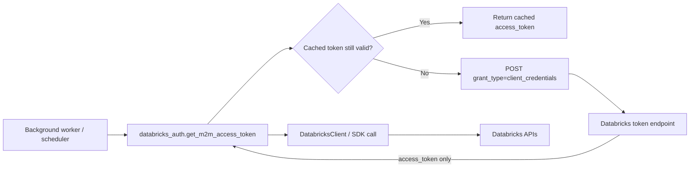
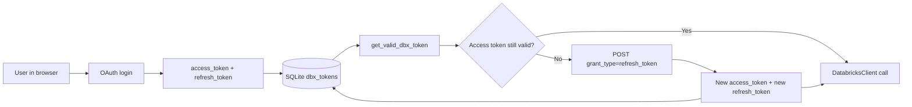
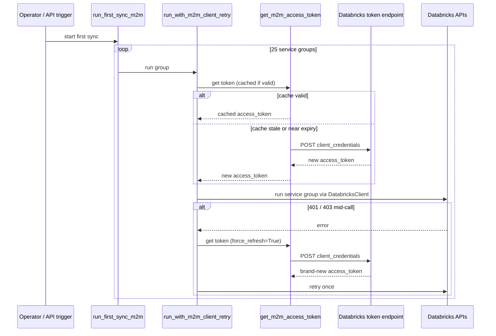
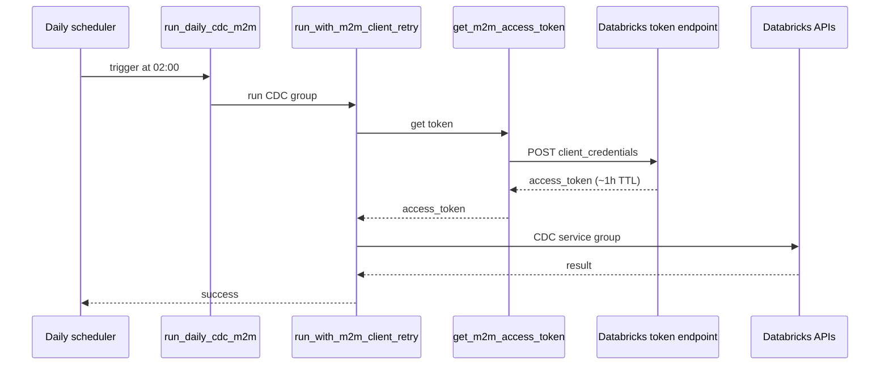
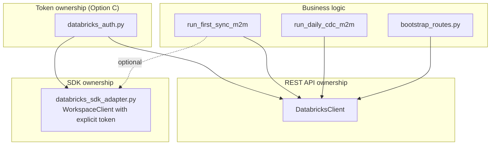

# M2M Option C (Combination) — Best Pattern for `acc-connector/`

This guide answers, in one place:

1. Which option (A, B, or C) is best for this repo and **why**.
2. Why M2M needs **token renewal** (not OAuth `refresh_token`), with diagrams.
3. The **cost picture** if M2M runs every day for a week, a month, and at scale.
4. A real-world example for one customer.
5. The **exact code changes** for Option C — what to add, where to add, what to remove — with line numbers from the current files in this repo.
6. A short explanation **next to every code block** so you understand *why* the code is there.
7. Flow diagrams for first sync (25 service groups) and daily CDC.

Companion docs:

- [`M2M_REFRESH_TOKEN_GUIDE.md`](M2M_REFRESH_TOKEN_GUIDE.md)
- [`DATABRICKS_AUTH.md`](DATABRICKS_AUTH.md)
- [`AUTH_U2M_M2M_SDK_INTEGRATION.md`](AUTH_U2M_M2M_SDK_INTEGRATION.md)

---

## 1. Short Answer

**Best for `acc-connector/`: Option C — Combination.**

```text
Token lifecycle:      backend/utils/databricks_auth.py   (no SDK)
Existing API calls:   backend/clients/databricks_client.py (DatabricksClient)
New SDK features:     backend/clients/databricks_sdk_adapter.py (SDK + explicit token)
```

Why: this repo already has 90% of Option C in place. The token manager exists, the SDK adapter exists, and every important call site (bootstrap, sync, zerobus, routes) already reads tokens through one place.

---

## 2. Why Option C Wins (Grounded in This Repo)

### 2.1 You already have a working token manager

File: `acc-connector/backend/utils/databricks_auth.py`

- Lines 102–163: `get_valid_dbx_token(user_id)` — U2M refresh.
- Lines 166–216: `get_m2m_access_token(workspace_url)` — M2M client_credentials with in-memory cache.
- Lines 232–237: `create_databricks_client_m2m(...)` factory.

You should not throw this away.

### 2.2 All API calls go through one custom HTTP client

File: `acc-connector/backend/clients/databricks_client.py`

`DatabricksClient` already wraps:

- SQL warehouses
- Unity Catalog (catalog / schema / volume / permissions)
- Jobs and pipelines
- Files API uploads

Rewriting all of these into SDK calls is a large migration with no business value today.

### 2.3 Bootstrap, sync, routes are already wired to the token manager

- `acc-connector/backend/routes/bootstrap_routes.py` (line 28, 47, 53) — uses `get_valid_dbx_token`.
- `acc-connector/backend/routes/databricks_routes.py` (lines 38–43) — uses `create_databricks_client_for_user`.
- `acc-connector/backend/services/sync/sync_orchestrator.py` (line 9, 98, 148) — uses `get_valid_dbx_token` + `DatabricksClient`.

### 2.4 You already have an SDK adapter that takes an explicit token

File: `acc-connector/backend/clients/databricks_sdk_adapter.py`

```22:33:acc-connector/backend/clients/databricks_sdk_adapter.py
def create_workspace_client(host: str, access_token: str) -> 'WorkspaceClient':
    """Instantiate WorkspaceClient with an explicit bearer token."""
    from databricks.sdk import WorkspaceClient

    return WorkspaceClient(
        host=host.rstrip('/'),
        token=access_token,
    )
```

This is literally Option C: SDK consumes a token; it does not own auth.

### 2.5 Your tests already lock in this design

File: `acc-connector/tests/test_databricks_auth.py`

Tests mock `requests.post`. If you let the SDK own auth (Option B), these tests become flaky and harder to write.

### 2.6 Why not Option A or Option B

| Option | Problem for this repo |
|--------|-----------------------|
| A. No SDK at all | You must write a REST wrapper for every new Databricks feature (UC search, Lakeflow, new jobs APIs). |
| B. SDK owns auth | Secrets read in many files, no easy `force_refresh`, harder to test, rewrites working `DatabricksClient`. |
| C. Combination | Token manager owns auth. `DatabricksClient` keeps working. SDK is used per-feature with an explicit token. |

---

## 3. Why M2M Needs Token *Renewal* (Not `refresh_token`)

### 3.1 Plain words

- **Access token**: the badge sent on every API call. Expires in about 60 minutes.
- **Refresh token** (OAuth): a long-lived voucher used to get a new access token without asking the user to log in again.

In M2M, **there is no user to log in again**. So OAuth does not issue a refresh token. The service principal simply calls the token endpoint again with its own `client_id` + `client_secret`. That is **renewal**, not refresh-token flow.

```text
U2M renewal:   refresh_token            -> new access_token (+ rotated refresh_token)
M2M renewal:   client_id + client_secret -> new access_token only
```

Both are automatic in `databricks_auth.py`.

### 3.2 Why M2M *should not* have a refresh token

- A refresh token is just another long-lived secret. The SP already has one (`client_secret`). Adding a second is more risk for zero benefit.
- M2M is always "online". It can authenticate again anytime.
- This matches the OAuth 2.1 / industry guidance: do not issue refresh tokens for the Client Credentials grant.

### 3.3 Diagram — Why M2M only renews



No box in this diagram says "refresh_token". That box never exists for M2M.

### 3.4 Diagram — How U2M differs (for comparison)



U2M has a refresh token because the user is not in the browser anymore. M2M does not need it because the SP can always present its secret.

---

## 4. Cost Picture (Day / Week / Month / Scale)

### 4.1 What costs money in this flow

| Item | Direct $ from M2M renewal? | Notes |
|------|----------------------------|-------|
| OAuth token call to Databricks | No | Auth requests are not billed. |
| Databricks SDK / `DatabricksClient` | No | Client library, not a service. |
| Compute (jobs, DLT / Lakeflow, SQL warehouses) | **Yes — main cost** | DBUs consumed by your sync workloads. |
| UC Volume storage | Yes | Object storage of exported CSVs/Parquet. |
| Egress | Sometimes | Depends on cloud and architecture. |
| Secret manager (Key Vault / Secrets Manager) | Tiny | Pennies per month per secret. |

So the literal "M2M refresh" cost is effectively zero. The expensive part is what runs **after** authentication.

### 4.2 Token-call volume math

Assume:

- 1 customer.
- First sync hits all 25 service groups across ~2 hours.
- Daily CDC runs once per day after that.
- Token TTL = 1 hour. Renewal buffer = 60 seconds.

Per-day token calls per customer:

| Run type | Token calls per run |
|----------|---------------------|
| First sync (Day 0 only) | ~2 to 3 (one initial + 1–2 renewals across 2 hours) |
| Daily CDC (Day 1+) | 1 (job is short, < 1 hour) |

Per customer per period:

| Period | Token calls |
|--------|-------------|
| 1 day  | 1 |
| 7 days (week) | 7 |
| 30 days (month) | 30 |
| 365 days (year) | 365 |

**Conclusion:** even at 1,000 customers, that is only ~30,000 token calls per month. Databricks does not bill for these. There is no cost concern from M2M renewal itself.

### 4.3 Where cost really shows up

The compute that the M2M token triggers is what costs money:

| Period | What runs | Cost driver |
|--------|-----------|-------------|
| Day 0 | First sync (25 service groups) | One-time large compute spike |
| Day 1..N | CDC only, once per day | Small incremental DBU usage |
| Week (7 days) | 6 × CDC + storage growth | Predictable, small |
| Month (30 days) | 29 × CDC + storage growth + occasional pipeline maintenance | Still much smaller than first sync |

Practical guidance:

- Make sure CDC is truly **incremental**. If it does a full pull every night, your monthly cost balloons.
- Use job clusters / serverless **with policies** (max DBU, max workers).
- Keep the M2M token cache in-process — do not call the token endpoint per API request. Code in this repo already does this (lines 190–193 of `databricks_auth.py`).

### 4.4 Future / scale concerns

| Scale change | What changes | What to do |
|--------------|--------------|------------|
| 1 worker → many Gunicorn workers | Each worker has its own in-memory cache | Fine at small scale. Consider Redis cache only if token endpoint becomes a bottleneck. |
| 1 customer → many customers | More token calls, more SP secrets to manage | Use one shared SP per workspace, or per-customer SP stored in Key Vault. Rotate secrets on a schedule. |
| Daily CDC → hourly CDC | More compute, still tiny token volume | Cost is in compute, not auth. |
| Larger ACC tenants | More files, more DBU | Watch storage growth + pipeline DBU. |

---

## 5. Real-World Example

A construction company with one Databricks workspace and one ACC account:

```text
Day 0  09:00  Admin clicks "Connect Databricks" + "Bootstrap" (U2M today).
Day 0  10:00  Operator triggers first M2M sync.
              Worker loops over 25 service groups for ~2 hours.
              get_m2m_access_token() returns cached token for ~55 minutes,
              then renews via client_credentials once.
              If an API call hits 401/403 mid-loop, retry helper renews and retries once.
Day 1  02:00  Scheduler runs daily CDC.
              Cached token is gone (process restarted or expired).
              get_m2m_access_token() calls client_credentials -> fresh access_token.
              Only the CDC service group runs (small).
Day 2..30 02:00  Same as Day 1.
```

After 30 days, the customer has paid for:

- 1 first sync (Day 0) of compute,
- 29 CDC runs of compute,
- storage growth in UC volumes,
- zero meaningful cost for "refresh".

No engineer logged in at 2 AM. No refresh token was stored. The SP authenticated again every time with `client_id` + `client_secret`.

---

## 6. Option C — Exact Code Changes for This Repo

All line numbers below match the **current** files in `acc-connector/` (as of this guide). If your M2M branch has different line numbers, search for the surrounding code block instead of trusting the line number.

### 6.1 `acc-connector/.env.example`

KEEP (already present at lines 27–34):

```env
# Optional — Service Principal M2M (client_credentials) for server-side API calls
# without a logged-in user. Create SP + OAuth secret in Databricks account console.
# DATABRICKS_SP_CLIENT_ID=<service-principal-application-id>
# DATABRICKS_SP_CLIENT_SECRET=<service-principal-oauth-secret>
# DATABRICKS_SP_SCOPE=all-apis
# Optional account-level token URL (when set with DATABRICKS_ACCOUNT_ID):
# DATABRICKS_ACCOUNT_ID=<databricks-account-id>
# DATABRICKS_SP_TOKEN_URL=https://accounts.cloud.databricks.com/oidc/accounts/<account-id>/v1/token
```

Why: these are the only env vars Option C needs for M2M. The token endpoint is auto-resolved otherwise.

REMOVE if anyone added these (they do not belong in M2M):

```env
DATABRICKS_SP_REFRESH_TOKEN=...
M2M_REFRESH_TOKEN=...
```

Why: M2M never receives a refresh token. Storing one is a security risk with no purpose.

### 6.2 `acc-connector/backend/utils/databricks_auth.py`

KEEP these existing blocks. They are the core of Option C.

```12:16:acc-connector/backend/utils/databricks_auth.py
DBX_OAUTH_SCOPE = os.getenv('DATABRICKS_OAUTH_SCOPE', 'all-apis offline_access')
TOKEN_REFRESH_BUFFER_SEC = 60   # rotate if token expires within 60 seconds

_oidc_endpoint_cache: dict[str, tuple[str, str]] = {}
_m2m_token_cache: dict[str, tuple[str, float]] = {}  # cache_key -> (access_token, expires_at)
```

Why: `_m2m_token_cache` is the in-process cache that prevents calling the token endpoint on every API call. `TOKEN_REFRESH_BUFFER_SEC = 60` means "renew if less than 60s remain", which avoids a near-expiry race.

```166:216:acc-connector/backend/utils/databricks_auth.py
def get_m2m_access_token(
    workspace_url: str,
    *,
    cloud_provider: str | None = None,
    force_refresh: bool = False,
) -> str:
    ...
```

Why: this is the single chokepoint for M2M auth. Everyone calls this. The `force_refresh=True` parameter is what makes the retry helper possible.

```232:237:acc-connector/backend/utils/databricks_auth.py
def create_databricks_client_m2m(workspace_url: str, *, cloud_provider: str | None = None):
    """Build a DatabricksClient authenticated as the configured service principal."""
    from backend.clients.databricks_client import DatabricksClient

    token = get_m2m_access_token(workspace_url, cloud_provider=cloud_provider)
    return DatabricksClient(workspace_url, token)
```

Why: this is how the rest of the codebase gets a Databricks client without knowing anything about tokens.

ADD a `force_refresh` knob to the factory. Replace lines 232–237 with:

```python
def create_databricks_client_m2m(
    workspace_url: str,
    *,
    cloud_provider: str | None = None,
    force_refresh: bool = False,
):
    """Build a DatabricksClient authenticated as the configured service principal."""
    from backend.clients.databricks_client import DatabricksClient

    token = get_m2m_access_token(
        workspace_url,
        cloud_provider=cloud_provider,
        force_refresh=force_refresh,
    )
    return DatabricksClient(workspace_url, token)
```

Why: long-running service groups occasionally hit 401/403 even with the 60s buffer (clock skew, edge cases). `force_refresh=True` lets the retry helper get a brand-new token on the second attempt.

ADD a retry helper at the bottom of the file (after line 237):

```python
def run_with_m2m_client_retry(
    workspace_url: str,
    operation,
    *,
    cloud_provider: str | None = None,
):
    """
    Run `operation(dbx)` with a fresh M2M client.

    If Databricks returns 401/403, renew the token once with force_refresh=True
    and retry the operation. This is NOT OAuth refresh-token flow; it is
    client_credentials renewal.
    """
    client = create_databricks_client_m2m(
        workspace_url,
        cloud_provider=cloud_provider,
    )
    try:
        return operation(client)
    except RuntimeError as exc:
        msg = str(exc)
        auth_failed = (
            'Databricks API error 401' in msg
            or 'Databricks API error 403' in msg
        )
        if not auth_failed:
            raise

        logger.warning(
            'Databricks M2M token rejected; renewing and retrying once for %s',
            workspace_url,
        )
        fresh_client = create_databricks_client_m2m(
            workspace_url,
            cloud_provider=cloud_provider,
            force_refresh=True,
        )
        return operation(fresh_client)
```

Why: `DatabricksClient._raise()` in this repo raises `RuntimeError("Databricks API error 401: ...")` on auth failure. The helper looks for that text, force-renews, and retries exactly once. One retry is enough; if it fails again, the cause is permission or config, not a stale token.

REMOVE anything like this if it exists in your M2M branch:

```python
# WRONG — M2M does not have a refresh_token
def _sp_refresh_token():
    return os.getenv('DATABRICKS_SP_REFRESH_TOKEN', '').strip()

resp = requests.post(
    token_url,
    data={
        'grant_type': 'refresh_token',
        'refresh_token': _sp_refresh_token(),
        'client_id': client_id,
        'client_secret': client_secret,
    },
    timeout=15,
)
```

Why: Databricks will reject this for service principals. Even if it appeared to work, it would conflate U2M and M2M flows and break tests.

### 6.3 `acc-connector/backend/clients/databricks_sdk_adapter.py`

KEEP as-is (lines 21–33):

```22:33:acc-connector/backend/clients/databricks_sdk_adapter.py
def create_workspace_client(host: str, access_token: str) -> 'WorkspaceClient':
    """Instantiate WorkspaceClient with an explicit bearer token."""
    from databricks.sdk import WorkspaceClient

    return WorkspaceClient(
        host=host.rstrip('/'),
        token=access_token,
    )
```

Why: this is the exact "SDK with explicit token" pattern Option C requires. Do not change it to use SDK-native `client_id`/`client_secret` auth.

ADD an M2M convenience function (after line 33):

```python
from backend.utils.databricks_auth import get_m2m_access_token


def create_workspace_client_m2m(
    host: str,
    *,
    cloud_provider: str | None = None,
):
    """SDK WorkspaceClient using an M2M access token from databricks_auth."""
    token = get_m2m_access_token(host, cloud_provider=cloud_provider)
    return create_workspace_client(host, token)
```

Why: gives new features a one-liner to use the SDK without duplicating token logic. Token ownership stays in `databricks_auth.py`.

REMOVE anything like this if present:

```python
# WRONG for Option C — SDK reads secrets directly
WorkspaceClient(
    host=workspace_url,
    client_id=os.environ['DATABRICKS_SP_CLIENT_ID'],
    client_secret=os.environ['DATABRICKS_SP_CLIENT_SECRET'],
)
```

Why: scatters secret reads across files and hides token renewal from logs and tests.

### 6.4 `acc-connector/backend/services/sync/sync_orchestrator.py` (M2M paths only)

This file is currently U2M-only (lines 98, 148). For an M2M path, add separate functions instead of changing U2M logic.

ADD at the top of the file (near line 9, after the existing import):

```python
from backend.utils.databricks_auth import (
    get_valid_dbx_token,
    run_with_m2m_client_retry,
)
```

Why: keep one import line for all auth helpers; do not import inside functions.

ADD a list of service groups (near the existing `_run_dc_export` definition, around line 87):

```python
M2M_SERVICE_GROUPS = [
    'projects',
    'users',
    'companies',
    # ... fill in all 25 service group keys
]
```

Why: a single source of truth for "what runs in the first M2M sync". Easier to add/remove a group later.

ADD M2M first-sync function (anywhere below `_run_dc_export`):

```python
def run_first_sync_m2m(workspace_url: str) -> None:
    """First-time M2M full sync across all service groups.

    Renews the Databricks access token before every group so a 2-hour run
    never hits an expired token. Retries once with a forced token renewal
    if any group fails with 401/403.
    """
    for service_group in M2M_SERVICE_GROUPS:
        def _run_group(dbx, sg=service_group):
            return run_one_service_group(dbx, sg)

        run_with_m2m_client_retry(workspace_url, _run_group)
```

Why: each iteration calls `create_databricks_client_m2m` -> `get_m2m_access_token`, which returns the cached token if still valid or renews otherwise. The `sg=service_group` default avoids the Python closure-late-binding trap inside a loop.

ADD M2M daily CDC function:

```python
def run_daily_cdc_m2m(workspace_url: str) -> dict:
    """Daily M2M CDC sync. Fresh token at the start of each run."""
    def _run_cdc(dbx):
        return run_cdc_service_group(dbx)

    return run_with_m2m_client_retry(workspace_url, _run_cdc)
```

Why: the scheduler triggers this once per day. Cached token will almost always be expired between runs; that is fine because the token manager just renews.

DO NOT change the existing U2M `_run_dc_export` path (lines 87–148). U2M sync still uses `get_valid_dbx_token(user_id)` because Unity Catalog permissions follow the logged-in user.

REMOVE this pattern if it ever appears in M2M sync code:

```python
# WRONG for a 2-hour M2M run
dbx_tok = get_valid_dbx_token(user_id)         # U2M only
dbx = DatabricksClient(dbx_tok['workspace_url'], dbx_tok['access_token'])
for sg in M2M_SERVICE_GROUPS:
    run_one_service_group(dbx, sg)             # token can expire mid-loop
```

Why: it ties M2M sync to a logged-in user *and* reuses one possibly stale token across the entire loop.

### 6.5 `acc-connector/tests/test_databricks_auth.py`

KEEP the existing M2M test (lines 118–150). It already covers the basic cache.

ADD a near-expiry renewal test (inside `class TestGetM2mAccessToken`):

```python
@patch('backend.utils.databricks_auth.requests.post')
@patch.dict(
    'os.environ',
    {
        'DATABRICKS_SP_CLIENT_ID':     'sp-id',
        'DATABRICKS_SP_CLIENT_SECRET': 'sp-secret',
    },
)
def test_m2m_refetches_token_when_cache_near_expiry(self, mock_post):
    ws = 'https://adb-1.2.azuredatabricks.net'
    auth._m2m_token_cache[f'{ws}:sp-id'] = ('old', time.time() + 30)

    mock_resp = MagicMock()
    mock_resp.status_code = 200
    mock_resp.json.return_value = {'access_token': 'new', 'expires_in': 3600}
    mock_post.return_value = mock_resp

    self.assertEqual(auth.get_m2m_access_token(ws), 'new')
    mock_post.assert_called_once()
```

Why: proves the 60-second buffer actually triggers renewal — protects against someone "optimizing" the buffer away.

ADD a force-refresh test:

```python
@patch('backend.utils.databricks_auth.requests.post')
@patch.dict(
    'os.environ',
    {
        'DATABRICKS_SP_CLIENT_ID':     'sp-id',
        'DATABRICKS_SP_CLIENT_SECRET': 'sp-secret',
    },
)
def test_m2m_force_refresh_bypasses_valid_cache(self, mock_post):
    ws = 'https://adb-1.2.azuredatabricks.net'
    auth._m2m_token_cache[f'{ws}:sp-id'] = ('cached', time.time() + 3600)

    mock_resp = MagicMock()
    mock_resp.status_code = 200
    mock_resp.json.return_value = {'access_token': 'forced', 'expires_in': 3600}
    mock_post.return_value = mock_resp

    self.assertEqual(auth.get_m2m_access_token(ws, force_refresh=True), 'forced')
    mock_post.assert_called_once()
```

Why: locks in that `force_refresh=True` actually bypasses the cache. This is the contract the retry helper depends on.

ADD a retry-helper test:

```python
@patch('backend.utils.databricks_auth.create_databricks_client_m2m')
def test_retry_helper_force_refreshes_after_auth_failure(self, mock_create):
    stale, fresh = object(), object()
    mock_create.side_effect = [stale, fresh]

    op = MagicMock()
    op.side_effect = [
        RuntimeError('Databricks API error 403: token expired'),
        {'ok': True},
    ]

    result = auth.run_with_m2m_client_retry('https://adb-1.2.azuredatabricks.net', op)

    self.assertEqual(result, {'ok': True})
    self.assertFalse(mock_create.call_args_list[0].kwargs.get('force_refresh', False))
    self.assertTrue(mock_create.call_args_list[1].kwargs['force_refresh'])
```

Why: proves the retry helper does exactly one renewal-and-retry cycle. Guards against accidental infinite retry loops.

REMOVE any test that expects an M2M refresh token to be returned or stored. There should be none.

---

## 7. Why This Code — Plain-English Summary

| Code piece | Why it exists |
|------------|---------------|
| `_m2m_token_cache` (line 16) | Avoid hitting Databricks token endpoint on every API call. |
| `TOKEN_REFRESH_BUFFER_SEC = 60` (line 13) | Renew slightly *before* expiry to avoid race conditions. |
| `get_m2m_access_token(... force_refresh=False)` (lines 166–216) | One place owns M2M auth. Cached by default, renews on demand. |
| `create_databricks_client_m2m(...)` (lines 232–237) | Callers ask for a Databricks client; they never touch tokens. |
| New `force_refresh` on the factory | Lets the retry helper get a brand-new token after a 401/403. |
| New `run_with_m2m_client_retry(...)` | Handles expired-mid-call cases for long-running first sync. |
| `create_workspace_client(host, token)` SDK adapter (lines 22–33) | SDK gets an explicit token; SDK does not own auth. |
| New `create_workspace_client_m2m(host)` | One-liner SDK creation for future features. |
| `M2M_SERVICE_GROUPS` list | Single source of truth for first sync scope. |
| `run_first_sync_m2m()` / `run_daily_cdc_m2m()` | Clear M2M entry points, separate from U2M sync. |

---

## 8. Flow Diagrams for Option C

### 8.1 First sync — 25 service groups



### 8.2 Daily CDC — once per day



### 8.3 Ownership map



---

## 9. Bottom Line

- Option C is the right pattern for `acc-connector/`.
- The repo already has the token manager, the SDK adapter, and the call-site wiring.
- M2M does not need a refresh token, and trying to add one is a security regression with no benefit.
- Auth costs are effectively zero, even at 1,000 customers × 30 days. The real cost lives in compute and storage.
- The only remaining work is:
  1. Add `force_refresh` to `create_databricks_client_m2m(...)`.
  2. Add `run_with_m2m_client_retry(...)` helper.
  3. Add `M2M_SERVICE_GROUPS` plus `run_first_sync_m2m()` / `run_daily_cdc_m2m()`.
  4. Add `create_workspace_client_m2m()` to the SDK adapter.
  5. Add the three new tests.
  6. Make sure no one introduced an M2M `refresh_token` anywhere — remove it if they did.
