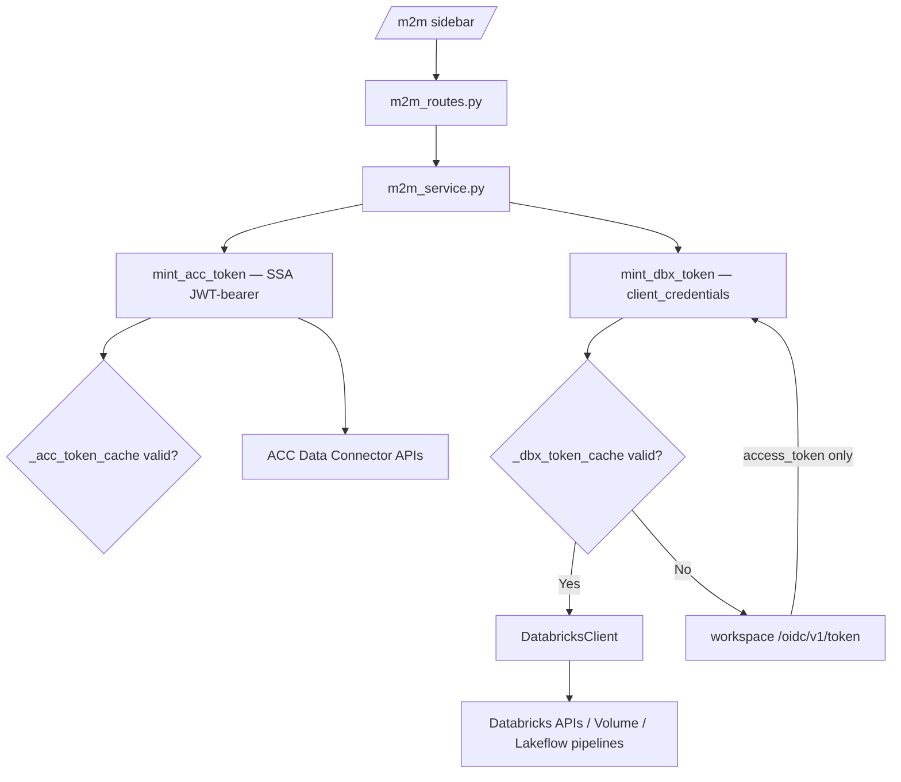

# M2M Token Renewal Guide for Databricks

> **Note on the name.** This file is called `M2M_REFRESH_TOKEN_GUIDE.md` for historical
> reasons. The most important thing it explains is that **M2M does not use a refresh token
> at all.** M2M authenticates with **service-principal credentials** (client_id +
> client_secret) using the OAuth `client_credentials` grant, and simply *mints a new
> access token* whenever the old one is near expiry. There is no `refresh_token`, so there
> is no "refresh-token fix" to do for M2M — unlike U2M.

This guide describes how M2M authentication actually works in this repo and how token
renewal is handled during first (snapshot) sync and daily CDC sync.

Related files in this repo:

- [`backend/services/m2m_service.py`](../backend/services/m2m_service.py) — the real M2M path (ACC + Databricks token minting, bootstrap, sync)
- [`backend/repositories/state/m2m_repository.py`](../backend/repositories/state/m2m_repository.py) — M2M persistence (`m2m_*` tables only)
- [`backend/routes/m2m_routes.py`](../backend/routes/m2m_routes.py) — `/m2m/*` HTTP routes
- [`backend/clients/databricks_client.py`](../backend/clients/databricks_client.py) — REST client (`update_token()` swaps the bearer token)
- [`backend/utils/databricks_auth.py`](../backend/utils/databricks_auth.py) — **U2M only** (user OAuth + refresh-token rotation). M2M does not touch this file.

---

## 1. The Main Point

### M2M does not use a refresh token — it uses M2M / service-principal credentials

In OAuth, M2M uses the **Client Credentials grant**:

```text
client_id + client_secret -> token endpoint -> short-lived access_token
```

There is no human browser login, so there is no user consent session to refresh. The
service principal authenticates again whenever it needs a new access token.

| Term | U2M (user login) | M2M (service principal) |
|------|------------------|-------------------------|
| OAuth grant | `authorization_code` then `refresh_token` | `client_credentials` |
| Human required | Yes, first login | No |
| Access token | Yes | Yes |
| **Refresh token** | **Yes (single-use, rotated)** | **No — never issued** |
| How token renews | Exchange `refresh_token` | Call `client_credentials` again with the SP secret |
| Credentials used | User's OAuth app + stored refresh token | `DATABRICKS_M2M_CLIENT_ID` / `DATABRICKS_M2M_CLIENT_SECRET` |

### Why M2M has no refresh token, and why that matters here

- A refresh token exists so you can act on behalf of a user who is no longer present.
- In M2M the service principal is always "present" — it can re-authenticate any time with
  its client_id + client_secret. A refresh token would just be another long-lived secret
  with no benefit.
- **The U2M 403 bug does not apply to M2M.** The U2M 403 came from Databricks rotating the
  *single-use refresh token* on every use — two concurrent refreshes raced and one got a
  dead token (fixed in `databricks_auth.py` with a per-user lock). M2M has no refresh
  token, so that race cannot happen. There is nothing of that kind to fix in M2M.

So when people say "M2M refresh token", they really mean:

```text
Automatically mint a new M2M access token before the old one expires.
```

That is token **renewal via client_credentials**, not OAuth refresh-token flow.

---

## 2. Actual Architecture in This Repo

M2M is a **self-contained parallel path**. It lives in
[`backend/services/m2m_service.py`](../backend/services/m2m_service.py), reads/writes only
the `m2m_*` tables, and never calls the user-mode (U2M) bootstrap/sync code. If the user
never opens the M2M sidebar item, none of it runs.

There are **two** independent token types in the M2M flow:

1. **ACC side — SSA JWT-bearer** (`mint_acc_token`): mints an Autodesk ACC access token via
   the Secure Service Account JWT-bearer grant. The APS app (`ACC_M2M_CLIENT_ID/SECRET`) is
   the *issuer*; the token identity is the SSA user (`ACC_SSA_USER_ID`).
2. **Databricks side — client_credentials** (`mint_dbx_token`): mints a Databricks service
   principal access token with `DATABRICKS_M2M_CLIENT_ID/SECRET`, scope `all-apis`.

This guide focuses on the Databricks side, but note the ACC side *also* has no refresh
token — it re-mints a JWT-bearer token the same way.



---

## 3. How Token Renewal Actually Works

### The Databricks token minter — `mint_dbx_token`

Located in [`m2m_service.py`](../backend/services/m2m_service.py). The real behavior:

- Caches the token in-memory per workspace (`_dbx_token_cache[base]`).
- Re-mints when the cached token is within `TOKEN_MINT_BUFFER_SEC = 120` seconds of expiry.
- Uses the **workspace-level** token endpoint `{workspace_url}/oidc/v1/token`.
- Sends `grant_type=client_credentials`, `scope=all-apis`, HTTP Basic auth = (client_id, secret).
- Returns `access_token` only. There is no `refresh_token` in the response and none is stored.

```python
DBX_M2M_SCOPE = 'all-apis'
TOKEN_MINT_BUFFER_SEC = 120   # re-mint this many seconds before expiry

def mint_dbx_token(workspace_url: str) -> str:
    base = workspace_url.rstrip('/')
    entry = _dbx_token_cache.get(base)
    if entry and time.time() < entry.get('expires_at', 0) - TOKEN_MINT_BUFFER_SEC:
        return entry['token']

    cid, sec = _dbx_creds()                    # DATABRICKS_M2M_CLIENT_ID / _SECRET
    r = requests.post(
        f'{base}/oidc/v1/token',
        auth=(cid, sec),
        data={'grant_type': 'client_credentials', 'scope': DBX_M2M_SCOPE},
        timeout=15,
    )
    if not r.ok:
        raise RuntimeError(f'Databricks M2M token request failed [{r.status_code}]: {r.text[:300]}')
    tok = r.json()
    expires_in = int(tok.get('expires_in', 3600))
    _dbx_token_cache[base] = {'token': tok['access_token'],
                              'expires_at': time.time() + expires_in}
    return tok['access_token']
```

### Renewal during long-running sync — **proactive re-mint** (not reactive retry)

A Databricks access token lives ~1 hour, but a first snapshot sync of ~260 tables can run
much longer. This repo handles that **proactively**: before each expensive step it re-mints
the token and swaps it into the existing client, rather than waiting for a 401/403 and
retrying.

```python
def _apply_minted_dbx_token(dbx: DatabricksClient, workspace_url: str) -> None:
    """Mint a Databricks SP token if the cache is stale; apply it to the client."""
    dbx.update_token(mint_dbx_token(workspace_url))
```

`_apply_minted_dbx_token` is called:

- before uploading files (`_upload_dc_files`), and **again every 50 files** during a long upload,
- before triggering a pipeline update (`_run_pipeline_update`),
- via the `before_poll` callback on `poll_pipeline_update`, so the token stays fresh across
  a 90-minute pipeline wait,
- before seeding the PK registry on snapshot runs.

Because `mint_dbx_token` only hits the network when the cache is within 120s of expiry,
these calls are cheap no-ops until renewal is actually needed.

### Daily CDC

Daily CDC runs once per day, so the in-memory cache is almost always cold at job start —
the first `mint_dbx_token` call gets a fresh token, and the same proactive re-mint keeps it
valid through the run. No refresh token, no persistence between days.

---

## 4. Environment Variables (as actually used)

From [`.env.example`](../.env.example) and `m2m_service.py`:

```env
# --- Databricks service principal (M2M, client_credentials) ---
DATABRICKS_M2M_CLIENT_ID=<sp-client-id>
DATABRICKS_M2M_CLIENT_SECRET=<sp-client-secret>
# scope is hardcoded to 'all-apis'; token URL is the workspace URL + /oidc/v1/token

# --- ACC side (SSA JWT-bearer) ---
# Issuer app (falls back to APS_CLIENT_ID/SECRET if the dedicated M2M app is not set)
ACC_M2M_CLIENT_ID=<aps-app-client-id>
ACC_M2M_CLIENT_SECRET=<aps-app-client-secret>
# Secure Service Account identity + signing key
ACC_SSA_USER_ID=<ssa-user-id>
ACC_SSA_KEY_ID=<ssa-public-key-kid>
ACC_SSA_PRIVATE_KEY_PATH=<path-to-ssa-private-key.pem>
```

> **There is no `DATABRICKS_SP_REFRESH_TOKEN` / `M2M_REFRESH_TOKEN` variable, and there must
> not be one.** M2M does not consume a refresh token. Do not add token-URL / account-id /
> `DATABRICKS_SP_CLIENT_ID` variables either — this repo uses the `DATABRICKS_M2M_*` names
> and the workspace-level `/oidc/v1/token` endpoint.

Security requirements:

- Do not commit `.env`. Store secrets in a managed secret store; rotate the SP secret on a schedule.
- Grant the service principal only the Unity Catalog, volume, warehouse, job, and pipeline
  permissions it needs.
- Never log tokens or secrets — log workspace URL and status only (the code follows this).

---

## 5. First Sync (25 service groups / snapshot) and Daily CDC

The M2M sync path (`_run_m2m_dc_export` in `m2m_service.py`) is:

```text
1. Read m2m_config + m2m_bootstrap_state.
2. Build a DatabricksClient with a freshly minted SP token.
3. ACC side: mint SSA token, create a Data Connector export request, wait for the job.
4. Download DC files -> upload to the UC Volume  (re-mint SP token every 50 files).
5. Trigger the AUTO CDC pipeline update, poll to completion (re-mint SP token on every poll).
6. Record the run in m2m_sync_runs and advance the watermark.
```

- **Snapshot (first/full sync)** runs the bronze AUTO CDC pipeline. It can be long, which is
  exactly why the token is re-minted at each phase and every 50 files.
- **CDC (daily incremental)** runs the CDC pipeline, optionally narrowed by `service_groups`
  and bounded by `start_date`/`end_date`. CDC is blocked until at least one snapshot has
  completed (`_assert_cdc_baseline`).

No engineer needs to be present at 2 AM, and no refresh token is stored — the service
principal re-authenticates with `client_credentials` every time.

---

## 6. SDK vs Non-SDK

This repo uses the **non-SDK REST path** (`DatabricksClient`) with a central token minter,
which is the right pattern here:

- One place (`mint_dbx_token`) owns Databricks token lifecycle.
- `DatabricksClient.update_token()` swaps the bearer token in place without rebuilding the client.
- Tests can mock `requests.post` deterministically.

If you ever adopt the Databricks SDK, keep minting the token here and pass it explicitly
(`WorkspaceClient(host=..., token=mint_dbx_token(host))`) rather than letting the SDK own
the SP credentials — that keeps a single source of truth for renewal.

---

## 7. What NOT To Do (common mistakes)

- ❌ Do **not** add a `grant_type=refresh_token` call for M2M. Databricks never issues an M2M
  refresh token; the request would fail.
- ❌ Do **not** copy the M2M token logic into `databricks_auth.py`. That file is U2M-only.
  M2M already has its own minter in `m2m_service.py`.
- ❌ Do **not** create one `DatabricksClient` at the start of a multi-hour sync and reuse it
  blindly — re-mint/re-apply the token at each phase (the code already does this).
- ❌ Do **not** try to port the U2M single-use-refresh-token 403 lock into M2M. There is no
  refresh token to serialize.

---

## 8. Final Summary

```text
U2M:
  authorization_code + single-use refresh_token, stored and rotated.
  403 race fixed with a per-user refresh lock in databricks_auth.py.

M2M:
  client_credentials with SP credentials (DATABRICKS_M2M_CLIENT_ID/SECRET).
  No refresh token — mint a new access token when the cached one is <120s from expiry.
  Long syncs stay valid via proactive re-mint (_apply_minted_dbx_token).
  Lives entirely in m2m_service.py; databricks_auth.py (U2M) is untouched.

Short answer:
  M2M needs automatic access-token RENEWAL, not a refresh token.
  It is already implemented correctly in this repo.
```
