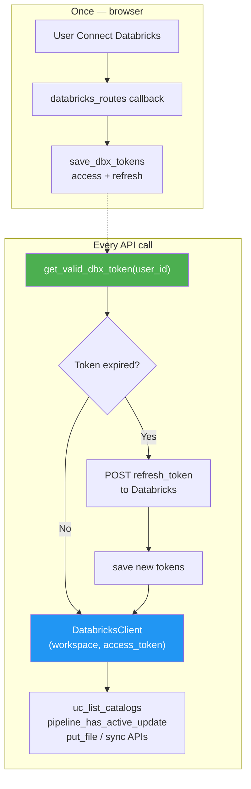
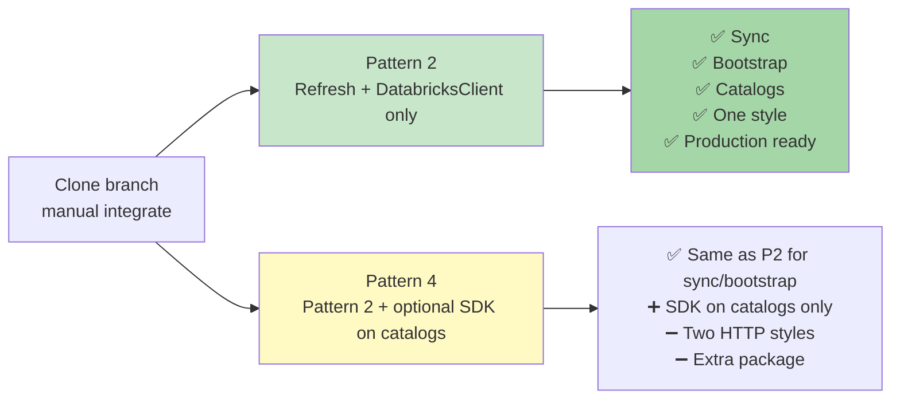

# Pattern 2 — Manual Integration Guide (U2M + DatabricksClient, No SDK)

Use this when you **clone the same branch to another folder** and want to **type or paste code by hand** to understand U2M refresh + Databricks API calls **without SDK**.

**Pattern 2 =**

```text
get_valid_dbx_token(user_id)  →  DatabricksClient  →  Databricks REST APIs
```

**You do NOT need:** `databricks-sdk`, `databricks_sdk_adapter.py`, or `WorkspaceClient`.

---

## What Pattern 2 includes

| Layer | File | Purpose |
|-------|------|---------|
| Storage | `token_repository.py` | Save/load access + refresh tokens |
| Auth | `databricks_auth.py` | Refresh when expired |
| HTTP | `databricks_client.py` | Call Databricks APIs (already in clone — keep as-is) |
| Login | `databricks_routes.py` | Browser OAuth + save tokens |
| Use sites | bootstrap, sync, catalogs, zerobus | Call auth before APIs |

---

## Integration order (do steps 1 → 7 in sequence)

```text
1. token_repository.py     (save_dbx_tokens with refresh_token)
2. databricks_auth.py      (copy whole file from source clone)
3. databricks_routes.py    (callback saves refresh_token)
4. bootstrap_routes.py     (get_valid_dbx_token)
5. sync_orchestrator.py    (get_valid_dbx_token)
6. databricks_routes.py    (catalogs uses factory)
7. tests                     (run test_databricks_auth.py)
```

---

# Step 1 — Token storage (`token_repository.py`)

**File:** `backend/repositories/state/token_repository.py`  
**Lines:** ~74–106

**VERIFY** `save_dbx_tokens` saves **both** `access_token` and `refresh_token`:

```python
def save_dbx_tokens(user_id: str, workspace_url: str, access_token: str,
                    refresh_token: str = None, expires_in: int = 3600,
                    cloud_provider: str = 'unknown') -> None:
    now = time.time()
    with _conn() as con:
        con.execute('''
            INSERT INTO dbx_tokens
                (user_id, workspace_url, cloud_provider, access_token, refresh_token, expires_at, updated_at)
            VALUES (?, ?, ?, ?, ?, ?, ?)
            ON CONFLICT(user_id) DO UPDATE SET
                workspace_url  = excluded.workspace_url,
                cloud_provider = excluded.cloud_provider,
                access_token   = excluded.access_token,
                refresh_token  = excluded.refresh_token,
                expires_at     = excluded.expires_at,
                updated_at     = excluded.updated_at
        ''', (user_id, workspace_url, cloud_provider, encrypt(access_token),
              encrypt(refresh_token) if refresh_token else None,
              now + expires_in, now))
```

**DO NOT use** `update_dbx_access_token()` for Databricks refresh — it only updates access token and breaks refresh rotation.

---

# Step 2 — Auth module (`databricks_auth.py`)

**File:** `backend/utils/databricks_auth.py`  
**Action:** Copy the **entire file** from your source clone (238 lines).

For U2M Pattern 2 you **must** have at minimum:

| Function | Line (approx) | Role |
|----------|---------------|------|
| `DBX_OAUTH_SCOPE` | 12 | Include `offline_access` for refresh_token at login |
| `TOKEN_REFRESH_BUFFER_SEC` | 13 | Refresh 60s before expiry |
| `_resolve_databricks_oidc_endpoints` | 29–58 | Find token URL per workspace |
| `get_valid_dbx_token` | 102–163 | **Core U2M refresh** |
| `create_databricks_client_for_user` | 224–229 | Pattern 2 factory |

### Core refresh function (understand this block)

```python
def get_valid_dbx_token(user_id: str) -> dict:
    record = db.get_dbx_tokens(user_id)
    if not record:
        raise RuntimeError('Databricks not connected — complete OAuth first')

    # Still valid? Return immediately — no HTTP call
    if time.time() < record['expires_at'] - TOKEN_REFRESH_BUFFER_SEC:
        return record

    refresh_token = record.get('refresh_token')
    if not refresh_token:
        raise RuntimeError('Databricks refresh token missing — user must re-authenticate')

    _, token_url = _resolve_databricks_oidc_endpoints(record['workspace_url'])
    resp = requests.post(
        token_url,
        data={
            'grant_type':    'refresh_token',
            'refresh_token': refresh_token,
            'client_id':     os.getenv('DATABRICKS_CLIENT_ID'),
            'client_secret': os.getenv('DATABRICKS_CLIENT_SECRET'),
        },
        timeout=15,
    )
    # ... error handling ...
    tokens = resp.json()
    new_refresh = tokens.get('refresh_token') or refresh_token
    db.save_dbx_tokens(
        user_id,
        record['workspace_url'],
        tokens['access_token'],
        new_refresh,
        tokens.get('expires_in', 3600),
        cloud_provider=record.get('cloud_provider', 'unknown'),
    )
    return db.get_dbx_tokens(user_id)
```

### Pattern 2 factory (shortcut for routes)

```python
def create_databricks_client_for_user(user_id: str):
    from backend.clients.databricks_client import DatabricksClient
    record = get_valid_dbx_token(user_id)
    return DatabricksClient(record['workspace_url'], record['access_token'])
```

> **Note:** File also has M2M functions (`get_m2m_access_token`). For U2M-only learning you can ignore M2M — sync uses U2M.

---

# Step 3 — Login saves refresh token (`databricks_routes.py`)

**File:** `backend/routes/databricks_routes.py`

### 3a. Imports (lines ~38–43)

```python
from backend.utils.databricks_auth import (
    DBX_OAUTH_SCOPE,
    _detect_cloud_provider,
    _resolve_databricks_oidc_endpoints,
    create_databricks_client_for_user,
)
```

### 3b. Callback — tokens born here (lines ~156–176)

**KEEP / ADD:**

```python
        tokens        = token_resp.json()
        access_token  = tokens['access_token']
        refresh_token = tokens.get('refresh_token')
        expires_in    = tokens.get('expires_in', 3600)
        cloud_provider = _detect_cloud_provider(workspace_url)
        # ... validation ...
        uid = _require_user_id()
        db.save_dbx_tokens(uid, workspace_url, access_token, refresh_token, expires_in,
                           cloud_provider=cloud_provider)
```

**REMOVE (old broken pattern):** saving only access token without refresh_token.

---

# Step 4 — Bootstrap (`bootstrap_routes.py`)

**File:** `backend/routes/bootstrap_routes.py`  
**Lines:** 28, 47, 53–54

### ADD import (line 28)

```python
from backend.utils.databricks_auth import get_valid_dbx_token
```

### REPLACE old token read with refresh (lines 46–54)

**REMOVE:**

```python
tok = db.get_dbx_tokens(uid)
bs.run_bootstrap(uid, tok['workspace_url'], tok['access_token'], catalog_name)
```

**ADD:**

```python
    try:
        get_valid_dbx_token(uid)
    except RuntimeError as exc:
        return jsonify({'error': str(exc)}), 401

    def _run():
        try:
            fresh = get_valid_dbx_token(uid)
            bs.run_bootstrap(uid, fresh['workspace_url'], fresh['access_token'], catalog_name)
        except Exception as exc:
            logger.error('Background bootstrap error: %s', exc)
```

---

# Step 5 — Sync (`sync_orchestrator.py`)

**File:** `backend/services/sync/sync_orchestrator.py`  
**Lines:** 9, 98, 140–148

### ADD import (line 9)

```python
from backend.utils.databricks_auth import get_valid_dbx_token
```

### REPLACE stale token (lines 97–98, 140–148)

**REMOVE:**

```python
dbx_tok = db.get_dbx_tokens(user_id)
# ...
dbx = DatabricksClient(dbx_tok['workspace_url'], dbx_tok['access_token'])
```

**ADD:**

```python
    try:
        dbx_tok = get_valid_dbx_token(user_id)
    except RuntimeError as exc:
        raise RuntimeError(
            'Databricks not configured — complete Databricks connection first'
        ) from exc
    # ... later ...
    workspace_url = dbx_tok['workspace_url']
    pat           = dbx_tok['access_token']
    dbx   = DatabricksClient(workspace_url, pat)
```

Sync then uses `dbx` for pipelines:

```python
dbx.pipeline_has_active_update(pipeline_id)
dbx.start_pipeline_update(pipeline_id, ...)
# etc. — all in databricks_client.py
```

---

# Step 6 — Catalogs (`databricks_routes.py`)

**File:** `backend/routes/databricks_routes.py`  
**Lines:** 204–205

### Pattern 2 code (no SDK)

```python
    uid = _require_user_id()
    try:
        client = create_databricks_client_for_user(uid)
        raw = client.uc_list_catalogs()
        # ... rest of loop unchanged ...
```

**REMOVE:**

```python
tok = db.get_dbx_tokens(uid)
client = DatabricksClient(tok['workspace_url'], tok['access_token'])
```

`create_databricks_client_for_user` internally calls `get_valid_dbx_token` then builds `DatabricksClient`.

---

# Step 7 — Zerobus (optional, if `ENABLE_ZEROBUS=true`)

**File:** `backend/services/zerobus_service.py`  
**Line:** ~171

```python
from backend.utils.databricks_auth import create_databricks_client_for_user

dbx = create_databricks_client_for_user(user_id)
catalog = dbx.uc_get_catalog(catalog_name)
```

Line ~135 `db.get_dbx_tokens` is OK — only checks "connected?", not API calls.

---

# Step 8 — Environment (`.env`)

```env
DATABRICKS_CLIENT_ID=your-oauth-app-id
DATABRICKS_CLIENT_SECRET=your-oauth-app-secret
DATABRICKS_REDIRECT_URI=http://localhost:8000/databricks/callback
DATABRICKS_OAUTH_SCOPE=all-apis offline_access
```

---

# Step 9 — Test

```bash
cd acc-connector
python -m unittest tests.test_databricks_auth -v
```

---

## Pattern 2 — all call sites summary

| File | Line | Code |
|------|------|------|
| `databricks_routes.py` | 176 | `db.save_dbx_tokens(..., refresh_token, ...)` at login |
| `databricks_routes.py` | 204–205 | `create_databricks_client_for_user(uid)` |
| `bootstrap_routes.py` | 47, 53–54 | `get_valid_dbx_token(uid)` |
| `sync_orchestrator.py` | 98, 148 | `get_valid_dbx_token` + `DatabricksClient` |
| `zerobus_service.py` | 171 | `create_databricks_client_for_user(user_id)` |

---

## Full flow diagram (Pattern 2)



---

# Why SDK-only is NOT possible for this connector

SDK (`WorkspaceClient`) is **not forbidden** — but **SDK alone cannot run the full connector**. Here is why in simple terms.

## Two different things

| | `DatabricksClient` | `WorkspaceClient` (SDK) |
|--|-------------------|-------------------------|
| Who made it? | **This connector** (`databricks_client.py`) | **Databricks** (`databricks-sdk` package) |
| Lines in repo | ~852 methods for this app | ~34 line adapter only |
| Job | Call APIs with token you give it | Call APIs with token you give it |
| Refresh token? | No | No |

**Neither creates or refreshes tokens.** Both need `get_valid_dbx_token` first.

## What sync/bootstrap need (SDK does not replace in this repo)

| Connector feature | Implemented in | SDK-only? |
|-------------------|----------------|-----------|
| List catalogs | `DatabricksClient.uc_list_catalogs()` | SDK can do this |
| Check pipeline running | `pipeline_has_active_update()` | Custom connector code |
| Start bronze pipeline | `start_pipeline_update()` | Custom connector code |
| Upload files to UC volume | `put_file()` | Custom connector code |
| Create bootstrap resources | `bootstrap_service` + client | Custom connector code |
| Sync workflows / notebooks | `sync_orchestrator` + client | Custom connector code |

**852 lines** of `databricks_client.py` were written for **this connector's exact sync/bootstrap flows**.  
SDK does not ship a drop-in replacement for all of that.

## "SDK everywhere" diagram — why it breaks

```text
Pattern 3 only (SDK everywhere) — NOT POSSIBLE for full app
────────────────────────────────────────────────────────────

User sync request
      ↓
get_valid_dbx_token  ✅
      ↓
WorkspaceClient only
      ↓
catalogs.list()     ✅ works
pipeline sync APIs  ❌ not implemented in your SDK migration
volume upload       ❌ not implemented
bootstrap provision ❌ not implemented

Result: catalogs OK, sync/bootstrap BROKEN
```

## What IS possible with SDK

```text
SDK on ONE route (Pattern 4) — possible but optional
────────────────────────────────────────────────────

catalogs route  → SDK (optional)
sync route      → DatabricksClient (required)
bootstrap       → DatabricksClient (required)
```

**Pattern 2 skips SDK entirely** — uses `DatabricksClient` for **all** routes. Simpler and complete.

---

# Pattern 2 advantages over Pattern 4

| Topic | Pattern 2 | Pattern 4 |
|-------|-----------|-----------|
| **SDK package** | Not needed | Optional on catalogs |
| **Files to touch** | Fewer | More (adapter + catalogs swap) |
| **HTTP styles in app** | One (`DatabricksClient`) | Two (client + SDK) |
| **Learning curve** | Lower | Higher |
| **Sync/bootstrap** | Same client everywhere | Same, but you must remember SDK is only on some routes |
| **Production** | ✅ Ready today | ✅ Ready, but adds optional complexity |
| **Refresh logic** | One `get_valid_dbx_token` | Same — no extra benefit from SDK |
| **403 fix after 1 hour** | ✅ | ✅ (identical auth) |

### Pattern 2 wins when (your case)

1. **Manual clone to learn** — one pattern, one client, less confusion  
2. **Full connector** — sync + bootstrap + catalogs all work  
3. **No extra dependency** — no `databricks-sdk` install/debug  
4. **Same result as Pattern 4 for sync** — Pattern 4 still uses `DatabricksClient` for sync anyway  
5. **SDK adds almost nothing for catalogs** — `uc_list_catalogs()` already works in Pattern 2  

### What Pattern 4 adds (only reason to consider it later)

| Pattern 4 extra | Worth it? |
|-----------------|-----------|
| `wc.catalogs.list()` syntax | Nice, not required |
| Learn official SDK | Optional learning exercise |
| Typed SDK models | Helpful for **new** features you write later |

**Verdict:** Pattern 2 = Pattern 4 minus optional SDK on catalogs. For understanding and production, **Pattern 2 is enough.**

---

# Pattern 2 vs Pattern 4 — decision diagram



---

# Checklist after manual integration

```text
[ ] databricks_auth.py copied — get_valid_dbx_token + create_databricks_client_for_user
[ ] save_dbx_tokens stores refresh_token
[ ] Login callback line ~176 saves refresh_token
[ ] bootstrap_routes uses get_valid_dbx_token (not raw db.get_dbx_tokens for API)
[ ] sync_orchestrator uses get_valid_dbx_token (line ~98)
[ ] catalogs uses create_databricks_client_for_user (line ~204)
[ ] NO update_dbx_access_token for Databricks refresh
[ ] .env has DATABRICKS_CLIENT_ID, SECRET, offline_access scope
[ ] unittest tests.test_databricks_auth passes
[ ] Connect Databricks → wait or force expiry → sync still works (no 403)
[ ] Did NOT add databricks-sdk (Pattern 2 — intentional)
```

---

# Files you do NOT need for Pattern 2

| File / package | Pattern 2 |
|----------------|-----------|
| `backend/clients/databricks_sdk_adapter.py` | Skip |
| `databricks-sdk` in requirements | Optional — not required |
| `WorkspaceClient` imports in routes | Skip |
| M2M env vars (`DATABRICKS_SP_*`) | Skip unless you add M2M later |

---

**Related:** `docs/U2M_REFRESH_MANUAL_INTEGRATION.md`, `docs/DATABRICKS_AUTH.md`
