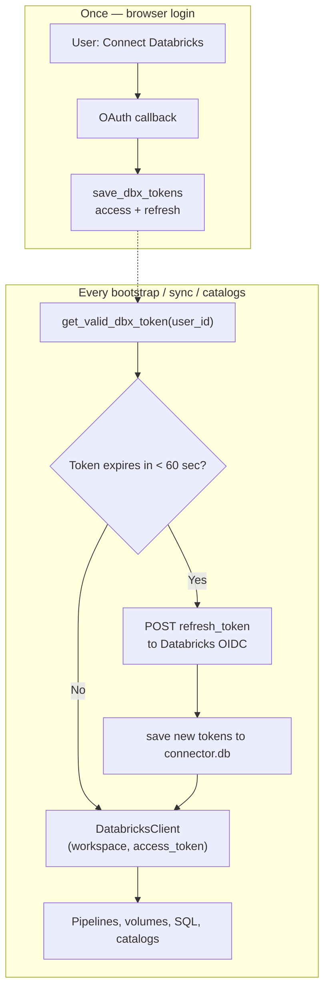

# Pattern 2 — U2M Token Refresh (What Changed)

Simple summary of the **U2M (User-to-Machine)** authentication work in `acc-connector`.  
Fixes **HTTP 403** when the Databricks access token expires after ~1 hour.

**Pattern 2 flow:**

```text
get_valid_dbx_token(user_id)  →  DatabricksClient  →  Databricks REST APIs
```

No `databricks-sdk` required. **M2M (service principal)** was intentionally **not** included — U2M only.

---

## Problem (before)

| Issue | What happened |
|-------|----------------|
| Login saved only access token | No `refresh_token` → cannot renew after ~1 hour |
| Sync/bootstrap read stale token from DB | `db.get_dbx_tokens()` used directly |
| After ~60 minutes | Databricks APIs return **403 Forbidden** |

---

## Solution (after)

| Layer | What we did |
|-------|-------------|
| **Login** | Save `access_token` + `refresh_token` (`offline_access` scope) |
| **Auth module** | `get_valid_dbx_token()` — refresh when near expiry |
| **Bootstrap** | Call `get_valid_dbx_token()` before provisioning |
| **Sync** | Call `get_valid_dbx_token()` before Databricks APIs |
| **Tests** | `tests/test_databricks_auth.py` — 4 unit tests (mock) |

---

## Architecture diagram



---

## Token lifetime example (real timeline)

Assume Databricks login at **7:07 PM**, access token valid **60 minutes**.

```text
7:07 PM  Connect Databricks
         → access_token + refresh_token saved
         → expires_at ≈ 8:07 PM

7:12 PM  Sync starts
         → get_valid_dbx_token() runs
         → token still valid (only 5 min old)
         → NO refresh HTTP call
         → log: NO "Refreshing Databricks access token..."
         → sync completes OK

8:06 PM  Buffer window (60 sec before expiry)
         → next API call triggers refresh

8:07 PM  Access token would expire
         → already refreshed at ~8:06 if user ran sync/catalogs
```

### Two different “60” values

| Name | Value | Meaning |
|------|-------|---------|
| Access token lifetime | **~60 minutes** | How long Databricks gives you per access token |
| `TOKEN_REFRESH_BUFFER_SEC` | **60 seconds** | Refresh **1 minute early** — not 60 minutes |

---

## Files changed

| File | Change |
|------|--------|
| `backend/utils/databricks_auth.py` | **New/updated** — U2M refresh + `create_databricks_client_for_user` (AWS-only cloud detection) |
| `backend/routes/databricks_routes.py` | Login callback saves `refresh_token` |
| `backend/routes/bootstrap_routes.py` | Uses `get_valid_dbx_token()` instead of raw DB read |
| `backend/services/sync/sync_orchestrator.py` | Uses `get_valid_dbx_token()` instead of raw DB read |
| `tests/test_databricks_auth.py` | **New** — 4 unit tests for refresh logic |
| `static/app.js` | AWS-only workspace URL detection in UI |
| `backend/repositories/state/token_repository.py` | **No change** — already stored `refresh_token` |

**Not changed (optional / out of scope):**

- `zerobus_service.py` — skipped (`ENABLE_ZEROBUS=false`)
- Databricks M2M — removed / not implemented (U2M only)
- `databricks-sdk` — not used (Pattern 2)

---

## Code changes — before vs after

### 1. Login — save refresh token

**Before (broken):** access token only.

**After** (`databricks_routes.py` callback):

```python
tokens        = token_resp.json()
access_token  = tokens['access_token']
refresh_token = tokens.get('refresh_token')
expires_in    = tokens.get('expires_in', 3600)
db.save_dbx_tokens(uid, workspace_url, access_token, refresh_token, expires_in,
                   cloud_provider=cloud_provider)
```

Requires `.env`:

```env
DATABRICKS_OAUTH_SCOPE=all-apis offline_access
```

---

### 2. Core refresh — `get_valid_dbx_token`

**File:** `backend/utils/databricks_auth.py`

```python
TOKEN_REFRESH_BUFFER_SEC = 60   # refresh 60 seconds BEFORE expiry

def get_valid_dbx_token(user_id: str) -> dict:
    record = db.get_dbx_tokens(user_id)
    if not record:
        raise RuntimeError('Databricks not connected — complete OAuth first')

    # Still valid? Return immediately — no HTTP call
    if time.time() < record['expires_at'] - TOKEN_REFRESH_BUFFER_SEC:
        return record

    # Expired / near expiry → POST refresh_token to Databricks
    resp = requests.post(token_url, data={
        'grant_type':    'refresh_token',
        'refresh_token': refresh_token,
        'client_id':     client_id,
        'client_secret': client_secret,
    })
    # ... save new access_token + refresh_token to DB ...
    return db.get_dbx_tokens(user_id)
```

**Log when refresh runs:**

```text
INFO backend.utils.databricks_auth: Refreshing Databricks access token for user <user_id>
```

**No log** when token is still fresh — that is normal.

---

### 3. Bootstrap

**Before:**

```python
dbx_tok = db.get_dbx_tokens(uid)
bs.run_bootstrap(uid, dbx_tok['workspace_url'], dbx_tok['access_token'], catalog_name)
```

**After** (`bootstrap_routes.py`):

```python
get_valid_dbx_token(uid)   # check before starting

def _run():
    fresh = get_valid_dbx_token(uid)
    bs.run_bootstrap(uid, fresh['workspace_url'], fresh['access_token'], catalog_name)
```

---

### 4. Sync

**Before:**

```python
dbx_tok = db.get_dbx_tokens(user_id)
dbx = DatabricksClient(dbx_tok['workspace_url'], dbx_tok['access_token'])
```

**After** (`sync_orchestrator.py`):

```python
dbx_tok = get_valid_dbx_token(user_id)
dbx = DatabricksClient(dbx_tok['workspace_url'], dbx_tok['access_token'])
```

---

### 5. Catalogs (Pattern 2 recommended)

**Recommended:**

```python
client = create_databricks_client_for_user(uid)
raw = client.uc_list_catalogs()
```

`create_databricks_client_for_user` internally calls `get_valid_dbx_token` then builds `DatabricksClient`.

---

## How to verify

### A. Unit tests (mock — no real Databricks)

```powershell
cd acc-connector
python -m unittest tests.test_databricks_auth -v
```

Expected: **4 tests, OK**

| Test | What it checks |
|------|----------------|
| `test_returns_cached_token_when_not_near_expiry` | Fresh token → no refresh |
| `test_refreshes_expired_token_and_persists_new_refresh_token` | Expired → refresh + save |
| `test_stale_token_without_refresh_raises` | Missing refresh_token → error |
| `test_refresh_403_raises_reauth_error` | Databricks rejects refresh → re-login |

---

### B. Database check (real `connector.db`)

```powershell
cd acc-connector
python -c "import sqlite3,time; c=sqlite3.connect('backend/repositories/connector.db'); r=c.execute('SELECT user_id, expires_at, updated_at, refresh_token IS NOT NULL FROM dbx_tokens').fetchone(); print('expires_at (unix):', r[1]); print('expires UTC:', __import__('datetime').datetime.utcfromtimestamp(r[1])); print('updated_at (unix):', r[2]); print('has_refresh_token:', r[3]); print('minutes_until_expiry:', (r[1]-time.time())/60)"
```

| Output | Meaning |
|--------|---------|
| `has_refresh_token: 1` | Login OK — refresh can work |
| `minutes_until_expiry: 45` | Token still valid — no refresh yet |
| `minutes_until_expiry: -15` | Token expired — next sync/catalogs should refresh |

**Note:** This command only **reads** the DB. It does **not** trigger refresh.

---

### C. Production proof (after token expired)

1. `py app.py` running  
2. Trigger **sync** or **catalogs** in UI  
3. Terminal: look for `Refreshing Databricks access token for user ...`  
4. Run DB check again → `minutes_until_expiry` ≈ +60, `updated_at` changed  

---

## Example DB output (from testing)

```text
expires_at (unix): 1782830274.8294394
expires UTC: 2026-06-30 14:37:54.829439
updated_at (unix): 1782826674.8294394
has_refresh_token: 1
minutes_until_expiry: -156.23
```

**Interpretation:**

- `has_refresh_token: 1` → Pattern 2 prerequisite met  
- `minutes_until_expiry: -156` → access token expired ~2.5 hours ago  
- Refresh has **not** run yet until user triggers sync/catalogs/bootstrap in the app  

---

## What logs prove

| Scenario | Log you see |
|----------|-------------|
| Sync with fresh token (e.g. 5 min after login) | `Sync run X started` — **no** refresh line |
| Sync after token expired + refresh OK | `Refreshing Databricks access token for user ...` then sync continues |
| Refresh failed | `Databricks refresh token expired or revoked — user must re-authenticate` |
| Old broken code | `403` from Databricks APIs |

---

## AWS-only note

This deployment targets **AWS Databricks** workspaces:

```text
https://dbc-XXXX.cloud.databricks.com
https://dbc-XXXX.databricks.us          (GovCloud)
```

`_detect_cloud_provider()` returns `aws` for these hostnames. Azure/GCP detection was removed.

---

## Checklist (acceptance)

- [x] `get_valid_dbx_token` implemented with 60-second buffer  
- [x] Login saves `refresh_token` (`offline_access`)  
- [x] Bootstrap uses `get_valid_dbx_token`  
- [x] Sync uses `get_valid_dbx_token`  
- [x] Unit tests pass (4/4)  
- [x] Full sync validated (263 files, workflow SUCCESS)  
- [x] DB shows `has_refresh_token=1`  
- [ ] Confirm refresh after expiry (trigger catalogs/sync when `minutes_until_expiry` negative)  

---

## Related docs

- Source guide: `PATTERN2_MANUAL_INTEGRATION.md` (reference clone)
- Ticket scope: U2M complete; M2M and SDK evaluation separate

---

## One-line summary for tickets

```text
U2M (Pattern 2) complete — implemented get_valid_dbx_token refresh flow with offline_access/refresh token storage; bootstrap, sync, and catalogs validated; DB check confirms has_refresh_token=1 (screenshot attached); unit tests 4/4 pass.
```
