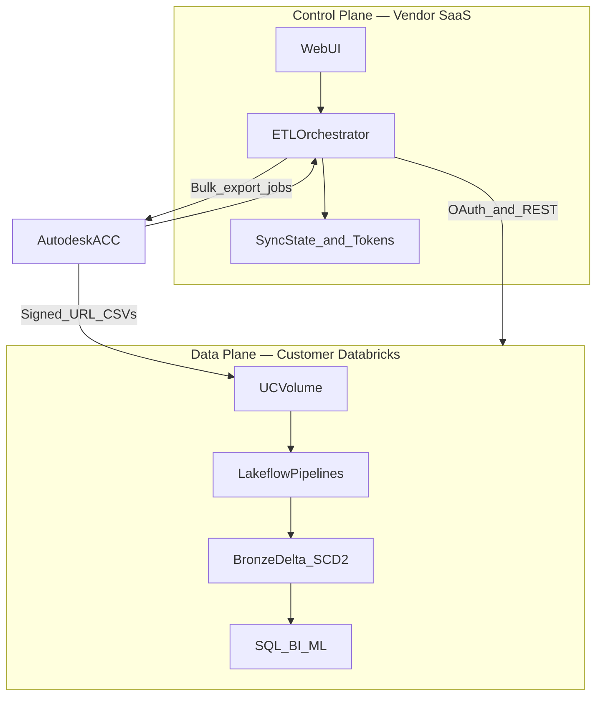
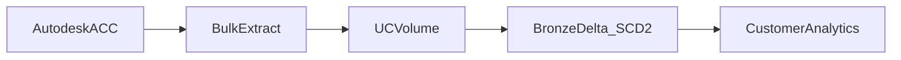

# Forma → Databricks Connector

The Forma → Databricks Connector is a **vendor-hosted SaaS ETL pipeline** that replicates Autodesk Construction Cloud (ACC) project data into your Databricks lakehouse. A **control plane** (our SaaS application) handles OAuth, orchestration, and scheduling; the **data plane** runs entirely in your Databricks workspace—CSVs land in Unity Catalog and load into Bronze Delta via Lakeflow pipelines. Today it extracts ~120–150 normalized tables per project via ACC's bulk Data Connector API, with daily CDC on ten core domains and on-demand full snapshots for the rest. Schema changes and deletes are handled automatically with full change history (SCD2) in Bronze.

## Architecture

## Data flow

## Details

| | |
|---|---|
| **Status** | Pre-beta |
| **Deployment** | Vendor-hosted SaaS control plane + customer-owned Databricks data plane |
| **Source** | Autodesk Construction Cloud (ACC) |
| **Target** | Customer Databricks workspace (Unity Catalog + Delta Lake) |
| **Extract** | ACC Data Connector bulk export (~120–150 tables / project) |
| **Load** | Unity Catalog Volume → Lakeflow pipelines → Bronze Delta (SCD2) |
| **Full sync** | On-demand snapshot (max once per 24 hours) |
| **Incremental sync** | Daily CDC on 10 core ACC domains |
| **Data residency** | Project data lands in the customer's Databricks workspace |

## Tech stack

| Layer | Technologies |
|---|---|
| **Control plane** | Python, Flask, APS OAuth, Databricks OAuth (U2M) |
| **Source API** | ACC Data Connector REST API |
| **Data plane** | Databricks Unity Catalog, UC Volumes, Delta Lake, Lakeflow Declarative Pipelines, Spark, PySpark |
| **Target integration** | Databricks REST APIs (Jobs, Pipelines, Files, SQL) |

## Future plan

Increase sync frequency beyond daily bulk/CDC by adding **per-service-group REST API ingestion**—targeting individual ACC modules (e.g. issues, RFIs, cost) for near-real-time updates into the same Bronze Delta tables.
