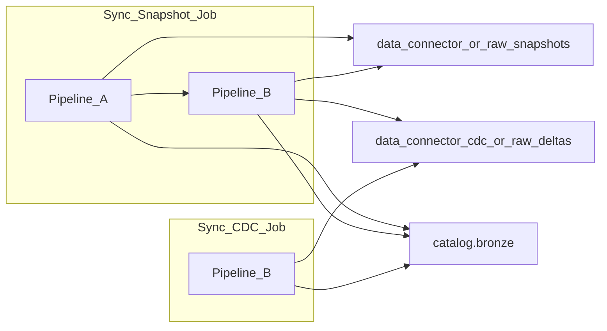

# ACC Service Groups CDC Pipeline v2 — Implementation Guide

This document describes what was implemented to align the Databricks ingestion layer with [pipeline.md](./pipeline.md).

## Architecture summary

Two Lakeflow Pipelines write to the same `{catalog}.bronze` schema with **strict table ownership** (no overlap):

| Pipeline | Notebook | Method | Service groups | Tables (approx) |
|---|---|---|---|---|
| **A — Snapshot** | `acc_snapshot_pipeline.py` | `create_auto_cdc_from_snapshot_flow()` SCD1 | 11 snapshot-only | varies |
| **B — Delta CDC** | `acc_delta_cdc_pipeline.py` | `create_auto_cdc_flow()` × 2 per table SCD1 | 10 cdc* (official) | varies |



## New files

```
acc-connector/notebooks/
  shared/
    service_groups_config.py    # 12 snapshot-only + 13 CDC group definitions
    acc_pipeline_common.py      # PK registry, schema.json bootstrap, evolution, status
  acc_snapshot_pipeline.py      # Pipeline A
  acc_delta_cdc_pipeline.py     # Pipeline B (ONCE + ongoing flows)
  acc_pipeline_test.py          # Standalone test harness (no bootstrap)
  bulk_downloader.py            # Unchanged
  auto_cdc_pipeline.py          # Legacy rollback
  auto_cdc_cdc_pipeline.py      # Legacy rollback
```

## Service group ownership

### Pipeline A — snapshot-only (11 groups, standard minus CDC mirrors)

`activities`, `assets`, `checklists`, `dailylogs`, `forms`, `iq`, `markups`, `photos`, `relationships`, `reviews`, `submittals`

### Sync Snapshot — ACC API jobs

| Job | `serviceGroups` | Volume | Pipeline |
|-----|-----------------|--------|----------|
| 1 | 11 snapshot-only (explicit list) | `data_connector/` | A |
| 2 | 10 `cdc*` groups | `data_connector_cdc/` | B ONCE baseline |

### ACC API: `serviceGroups` rule

Use **`all` alone** OR **list each group individually** — never mix. Sync Snapshot Job 1 lists the 11 snapshot-only groups explicitly (not `all`), so the volume contains only Pipeline A CSVs.

See [POST /requests](https://aps.autodesk.com/en/docs/acc/v1/reference/http/data-connector-requests-POST/).

Pipeline A **skips** CSVs for domains with a CDC mirror (`admin`, `issues`, `cost`, …).

### Pipeline B — delta CDC (10 groups, official ACC enum)

`cdcadmin`, `cdccost`, `cdcissues`, `cdclocations`, `cdcrfis`, `cdcschedule`, `cdcsubmittalsacc`, `cdcsheets`, `cdcmeetingminutes`, `cdctransmittals`

Source: [ACC POST /requests](https://aps.autodesk.com/en/docs/acc/v1/reference/http/data-connector-requests-POST/)

Bronze table names follow ACC export naming: `cdcissues_issues`, `cdcadmin_users`, etc.

## Preserved logic (from legacy notebooks)

The shared module keeps proven behavior from `auto_cdc_pipeline.py`:

- PK registry sync from `pk_config.json` → `_meta_bronze_pk_registry`
- `schema.json` bootstrap from `autodesk_data_extract.zip`
- Hash-gated schema evolution and `_meta_bronze_table_status` heartbeat
- SCD Type 1 targets (`stored_as_scd_type=1`) — latest row per PK, no `__START_AT` / `__END_AT`
- Soft deletes via `deleted_at IS NULL` filter (snapshot) or `apply_as_deletes` (CDC)

CDC tables additionally seed PKs from `schemas/cdc*.json` (ordinal_position 1) when absent from `pk_config.json`.

## Volume layouts

Controlled by `acc.volume_layout` (`legacy` default, `v2` optional):

| Layout | Snapshot path | Delta path |
|---|---|---|
| **legacy** | `.../data_connector/{project}/{run}/*.csv` | `.../data_connector_cdc/{project}/{run}/*.csv` |
| **v2** | `.../raw/snapshots/{service_group}/*.csv` | `.../raw/deltas/{service_group}/{date}/*.csv` |

### Spark configuration keys

| Key | Default | Description |
|---|---|---|
| `acc.catalog` | `final_poc` | Unity Catalog name |
| `acc.volume_layout` | `legacy` | Path layout selector |
| `acc.test_mode` | `false` | Skip meta-table MERGE (test notebook) |
| `acc.dc_snapshot_path` | empty | Explicit snapshot run folder |
| `acc.dc_cdc_path` | empty | Explicit CDC run folder |
| `acc.dc_project_id` | empty | Project filter for latest-run fallback |

## Pipeline A details

Per snapshot-only table:

1. Gate on PK presence (registry / pk_config / auto-discovery)
2. Build evolved schema from `schema.json`
3. `create_streaming_table` with business columns only (SCD1)
4. `create_auto_cdc_from_snapshot_flow` with **versioned lambda** source:

```python
def next_snapshot(latest_version):
    if latest_version is not None and latest_version >= version:
        return None
    return (read_csv_df(path, schema, filter_deleted_at=True), version)
```

Reference: [create_auto_cdc_from_snapshot_flow](https://docs.databricks.com/aws/en/ldp/developer/ldp-python-ref-apply-changes-from-snapshot)

## Pipeline B details

Per CDC table — **two flows, same target**:

| Flow | Source | Parameters |
|---|---|---|
| **ONCE** | Full snapshot CSV | `once=True`, `sequence_by=adsk_updated_at` |
| **Ongoing** | Delta CSVs (Auto Loader in v2, batch in legacy) | `apply_as_deletes=deleted_at IS NOT NULL` |

Reference: [create_auto_cdc_flow](https://docs.databricks.com/aws/en/ldp/developer/ldp-python-ref-apply-changes)

ACC CDC API: [POST /requests](https://aps.autodesk.com/en/docs/acc/v1/reference/http/data-connector-requests-POST/)

## Jobs and orchestration

| User action | Job | Tasks |
|---|---|---|
| **Sync Snapshot** | `CCTech_ACCConnector_Snapshot_Sync` | optional download → Pipeline A → Pipeline B |
| **Sync CDC** | `CCTech_ACCConnector_CDC_Sync` | optional download → Pipeline B only |

### Snapshot sync flow (backend)

1. Standard DC export → `data_connector/{project}/{timestamp}/`
2. CDC DC export → `data_connector_cdc/{project}/{timestamp}/`
3. Combined workflow applies config to both pipelines sequentially

CDC-only sync runs a single CDC export and triggers Pipeline B.

## Bootstrap changes

Bootstrap now:

- Uploads new notebooks + `shared/*` modules
- Points `CCTech_ACCConnector_PipelineA_Snapshot` → `acc_snapshot_pipeline`
- Points `CCTech_ACCConnector_PipelineB_DeltaCDC` → `acc_delta_cdc_pipeline`
- Creates combined snapshot workflow (Pipeline A → B)
- Sets default pipeline config: `acc.volume_layout=legacy`, `acc.test_mode=false`

**Re-run bootstrap** after pulling this change to register new notebook paths.

## Test pipeline (no bootstrap)

Use `acc_pipeline_test.py` for local validation without meta tables:

1. Create a Lakeflow Pipeline targeting `acc_pipeline_test`
2. Set configuration:
   ```
   acc.catalog = <catalog>
   acc.test_mode = true
   acc.volume_layout = v2
   ```
3. Run the pipeline — it auto-creates fixture CSVs under:
   ```
   /Volumes/<catalog>/bronze/acc_bronze_volume/test_fixtures/
   ```
4. Registers two tables:
   - `assets_assets` (snapshot-only, Pipeline A pattern)
   - `cdcissues_issues` (CDC ONCE + ongoing, Pipeline B pattern)

Widgets (ad-hoc notebook runs): `catalog`, `test_group` (`snapshot`|`delta`|`both`), `fixture_base`.

## Legacy rollback

Old notebooks remain in the repo:

- `auto_cdc_pipeline.py` — monolithic snapshot CDC
- `auto_cdc_cdc_pipeline.py` — monolithic delta CDC

Point bootstrap pipeline libraries back to these if rollback is needed.

## Validation

```bash
cd acc-connector
python scripts/smoke_check.py
```

Expected: `SMOKE OK` with 10 CDC groups (official) and 12 snapshot-only groups.

## Design notes

- **SCD type:** **SCD Type 1** (matches pipeline.md). Re-bootstrap or drop bronze tables when migrating from prior SCD2 pipelines.
- **Table counts:** Repo has ~96 snapshot + ~139 CDC schema tables (architecture doc ~262 is approximate).
- **Pipeline B init time:** ~278 flows (139 tables × 2). Monitor init duration; split per pipeline.md §13 if > 5 minutes.

## Related docs

- [pipeline.md](./pipeline.md) — architecture decision record
- [Databricks AUTO CDC FROM SNAPSHOT](https://docs.databricks.com/aws/en/ldp/developer/ldp-python-ref-apply-changes-from-snapshot)
- [Databricks AUTO CDC flow](https://docs.databricks.com/aws/en/ldp/developer/ldp-python-ref-apply-changes)
- [ACC Data Connector POST /requests](https://aps.autodesk.com/en/docs/acc/v1/reference/http/data-connector-requests-POST/)
